# <center>本科实验报告</center>
## <center>课程名称：<u>数字逻辑设计</u></center>
## <center>姓名：<u>邓欢桐</u></center>
## <center>学院：<u>计算机科学与技术学院</u></center>
## <center>系：<u>混合班</u></center>
## <center>专业：<u>计算机科学与技术</u></center>
## <center>学号：<u>3250102223</u></center>
## <center>指导教师：<u>董亚波</u></center>
<center>2026年 月 日</center>

### <center>浙江大学实验报告</center>
#### 课程名称：<u>数字逻辑设计</u> 实验类型：<u>综合</u>       
#### 实验项目名称：<u>7段数码管显示译码器设计与应用</u>
#### 学生姓名：<u>邓欢桐</u> 专业：<u>混合班</u> 学号：<u>3250102223</u>
#### 同组学生姓名：<u>杨海涛</u> 指导老师：<u>董亚波</u>     
#### 实验地点：<u>东4-509</u> 实验日期：<u>2026</u>年<u>4</u>月<u>13</u>日

---

### 一、实验目的和要求

#### 实验目的

- 掌握七段数码管的结构、共阳/共阴驱动原理与显示规则。
- 掌握七段显示译码器的真值表、逻辑化简与电路设计方法。
- 掌握在 **Digital** 中完成原理图设计、仿真、导出 **Verilog** 的流程。
- 掌握在 **Vivado** 中工程创建、模块调用、约束添加、综合实现、下载验证的完整 **FPGA** 开发流程。
- 熟悉 **SWORD** 实验板上开关与数码管的硬件控制逻辑。

---

#### 实验要求

- **任务1**：在 **Digital** 中设计兼容 **MC14495** 的译码器模块 **MyMC14495**，完成仿真并导出 **Verilog**。
- **任务2**：在 **Vivado** 中搭建顶层工程，调用 **MyMC14495**，实现开关控制4位数码管显示。
- *功能要求*：
   - **SW[3:0]**：$4$ 位二进制输入，控制显示数字 $0 \sim F$。
   - **SW[7:4]**：控制 $4$ 位数码管亮灭。
   - **SW[14]**：$LE$ 使能端，控制全局熄灭 / 显示。
   - **SW[15]**：控制小数点显示。
- 完成仿真、下载验证，记录波形与下板子验证结果。

---

### 二、实验内容和原理

#### 内容：

- **任务1**：原理图设计实现显示译码 **MyMC14495** 模块
- **任务2**：用 **MyMC14495** 模块实现数码管显示

---

#### 原理：

1. 七段数码管原理

> 七段数码管由 $a \sim g$ 七段 $LED$ + $dp$ 小数点构成，分为共阳与共阴：

- 共阳：阳极接 $VCC$ ，低电平点亮（本实验采用）。
- 共阴：阴极接地，高电平点亮。

2. **MC14495** 译码器原理

> **MC14495** 是共阳七段译码器，输入 $4$ 位二进制 $D_3D_2D_1D_0$，输出 $a \sim g$ 段码与小数点 $p$。

- $LE=0$：正常译码显示。
- $LE=1$：所有段输出高电平，全灭。

3. 多位数码管驱动原理

> 本实验采用静态控制：**SW[7:4]** 直接控制位选端 **AN[3:0]**，同一时刻 $4$ 位显示相同数字。

---

### 三、实验过程和数据记录

#### 任务一

- 在 **Digital** 中新建电路，名称用 **MyMC14495**，并用原理图方式进行设计：

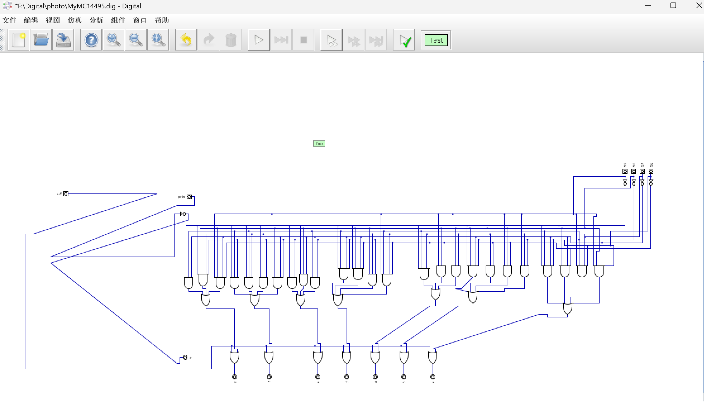

- 在 **Digital** 上设计测试用例，验证输入输出波形

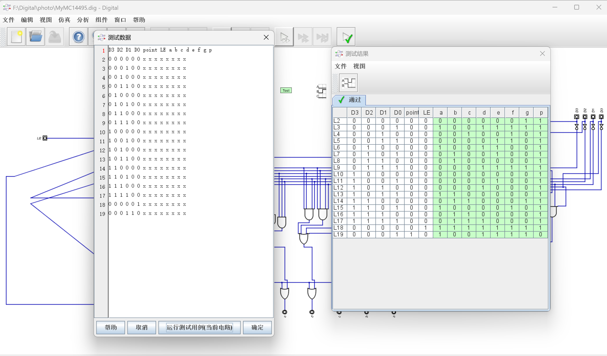

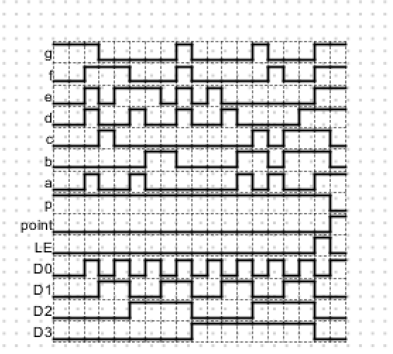

- 在 **Digital** 上新建电路 **MyMC14495_Test**，通过实时仿真验证显示结果正确性：

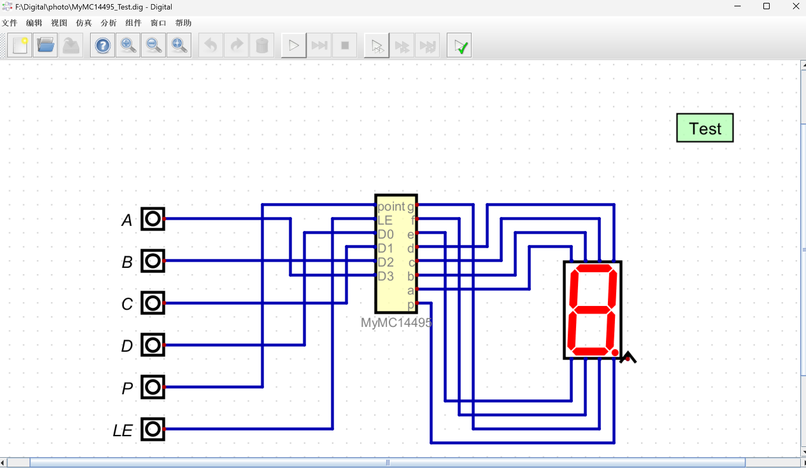

>输入为：$1000$

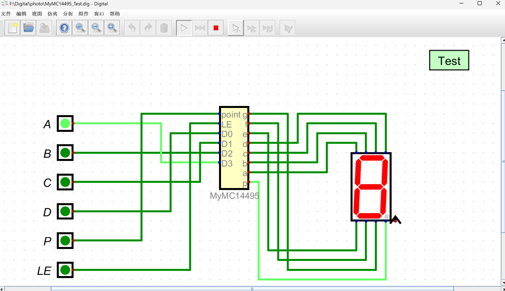

>输入为：$0110$

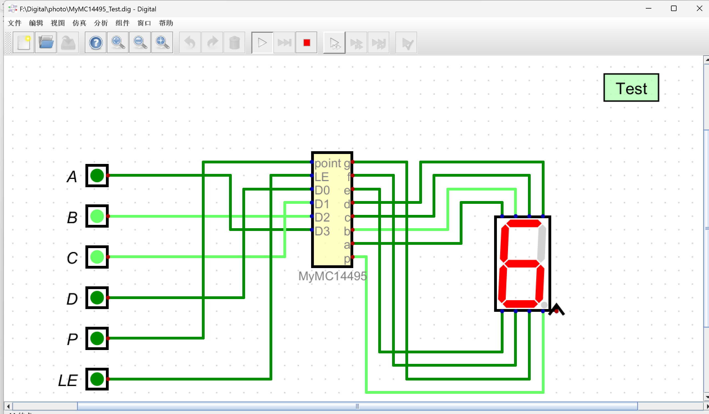

> 输入为：$1001$

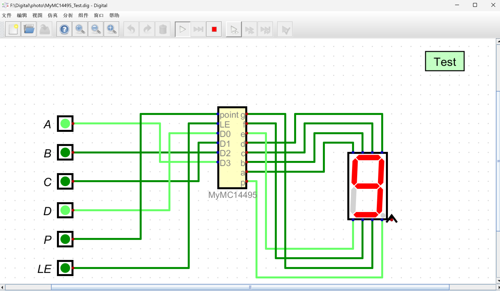

> 输入带小数点：$0001.$

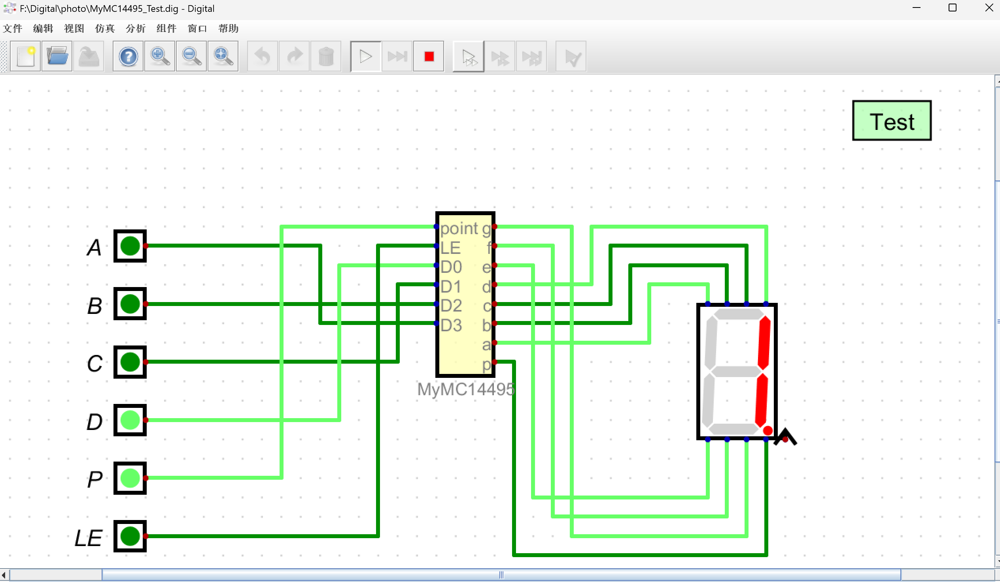

> 输入全开：

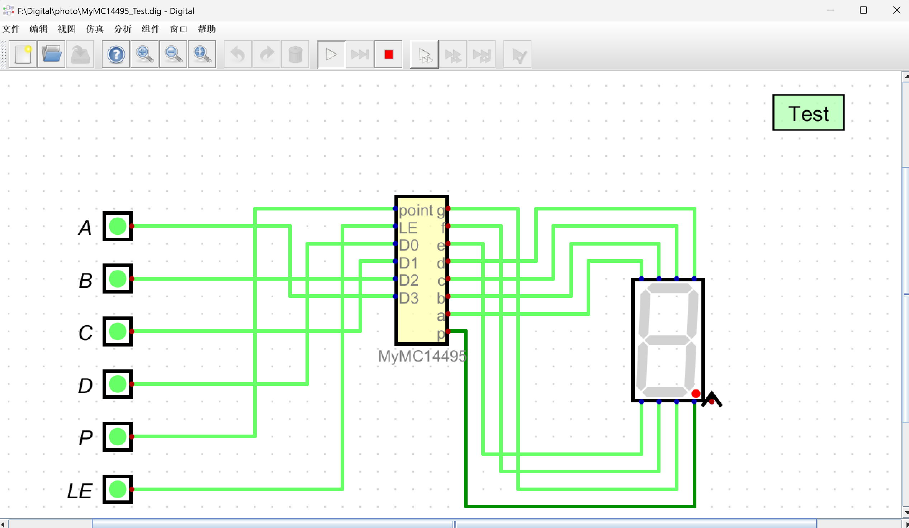

- 导出 **Verilog** 文件：**MyMC14495.v**

```verilog
/*
 * Generated by Digital. Don't modify this file!
 * Any changes will be lost if this file is regenerated.
 */

module MyMC14495 (
  input point,
  input LE,
  input D0,
  input D1,
  input D2,
  input D3,
  output g,
  output f,
  output e,
  output d,
  output c,
  output b,
  output a,
  output p
);
  wire s0;
  wire s1;
  wire s2;
  wire s3;
  assign p = ~ point;
  assign s0 = ~ D0;
  assign s1 = ~ D1;
  assign s2 = ~ D2;
  assign s3 = ~ D3;
  assign g = (((s0 & s1 & D2 & D3) | (D0 & D1 & D2 & s3) | (s1 & s2 & s3)) | LE);
  assign f = (((D0 & s1 & D2 & D3) | (D0 & D1 & s3) | (D1 & s2 & s3) | (D0 & s2 & s3)) | LE);
  assign e = (((D0 & s1 & s2) | (s1 & D2 & s3) | (D0 & s3)) | LE);
  assign d = (((s0 & D1 & s2 & D3) | (D0 & D1 & D2) | (s0 & s1 & D2 & s3) | (D0 & s1 & s2 & s3)) | LE);
  assign c = (((D1 & D2 & D3) | (s0 & D2 & D3) | (s0 & D1 & s2 & s3)) | LE);
  assign b = (((D0 & D1 & D3) | (s0 & D2 & D3) | (s0 & D1 & D2) | (D0 & s1 & D2 & s3)) | LE);
  assign a = (((D0 & s1 & D2 & D3) | (D0 & D1 & s2 & D3) | (s0 & s1 & D2 & s3) | (D0 & s1 & s2 & s3)) | LE);
endmodule
```

---

#### 任务二

- 新建工程 **DispNumber_sch**：

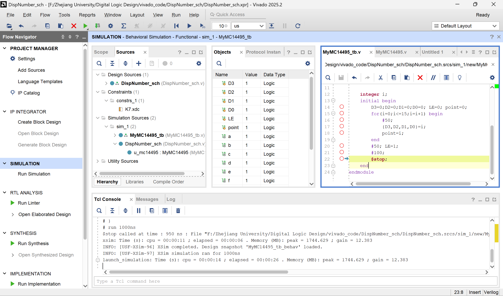

- 新建文件 **DispNumber_sch.v**：

> **DispNumber_sch.v** 代码如下：

```verilog
`timescale 1ns / 1ps


module DispNumber_sch(
    input  [15:0] SW,      
    output [ 7:0] SEGMENT, 
    output [ 3:0] AN       
);

    assign AN = ~SW[7:4];
    
    MyMC14495 u_mc14495(
        .D3    (SW[3]),
        .D2    (SW[2]),
        .D1    (SW[1]),
        .D0    (SW[0]),
        .point (SW[15]), 
        .LE    (SW[14]), 
        .a     (SEGMENT[0]),
        .b     (SEGMENT[1]),
        .c     (SEGMENT[2]),
        .d     (SEGMENT[3]),
        .e     (SEGMENT[4]),
        .f     (SEGMENT[5]),
        .g     (SEGMENT[6]),
        .p     (SEGMENT[7])
    );

endmodule
```

- 添加 **MyMC14495.v** 到工程：

>**MyMC14495.v** 代码如下，和任务一中导出的 **Verilog** 代码完全一致：

```verilog
/*
 * Generated by Digital. Don't modify this file!
 * Any changes will be lost if this file is regenerated.
 */

module MyMC14495 (
  input point,
  input LE,
  input D0,
  input D1,
  input D2,
  input D3,
  output g,
  output f,
  output e,
  output d,
  output c,
  output b,
  output a,
  output p
);
  wire s0;
  wire s1;
  wire s2;
  wire s3;
  assign p = ~ point;
  assign s0 = ~ D0;
  assign s1 = ~ D1;
  assign s2 = ~ D2;
  assign s3 = ~ D3;
  assign g = (((s0 & s1 & D2 & D3) | (D0 & D1 & D2 & s3) | (s1 & s2 & s3)) | LE);
  assign f = (((D0 & s1 & D2 & D3) | (D0 & D1 & s3) | (D1 & s2 & s3) | (D0 & s2 & s3)) | LE);
  assign e = (((D0 & s1 & s2) | (s1 & D2 & s3) | (D0 & s3)) | LE);
  assign d = (((s0 & D1 & s2 & D3) | (D0 & D1 & D2) | (s0 & s1 & D2 & s3) | (D0 & s1 & s2 & s3)) | LE);
  assign c = (((D1 & D2 & D3) | (s0 & D2 & D3) | (s0 & D1 & s2 & s3)) | LE);
  assign b = (((D0 & D1 & D3) | (s0 & D2 & D3) | (s0 & D1 & D2) | (D0 & s1 & D2 & s3)) | LE);
  assign a = (((D0 & s1 & D2 & D3) | (D0 & D1 & s2 & D3) | (s0 & s1 & D2 & s3) | (D0 & s1 & s2 & s3)) | LE);
endmodule
```

- 添加约束文件 **K7.xdc**：

```tcl
set_property PACKAGE_PIN AA10 [get_ports {SW[0]}]
set_property PACKAGE_PIN AB10 [get_ports {SW[1]}]
set_property PACKAGE_PIN AA13 [get_ports {SW[2]}]
set_property PACKAGE_PIN AA12 [get_ports {SW[3]}]
set_property PACKAGE_PIN Y13  [get_ports {SW[4]}]
set_property PACKAGE_PIN Y12  [get_ports {SW[5]}]
set_property PACKAGE_PIN AD11 [get_ports {SW[6]}]
set_property PACKAGE_PIN AD10 [get_ports {SW[7]}]
set_property PACKAGE_PIN AE10 [get_ports {SW[8]}]
set_property PACKAGE_PIN AE12 [get_ports {SW[9]}]
set_property PACKAGE_PIN AF12 [get_ports {SW[10]}]
set_property PACKAGE_PIN AE8  [get_ports {SW[11]}]
set_property PACKAGE_PIN AF8  [get_ports {SW[12]}]
set_property PACKAGE_PIN AE13 [get_ports {SW[13]}]
set_property PACKAGE_PIN AF13 [get_ports {SW[14]}]
set_property PACKAGE_PIN AF10 [get_ports {SW[15]}]

set_property IOSTANDARD LVCMOS15 [get_ports {SW[*]}]


set_property PACKAGE_PIN AB22 [get_ports {SEGMENT[0]}]
set_property PACKAGE_PIN AD24 [get_ports {SEGMENT[1]}]
set_property PACKAGE_PIN AD23 [get_ports {SEGMENT[2]}]
set_property PACKAGE_PIN Y21  [get_ports {SEGMENT[3]}]
set_property PACKAGE_PIN W20  [get_ports {SEGMENT[4]}]
set_property PACKAGE_PIN AC24 [get_ports {SEGMENT[5]}]
set_property PACKAGE_PIN AC23 [get_ports {SEGMENT[6]}]
set_property PACKAGE_PIN AA22 [get_ports {SEGMENT[7]}]

set_property IOSTANDARD LVCMOS33 [get_ports {SEGMENT[*]}]


set_property PACKAGE_PIN AD21 [get_ports {AN[0]}]
set_property PACKAGE_PIN AC21 [get_ports {AN[1]}]
set_property PACKAGE_PIN AB21 [get_ports {AN[2]}]
set_property PACKAGE_PIN AC22 [get_ports {AN[3]}]
```

- 添加仿真文件 **MyMC14495_tb.v**：

```verilog
`timescale 1ns / 1ps
module MyMC14495_tb;
    reg D3,D2,D1,D0,LE,point;
    wire a,b,c,d,e,f,g,p;
    
    MyMC14495 uut(
        .D3(D3),.D2(D2),.D1(D1),.D0(D0),
        .LE(LE),.point(point),
        .a(a),.b(b),.c(c),.d(d),.e(e),.f(f),.g(g),.p(p)
    );
    
    integer i;
    initial begin
        D3=0;D2=0;D1=0;D0=0; LE=0; point=0;
        for(i=0;i<=15;i=i+1) begin
            #50;
            {D3,D2,D1,D0}=i;
            point=i;
        end
        #50; LE=1;
        #100;
        $stop;
    end
endmodule
```

- 仿真波形：
   - 与 **Digital** 的测试用例仿真结果比较, 观察两者的区别联系：
   - 对波形进行解释：

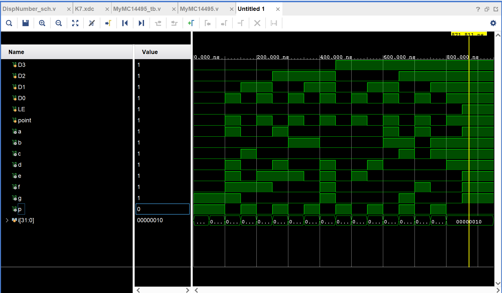

> - **一些解释**：
>    - 本仿真波形图和PPT内的仿真波形图有所不同，经过仔细观察，发现是 **LE** 与 **point** 位置刚好相反，细心验证后，确认与PPT的示例图完全一致，仿真实验成功。
>    - 另外本次仿真时发现实际上建立 **Design Sources** 后，实际上 **Simulation** 处也会自动建立相应文件，若把 **Simulation** 处的文件删除， **Design Sources** 处的文件也会失效。

> - **区别和联系**：
>    - 联系：没有很本质上的区别，波形几乎一模一样；
>    - 区别：**p** 和 **point** 两部分由于 **Digital** 是自定义的输入，而 **Vivado** 与其不完全一样，表现在仿真波形上就会有所不同，但本质上都是对的，都是 **p** 和 **point** 取相反的关系。

- 实现数码管显示

> 代码在前面已经完整地展示。

- 实际下板子验证：
   - **XDC** 引脚定义：
      - *输入*
         - **SW[7:4]**，分别控制 **AN[3:0]**
         - **SW[3:0]=$D_3D_2D_1D_{0}$**
         - **SW[14]=LE**
         - **SW[15]=point**
      - *输出*
         - **a ~ g, p**
         - **AN[3:0]**
   - **XDC** 文件引脚约束关系：
      - 在前面已有完整代码

>打开 **SW[0]** 与 **SW[4 ~ 7]**：$0001$ 表现为 $1$


> 打开 **SW[0]** 与 **SW[1]** 与 **SW[4 ~ 7]**：$0011$ 表现为 $3$

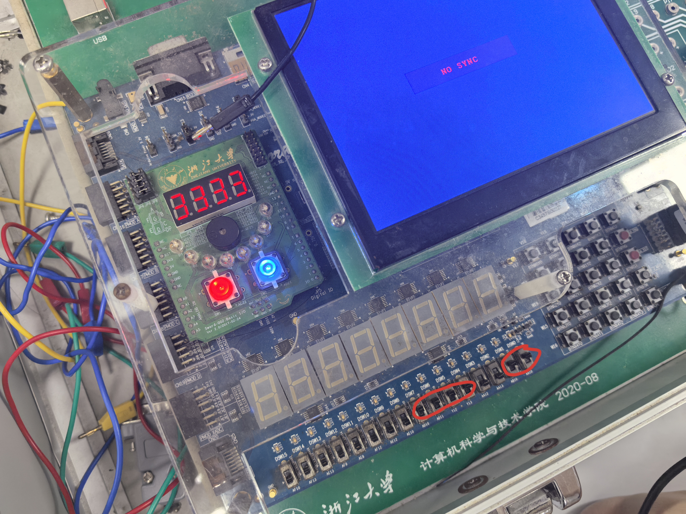

> 打开 **SW[0]** 与 **SW[1]** 与 **SW[2]** 与 **SW[4 ~ 7]**：$0111$ 表现为 $7$


> 打开 **SW[0]** 与 **SW[3]** 与 **SW[4 ~ 7]**：$1001$ 表现为 $9$


> 打开 **SW[14]** 与 **SW[4 ~ 7]**：**LE** 信号，锁存显示

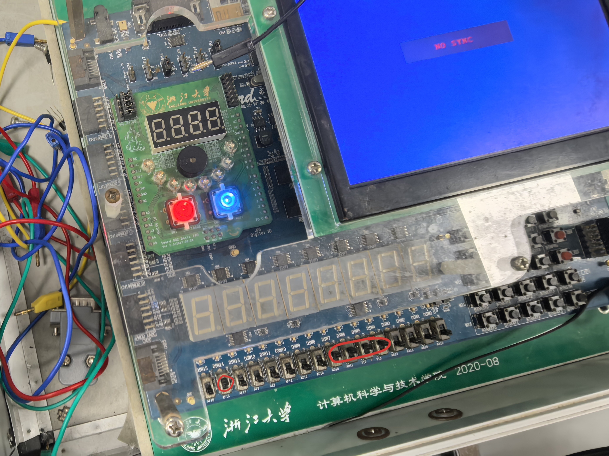

> 打开 **SW[15]** 与 **SW[4 ~ 7]**：小数点


> 以上 **SW[4 ~ 7]** 是打开的，分别对应第 $1$、第 $2$、第 $3$、第 $4$ 个显示数据。


---

### 四、实验结果分析

>**Digital** 平台的原理图仿真、**Vivado** 平台的代码功能仿真，以及 **FPGA** 开发板的板级验证，三者结果基本一致，均满足实验设计要求。

- **Digital** 仿真结果：
   - 输入 **0~F**，数码管能正确显示对应字符。
   - **LE = 1** 时，数码管全灭，符合 **MC14495** 功能。
   - **point = 1** 时，小数点正常点亮。
   - 当输入 $0000 \sim 1111$ 时，数码管能够依次正确显示 $0 \sim F$ 十六进制字符，显示清晰无乱码。当 **LE** 端置 $1$ 时，无论输入任何数值，数码管均熄灭，符合 **MC14495** 消隐功能的定义。
   - 将 **point** 信号置 $1$ 后，小数点稳定点亮，与段码显示互不干扰。
- **Vivado** 仿真结果- 仿真波形与真值表一致，**a ~ g** 输出正确。
   - **LE** 拉高后所有段变为高电平，模块功能正常。
   - 从波形结果可以看出，每一组输入对应的段码输出与实验给出的真值表完全匹配，信号跳变清晰、时序正确
   - LE被拉高后，所有段输出立即变为高电平，实现全局灭灯
- **FPGA** 下载验证结果
   - **SW[3:0]** 可正确控制显示 **0 ~ F**。
   - **SW[7:4]** 可单独控制每一位数码管亮灭。
   - **SW[14]** 可全局熄灭/开启显示。
   - **SW[15]** 可控制小数点亮灭。
   - 硬件运行稳定，无逻辑错误，无闪烁、无错乱，整体效果符合预期。
- **Digital** 与 **Vivado** 的仿真波形比较：
   - 本质无差异，只是在 **p** 与 **point** 的数值上有所差异，这里可以在 **Digital** 上的测试用例进行修改，完全没有本质上的差别，因此我们有十足的把握认为其是正确的。

---

### 五、讨论与心得

- 总得来说，这次实验依旧让我收获颇丰，再一次加深了对 **Digital** 与 **Vivado** 应用的熟练度，以及本次连接电路图的时间远比我想象的要短得多，似乎甚至不到一个小时，虽然连出来很难看；

- 另外，本次实验也让我进一步理解了译码器如何根据真值表实现逻辑，进一步巩固了代码设计与硬件实际运行的结合和联系；
- 其中最大的收获是由于 **K7** 错了，导致我们重新参照先前的实验进行修改，这进一步巩固了我们对于约束文件的编写和使用知识和能力；
- 一个小插曲是第一次下开发板验证的时候，最后一个数字 $8$ 的中间一横始终不亮，经过老师验证确实是板子的问题，一度怀疑自己的代码是哪个小地方写错了...；
- 最后，本次实验和杨海涛同学的合作依旧十分成功，一人拍照 + 调整电脑，一人进行上手的下板子调试，两人配合默契，本次实验完全是成功的。

---


