# <center>本科实验报告</center>
## <center>课程名称：<u>数字逻辑设计</u></center>
## <center>姓名：<u>邓欢桐</u></center>
## <center>学院：<u>计算机科学与技术学院</u></center>
## <center>系：<u>混合班</u></center>
## <center>专业：<u>计算机科学与技术</u></center>
## <center>学号：<u>3250102223</u></center>
## <center>指导教师：<u>董亚波</u></center>
<center>2026年4月20日</center>

### <center>浙江大学实验报告</center>
#### 课程名称：<u>数字逻辑设计</u> 实验类型：<u>综合</u>       
#### 实验项目名称：<u>多路选择器设计及应用</u>
#### 学生姓名：<u>邓欢桐</u> 专业：<u>混合班</u> 学号：<u>3250102223</u>
#### 同组学生姓名：<u>杨海涛</u> 指导老师：<u>董亚波</u>     
#### 实验地点：<u>东4-509</u> 实验日期：<u>2026</u>年<u>4</u>月<u>20</u>日

### 一、实验目的和要求

#### 实验目的

- 掌握**4 选 1 多路选择器**的工作原理、逻辑构成与功能实现。

- 掌握多路选择器的位扩展方法，完成 $1$ 位与 $4$ 位多路选择器设计。

- 理解**4 位七段数码管动态扫描显示**原理，掌握扫描驱动模块设计。

- 完成基于多路选择器与数码管扫描的**记分板系统**设计与上板验证。

- 熟练使用 **Digital** 原理图设计、**Vivado** 仿真、综合、实现与下载流程。

#### 实验要求

- 在 **Digital** 中完成 $1$ 位 $4$ 选 $1$、$4$ 位 $4$ 选 $1$ 数据选择器设计与仿真。

- 设计 $4$ 位七段数码管动态扫描显示控制模块 **DispNum**。

- 完成记分板完整系统设计：按键加分、开关控制小数点与消隐、数码管显示。

- 完成仿真验证、引脚约束、上板测试，并记录波形与现象。

- 分析按键抖动、显示稳定性、小数点控制等问题。

---

### 二、实验内容和原理

#### 内容：

- 任务 $1$：数据选择器设计

   - 在 **Digital** 中用原理图设计**1 位 4 选 1 数据选择器 Mux4to1**。
   - 在 **Digital** 中设计**4 位 4 选 1 数据选择器 Mux4to1b4**（位扩展）。
   - 建立测试用例，仿真验证选择功能，记录波形。

- 任务 $2$：$4$ 位数码管扫描显示模块设计

   - 设计 $2-4$ 译码器，生成数码管位选信号。
   - 设计 $4$ 选 $1$ 数据选择器，选择显示数据、小数点、消隐信号。
   - 调用`MyMC14495`七段译码模块，输出段码。
   - 完成`DispNum`模块设计与仿真。

- 任务 $3$：记分板系统设计

   - 设计时钟分频模块`clkdiv`。
   - 设计按键加 $1$ 模块`CreateNumber`。
   - 设计顶层模块`top`，完成系统集成。
   - 编写 **XDC** 引脚约束文件。
   - 进行行为仿真与上板验证，测试按键、开关、显示功能。

---

#### 原理：

- $4$ 选 $1$ 多路选择器原理

    >$4$ 选 $1$ 数据选择器根据 $2$ 位选择信号 `S [1:0]`，从 $4$ 个输入数据中选中 $1$ 个输出。

  - 逻辑表达式：

  $O=\bar{S_1}\bar{S_0}I_0+\bar{S_1}S_0I_1+S_1\bar{S_0}I_2+S_1S_0I_3$

  - $4$ 位扩展：选择信号不变，每路数据扩展为 4 位，实现并行数据选择。

- 七段数码管动态扫描显示原理

  - 采用**时分复用**，利用人眼视觉暂留，用一套译码电路驱动 $4$ 位数码管。
  - 由分频计数器产生`scan[1:0]`，经 $2-4$ 译码器产生**低电平有效**的位选信号`AN[3:0]`。
  - 由 $4$ 选 $1$ 选择器选中当前位显示数据，经译码器输出段码`SEGMENT`。
  - 刷新间隔约 $1.3ms$，显示稳定无闪烁。

- 共阳数码管驱动规则

  - 段脚（$a \sim g$、$dp$）**低电平点亮，高电平熄灭**。
  - 小数点由`point`信号控制，消隐由`LE`信号控制。

- 记分板系统原理

  - `clkdiv`：时钟分频，提供扫描信号。
  - `CreateNumber`：$4$ 个按键独立控制 $4$ 位数码管加 $1$。
  - `DispNum`：位选、段选、小数点、消隐控制。
  - `MyMC14495`：$4$ 位二进制转七段码。

---

### 三、实验过程和数据记录

#### 任务 $1$：数据选择器设计

- 在 **Digital** 上用原理图方式设计 $1$ 位 $4$ 选 $1$ 数据选择器 **Mux4to1**

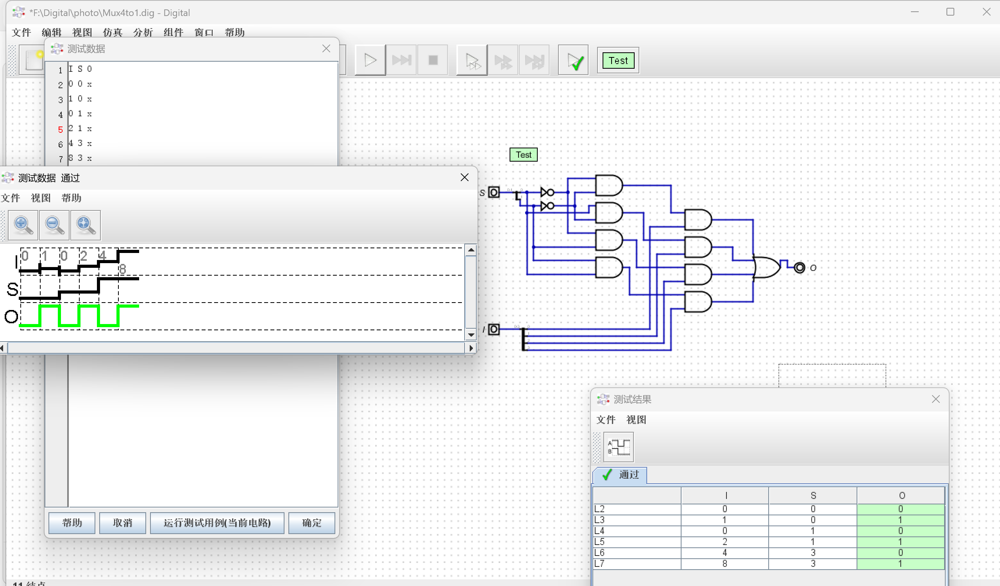

> 如图所示，同 **PPT** 上给出的参考图完全一致，测试通过，逻辑正确。
>
> - 仿真波形中，**I 为 4 位输入数据**，**S 为 2 位选择信号**，**O 为 1 位输出信号**。
>
>   在 $4$ 位二进制数据中，硬件规定**从右至左依次为第 0 位、第 1 位、第 2 位、第 3 位**。本电路遵循标准 $4$ 选 $1$ 数据选择器逻辑：
>
>   - 当 `S=0` 时，输出 `O` 取 `I` 的**第 0 位（最右侧）**；
>  - 当 `S=1` 时，输出 `O` 取 `I` 的**第 1 位（右数第 2 位）**；
>   - 当 `S=3` 时，输出 `O` 取 `I` 的**第 3 位（最左侧）**。

- 在 **Digital** 上原理图方式设计 $4$ 位 $4$ 选 $1$ 数据选择器 **Mux4to1b4**

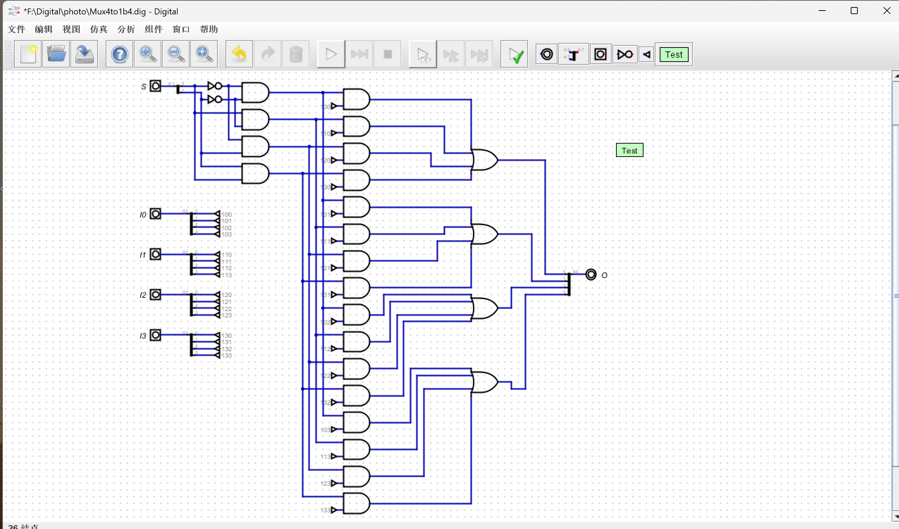

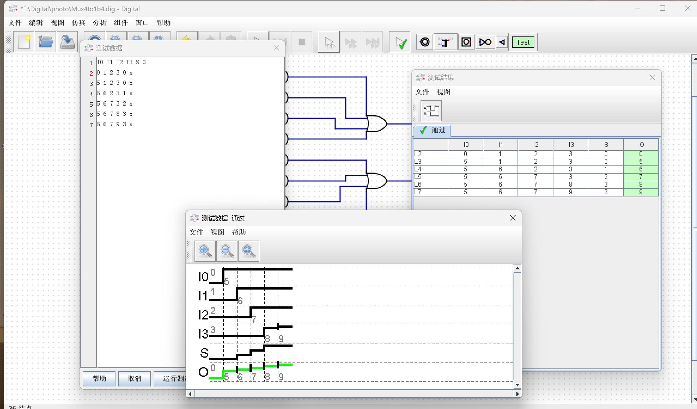

> 如图所示，同 **PPT** 上给出的参考图完全一致，测试通过，逻辑正确。
>
> 对仿真波形进行分析：
>
> - 输入 `I0~I3` 为不同的 4 位数据（如 `0、1、2、3` 或 `5、6、7、9`）
>
> - 选择信号 `S` 依次变化（`0→1→2→3`）
>
> - 输出 `O` 同步跟随 `S` 的变化，依次输出 `I0→I1→I2→I3` 的值，例如：
>
>    - `S=0` 时，`O=I0`
>
>    - `S=1` 时，`O=I1`
>    
>    - `S=2` 时，`O=I2`
>    
>    - `S=3` 时，`O=I3`
>
> 波形中 `O` 信号与对应输入数据完全一致，无延迟或错误跳变。

---

#### 任务 $2$：$4$ 位数码管扫描显示模块设计

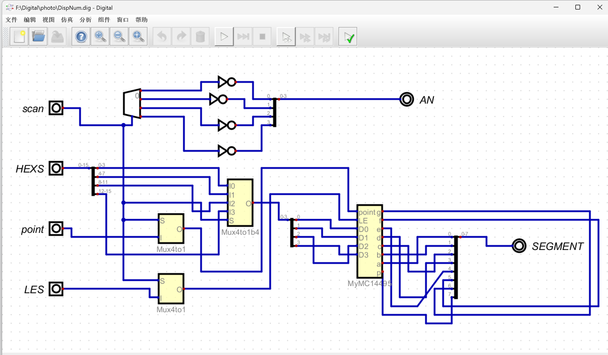

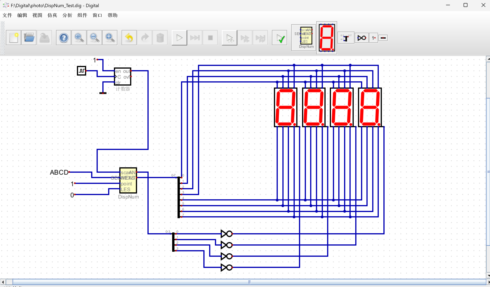

> `point` 为 $1$ 的时候小数点是点亮的，`LES` 为 $1$ 的时候所有都是灭的。

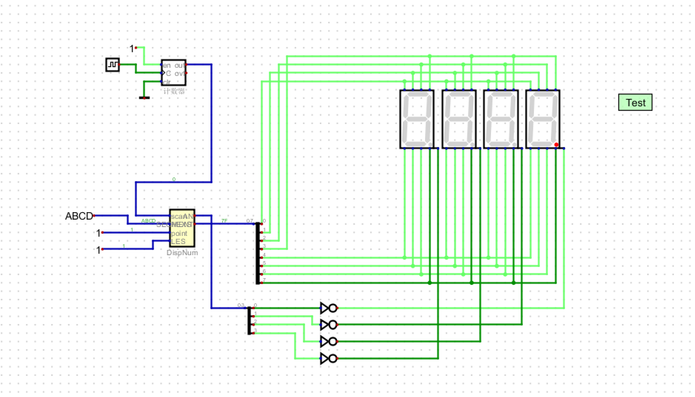

>如下面四张图所示，`ABCD` 随时间推移依次循环显示，且若频率增大，循环速率明显上升。

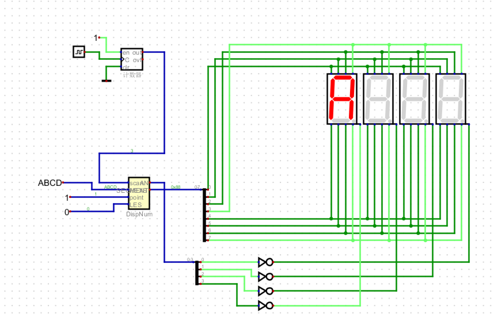

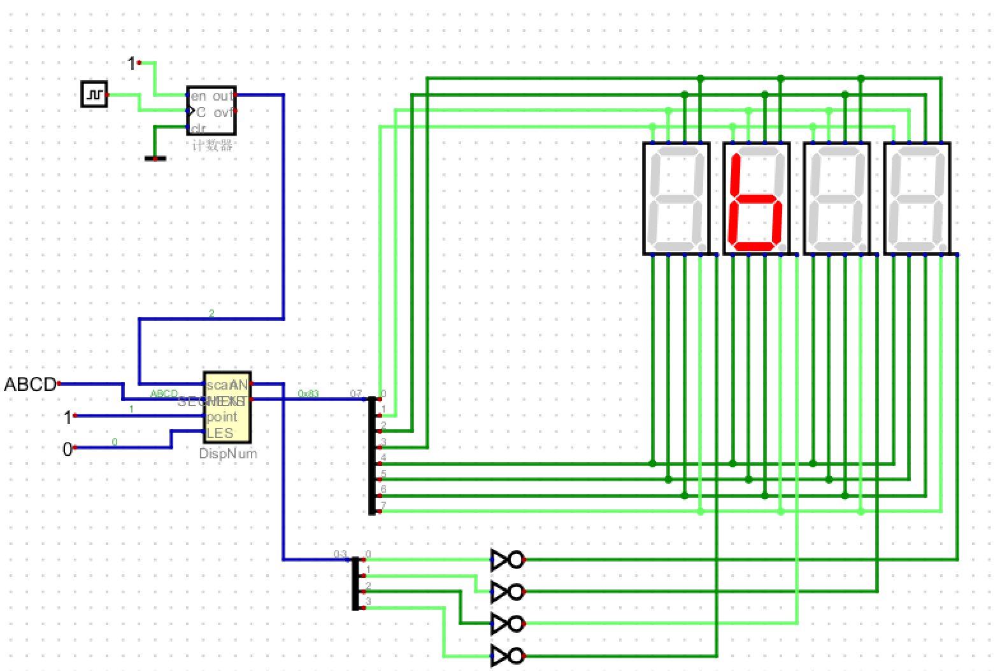

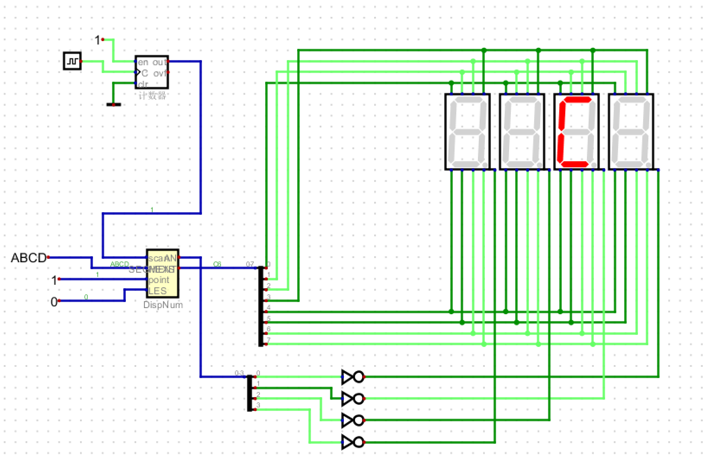

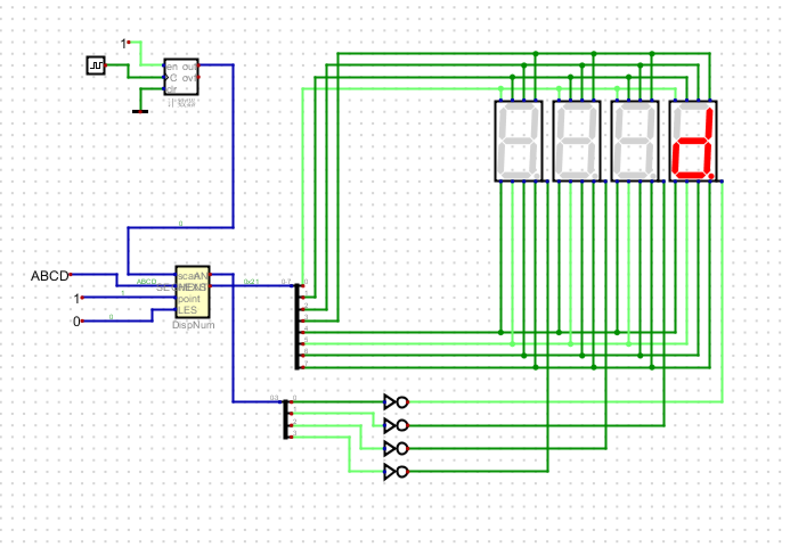

> 以下是导出的 `DispNum.v` 文件，方便后续在 **vivado** 上使用。

```verilog
/*
 * Generated by Digital. Don't modify this file!
 * Any changes will be lost if this file is regenerated.
 */

module Decoder2 (
    output out_0,
    output out_1,
    output out_2,
    output out_3,
    input [1:0] sel
);
    assign out_0 = (sel == 2'h0)? 1'b1 : 1'b0;
    assign out_1 = (sel == 2'h1)? 1'b1 : 1'b0;
    assign out_2 = (sel == 2'h2)? 1'b1 : 1'b0;
    assign out_3 = (sel == 2'h3)? 1'b1 : 1'b0;
endmodule


module Mux4to1 (
  input [1:0] S,
  input [3:0] I,
  output O
);
  assign O = (((~ S[0] & ~ S[1]) & I[0]) | ((S[0] & ~ S[1]) & I[1]) | ((~ S[0] & S[1]) & I[2]) | ((S[1] & S[0]) & I[3]));
endmodule

module Mux4to1b4 (
  input [3:0] I0,
  input [3:0] I1,
  input [3:0] I2,
  input [3:0] I3,
  input [1:0] S,
  output [3:0] O
);
  wire s0;
  wire s1;
  wire s2;
  wire s3;
  wire s4;
  wire s5;
  wire s6;
  wire s7;
  assign s3 = S[0];
  assign s5 = S[1];
  assign s7 = (s5 & s3);
  assign s0 = ~ s3;
  assign s1 = ~ s5;
  assign s2 = (s0 & s1);
  assign s4 = (s3 & s1);
  assign s6 = (s0 & s5);
  assign O[0] = ((s2 & I0[0]) | (s4 & I1[0]) | (s6 & I2[0]) | (s7 & I3[0]));
  assign O[1] = ((s2 & I0[1]) | (s4 & I1[1]) | (s6 & I2[1]) | (s7 & I3[1]));
  assign O[2] = ((s2 & I0[2]) | (s4 & I1[2]) | (s6 & I2[2]) | (s7 & I3[2]));
  assign O[3] = ((s2 & I0[3]) | (s4 & I1[3]) | (s6 & I2[3]) | (s7 & I3[3]));
endmodule

module MyMC14495 (
  input point,
  input LE,
  input D0,
  input D1,
  input D2,
  input D3,
  output g,
  output f,
  output e,
  output d,
  output c,
  output b,
  output a,
  output p
);
  wire s0;
  wire s1;
  wire s2;
  wire s3;
  assign p = ~ point;
  assign s0 = ~ D0;
  assign s1 = ~ D1;
  assign s2 = ~ D2;
  assign s3 = ~ D3;
  assign g = (((s0 & s1 & D2 & D3) | (D0 & D1 & D2 & s3) | (s1 & s2 & s3)) | LE);
  assign f = (((D0 & s1 & D2 & D3) | (D0 & D1 & s3) | (D1 & s2 & s3) | (D0 & s2 & s3)) | LE);
  assign e = (((D0 & s1 & s2) | (s1 & D2 & s3) | (D0 & s3)) | LE);
  assign d = (((s0 & D1 & s2 & D3) | (D0 & D1 & D2) | (s0 & s1 & D2 & s3) | (D0 & s1 & s2 & s3)) | LE);
  assign c = (((D1 & D2 & D3) | (s0 & D2 & D3) | (s0 & D1 & s2 & s3)) | LE);
  assign b = (((D0 & D1 & D3) | (s0 & D2 & D3) | (s0 & D1 & D2) | (D0 & s1 & D2 & s3)) | LE);
  assign a = (((D0 & s1 & D2 & D3) | (D0 & D1 & s2 & D3) | (s0 & s1 & D2 & s3) | (D0 & s1 & s2 & s3)) | LE);
endmodule

module DispNum (
  input [1:0] scan,
  input [15:0] HEXS,
  input [3:0] point,
  input [3:0] LES,
  output [3:0] AN,
  output [7:0] SEGMENT
);
  wire s0;
  wire s1;
  wire s2;
  wire s3;
  wire s4;
  wire s5;
  wire [3:0] s6;
  wire [3:0] s7;
  wire [3:0] s8;
  wire [3:0] s9;
  wire [3:0] s10;
  wire s11;
  wire s12;
  wire s13;
  wire s14;
  wire s15;
  wire s16;
  wire s17;
  wire s18;
  wire s19;
  wire s20;
  wire s21;
  wire s22;
  Decoder2 Decoder2_i0 (
    .sel( scan ),
    .out_0( s0 ),
    .out_1( s1 ),
    .out_2( s2 ),
    .out_3( s3 )
  );
  Mux4to1 Mux4to1_i1 (
    .S( scan ),
    .I( point ),
    .O( s4 )
  );
  Mux4to1 Mux4to1_i2 (
    .S( scan ),
    .I( LES ),
    .O( s5 )
  );
  assign s6 = HEXS[3:0];
  assign s7 = HEXS[7:4];
  assign s8 = HEXS[11:8];
  assign s9 = HEXS[15:12];
  assign AN[0] = ~ s0;
  assign AN[1] = ~ s1;
  assign AN[2] = ~ s2;
  assign AN[3] = ~ s3;
  Mux4to1b4 Mux4to1b4_i3 (
    .I0( s6 ),
    .I1( s7 ),
    .I2( s8 ),
    .I3( s9 ),
    .S( scan ),
    .O( s10 )
  );
  assign s11 = s10[0];
  assign s12 = s10[1];
  assign s13 = s10[2];
  assign s14 = s10[3];
  MyMC14495 MyMC14495_i4 (
    .point( s4 ),
    .LE( s5 ),
    .D0( s11 ),
    .D1( s12 ),
    .D2( s13 ),
    .D3( s14 ),
    .g( s15 ),
    .f( s16 ),
    .e( s17 ),
    .d( s18 ),
    .c( s19 ),
    .b( s20 ),
    .a( s21 ),
    .p( s22 )
  );
  assign SEGMENT[0] = s21;
  assign SEGMENT[1] = s20;
  assign SEGMENT[2] = s19;
  assign SEGMENT[3] = s18;
  assign SEGMENT[4] = s17;
  assign SEGMENT[5] = s16;
  assign SEGMENT[6] = s15;
  assign SEGMENT[7] = s22;
endmodule
```

---

#### 任务 $3$：记分板系统设计

- 首先设计辅助模块：时钟计数分频器，其一些特点和性质介绍如下
  - 可输出 $2 \sim 2^{32}$ 分频信号，可用于一般非同步类时钟信号
  - 延时较高，要求不高的时钟也可以用
  - 本实验中用 `clk_div(18:17)` 作为扫描控制信号 `scan[1:0]`，控制 $4$ 位数码管的动态扫描，每一位显示切换时间为 $2^{17} / 100M = 1.3ms$
  - 由此可见，通过对系统时钟的高位分频，我们可以得到稳定且合适频率的扫描控制信号，既能满足人眼视觉暂留的刷新要求，又无需额外搭建复杂的计数器电路，是实现 $4$ 位数码管动态扫描的高效方案。


> 以下是时钟分频 `clkdiv.v` 文件

```verilog
module clkdiv(
    input wire clk,
    input wire rst,
    output reg[31:0] clk_div
);
    // used in simulation
    initial begin
        clk_div = 0;
    end

    // clock divider   
    always @(posedge clk or posedge rst) begin
        if (rst) 
            clk_div <= 0;
        else 
            clk_div <= clk_div + 1'b1;
    end
endmodule
```

---

- 其次设计 `CreateNumber` 按键数据输入模块
  - 四个按键，各按一下，$4$ 个 $4$ 位 $2$ 进制数分别加 $1$。电路包含 4 个独立按键，每按下一个按键，对应数码管的 $4$ 位二进制数就会加 $1$，可实现记分、计数等数据输入功能。
  - 为了避免按键抖动导致的误触发，实际应用中需要在按键输入前增加消抖电路，以保证每次按键仅触发一次加 $1$ 操作。但很明显，本次实验并没有完成这个工作，根据老师的指示与要求，将在下一节实验课实现该功能。
  - 模块输出为 $16$ 位数据 `num[15:0]`，将 $4$ 个 $4$ 位数据拼接在一起，可直接作为数码管显示模块的输入信号。

> 以下是按键加 $1$ 的 `CreateNumber.v` 文件

```verilog
module CreateNumber(
    input wire [3:0] btn,
    output reg [15:0] num
);
    wire [3:0] A,B,C,D;

    initial num <= 16'b1010_1011_1100_1101; // display "AbCd"

    assign A = num[3:0] + 4'd1;
    assign B = num[7:4] + 4'd1;
    assign C = num[11:8] + 4'd1;
    assign D = num[15:12] + 4'd1;

    always @(posedge btn[0]) num[3:0]  <= A;
    always @(posedge btn[1]) num[7:4]  <= B;
    always @(posedge btn[2]) num[11:8] <= C;
    always @(posedge btn[3]) num[15:12]<= D;
endmodule
```

---

- 从 **Digital** 中导出 `DispNum.v`，加入工程
  - 该模块是数码管动态扫描的核心控制单元，由 **Digital** 工具生成，无需手动修改，当然实际上也可以用 `case` 语句实现，只是从 **Digital** 中直接导出会更加方便省事。
  - 模块内部共包含 **Decoder2、Mux4to1、Mux4to1b4、MyMC14495、DispNum** 五个子模块，通过扫描信号控制多路选择与译码输出，实现数码管分时点亮、数据显示、小数点控制与消隐功能，最终输出位选信号 `AN` 与段码信号 `SEGMENT`，完成稳定无闪烁的四位数码管显示。
  - 工作原理如下：
    - **Decoder2（2-4 译码器）**：接收 $2$ 位扫描信号 `scan`，将其译码为 $4$ 路位选信号，同一时刻仅使能一路输出，用于选择当前点亮的数码管。
    - **Mux4to1（1 位 4 选 1 数据选择器）**：共实例化两个，分别根据扫描信号从 $4$ 位 `point` 信号中选择当前位小数点信号、从 $4$ 位 `LES` 信号中选择当前位消隐信号，为显示驱动模块提供控制信号。
    - **Mux4to1b4（4 位 4 选 1 数据选择器）**：根据扫描信号，将 $16$ 位输入数据 `HEXS` 分为四组 $4$ 位数据，依次选择其中一组输出，作为当前数码管的显示数据。
    - **MyMC14495（七段数码管显示驱动模块）**：接收选中的 $4$ 位显示数据、小数点信号与消隐信号，将二进制数据翻译为共阳数码管对应的七段段码，并完成小数点与消隐逻辑控制。
    - **DispNum（顶层整合模块）**：完成所有子模块的例化与信号连接，将译码后的位选信号反相输出为 `AN` 信号，将驱动模块输出的段码整理为 `SEGMENT` 信号，直接驱动硬件数码管完成动态显示。

> 以下是 `DispNum.v` 文件

```verilog
/*
 * Generated by Digital. Don't modify this file!
 * Any changes will be lost if this file is regenerated.
 */

module Decoder2 (
    output out_0,
    output out_1,
    output out_2,
    output out_3,
    input [1:0] sel
);
    assign out_0 = (sel == 2'h0)? 1'b1 : 1'b0;
    assign out_1 = (sel == 2'h1)? 1'b1 : 1'b0;
    assign out_2 = (sel == 2'h2)? 1'b1 : 1'b0;
    assign out_3 = (sel == 2'h3)? 1'b1 : 1'b0;
endmodule


module Mux4to1 (
  input [1:0] S,
  input [3:0] I,
  output O
);
  assign O = (((~ S[0] & ~ S[1]) & I[0]) | ((S[0] & ~ S[1]) & I[1]) | ((~ S[0] & S[1]) & I[2]) | ((S[1] & S[0]) & I[3]));
endmodule

module Mux4to1b4 (
  input [3:0] I0,
  input [3:0] I1,
  input [3:0] I2,
  input [3:0] I3,
  input [1:0] S,
  output [3:0] O
);
  wire s0;
  wire s1;
  wire s2;
  wire s3;
  wire s4;
  wire s5;
  wire s6;
  wire s7;
  assign s3 = S[0];
  assign s5 = S[1];
  assign s7 = (s5 & s3);
  assign s0 = ~ s3;
  assign s1 = ~ s5;
  assign s2 = (s0 & s1);
  assign s4 = (s3 & s1);
  assign s6 = (s0 & s5);
  assign O[0] = ((s2 & I0[0]) | (s4 & I1[0]) | (s6 & I2[0]) | (s7 & I3[0]));
  assign O[1] = ((s2 & I0[1]) | (s4 & I1[1]) | (s6 & I2[1]) | (s7 & I3[1]));
  assign O[2] = ((s2 & I0[2]) | (s4 & I1[2]) | (s6 & I2[2]) | (s7 & I3[2]));
  assign O[3] = ((s2 & I0[3]) | (s4 & I1[3]) | (s6 & I2[3]) | (s7 & I3[3]));
endmodule

module MyMC14495 (
  input point,
  input LE,
  input D0,
  input D1,
  input D2,
  input D3,
  output g,
  output f,
  output e,
  output d,
  output c,
  output b,
  output a,
  output p
);
  wire s0;
  wire s1;
  wire s2;
  wire s3;
  assign p = ~ point;
  assign s0 = ~ D0;
  assign s1 = ~ D1;
  assign s2 = ~ D2;
  assign s3 = ~ D3;
  assign g = (((s0 & s1 & D2 & D3) | (D0 & D1 & D2 & s3) | (s1 & s2 & s3)) | LE);
  assign f = (((D0 & s1 & D2 & D3) | (D0 & D1 & s3) | (D1 & s2 & s3) | (D0 & s2 & s3)) | LE);
  assign e = (((D0 & s1 & s2) | (s1 & D2 & s3) | (D0 & s3)) | LE);
  assign d = (((s0 & D1 & s2 & D3) | (D0 & D1 & D2) | (s0 & s1 & D2 & s3) | (D0 & s1 & s2 & s3)) | LE);
  assign c = (((D1 & D2 & D3) | (s0 & D2 & D3) | (s0 & D1 & s2 & s3)) | LE);
  assign b = (((D0 & D1 & D3) | (s0 & D2 & D3) | (s0 & D1 & D2) | (D0 & s1 & D2 & s3)) | LE);
  assign a = (((D0 & s1 & D2 & D3) | (D0 & D1 & s2 & D3) | (s0 & s1 & D2 & s3) | (D0 & s1 & s2 & s3)) | LE);
endmodule

module DispNum (
  input [1:0] scan,
  input [15:0] HEXS,
  input [3:0] point,
  input [3:0] LES,
  output [3:0] AN,
  output [7:0] SEGMENT
);
  wire s0;
  wire s1;
  wire s2;
  wire s3;
  wire s4;
  wire s5;
  wire [3:0] s6;
  wire [3:0] s7;
  wire [3:0] s8;
  wire [3:0] s9;
  wire [3:0] s10;
  wire s11;
  wire s12;
  wire s13;
  wire s14;
  wire s15;
  wire s16;
  wire s17;
  wire s18;
  wire s19;
  wire s20;
  wire s21;
  wire s22;
  Decoder2 Decoder2_i0 (
    .sel( scan ),
    .out_0( s0 ),
    .out_1( s1 ),
    .out_2( s2 ),
    .out_3( s3 )
  );
  Mux4to1 Mux4to1_i1 (
    .S( scan ),
    .I( point ),
    .O( s4 )
  );
  Mux4to1 Mux4to1_i2 (
    .S( scan ),
    .I( LES ),
    .O( s5 )
  );
  assign s6 = HEXS[3:0];
  assign s7 = HEXS[7:4];
  assign s8 = HEXS[11:8];
  assign s9 = HEXS[15:12];
  assign AN[0] = ~ s0;
  assign AN[1] = ~ s1;
  assign AN[2] = ~ s2;
  assign AN[3] = ~ s3;
  Mux4to1b4 Mux4to1b4_i3 (
    .I0( s6 ),
    .I1( s7 ),
    .I2( s8 ),
    .I3( s9 ),
    .S( scan ),
    .O( s10 )
  );
  assign s11 = s10[0];
  assign s12 = s10[1];
  assign s13 = s10[2];
  assign s14 = s10[3];
  MyMC14495 MyMC14495_i4 (
    .point( s4 ),
    .LE( s5 ),
    .D0( s11 ),
    .D1( s12 ),
    .D2( s13 ),
    .D3( s14 ),
    .g( s15 ),
    .f( s16 ),
    .e( s17 ),
    .d( s18 ),
    .c( s19 ),
    .b( s20 ),
    .a( s21 ),
    .p( s22 )
  );
  assign SEGMENT[0] = s21;
  assign SEGMENT[1] = s20;
  assign SEGMENT[2] = s19;
  assign SEGMENT[3] = s18;
  assign SEGMENT[4] = s17;
  assign SEGMENT[5] = s16;
  assign SEGMENT[6] = s15;
  assign SEGMENT[7] = s22;
endmodule
```

---

- 设计顶层模块
  - 将 `clkdiv`、`CreateNumber`、`DispNum` 三个子模块进行了整合，实现了整个记分板系统的功能。顶层模块接收系统时钟 `clk`、开关信号 `SW` 和按键信号 `BTN`，并输出数码管位选信号 `AN` 和段码信号 `SEGMENT`，同时将 `BTNX4` 固定为低电平。
  - 模块中例化了三个核心子模块：
    1. `clkdiv`：将系统时钟分频，输出 $32$ 位计数信号 `clk_div`，并取其中 `clk_div[18:17]` 作为数码管的扫描控制信号 `scan`，实现动态扫描的时序控制。
    2. `CreateNumber`：接收按键信号 `BTN`，实现记分数据的手动输入，输出 $16$ 位数据 `num`，作为数码管的显示内容。
    3. `DispNum`：接收扫描信号 `scan`、显示数据 `num`、消隐信号 `SW[7:4]` 和小数点控制信号 `SW[3:0]`，输出数码管的位选与段码信号，驱动四位共阳数码管完成动态显示。
   - 各模块之间通过信号互联，形成了一个完整的 “时钟分频 - 数据输入 - 数码管显示” 的闭环系统，实现了计分板无闪烁、并可手动修改的四位数码管记分板功能。

>以下是系统顶层 `top.v` 文件

```verilog
module top(
    input wire clk, 
    input wire [7:0] SW,
    input wire [3:0] BTN,
    output wire [3:0] AN,
    output wire [7:0] SEGMENT,
    output wire BTNX4
);
    wire [15:0] num;
    wire [31:0] clk_div;

    CreateNumber c0(
        .btn(BTN),
        .num(num)
    );

    DispNum d0(
        .scan(clk_div[18:17]),
        .HEXS(num),
        .LES(SW[7:4]),
        .point(SW[3:0]),
        .AN(AN),
        .SEGMENT(SEGMENT)
    );

    clkdiv c1(
        .clk(clk),
        .rst(1'b0),
        .clk_div(clk_div)
    );

    assign BTNX4 = 1'b0;
endmodule
```

---

- 对 `top` 模块进行行为仿真
  - 它为顶层模块 `top` 提供了测试激励，用于验证整个记分板系统的功能正确性。
  - 该文件首先定义了与顶层模块输入、输出对应的测试信号，包括时钟 `clk`、开关 `SW`、按键 `BTN`，以及数码管输出 `AN`、`SEGMENT` 等。
  - 通过 `initial` 块初始化信号状态，并设置测试序列：先将所有信号置零，再依次对按键 `BTN[0]` 和 `BTN[1]` 施加脉冲激励，模拟用户按键操作，验证 `CreateNumber` 模块的计数功能。
  - 同时，通过 `always` 块生成周期为 $20ns$ 的时钟信号，模拟 **FPGA** 的系统时钟，驱动 `clkdiv` 模块工作，为数码管动态扫描提供时序。
  - 仿真结束时调用 `$stop` 停止运行，通过观察仿真波形，可验证按键计数、时钟分频、数码管扫描等功能是否正常工作。
  - 注意需要将 `top` 模块中的 `DispNum` 模块实例化代码里的 `.scan(clk_div[18:17])` 改成 `.scan(clk_div[1:0])`，加快行为仿真速度。


> 以下是仿真 `top_tb.v` 文件

```verilog
`timescale 1ns / 1ps

module top_tb;

reg clk;
reg [7:0] SW;
reg [3:0] BTN;
wire [3:0] AN;
wire [7:0] SEGMENT;
wire BTNX4;

top uut (
    .clk(clk),
    .SW(SW),
    .BTN(BTN),
    .AN(AN),
    .SEGMENT(SEGMENT),
    .BTNX4(BTNX4)
);

initial begin
    clk = 0;
    SW = 8'b00000000;
    BTN = 4'b0000;
    #100;
    
    BTN[0] = 1;
    #50;
    BTN[0] = 0;
    #200;
    
    BTN[1] = 1;
    #50;
    BTN[1] = 0;
    #200;
    
    $stop;
end

always #10 clk = ~clk;
```

---

- 仿真中观察内部信号

>以下是仿真波形图片

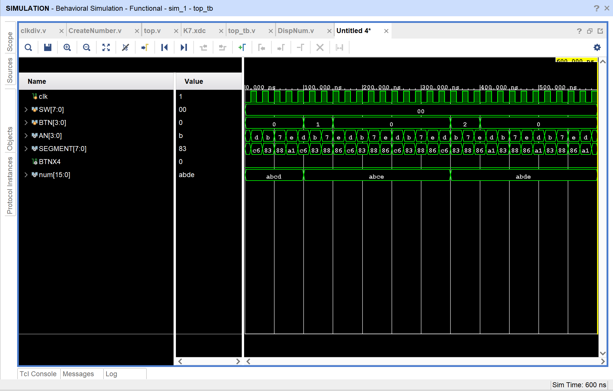

对波形图与 PPT 参考图存在的差异的一些解释：

- 首先 `SW[7:0]` 部分在 PPT 里给到的数据一直是 `0f`，但此处却是一直不变的 `00`，原因如下：

   - SW的值在仿真文件里被固定为 $0$ 了。
     
     - `top_tb.v` 里的代码:
     
     ```verilog 
     initial begin
     clk = 0;
     SW= 8'b00000000;  //这里写死了 SW初始值为0
     BTN = 4'b0000;
     #100;
     //...后面也没改 SW
     end
     ```

   - 在仿真文件里，从始至终都没有给 `SW` 赋值，它一直保持 `8'b00000000`，所以波形里 `SW[7:0]`一直显示 `00`，完全符合预期，根据实验结果，其实并不影响最终的上板子实验。至少据本人看来，影响不过是 C 语言里把 `x++` 写成 `x += 1` 罢了。

 - 其次 `AN[3:0]` 部分在 PPT 里面是 `e->d->b->7`，而在我的仿真波形图里却是 `d->b->7->e`，实际实在无影响，它俩其实是同一个循环，只是截取的起始点不同，导致出现了两种排列。

 - 另外 `SEGMENT[7:0]` 出现了 `83` 而非 `03`，本质不是程序错误，而是 `8 = 小数点是亮的`，`0 = 小数点是灭的`，实际数字显示完全一样。

 - 最后，`num[15:0]` 部分出现了 `abde` 而非 PPT 里的 `abcf`，究其原因，实际上电路本身完全正确，之前的所有差异，都是仿真文件里按键操作不同导致的，和设计没有任何关系。

因此，该波形图虽然和 PPT 的有所差异，但实际上完全是正确的。

另外，单纯地对该波形图进行解释分析：

1. **`clk` 信号**

波形中是连续的方波，周期为 $20ns$（高电平 $10ns$，低电平 $10ns$），与测试文件中 `always #10 clk = ~clk;` 生成的系统时钟一致，为所有模块提供同步时序。

2. **`SW[7:0]` 信号**

全程保持 `00`，对应测试文件中 `SW = 8'b00000000;`，表示未启用数码管消隐和小数点功能，数码管以默认方式显示。

3. **`BTN[3:0]` 信号（按键输入）**

- `0-100ns`：保持 `0`，无按键按下。

- `100-150ns`：`BTN[0]` 变为高电平（值为 `1`），模拟第 $0$ 个按键按下，随后恢复为 `0`。

- `300-350ns`：`BTN[1]` 变为高电平（值为 `2`），模拟第 $1$ 个按键按下，随后恢复为 `0`。

两次按键操作，分别触发了对应数码管数值的加 $1$ 动作。

4. **`num[15:0]` 信号（内部显示数据）**

- `0-100ns`：初始值为 `abcd`（$16$ 进制），对应 $4$ 个数码管分别显示 `a`、`b`、`c`、`d`。

- `100ns` 按键触发后：数值变为 `abce`，最低位 `d` 加 $1$ 变为 `e`。

- `300ns`按键触发后：数值变为 `abde` ，次低位 `c`加 $1$ 变为 `d`。

  波形清晰验证了 `CreateNumber` 模块的按键计数功能，按键按下后对应位数据正确递增。

5. **`AN[3:0]` 信号（数码管位选）**

波形中按 `d->b->7->e` 的顺序循环切换（十六进制），对应二进制 `1101->1011->0111->1110`，是共阳数码管的位选逻辑：低电平点亮。

该信号由 `scan` 信号经 `Decoder2` 译码产生，每一个周期依次点亮 $4$ 个数码管，实现动态扫描显示，与 `DispNum` 模块的设计完全一致。

6. **`SEGMENT[7:0]` 信号（数码管段码）**

随 `AN` 的循环，段码值在 `c6`、`83`、`88`、`a1` 等之间切换，分别对应 `num` 中 `a`、`b`、`c`、`d` 等数字的译码结果。

该信号由 `MyMC14495` 模块产生，将 $4$ 位二进制数据转换为共阳数码管的段码，验证了译码逻辑的正确性。

>截图记录工程里的模块层次结构

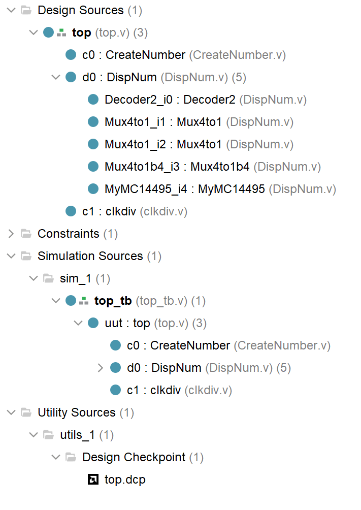

这张 `Design Sources` 层次树，整个工程的模块关系即完整展示：

- 顶层 `top` 调用了 `CreateNumber`、`DispNum`、`clkdiv` 三个子模块
- `DispNum` 内部的 `Decoder2`、`Mux4to1`、`MyMC14495` 等子模块完全没有缺失

---

> 以下是 `K7.xdc` 约束文件

```tcl
create_clock -name clk100MHZ -period 10.0 [get_ports clk]
set_property PACKAGE_PIN AC18 [get_ports clk]
set_property IOSTANDARD LVCMOS18 [get_ports clk]


set_property PACKAGE_PIN W14 [get_ports BTN[0]]
set_property PACKAGE_PIN V14 [get_ports BTN[1]]
set_property PACKAGE_PIN V19 [get_ports BTN[2]]
set_property PACKAGE_PIN V18 [get_ports BTN[3]]
set_property IOSTANDARD LVCMOS18 [get_ports BTN]
set_property CLOCK_DEDICATED_ROUTE FALSE [get_nets BTN_IBUF[*]]


set_property PACKAGE_PIN W16 [get_ports BTNX4]
set_property IOSTANDARD LVCMOS18 [get_ports BTNX4]


set_property PACKAGE_PIN AA10 [get_ports SW[0]]
set_property PACKAGE_PIN AB10 [get_ports SW[1]]
set_property PACKAGE_PIN AA13 [get_ports SW[2]]
set_property PACKAGE_PIN AA12 [get_ports SW[3]]
set_property PACKAGE_PIN Y13  [get_ports SW[4]]
set_property PACKAGE_PIN Y12  [get_ports SW[5]]
set_property PACKAGE_PIN AD11 [get_ports SW[6]]
set_property PACKAGE_PIN AD10 [get_ports SW[7]]
set_property IOSTANDARD LVCMOS15 [get_ports SW]


set_property PACKAGE_PIN AD21 [get_ports AN[0]]
set_property PACKAGE_PIN AC21 [get_ports AN[1]]
set_property PACKAGE_PIN AB21 [get_ports AN[2]]
set_property PACKAGE_PIN AC22 [get_ports AN[3]]
set_property IOSTANDARD LVCMOS33 [get_ports AN]


set_property PACKAGE_PIN AB22 [get_ports SEGMENT[0]]
set_property PACKAGE_PIN AD24 [get_ports SEGMENT[1]]
set_property PACKAGE_PIN AD23 [get_ports SEGMENT[2]]
set_property PACKAGE_PIN Y21  [get_ports SEGMENT[3]]
set_property PACKAGE_PIN W20  [get_ports SEGMENT[4]]
set_property PACKAGE_PIN AC24 [get_ports SEGMENT[5]]
set_property PACKAGE_PIN AC23 [get_ports SEGMENT[6]]
set_property PACKAGE_PIN AA22 [get_ports SEGMENT[7]]
set_property IOSTANDARD LVCMOS33 [get_ports SEGMENT]
```

---

### 四、实验结果分析

- 本次实验完成了 $4$ 选 $1$ 多路选择器设计、四位数码管动态扫描驱动模块设计，以及基于多路选择器的记分板系统设计与验证。

- 通过 **Digital** 软件完成多路选择器与 `DispNum` 模块的原理图设计、仿真与代码导出，在 **Vivado** 中完成时钟分频辅助模块设计、按键计数输入模块设计、设计顶层模块并进行顶层集成、在 **Vivado** 上直接进行行为仿真、编写引脚约束文件与上板测试。
- 在第一个实验中，$1$ 位 $4$ 选 $1$ 多路选择器仿真结果正常，输入 `I`、选择信号 `S` 与输出 `O` 的逻辑关系是正确的，输出随选择信号即时变化且没有出现延迟，完全符合组合电路的工作特性，所有测试用例均通过，验证了电路功能正确。在此基础上完成的 $4$ 位 $4$ 选 $1$ 多路选择器采用位扩展方式实现，仿真显示输出可准确跟随选择信号切换对应 $4$ 路输入，位扩展设计是切实有效的，能够满足多位数据选择的需求。
- 四位数码管动态扫描模块工作正常，在 Digital 中调好频率可以看见数码管的示数变化，能够利用分时扫描与视觉暂留特性实现四位数据稳定显示，小数点与消隐控制功能准确，段码与位选信号时序配合是合理，无闪烁、无乱码。记分板系统整体联调顺利，按键可实现对应位加 $1$ 操作，开关能够控制小数点与消隐功能，上板后系统运行稳定，各项功能均达到实验预期。
- 实验过程中也观察到，由于未加入按键消抖电路，实际使用时可能出现误触发情况，可能按下一次就会容易不止加 $1$；仿真波形与参考波形存在少量差异，但不影响核心逻辑正确性。
- 整体来看，本次实验所有模块设计正确、系统集成顺利，圆满完成了多路选择器应用与记分板系统的设计验证任务。

---

### 五、讨论与心得

本次实验让我我深入理解了 $4$ 选 $1$ 数据选择器的工作原理与位扩展方法，掌握了利用多路选择器实现多位数据分时选择的设计思路。仿真阶段通过修改扫描信号加快仿真速度，以及对波形差异的分析，实在是大开眼界，就此掌握了一些辅助仿真的技巧。另外在 Digital 绘制电路图期间也认识了更多的组件。最后本次和杨海涛同学的合作依旧成功，一切顺利，配合默契，圆满完成本次实验。

---


