# <center>本科实验报告</center>
## <center>课程名称：<u>数字逻辑设计</u></center>
## <center>姓名：<u>邓欢桐</u></center>
## <center>学院：<u>计算机科学与技术学院</u></center>
## <center>系：<u>混合班</u></center>
## <center>专业：<u>计算机科学与技术</u></center>
## <center>学号：<u>3250102223</u></center>
## <center>指导教师：<u>董亚波</u></center>
<center>2026年5月18日</center>

### <center>浙江大学实验报告</center>
#### 课程名称：<u>数字逻辑设计</u> 实验类型：<u>综合</u>       
#### 实验项目名称：<u>**同步时序电路设计**</u>
#### 学生姓名：<u>邓欢桐</u> 专业：<u>混合班</u> 学号：<u>3250102223</u>
#### 同组学生姓名：<u>杨海涛</u> 指导老师：<u>董亚波</u>     
#### 实验地点：<u>东4-509</u> 实验日期：<u>2026</u>年<u>5</u>月<u>18</u>日

### 一、实验目的和要求

#### 目的：

- 理解**同步时序电路**基本结构与工作原理，掌握同步二进制计数器、可逆计数器的逻辑构成与运行机制。
- 熟练掌握时序电路状态表、状态图、激励方程、输出方程的推导与应用方法。
- 学会使用**原理图输入法**设计 4 位同步二进制计数器，掌握数字逻辑仿真工具 Digital 与 FPGA 开发工具 Vivado 的使用。
- 掌握**Verilog 行为描述**方式编写有限状态机与计数器模块，完成代码编写、功能仿真与 FPGA 板级实现。
- 掌握分频器设计方法，能够利用高频时钟分频得到秒级、百毫秒级基准时钟，实现时序电路的实际硬件运行。

---

#### 要求：

- 采用原理图方式完成 4 位同步二进制计数器设计，完成仿真验证并导出 Verilog 文件，在 Vivado 中进行二次仿真。
- 基于 Verilog 行为描述设计**16 位可逆同步二进制计数器**，可通过控制端选择加 / 减计数，实现进位、借位信号输出。
- 设计 100MHz 分频得到 1Hz 秒时钟、100ms 基准时钟的分频模块。
- 搭建顶层模块，将计数器、分频器、数码管显示、LED 指示进行例化关联，在 SWORD 开发板上实现硬件运行。
- 完成功能仿真，观察计数波形、进位 / 借位信号变化；板级调试记录正向进位、反向借位时刻波形与硬件现象，撰写实验分析。

---

### 二、实验内容和原理

#### 内容：

1. **任务一：原理图设计 4 位同步二进制计数器**

- 在 Digital 软件中新建原理图，调用 D 触发器、与或非门等器件，根据激励函数搭建 4 位同步二进制计数器电路。
- 搭建完成后进行功能仿真，观察 QA、QB、QC、QD 计数波形与进位 RC 输出。
- 导出电路对应的 Verilog 文件，导入 Vivado 工程，编写仿真测试文件完成行为仿真，验证时序逻辑正确性。
- 设计 1Hz 秒分频模块与顶层文件，将 4 位计数器绑定 1Hz 时钟，计数结果输出到数码管最低位，进位 RC 由 LED 灯显示。

2. **任务二：Verilog 行为描述设计 16 位可逆同步计数器**

- 在 Vivado 中新建工程，采用行为描述编写 16 位可逆计数器模块，定义时钟 clk、模式控制端 S、16 位计数输出 cnt、进位借位输出 RC。
- 编写仿真测试文件，仿真观察正向计数进位、反向计数借位时刻 RC 的电平变化。
- 设计 100ms 分频时钟模块，搭建顶层 Top 模块，例化分频器与 16 位可逆计数器；通过开发板按键 SW [0] 控制加减计数，计数结果由 4 位数码管显示，RC 状态由 LED 指示。
- 下载程序到 SWORD 开发板，录制并观察正向计数溢出、反向计数归零的硬件现象，保存波形与硬件截图。

---

#### 原理：

1. **同步时序电路基本原理**
同步时序电路所有触发器共用同一时钟信号，状态变化统一在时钟边沿触发，无异步毛刺、时序稳定性强。电路由组合逻辑电路和时序触发器（本实验采用 D 触发器）构成，满足 $Q^{n+1}=D$，通过设计激励函数 D 实现预定计数逻辑。

2. **4 位同步二进制计数器原理**
由 4 个 D 触发器级联构成同步计数结构，在统一时钟上升沿按二进制规律 0000~1111 循环累加，计满 15 后回到 0。通过卡诺图化简得到各触发器激励信号 DA、DB、DC、DD 逻辑表达式；进位输出 RC 在计数器全 1 时输出高电平，表示计数溢出。

3. **可逆同步计数器原理**
设置模式控制端 S：**S=1** 为正向加 1 计数，**S=0** 为反向减 1 计数；进位 / 借位信号 RC 在正向计满全 1、反向减至全 0 时输出高电平，分别表征进位和借位状态。采用 Verilog 行为描述可直接通过加减运算实现计数逻辑，简洁易移植。

4. **分频器原理**
开发板输入系统时钟为 100MHz，通过计数器循环计数，达到设定计数值后翻转输出电平，实现整数分频。计数 50000000 次可分频得到 1Hz 秒时钟，计数 5000000 次可得到 100ms 基准时钟，为慢速计数提供时钟基准。

---

### 三、实验过程和数据记录

#### 任务 1：原理图方式设计 4 位同步二进制计数器

根据原理：

$D_D$ 卡诺图化简

- 变量：行变量 $Q_A Q_B$，列变量 $Q_C Q_D$，输出 $D_D$
- 卡诺图：

| $Q_A Q_B \setminus Q_C Q_D$ | 00 | 01 | 11 | 10 |
| :---: | :---: | :---: | :---: | :---: |
| 00 | **1** |  |  | **1** |
| 01 | **1** |  |  | **1** |
| 11 | **1** |  |  | **1** |
| 10 | **1** |  |  | **1** |

- 化简结果：$D_D = \overline{Q_D}$

---

$D_C$ 卡诺图化简

- 变量：行变量 $Q_A Q_B$，列变量 $Q_C Q_D$，输出 $D_D$
- 卡诺图：

| $Q_A Q_B \setminus Q_C Q_D$ | 00 | 01 | 11 | 10 |
| :---: | :---: | :---: | :---: | :---: |
| 00 |  | **1** |  | **1** |
| 01 |  | **1** |  | **1** |
| 11 |  | **1** |  | **1** |
| 10 |  | **1** |  | **1** |

---

- 化简结果：$D_C = \overline{Q_C}Q_D + Q_C\overline{Q_D} = Q_D \oplus Q_C$

---

$D_B$ 卡诺图化简

- 变量：行变量 $Q_A Q_B$，列变量 $Q_C Q_D$，输出 $D_B$
- 卡诺图：

| $Q_A Q_B \setminus Q_C Q_D$ | 00 | 01 | 11 | 10 |
| :---: | :---: | :---: | :---: | :---: |
| 00 |  |  | **1** |  |
| 01 | **1** | **1** |  | **1** |
| 11 | **1** | **1** |  | **1** |
| 10 |  |  | **1** |  |

- 化简结果：$D_B = Q_B\overline{Q_C} + Q_B\overline{Q_D} + \overline{Q_B}Q_CQ_D = Q_CQ_D \oplus Q_B$

---

$D_A$ 卡诺图化简

- 变量：行变量 $Q_A Q_B$，列变量 $Q_C Q_D$，输出 $D_A$
- 卡诺图：

| $Q_A Q_B \setminus Q_C Q_D$ | 00 | 01 | 11 | 10 |
| :---: | :---: | :---: | :---: | :---: |
| 00 |  |  |  |  |
| 01 |  |  | **1** |  |
| 11 | **1** | **1** |  | **1** |
| 10 | **1** | **1** | **1** | **1** |

---

- 化简结果：$D_A = Q_A\overline{Q_B} + Q_A\overline{Q_C} + Q_A\overline{Q_D} + \overline{Q_A}Q_BQ_CQ_D = Q_BQ_CQ_D \oplus Q_A$

---

- 激励函数

$D_A = Q_B Q_C Q_D \oplus Q_A$
$D_B = Q_C Q_D \oplus Q_B$
$D_C = Q_D \oplus Q_C$
$D_D = \overline{Q_D}$

- 进位 $R_C$ 的输出函数

$R_C = Q_A Q_B Q_C Q_D$

---


> 画出的 **Digital** 原理图：

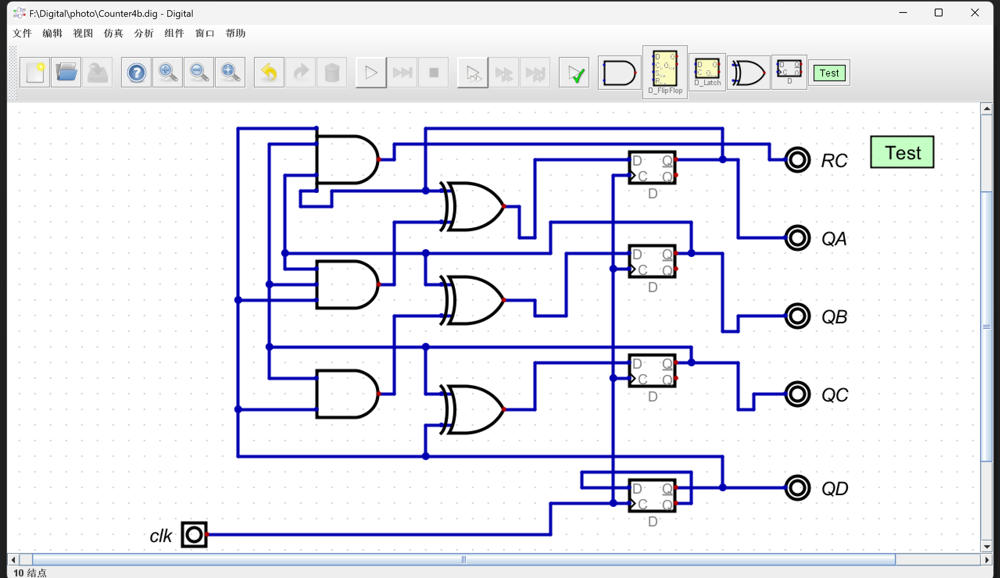


> 在 **Digital** 写出的测试用例如下：

```text
clk QA QB QC QD RC
0 x x x x x
1 x x x x x
0 x x x x x
0 x x x x x
1 x x x x x
0 x x x x x
0 x x x x x
1 x x x x x
0 x x x x x
0 x x x x x
1 x x x x x
0 x x x x x
0 x x x x x
1 x x x x x
0 x x x x x
0 x x x x x
1 x x x x x
0 x x x x x
0 x x x x x
1 x x x x x
0 x x x x x
0 x x x x x
1 x x x x x
0 x x x x x
0 x x x x x
1 x x x x x
0 x x x x x
0 x x x x x
1 x x x x x
0 x x x x x
0 x x x x x
1 x x x x x
0 x x x x x
0 x x x x x
1 x x x x x
0 x x x x x
0 x x x x x
1 x x x x x
0 x x x x x
0 x x x x x
1 x x x x x
0 x x x x x
0 x x x x x
1 x x x x x
0 x x x x x
0 x x x x x
1 x x x x x
0 x x x x x
0 x x x x x
```

---

> **Digital** 中测试用例得到的波形图：

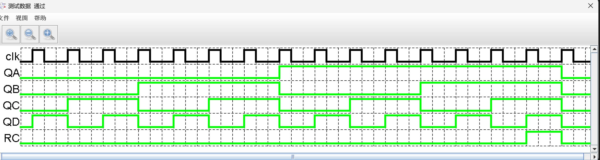

---

> 对波形的简单解释：

如图，时钟 `clk` 为固定周期方波，每到来一个时钟上升沿，**QA、QB、QC、QD** 按照 4 位二进制规律从 `0000` 依次递增计数，按 0~F 循环变化；

进位信号 `RC` 仅当计数器状态为 `1111`（十进制 15）时跳变为高电平，其余计数状态下保持低电平，实现满量程进位功能；

所有触发器均由同一时钟同步触发，状态跳转无先后延迟，符合同步时序电路无竞争冒险的特性。

---

> `Counter4b.v` 如下：
>
> 同时，在 Vivado 上进行仿真及下板子操作时，其命名为 `counter_4bit.v`，但实质上不影响，仅仅是名称问题。

```verilog
/*
 * Generated by Digital. Don't modify this file!
 * Any changes will be lost if this file is regenerated.
 */
module DIG_D_FF_1bit
#(
    parameter Default = 0
)
(
   input D,
   input C,
   output Q,
   output \~Q
);
    reg state;

    assign Q = state;
    assign \~Q = ~state;

    always @ (posedge C) begin
        state <= D;
    end

    initial begin
        state = Default;
    end
endmodule


module Counter4b (
  input clk,
  output RC,
  output QA,
  output QB,
  output QC,
  output QD
);
  wire QA_temp;
  wire QB_temp;
  wire QC_temp;
  wire QD_temp;
  wire s0;
  wire s1;
  wire s2;
  wire s3;
  DIG_D_FF_1bit #(
    .Default(0)
  )
  DIG_D_FF_1bit_i0 (
    .D( s0 ),
    .C( clk ),
    .Q( QA_temp )
  );
  DIG_D_FF_1bit #(
    .Default(0)
  )
  DIG_D_FF_1bit_i1 (
    .D( s1 ),
    .C( clk ),
    .Q( QB_temp )
  );
  DIG_D_FF_1bit #(
    .Default(0)
  )
  DIG_D_FF_1bit_i2 (
    .D( s2 ),
    .C( clk ),
    .Q( QC_temp )
  );
  DIG_D_FF_1bit #(
    .Default(0)
  )
  DIG_D_FF_1bit_i3 (
    .D( s3 ),
    .C( clk ),
    .Q( QD_temp ),
    .\~Q ( s3 )
  );
  assign RC = (QD_temp & QC_temp & QB_temp & QA_temp);
  assign s0 = (QA_temp ^ (QB_temp & QC_temp & QD_temp));
  assign s1 = (QB_temp ^ (QC_temp & QD_temp));
  assign s2 = (QC_temp ^ QD_temp);
  assign QA = QA_temp;
  assign QB = QB_temp;
  assign QC = QC_temp;
  assign QD = QD_temp;
endmodule
```

---

> `Counter4b_tb.v` 文件如下：

```verilog
`timescale 1ns / 1ps

module Counter4b_tb();

  reg clk;
  wire [3:0] out;
  wire rc;
  
  counter_4bit c1(
    .clk(clk),
    .QA(out[3]),
    .QB(out[2]),
    .QC(out[1]),
    .QD(out[0]),
    .RC(rc)
  );
  
  initial begin
    clk = 0;
  end
  
  always begin
    #10 clk = ~clk;
   end
   
   initial begin
     #800 $finish;
   end
endmodule
```

由此，我们可以进行仿真，得到仿真波形

> **Vivado** 仿真波形图如下：

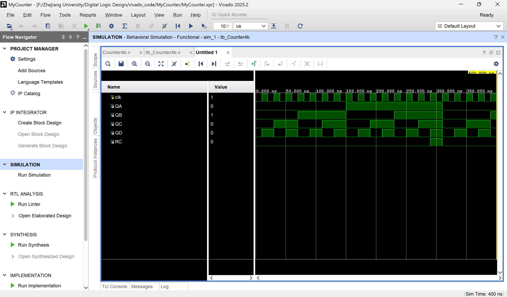

---

> 对波形的一些解释：

仿真波形中 `clk` 周期性翻转，**QA、QB、QC、QD** 在时钟上升沿同步更新状态，严格按照 4 位二进制加法规律递增；

计数从 `0000` 逐步计数到 `1111` 后自动回卷至 `0000`，完成循环；

`RC`进位信号在`1111`时刻置高，下一时钟沿随计数器归零立刻拉低，脉冲宽度与时钟周期一致，进位逻辑准确无误。实质上，和前面 Digital 里面的仿真波形没有任何本质区别。

---

> 由于需要输出秒时钟，因此需要添加 `design sources`，命名为 `counter_1s`，内容如下

```verilog
module counter_1s(clk, clk_1s);
    input wire clk;
    output reg clk_1s;
    reg [31:0] cnt;
    initial clk_1s = 0;
    always @ (posedge clk) begin
       if (cnt < 50000000) begin
           cnt <= cnt + 1'b1;
       end else begin
           cnt <= 0;
           clk_1s <= ~clk_1s;
       end
    end
endmodule
```

---

> 另外在该实验中，我们之前的 `MyMC14495.v` 文件需要使用，这里一并附上

```verilog
/*
 * Generated by Digital. Don't modify this file!
 * Any changes will be lost if this file is regenerated.
 */

module MyMC14495 (
  input D0,
  input D1,
  input D2,
  input D3,
  input LE,
  input point,
  output a,
  output b,
  output c,
  output d,
  output e,
  output f,
  output g,
  output p
);
  wire s0;
  wire s1;
  wire s2;
  wire s3;
  assign s0 = ~ D0;
  assign s1 = ~ D1;
  assign s2 = ~ D2;
  assign s3 = ~ D3;
  assign a = (((D0 & s1 & s2 & s3) | (s0 & s1 & D2 & s3) | (D0 & D1 & s2 & D3) | (D0 & s1 & D2 & D3)) | LE);
  assign b = (((D0 & s1 & D2 & s3) | (s0 & D2 & D1) | (s0 & D2 & D3) | (D0 & D1 & D3)) | LE);
  assign c = (((s3 & s2 & D1 & s0) | (D3 & D2 & s0) | (D3 & D2 & D1)) | LE);
  assign d = (((s3 & s2 & s1 & D0) | (s3 & D2 & s1 & s0) | (D2 & D1 & D0) | (D3 & s2 & D1 & s0)) | LE);
  assign e = (((s3 & D0) | (s3 & D2 & s1) | (s1 & s2 & D0)) | LE);
  assign f = (((s3 & s2 & D0) | (s3 & D1 & D0) | (s3 & s2 & D1) | (D3 & D2 & s1 & D0)) | LE);
  assign g = (((s3 & s2 & s1) | (s3 & D2 & D1 & D0) | (D3 & D2 & s1 & s0)) | LE);
  assign p = ~point;
endmodule
```

---

> 顶层文件 `top.v` 如下：

```verilog
module top( 
    input wire clk, 
	output wire [3:0] AN,
	output wire [7:0] SEGMENT,
	output wire BTNX4,
	output wire RC
);
	wire [3:0] num;
	wire clk_1s;
    counter_1s c1(.clk(clk), .clk_1s(clk_1s));
    counter_4bit c4b(
        .clk(clk_1s),
        .QA(num[3]),
        .QB(num[2]),
        .QC(num[1]),
        .QD(num[0]),
        .RC(RC)
      );
    MyMC14495 s0(
        .D3(num[3]), .D2(num[2]),  .D1(num[1]), .D0(num[0]),
        .point(0), .LE(0),
        .a(SEGMENT[0]),
        .b(SEGMENT[1]),
        .c(SEGMENT[2]),
        .d(SEGMENT[3]),
        .e(SEGMENT[4]),
        .f(SEGMENT[5]),
        .g(SEGMENT[6]),
        .p(SEGMENT[7])
    );
    assign AN[3:0] = 4'b1110;
    assign BTNX4 = 1'b0;
endmodule
```

---

> 仿真文件 `top_tb.v` 如下：

```verilog
`timescale 1ns / 1ps
 
module top_tb();

  reg clk;
  wire [3:0] AN;
  wire [7:0] SEGMENT;
  wire BTNX4;
  
  top t1(
    .clk(clk), 
	.AN(AN),
	.SEGMENT(SEGMENT),
	.BTNX4(BTNX4)
  );
  
  initial begin
    clk = 0;
  end
  
  always begin
    #10 clk = ~clk;
   end
   
   initial begin
     #100000 $finish;
   end
endmodule
```

---

> 仿真波形：

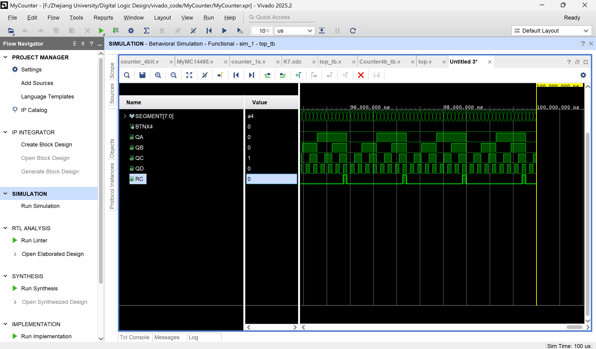

> 对波形的一些解释：

首先需要明确的是，直接点开放大全屏图标是无法看到 $RC$ 进行跳变的，因为脉冲太宽了。

仿真为加快运行速度，将 1Hz 分频计数阈值改小，波形可快速观察计数变化；

系统时钟 `clk` 持续振荡，分频后秒时钟驱动 4 位计数器，数码管段选 `SEGMENT`、位选 `AN` 随计数值动态变化，实时译码显示当前计数；

`RC ` 进位信号在计数到最大值时拉高，对应 LED 控制端口同步置高，和理论设计完全一致；

波形无毛刺、无时序错乱，说明模块例化、端口连接、分频逻辑均设计正确。

---

至此，我们可以进行上板子实验了

> 约束文件 `K7.xdc` 如下：

```tcl
create_clock -name clk100MHZ -period 10.0 [get_ports {clk}]
set_property PACKAGE_PIN AC18 [get_ports {clk}]
set_property IOSTANDARD LVCMOS18 [get_ports {clk}]

set_property PACKAGE_PIN AB22 [get_ports {SEGMENT[0]}]
set_property IOSTANDARD LVCMOS33 [get_ports {SEGMENT[0]}]
set_property PACKAGE_PIN AD24 [get_ports {SEGMENT[1]}]
set_property IOSTANDARD LVCMOS33 [get_ports {SEGMENT[1]}]
set_property PACKAGE_PIN AD23 [get_ports {SEGMENT[2]}]
set_property IOSTANDARD LVCMOS33 [get_ports {SEGMENT[2]}]
set_property PACKAGE_PIN Y21 [get_ports {SEGMENT[3]}]
set_property IOSTANDARD LVCMOS33 [get_ports {SEGMENT[3]}]
set_property PACKAGE_PIN W20 [get_ports {SEGMENT[4]}]
set_property IOSTANDARD LVCMOS33 [get_ports {SEGMENT[4]}]
set_property PACKAGE_PIN AC24 [get_ports {SEGMENT[5]}]
set_property IOSTANDARD LVCMOS33 [get_ports {SEGMENT[5]}]
set_property PACKAGE_PIN AC23 [get_ports {SEGMENT[6]}]
set_property IOSTANDARD LVCMOS33 [get_ports {SEGMENT[6]}]
set_property PACKAGE_PIN AA22 [get_ports {SEGMENT[7]}]
set_property IOSTANDARD LVCMOS33 [get_ports {SEGMENT[7]}]
set_property PACKAGE_PIN W16 [get_ports BTNX4]
set_property IOSTANDARD LVCMOS18 [get_ports BTNX4]

set_property PACKAGE_PIN AD21 [get_ports {AN[0]}]
set_property IOSTANDARD LVCMOS33 [get_ports {AN[0]}]
set_property PACKAGE_PIN AC21 [get_ports {AN[1]}]
set_property IOSTANDARD LVCMOS33 [get_ports {AN[1]}]
set_property PACKAGE_PIN AB21 [get_ports {AN[2]}]
set_property IOSTANDARD LVCMOS33 [get_ports {AN[2]}]
set_property PACKAGE_PIN AC22 [get_ports {AN[3]}]
set_property IOSTANDARD LVCMOS33 [get_ports {AN[3]}]

set_property PACKAGE_PIN AF24 [get_ports {RC}]
set_property IOSTANDARD LVCMOS33 [get_ports {RC}]
```

---

> 实验实时图片：

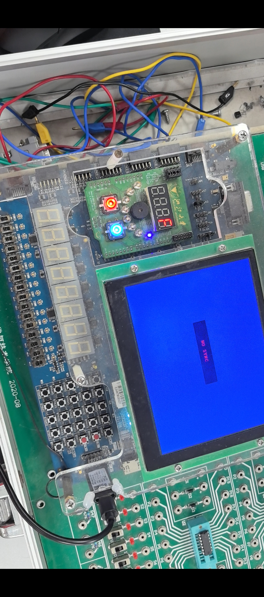

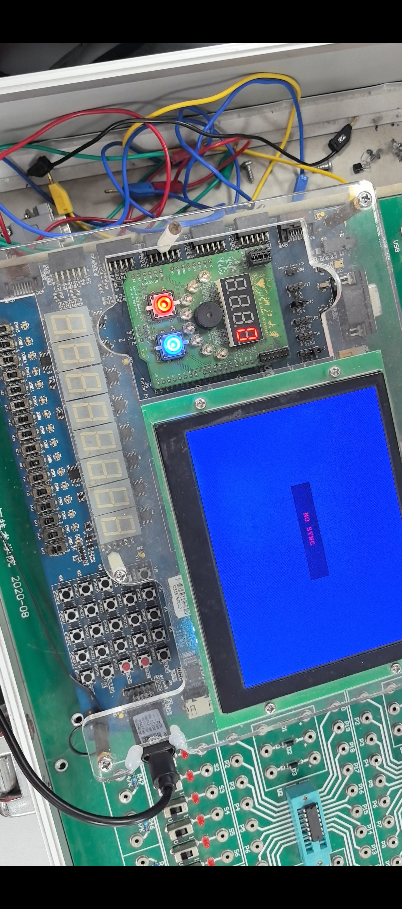

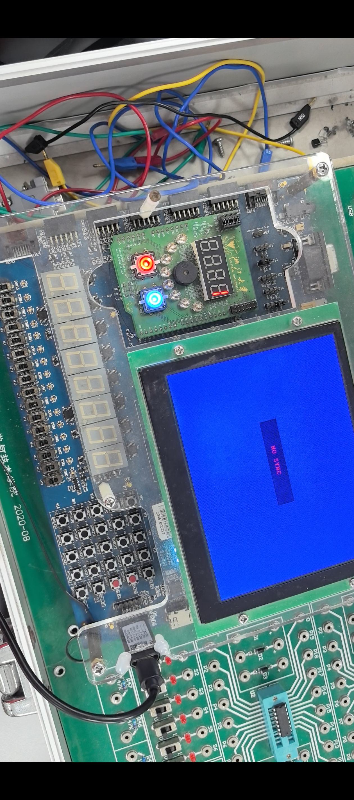

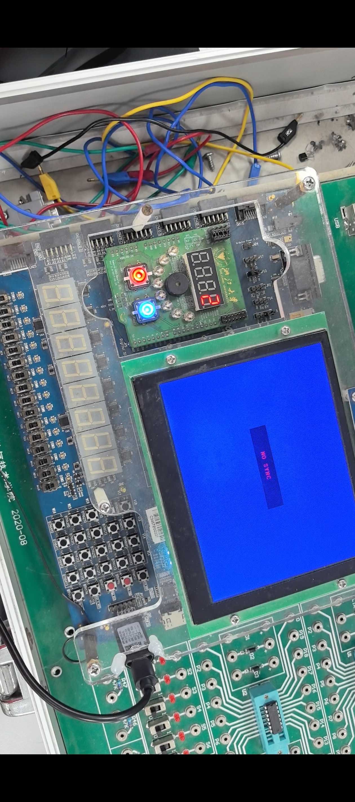

---

> 对图片的一些解释：

如图，在显示 $F$ 即 $16$ 时，灯亮，说明完成进位，且严格以 0 -> 1 -> 2 -> 3 -> 4 -> 5 -> 6 -> 7 -> 8 -> 9 -> A -> B -> C -> D -> E -> F  的顺序进行循环，每秒一次跳变，完全符合实验预期。

当数码管显示`F`（15）时，对应进位 LED 指示灯点亮，计数跳变回 0 时 LED 同步熄灭；

整体计数节奏稳定、无跳数、无乱码，数码管译码正常，LED 进位指示逻辑匹配仿真结果，验证了原理图设计、Verilog 代码及硬件约束均有效。

> 一点碎碎念：

一开始把数据整成了另一个非常诡异的顺序，虽然它诡异但它确实是一个特定的顺序，上课才知道其实各种顺序都是可以的，只是本实验要求 0 到 16 的有序顺序罢了。

---

#### 任务 2：设计 16 位可逆同步二进制计数器

可逆二进制同步计数器通过控制端S选择正向或者反向计数

- S = 1时，正向计数
- S = 0时，反向计数
- 各触发器逻辑表达式如下式：

$D_A = \overline{Q_A}$

$D_B = \overline{S}(\overline{\overline{Q_A}} \oplus \overline{Q_B}) + S(\overline{Q_A} \oplus \overline{\overline{Q_B}}) = S \oplus \overline{Q_A} \oplus \overline{Q_B}$

$D_C = \overline{S}[(\overline{\overline{Q_A} \overline{Q_B}}) \oplus \overline{Q_C}] + S[(\overline{Q_A} + \overline{Q_B}) \oplus \overline{Q_C}] = [\overline{S}\overline{Q_A} \overline{Q_B} + S(\overline{Q_A} + \overline{Q_B})] \oplus \overline{Q_C}$

$= [\overline{S}(Q_A + Q_B) + S(\overline{Q_A} + \overline{Q_B})] \oplus \overline{Q_C}$

$D_D = \overline{S}[(\overline{\overline{Q_A} \overline{Q_B} \overline{Q_C}}) \oplus \overline{Q_D}] + S[(\overline{Q_A} + \overline{Q_B} + \overline{Q_C}) \oplus \overline{Q_D}] = [\overline{S}\overline{Q_A} \overline{Q_B} \overline{Q_C} + S(\overline{Q_A} + \overline{Q_B} + \overline{Q_C})] \oplus \overline{Q_D}$

$= [\overline{S}(Q_A + Q_B + Q_C) + S(\overline{Q_A} + \overline{Q_B} + \overline{Q_C})] \oplus \overline{Q_D}$

$R = \overline{S}\overline{Q_A}\overline{Q_B}\overline{Q_C}\overline{Q_D} + S Q_A Q_B Q_C Q_D$

> 注意，由于排版原因，有些部分符号的 \overline 连在了一起，导致视觉上可能有误，虽然可以使用 \bar，但是 \bar 太短了，有时候也无法完全覆盖整个符号，因此为严谨考虑，还是把 PPT 的原图片直接附上，这样视觉上更加准确些，歧义也更少一些：

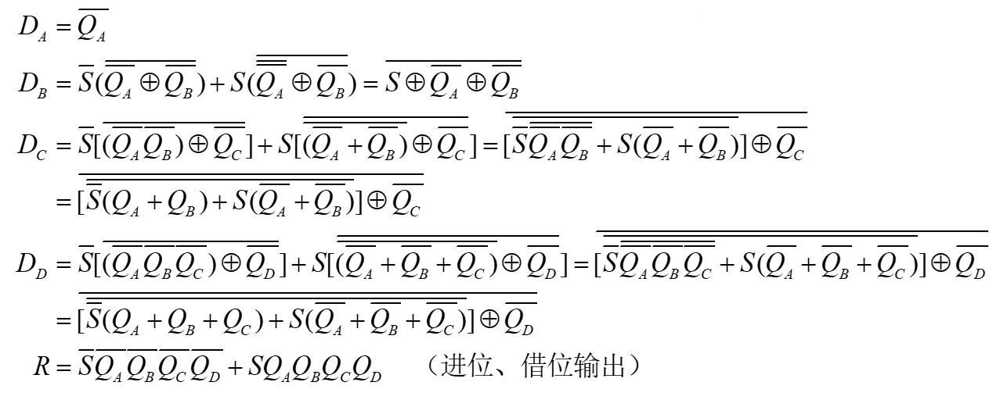

---

> 编写二进制 4 位同步计数器 `RevCounter.v` 文件如下：

```verilog
`timescale 1ns / 1ps
module RevCounter (
    input  wire clk,
    input  wire s, 
    output wire [15:0] cnt, 
    output wire Rc
);
    reg [15:0] count;
    assign cnt = count;
    assign Rc = (s && (count == 16'hFFFF)) || (~s && (count == 16'h0000));

    always @(posedge clk) begin
        if (s)
            count <= count + 1'b1;
        else
            count <= count - 1'b1;
    end
    
    initial count = 16'd0;
endmodule
```

---

> 计数器设计，编写 `clk_100ms` 如下：

```verilog
module clk_100ms #(parameter DIV = 2) (
    input wire clk_in, // 100MHz
    output reg clk_out 
);
    reg [31:0] cnt;
    initial clk_out = 0;

    always @(posedge clk_in) begin
        if (cnt < DIV - 1)
            cnt <= cnt + 1;
        else begin
            cnt <= 0;
            clk_out <= ~clk_out;
        end
    end
endmodule
```

---

>仿真文件 `RevCounter_tb.v` 如下：

```verilog
`timescale 1ns / 1ps

module RevCounter_tb();

    reg clk;
    reg sw;
    wire [15:0] cnt;
    wire RC;

    RevCounter uut (
        .clk (clk),
        .cnt (cnt),
        .s(sw),
        .Rc(RC)
    );

    always #10 clk = ~clk;

   initial begin
        clk = 0;
        sw = 1;
        #40; sw = 0;
        #100;
        sw = 1;
        #100;
        $finish;
    end

endmodule
```

---

> 由此得到仿真波形如下：

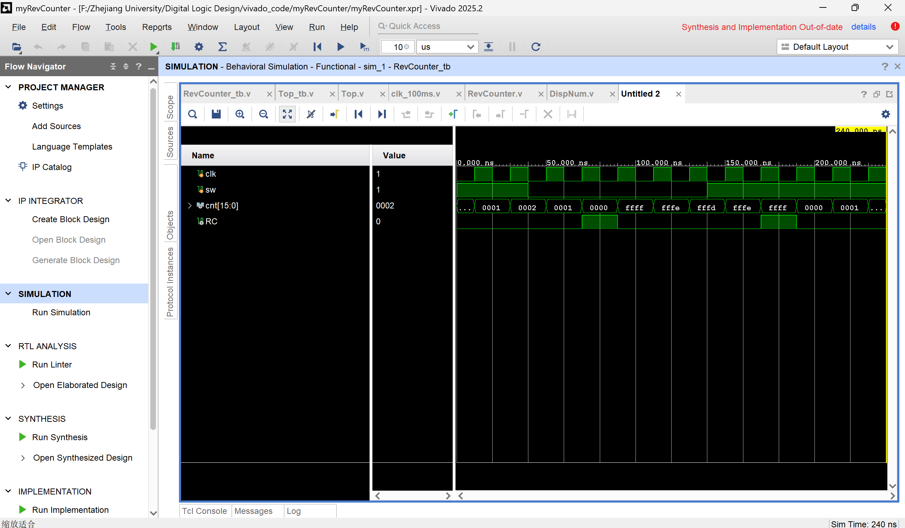

> 对波形的一些解释：

由图可知，正向计数和反向计数的波形是不同的；

控制端 `s=1` 时，16 位计数输出 `cnt` 从初始值开始**逐次加 1**正向递增；

切换 `s=0` 后，计数器立即变为**逐次减 1**反向递减；

进位 / 借位信号 `Rc` 有两种触发状态：正向计数到最大值 `16'hFFFF` 时 `Rc` 拉高（进位），反向计数递减到 `16'h0000` 时 `Rc` 同样拉高（借位）；

波形清晰区分了正向、反向计数规律，`Rc` 仅在边界零点、满值点输出高电平，符合可逆计数器设计原理。

---

> 该实验需要用到此前写过的 `DispNum.v`，为了保证一致性和完整性，这里一并附上：

```verilog
/*
 * Generated by Digital. Don't modify this file!
 * Any changes will be lost if this file is regenerated.
 */

module Decoder2 (
    output out_0,
    output out_1,
    output out_2,
    output out_3,
    input [1:0] sel
);
    assign out_0 = (sel == 2'h0)? 1'b1 : 1'b0;
    assign out_1 = (sel == 2'h1)? 1'b1 : 1'b0;
    assign out_2 = (sel == 2'h2)? 1'b1 : 1'b0;
    assign out_3 = (sel == 2'h3)? 1'b1 : 1'b0;
endmodule


module Mux4to1 (
  input [1:0] S,
  input [3:0] I,
  output O
);
  assign O = (((~ S[0] & ~ S[1]) & I[0]) | ((S[0] & ~ S[1]) & I[1]) | ((~ S[0] & S[1]) & I[2]) | ((S[1] & S[0]) & I[3]));
endmodule

module Mux4to1b4 (
  input [3:0] I0,
  input [3:0] I1,
  input [3:0] I2,
  input [3:0] I3,
  input [1:0] S,
  output [3:0] O
);
  wire s0;
  wire s1;
  wire s2;
  wire s3;
  wire s4;
  wire s5;
  wire s6;
  wire s7;
  assign s3 = S[0];
  assign s5 = S[1];
  assign s7 = (s5 & s3);
  assign s0 = ~ s3;
  assign s1 = ~ s5;
  assign s2 = (s0 & s1);
  assign s4 = (s3 & s1);
  assign s6 = (s0 & s5);
  assign O[0] = ((s2 & I0[0]) | (s4 & I1[0]) | (s6 & I2[0]) | (s7 & I3[0]));
  assign O[1] = ((s2 & I0[1]) | (s4 & I1[1]) | (s6 & I2[1]) | (s7 & I3[1]));
  assign O[2] = ((s2 & I0[2]) | (s4 & I1[2]) | (s6 & I2[2]) | (s7 & I3[2]));
  assign O[3] = ((s2 & I0[3]) | (s4 & I1[3]) | (s6 & I2[3]) | (s7 & I3[3]));
endmodule

module MyMC14495 (
  input point,
  input LE,
  input D0,
  input D1,
  input D2,
  input D3,
  output g,
  output f,
  output e,
  output d,
  output c,
  output b,
  output a,
  output p
);
  wire s0;
  wire s1;
  wire s2;
  wire s3;
  assign p = ~ point;
  assign s0 = ~ D0;
  assign s1 = ~ D1;
  assign s2 = ~ D2;
  assign s3 = ~ D3;
  assign g = (((s0 & s1 & D2 & D3) | (D0 & D1 & D2 & s3) | (s1 & s2 & s3)) | LE);
  assign f = (((D0 & s1 & D2 & D3) | (D0 & D1 & s3) | (D1 & s2 & s3) | (D0 & s2 & s3)) | LE);
  assign e = (((D0 & s1 & s2) | (s1 & D2 & s3) | (D0 & s3)) | LE);
  assign d = (((s0 & D1 & s2 & D3) | (D0 & D1 & D2) | (s0 & s1 & D2 & s3) | (D0 & s1 & s2 & s3)) | LE);
  assign c = (((D1 & D2 & D3) | (s0 & D2 & D3) | (s0 & D1 & s2 & s3)) | LE);
  assign b = (((D0 & D1 & D3) | (s0 & D2 & D3) | (s0 & D1 & D2) | (D0 & s1 & D2 & s3)) | LE);
  assign a = (((D0 & s1 & D2 & D3) | (D0 & D1 & s2 & D3) | (s0 & s1 & D2 & s3) | (D0 & s1 & s2 & s3)) | LE);
endmodule

module DispNum (
  input [1:0] scan,
  input [15:0] HEXS,
  input [3:0] point,
  input [3:0] LES,
  output [3:0] AN,
  output [7:0] SEGMENT
);
  wire s0;
  wire s1;
  wire s2;
  wire s3;
  wire s4;
  wire s5;
  wire [3:0] s6;
  wire [3:0] s7;
  wire [3:0] s8;
  wire [3:0] s9;
  wire [3:0] s10;
  wire s11;
  wire s12;
  wire s13;
  wire s14;
  wire s15;
  wire s16;
  wire s17;
  wire s18;
  wire s19;
  wire s20;
  wire s21;
  wire s22;
  Decoder2 Decoder2_i0 (
    .sel( scan ),
    .out_0( s0 ),
    .out_1( s1 ),
    .out_2( s2 ),
    .out_3( s3 )
  );
  Mux4to1 Mux4to1_i1 (
    .S( scan ),
    .I( point ),
    .O( s4 )
  );
  Mux4to1 Mux4to1_i2 (
    .S( scan ),
    .I( LES ),
    .O( s5 )
  );
  assign s6 = HEXS[3:0];
  assign s7 = HEXS[7:4];
  assign s8 = HEXS[11:8];
  assign s9 = HEXS[15:12];
  assign AN[0] = ~ s0;
  assign AN[1] = ~ s1;
  assign AN[2] = ~ s2;
  assign AN[3] = ~ s3;
  Mux4to1b4 Mux4to1b4_i3 (
    .I0( s6 ),
    .I1( s7 ),
    .I2( s8 ),
    .I3( s9 ),
    .S( scan ),
    .O( s10 )
  );
  assign s11 = s10[0];
  assign s12 = s10[1];
  assign s13 = s10[2];
  assign s14 = s10[3];
  MyMC14495 MyMC14495_i4 (
    .point( s4 ),
    .LE( s5 ),
    .D0( s11 ),
    .D1( s12 ),
    .D2( s13 ),
    .D3( s14 ),
    .g( s15 ),
    .f( s16 ),
    .e( s17 ),
    .d( s18 ),
    .c( s19 ),
    .b( s20 ),
    .a( s21 ),
    .p( s22 )
  );
  assign SEGMENT[0] = s21;
  assign SEGMENT[1] = s20;
  assign SEGMENT[2] = s19;
  assign SEGMENT[3] = s18;
  assign SEGMENT[4] = s17;
  assign SEGMENT[5] = s16;
  assign SEGMENT[6] = s15;
  assign SEGMENT[7] = s22;
endmodule
```

---

> 加上前面给到的 `clk_100ms`，编写顶层文件 `Top.v` 如下：

```verilog
module Top #(
    parameter CLK_DIV_100MS = 5_000_000,
    parameter SCAN_DIV = 100_000
) (
    input  wire clk_100m,
input  wire [1:0] SW,
    output wire [3:0] AN,
    output wire [7:0] SEGMENT,
    output wire [7:0] LED 
);

    wire clk_100ms;
    wire clk_scan;
    wire [15:0] cnt;
    wire Rc; 

    clk_100ms #(.DIV(CLK_DIV_100MS)) u_clk_100ms (
        .clk_in (clk_100m),
        .clk_out(clk_100ms)
    );
    clk_100ms #(.DIV(SCAN_DIV)) u_clk_scan (
        .clk_in (clk_100m),
        .clk_out(clk_scan)
    );

    RevCounter u_counter (
        .clk (clk_100ms),
        .s   (SW),
        .cnt (cnt),
        .Rc  (Rc)
    );

    reg [1:0] scan_cnt; 
    always @(posedge clk_scan) begin
        scan_cnt <= scan_cnt + 1'b1;
    end

    // 这里端口名改为 HEXS！！！
    DispNum u_disp (
        .HEXS    (cnt),
        .point   (4'b0000), 
        .LES     (4'b0000),
        .scan    (scan_cnt),
        .AN      (AN),
        .SEGMENT (SEGMENT) 
    );

    assign LED[0] = Rc;
    assign LED[7:1] = 7'b0;

endmodule
```

---

> 同时，编写仿真文件 `Top_tb.v` 如下：

```verilog
`timescale 1ns / 1ps
module Top_tb();

    reg  clk_100m;
reg [1:0] sw;
    wire [3:0] AN;
    wire [7:0] SEGMENT;
    wire [7:0] LED;

    Top #(
        .CLK_DIV_100MS (10),
        .SCAN_DIV (2) 
    ) u_top (
        .clk_100m(clk_100m),
        .SW      (sw),   
        .AN      (AN),
        .SEGMENT (SEGMENT),
        .LED     (LED)
    );

    always #5 clk_100m = ~clk_100m;

    initial begin
        clk_100m = 0;
        sw = 1;  
        #5000;    
        sw = 0;
        #5000;
        $finish;
    end

    initial
        $monitor("Time=%t, cnt=%d, Rc=%b", $time, u_top.u_counter.cnt, LED[0]);

endmodule
```

---

> 仿真波形图如下：

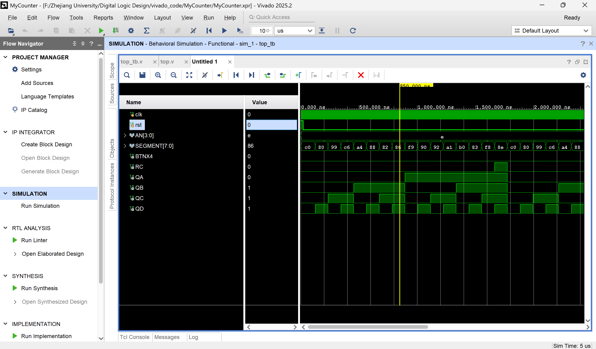

---

> 对波形的一些解释：

系统 100MHz 时钟作为全局时钟，经分频得到 100ms 计时时钟与数码管扫描时钟；

拨动开关 `SW[0]` 控制计数方向，改变电平可随时切换加 / 减计数；

16 位计数值 `cnt` 实时送入数码管译码模块，4 位数码管同步刷新显示十六进制计数值；

`LED[0]` 跟随 `Rc` 电平变化，在进位、借位时刻点亮，其余时刻熄灭；

仿真中状态跳转干净、无时序冲突，模块间级化、分频、译码、控制逻辑全部正常工作。

---

> 编写  `K7.xdc` 约束文件如下：

```tcl
set_property PACKAGE_PIN AC18 [get_ports clk_100m]
set_property IOSTANDARD LVCMOS18 [get_ports clk_100m]

create_clock -period 10.000 -name clk_100m [get_ports "clk_100m"]

set_property PACKAGE_PIN AA10 [get_ports {SW[0]}]
set_property PACKAGE_PIN AB10 [get_ports {SW[1]}]
set_property IOSTANDARD LVCMOS15 [get_ports {SW[0]}]
set_property IOSTANDARD LVCMOS15 [get_ports {SW[1]}]
	
# LED
set_property PACKAGE_PIN W23 [get_ports {LED[0]}]
set_property IOSTANDARD LVCMOS33 [get_ports {LED[0]}]
set_property PACKAGE_PIN AB26 [get_ports {LED[1]}]
set_property IOSTANDARD LVCMOS33 [get_ports {LED[1]}]
set_property PACKAGE_PIN Y25 [get_ports {LED[2]}]
set_property IOSTANDARD LVCMOS33 [get_ports {LED[2]}]
set_property PACKAGE_PIN AA23 [get_ports {LED[3]}]
set_property IOSTANDARD LVCMOS33 [get_ports {LED[3]}]
set_property PACKAGE_PIN Y23 [get_ports {LED[4]}]
set_property IOSTANDARD LVCMOS33 [get_ports {LED[4]}]
set_property PACKAGE_PIN Y22 [get_ports {LED[5]}]
set_property IOSTANDARD LVCMOS33 [get_ports {LED[5]}]
set_property PACKAGE_PIN AE21 [get_ports {LED[6]}]
set_property IOSTANDARD LVCMOS33 [get_ports {LED[6]}]
set_property PACKAGE_PIN AF24 [get_ports {LED[7]}]
set_property IOSTANDARD LVCMOS33 [get_ports {LED[7]}]

	
set_property PACKAGE_PIN AD21 [get_ports {AN[0]}]
set_property PACKAGE_PIN AC21 [get_ports {AN[1]}]
set_property PACKAGE_PIN AB21 [get_ports {AN[2]}]
set_property PACKAGE_PIN AC22 [get_ports {AN[3]}]
set_property PACKAGE_PIN AB22 [get_ports {SEGMENT[0]}]
set_property PACKAGE_PIN AD24 [get_ports {SEGMENT[1]}]
set_property PACKAGE_PIN AD23 [get_ports {SEGMENT[2]}]
set_property PACKAGE_PIN Y21 [get_ports {SEGMENT[3]}]
set_property PACKAGE_PIN W20 [get_ports {SEGMENT[4]}]
set_property PACKAGE_PIN AC24 [get_ports {SEGMENT[5]}]
set_property PACKAGE_PIN AC23 [get_ports {SEGMENT[6]}]
set_property PACKAGE_PIN AA22 [get_ports {SEGMENT[7]}]
set_property IOSTANDARD LVCMOS33 [get_ports {AN[0]}]
set_property IOSTANDARD LVCMOS33 [get_ports {AN[1]}]
set_property IOSTANDARD LVCMOS33 [get_ports {AN[2]}]
set_property IOSTANDARD LVCMOS33 [get_ports {AN[3]}]
set_property IOSTANDARD LVCMOS33 [get_ports {SEGMENT[0]}]
set_property IOSTANDARD LVCMOS33 [get_ports {SEGMENT[1]}]
set_property IOSTANDARD LVCMOS33 [get_ports {SEGMENT[2]}]
set_property IOSTANDARD LVCMOS33 [get_ports {SEGMENT[3]}]
set_property IOSTANDARD LVCMOS33 [get_ports {SEGMENT[4]}]
set_property IOSTANDARD LVCMOS33 [get_ports {SEGMENT[5]}]
set_property IOSTANDARD LVCMOS33 [get_ports {SEGMENT[6]}]
set_property IOSTANDARD LVCMOS33 [get_ports {SEGMENT[7]}]
```

---

> 实验实时图片如下所示：


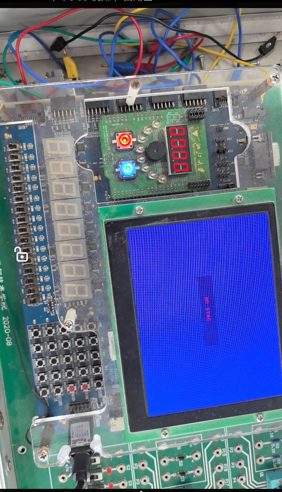

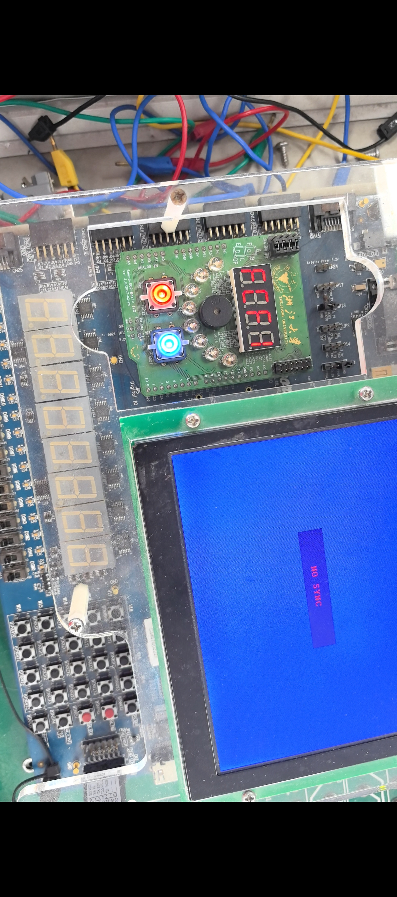

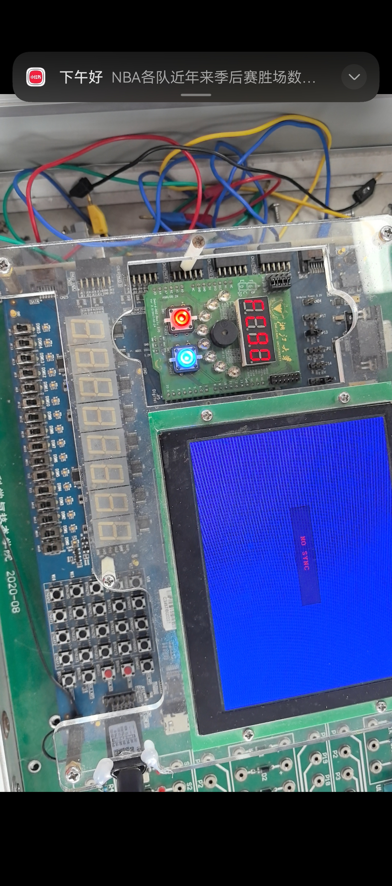

> 对图片的一些解释：

开发板下载程序后，默认状态下数码管 16 位数值**持续正向累加**；

拨动按键切换控制电平后，数码管数值变为**持续反向递减**；

正向计数累加到 `FFFF` 时，LED 指示灯亮起，表示进位触发；

反向计数递减到 `0000` 时，LED 同样亮起，表示借位触发；（注意，图中 `0000` 没有亮灯是因为那是正向计数，不是代码或程序错误！！）

过零点与满值点状态切换平稳，数码管显示清晰无闪烁，按键控制响应及时，硬件功能与仿真波形、理论设计完全吻合。

> 另外的一点碎碎念：

求证来很多同学，甚至包括上一届的学长，都说这个实验要的就是从最小的 `0000` 到最大的 `FFFF`，但是周一晚上实验的时候老师一直认为是 `0000` 到 `9999`，这我认为完全不对，当然毫不意外地，当晚在板子上根本跑不出老师要的结果，虽然我们在尽全力强行修改我们的顶层文件等等的地方。

说了这么多，不是想表达什么不满，而是想说如上的实验我们确实是正确的。

---

### 四、实验结果分析

#### 4.1 4 位同步二进制计数器结果分析

1. **理论逻辑推导结果**

   通过列出 4 位计数器状态转移真值表，对$D_A、D_B、D_C、D_D$分别进行卡诺图化简，得到各触发器激励函数：

   $D_D=\overline{Q_D}$、$D_C=Q_D\oplus Q_C$、$D_B=Q_CQ_D\oplus Q_B$、$D_A=Q_BQ_CQ_D\oplus Q_A$，

   同时推导出进位输出逻辑$R_C=Q_AQ_BQ_CQ_D$，逻辑表达式化简正确，符合同步计数器时序设计理论。

2. **Digital 原理图仿真结果分析**

   在 Digital 软件中基于 D 触发器和逻辑门搭建同步计数电路，编写测试激励进行功能验证。仿真波形显示，在统一时钟上升沿作用下，QA、QB、QC、QD 同步按**0000~1111**二进制规律依次递增，计数满 15 后自动回零循环；进位信号 RC 仅在计数状态为 1111 时输出高电平，其余时刻保持低电平。所有触发器状态同时翻转，无逐级传输延迟，无竞争冒险现象，完全满足同步时序电路设计要求。

3. **Vivado 行为仿真结果分析**

   将 Digital 导出的 Verilog 模块导入 Vivado 并编写测试文件，仿真波形与 Digital 仿真高度一致。时钟周期稳定，四位输出严格同步递增、循环归零，进位 RC 脉冲宽度与时钟周期匹配，时序干净无毛刺，验证了原理图转化为硬件描述语言后逻辑功能保持不变，模块功能可靠。

4. **分频与顶层联合仿真分析**

   设计 100MHz 转 1Hz 分频模块，仿真时适当减小计数阈值以缩短仿真时间，分频模块可稳定输出低频秒脉冲。顶层文件将分频器、4 位计数器、七段数码管译码模块进行例化互联，仿真中数码管位选 AN、段选 SEGMENT 可随计数值实时译码刷新，RC 进位信号与 LED 控制端口联动正确，模块端口匹配、时序配合正常，整体系统逻辑无误。

5. **FPGA 板级硬件实测分析**

   程序下载至 SWORD 开发板后，计数器以 1 秒为周期稳定递增，数码管最低位按照**$0 \sim 9、A \sim F$**十六进制顺序循环显示；当计数到最大值 F（15）时，进位对应 LED 点亮，计数跳变回 0 时 LED 同步熄灭。硬件运行计数平稳、无跳数、无乱码，数码管译码显示正常，约束文件引脚绑定有效，硬件实测结果与仿真、理论设计完全吻合。

   ---

#### 4.2 16 位可逆同步二进制计数器结果分析

1. **Verilog 代码功能仿真分析**

   采用行为描述编写 16 位可逆计数器，通过控制端 S 实现计数方向切换。仿真波形表明：当$S=1$时，计数器从初始值开始逐次加 1，正向连续递增；当$S=0$时，计数器立即切换为逐次减 1，反向连续递减。进位 / 借位信号$R_C$在正向计数达到最大值 16'hFFFF、反向计数降至最小值 16'h0000 时均输出高电平，分别实现进位与借位指示，边界逻辑判断准确。

2. **100ms 分频与时序匹配分析**

   设计 100MHz 时钟分频得到 100ms 基准时钟，作为可逆计数器的工作时钟，同时配置数码管动态扫描时钟。分频模块计数阈值设置合理，输出时钟周期稳定，既保证了计数刷新节奏适中，又满足数码管动态扫描无闪烁的要求，各模块时钟域时序匹配良好。

3. **顶层模块联合仿真结果**

   顶层模块集成分频器、16 位可逆计数器、数码管译码显示模块，仿真中按键 SW 可随时切换加减计数模式，16 位计数值能实时送往数码管进行十六进制显示；LED [0] 精准跟随 Rc 电平变化，在进位、借位时刻点亮，其余时刻熄灭。整体仿真状态跳转稳定，模块例化、信号连线、译码逻辑均无错误。

4. **板级硬件运行结果分析**

   FPGA 下载程序后，默认模式下数码管 16 位数值持续正向累加；拨动按键切换控制电平后，立即变为反向递减计数。正向计数到 FFFF 时 LED 点亮表示进位，反向计数到 0000 时 LED 点亮表示借位；计数切换响应灵敏，数码管四位显示清晰稳定、无闪烁、无错乱，硬件现象与仿真波形、理论原理完全一致，证明 16 位可逆同步计数器设计、分频逻辑、数码管显示及引脚约束均达到设计预期。

#### 4.3 整体实验综合分析

本次实验分别采用**原理图输入法**和**Verilog 行为描述法**完成同步计数器设计，两种设计方式均能实现预期功能。原理图设计直观体现触发器、逻辑门的硬件连接与时序激励关系，适合理解底层时序原理；Verilog 行为描述简洁高效，适合多位、复杂时序电路快速开发。同步时序电路共用全局时钟，状态同步跳转、时序稳定性远优于异步计数器；分频模块实现了高频系统时钟向低速计时时钟的转换，是数字时钟、定时器等实际应用的核心基础。仿真与板级实测结果相互印证，所有功能均满足实验设计指标，电路逻辑、代码设计、硬件配置均正确可靠。

---

### 五、讨论与心得

#### （一）实验讨论

1. 同步计数器相比异步计数器，所有触发器同时由时钟触发，避免了逐级延时带来的竞争冒险，时序更加稳定，适合高频、高精度计数场景，但硬件资源占用略高。
2. 原理图设计适合理解底层门电路与触发器的连接逻辑，能直观掌握激励方程、组合逻辑的物理实现；而 Verilog 行为描述无需搭建底层电路，代码简洁、开发效率高，适合多位、复杂时序电路设计，工程实用性更强。
3. 分频器设计中，计数初值和翻转逻辑直接决定输出时钟频率，仿真时可缩小计数阈值加快仿真速度，硬件下载时恢复真实计数值，兼顾仿真效率与实际功能。
4. 可逆计数器的进位 / 借位信号是时序电路重要输出，可用于多级计数器级联扩展位数，本次实验中 RC 在全 1 进位、全 0 借位时拉高，符合同步计数器设计规范。
5. 数码管与 LED 硬件显示调试中，需注意模块例化、端口映射匹配问题，否则会出现计数正常但数码管不刷新、LED 状态异常等问题。

---

#### （二）实验心得

1. 通过本次实验系统掌握了同步时序电路的完整设计流程：从原理分析、状态表推导，到原理图搭建、Verilog 编程，再到仿真调试、FPGA 硬件下载，完整理解了数字时序电路从理论到工程实现的全过程。
2. 深刻体会到了原理图设计和硬件描述语言设计的区别：原理图适合入门理解底层逻辑，Verilog 适合快速开发复杂功能，后续大型数字系统设计应以 Verilog 行为描述为主。
3. 熟悉了 Digital 和 Vivado 工具的操作方法，掌握了时序仿真、波形分析、分频模块、有限状态机的设计技巧，提升了 Verilog 代码编写与查错调试能力。
4. 在硬件调试过程中，学会了根据仿真波形排查逻辑错误、根据硬件现象排查端口绑定与模块例化问题，培养了工程思维和问题排查能力。
5. 认识到同步时序电路在数字时钟、定时器、分频器、自动控制等场景的广泛应用，为后续课程学习打下了扎实基础。

---


