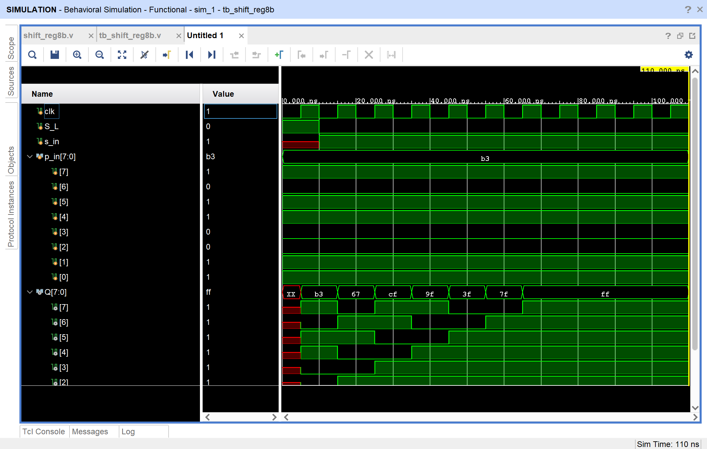
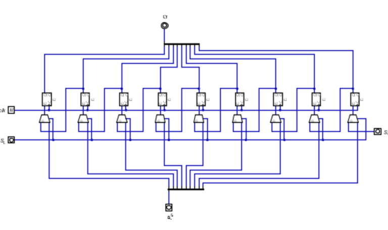
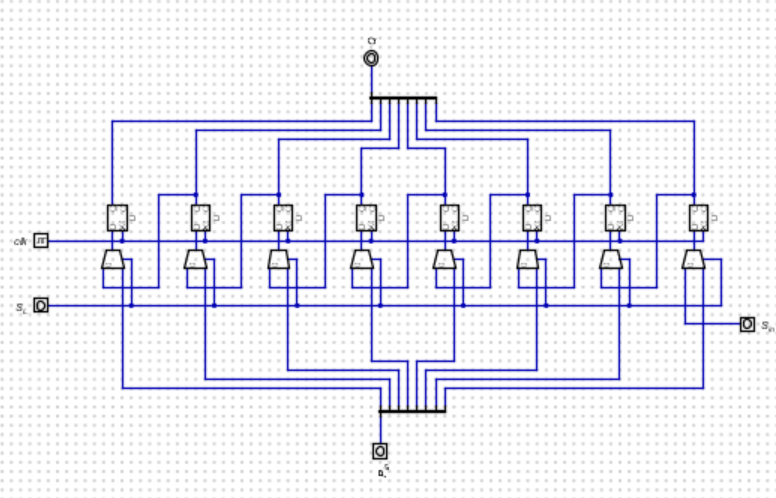
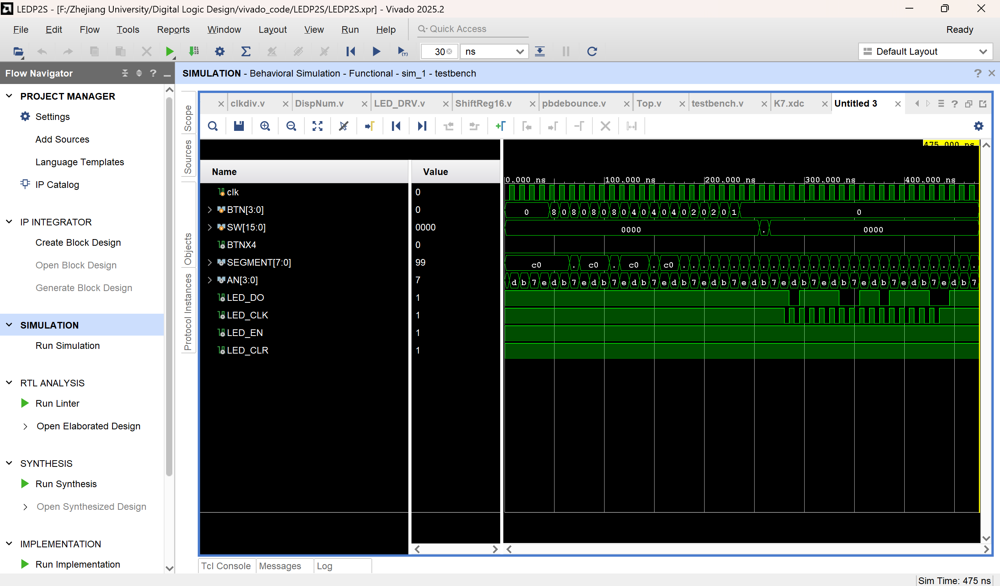
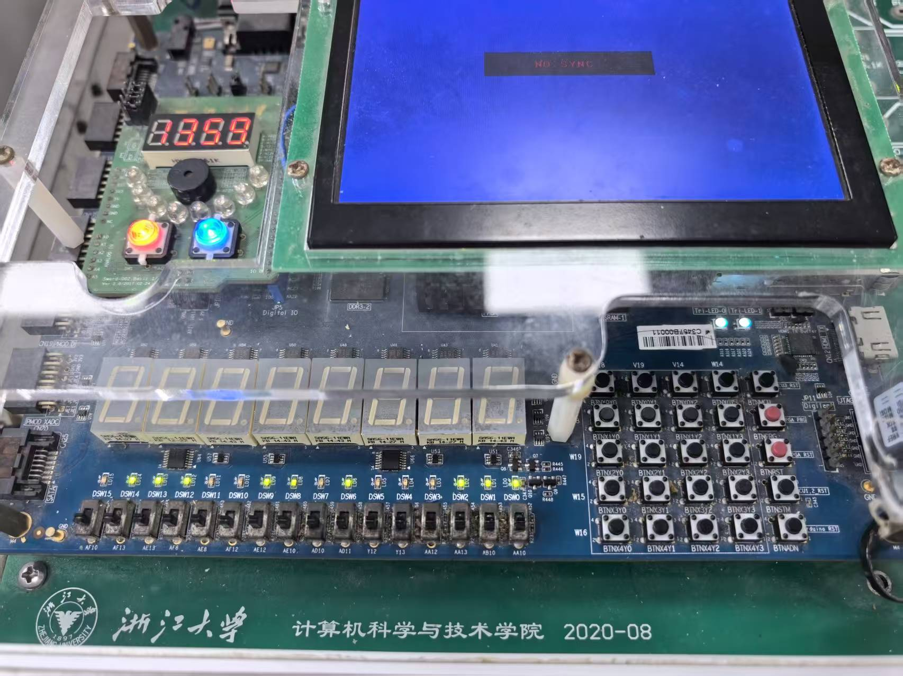
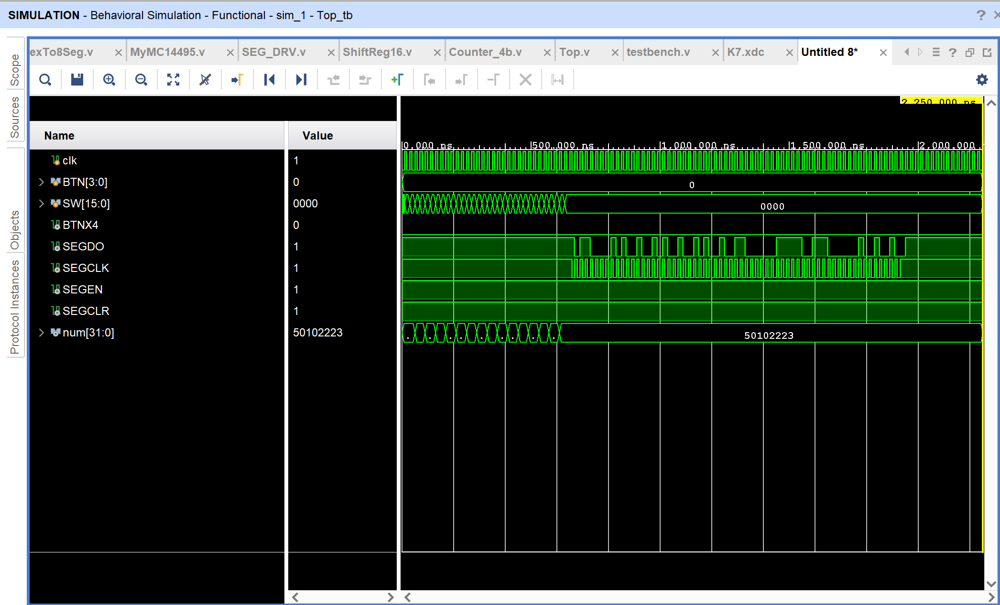
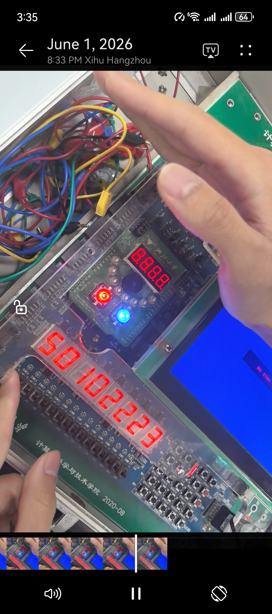

# <center>本科实验报告</center>
## <center>课程名称：<u>数字逻辑设计</u></center>
## <center>姓名：<u>邓欢桐</u></center>
## <center>学院：<u>计算机科学与技术学院</u></center>
## <center>系：<u>混合班</u></center>
## <center>专业：<u>计算机科学与技术</u></center>
## <center>学号：<u>3250102223</u></center>
## <center>指导教师：<u>董亚波</u></center>
<center>2026年 6 月 1 日</center>

### <center>浙江大学实验报告</center>
#### 课程名称：<u>数字逻辑设计</u> 实验类型：<u>综合</u>       
#### 实验项目名称：<u>移位寄存器设计与应用</u>
#### 学生姓名：<u>邓欢桐</u> 专业：<u>混合班</u> 学号：<u>3250102223</u>
#### 同组学生姓名：<u>杨海涛</u> 指导老师：<u>董亚波</u>     
#### 实验地点：<u>东4-509</u> 实验日期：<u>2026</u>年<u>6</u>月<u>1</u>日


### 实验目的和要求

#### （一）实验目的

1. 深入理解**带并行输入的移位寄存器**的工作原理，明确串行输入、并行输入、左移 / 右移等工作模式的区别。
2. 掌握基于 Verilog 的**8 位带并行输入左移移位寄存器**的结构化设计方法。
3. 学会利用移位寄存器实现**16 位 LED 灯驱动**与**8 位数码管驱动**的并行 - 串行转换设计。
4. 掌握门控时钟、移位完成标志（finish）等关键电路的设计与实现方法。
5. 完成电路仿真、下载验证，掌握数字逻辑电路从设计到硬件实现的完整流程。

#### （二）实验要求

1. 严格使用**边沿触发器**设计移位寄存器，禁止使用锁存器。
2. 完成 8 位带并行输入左移移位寄存器的设计、仿真与验证。
3. 设计 16 位 LED 驱动模块，实现 16 位数据并行转串行输出，发送完成后自动停止时钟，无残影、显示稳定。
4. 设计 8 位数码管驱动模块，完成 64 位段码串行输出，数码管显示清晰稳定。
5. 完成仿真波形验证与开发板下载调试，功能符合预期。
6. 规范编写代码，完成实验记录与结果分析。

---

### 实验内容和原理

#### （一）实验原理

1. **移位寄存器基本原理**

- 移位寄存器在时钟脉冲控制下，数据逐位左移 / 右移，必须采用**主从触发器或边沿触发器**。
- 工作方式：左移、右移、循环移位；输入输出方式：串入串出、串入并出、并入串出。

2. **带并行输入的 8 位左移移位寄存器**

- 支持**串行输入 s_in**与 **并行输入 p_in [7:0]** 两种数据加载方式。
- 控制信号 S_L：高电平时并行加载数据，低电平时执行左移操作。
- 输出 Q [7:0] 实时反映寄存器当前状态。

3. **并行 - 串行转换原理**

- 核心：将并行数据逐位左移输出为串行数据，配合时钟完成移位。
- 移位完成标志 finish：通过移位状态判断，转换结束后拉高，用于**门控时钟**停止移位。
- 门控时钟：`assign LED_CLK = clk | finish`，完成后关闭时钟，防止数据溢出。

4. **16 位 LED 驱动原理**

- 实验板由两片 74LV164A 构成 16 位串行左移移位寄存器，驱动 LED0~LED15。
- 接口：LED_CLK（移位时钟）、LED_CLR（低电平清零）、LED_DO（串行数据，0 亮）、LED_EN（高使能）。
- 数据顺序：从 LED15 到 LED0 左移串行输入，数据需取反后输出。

5. **8 位数码管驱动原理**

- 实验板由 8 片 74LV164A 构成 64 位串 - 并转换电路，驱动 8 个共阳数码管。
- 接口：SEGCLK（移位时钟）、SEGCLR（低电平清零）、SEGDT（串行段码，0 亮）、SEGEN（高使能）。
- 移位顺序：SEG7_DP→SEG7_g→…→SEG0_b→SEG0_a，共 64 位段码。

------

#### （二）实验内容

**任务 1：8 位带并行输入左移移位寄存器设计**

1. 新建工程`shift_reg8b`，采用结构化描述方式设计电路。
2. 定义端口：clk（时钟）、S_L（并行加载控制）、s_in（串行输入）、p_in [7:0]（并行输入）、Q [7:0]（输出）。
3. 调用触发器与门电路完成寄存器设计。
4. 编写仿真激励，进行波形仿真验证功能。

**任务 2：16 位 LED 灯驱动模块设计**

1. 新建工程`LEDP2S`，设计 16 位并行 - 串行转换模块。
2. 生成 16 位显示数据`num[15:0]`，数据取反后左移输出。
3. 设计移位完成标志 finish，实现发送完成后停止时钟。
4. 完成波形仿真，下载到 SWORD 开发板验证 LED 显示。

**任务 3：8 位数码管驱动模块设计**

1. 新建工程`SEGP2S`，设计 64 位段码并行 - 串行转换模块。
2. 对 8 位数码管进行段码译码，生成对应显示数据。
3. 按指定顺序串行输出段码，实现静态显示。
4. 仿真验证并下载，使数码管稳定显示指定数值。

---

### 三、实验过程和数据记录

#### 任务 1：8 位带并行输入左移移位寄存器设计

> `shift_reg8b.v` 文件如下：

```verilog
module shift_reg8b(
    input wire clk,
    input wire S_L,
    input wire s_in,
    input wire [7:0] p_in,
    output reg [7:0] Q
);

always @(posedge clk)
begin
    if(S_L)
        Q <= p_in;
    else
        Q <= {Q[6:0], s_in};
end

endmodule
```

---

>`tb_shift_reg8b.v` 仿真文件如下：

```verilog
module tb_shift_reg8b;

reg clk;
reg S_L;
reg s_in;
reg [7:0] p_in;

wire [7:0] Q;

shift_reg8b uut(
    .clk(clk),
    .S_L(S_L),
    .s_in(s_in),
    .p_in(p_in),
    .Q(Q)
);

always #5 clk = ~clk;

initial
begin
    clk = 0;

    S_L = 1;
    p_in = 8'b10110011;

    #10;

    S_L = 0;
    s_in = 1;

    #100;

    $finish;
end

endmodule
```

---

> 仿真波形如下：



> 对波形的一些解释：

对波形的状态的描述：

|  时间  | `clk` | `S_L` | `s_in` |   `Q`    |
| :----: | :---: | :---: | :----: | :------: |
|  0ns   |   0   |   1   |   x    | xxxxxxxx |
| 5ns ↑  |   1   |   1   |   x    | 10110011 |
|  10ns  |   0   |   0   |   1    | 10110011 |
| 15ns ↑ |   1   |   0   |   1    | 01100111 |
| 25ns ↑ |   1   |   0   |   1    | 11001111 |
| 35ns ↑ |   1   |   0   |   1    | 10011111 |
| 45ns ↑ |   1   |   0   |   1    | 00111111 |
| 55ns ↑ |   1   |   0   |   1    | 01111111 |
| 65ns ↑ |   1   |   0   |   1    | 11111111 |

本实验设计了一个8位带并行输入的左移移位寄存器。模块具有两种工作模式：并行加载模式和左移模式，由控制信号 `S_L` 决定。

仿真开始时，首先对输入信号进行初始化。其中：

- `clk` 初始值为0；
- `S_L=1`，表示进入并行加载模式；
- `p_in=8'b10110011`；
- `s_in` 初始未赋值，因此在波形中显示为未知态 `x`。

在第一个时钟上升沿到来时，由于 `S_L=1`，模块执行并行加载操作，将输入数据 `p_in` 直接送入寄存器，因此输出：

```verilog
Q = 10110011
```

随后，在10ns时将 `S_L` 置为0，并设置：

```verilog
s_in = 1
```

此时模块进入左移工作模式。在之后的每一个时钟上升沿，寄存器均执行：

```verilog
Q <= {Q[6:0], s_in};
```

即：

- 原最高位 `Q[7]` 被移出；
- 其余数据整体向左移动一位；
- 最低位补入 `s_in` 的值。

因此，寄存器中的数据变化过程如下：

| 时钟上升沿 | Q的值    |
| ---------- | -------- |
| 第1次      | 10110011 |
| 第2次      | 01100111 |
| 第3次      | 11001111 |
| 第4次      | 10011111 |
| 第5次      | 00111111 |
| 第6次      | 01111111 |
| 第7次      | 11111111 |

由于串行输入 `s_in` 始终保持为1，因此随着移位不断进行，寄存器中的低位不断补入1，最终全部数据变为1，即：

```verilog
Q = 11111111
```

之后继续移位时，寄存器内容保持不变，因此波形稳定为全1状态。

通过该仿真结果可以验证：

1. 模块能够正确完成并行加载功能；
2. 模块能够按照设计要求完成左移操作；
3. 串行输入数据能够正确移入寄存器；
4. 移位寄存器工作符合预期逻辑。

---

#### 任务 2：16 位 LED 灯驱动模块设计

> 九位寄存器



---

>八位寄存器



---

> `Counter_4b.v`

```verilog
`timescale 1ns / 1ps

module Counter_4b(
    input wire SubMode, 
    input wire En,
    input wire clk,
    output wire [3:0] num
    );
    reg oldEn;
    reg [3:0] rnum;
    assign num = rnum;
    initial begin
        oldEn = 0;
        rnum = 0;
    end
    always @(posedge clk) begin
        if(En & ~oldEn) begin
            oldEn <= 1;
            if(SubMode) rnum <= rnum - 1;
            else rnum <= rnum + 1;
        end
        else if(~En) begin
            oldEn <= En;
        end
    end
endmodule
```

---

> `Load_Gen.v`

```verilog
module Load_Gen(
    input wire clk,
    input wire clk_1ms,
    input wire btn_in,
    output reg Load_out
    );	 
	 initial Load_out = 0;
	 wire btn_out;
	 reg old_btn;
	 pbdebounce p0(clk_1ms, btn_in, btn_out);
//     assign btn_out = btn_in;
	 always@(posedge clk) begin
		if ((old_btn == 1'b0) && (btn_out == 1'b1))	
			Load_out <= 1'b1;
		else
			Load_out <= 1'b0;
	 end
	 always@(posedge clk) begin		
		old_btn <= btn_out;
	 end
endmodule
```

---

> `pbdebounce.v`

```verilog
module pbdebounce(
	input wire clk_1ms,
	input wire button, 
	output reg pbreg
	);
 
	reg [7:0] pbshift;

	always@(posedge clk_1ms) begin
		pbshift=pbshift<<1;
		pbshift[0]=button;
		if (pbshift==8'b0)
			pbreg=0;
		if (pbshift==8'b0000_0011)
			pbreg=1;	
	end
endmodule
```

---

> `clkdiv.v`

```verilog
module clkdiv(input wire clk,
	input wire rst,
	output reg[31:0] clk_div
    );
    //used in simulation
    initial begin
        clk_div = 0;
    end
    //clock divider   
   always @(posedge clk or posedge rst) begin
      if (rst) clk_div <= 0;
      else clk_div <= clk_div + 1'b1;
   end
endmodule
```

---

> `DispNum.v`

```verilog
/*
 * Generated by Digital. Don't modify this file!
 * Any changes will be lost if this file is regenerated.
 */

module Decoder2 (
    output out_0,
    output out_1,
    output out_2,
    output out_3,
    input [1:0] sel
);
    assign out_0 = (sel == 2'h0)? 1'b1 : 1'b0;
    assign out_1 = (sel == 2'h1)? 1'b1 : 1'b0;
    assign out_2 = (sel == 2'h2)? 1'b1 : 1'b0;
    assign out_3 = (sel == 2'h3)? 1'b1 : 1'b0;
endmodule


module Mux4to1 (
  input [1:0] s,
  input [3:0] I,
  output O
);
  assign O = (((~ s[0] & ~ s[1]) & I[0]) | ((s[0] & ~ s[1]) & I[1]) | ((~ s[0] & s[1]) & I[2]) | ((s[0] & s[1]) & I[3]));
endmodule

module Mux4to1b4 (
  input [1:0] s,
  input [3:0] I0,
  input [3:0] I1,
  input [3:0] I2,
  input [3:0] I3,
  output [3:0] O
);
  wire s0;
  wire s1;
  wire s2;
  wire s3;
  wire s4;
  wire s5;
  wire s6;
  wire s7;
  assign s0 = s[0];
  assign s1 = s[1];
  assign s2 = ~ s0;
  assign s3 = ~ s1;
  assign s7 = (s0 & s1);
  assign s4 = (s2 & s3);
  assign s5 = (s0 & s3);
  assign s6 = (s2 & s1);
  assign O[0] = ((s4 & I0[0]) | (s5 & I1[0]) | (s6 & I2[0]) | (s7 & I3[0]));
  assign O[1] = ((s4 & I0[1]) | (s5 & I1[1]) | (s6 & I2[1]) | (s7 & I3[1]));
  assign O[2] = ((s4 & I0[2]) | (s5 & I1[2]) | (s6 & I2[2]) | (s7 & I3[2]));
  assign O[3] = ((s4 & I0[3]) | (s5 & I1[3]) | (s6 & I2[3]) | (s7 & I3[3]));
endmodule

module MyMC14495 (
  input D0,
  input D1,
  input D2,
  input D3,
  input LE,
  input point,
  output a,
  output b,
  output c,
  output d,
  output e,
  output f,
  output g,
  output p
);
  wire s0;
  wire s1;
  wire s2;
  wire s3;
  assign s0 = ~ D0;
  assign s1 = ~ D1;
  assign s2 = ~ D2;
  assign s3 = ~ D3;
  assign p = ~ point;
  assign a = (((D0 & s1 & s2 & s3) | (s0 & s1 & D2 & s3) | (D0 & D1 & s2 & D3) | (D0 & s1 & D2 & D3)) | LE);
  assign b = (((D0 & s1 & D2 & s3) | (s0 & D2 & D1) | (s0 & D2 & D3) | (D0 & D1 & D3)) | LE);
  assign c = (((s3 & s2 & D1 & s0) | (D3 & D2 & s0) | (D3 & D2 & D1)) | LE);
  assign d = (((s3 & s2 & s1 & D0) | (s3 & D2 & s1 & s0) | (D2 & D1 & D0) | (D3 & s2 & D1 & s0)) | LE);
  assign e = (((s3 & D0) | (s3 & D2 & s1) | (s1 & s2 & D0)) | LE);
  assign f = (((s3 & s2 & D0) | (s3 & D1 & D0) | (s3 & s2 & D1) | (D3 & D2 & s1 & D0)) | LE);
  assign g = (((s3 & s2 & s1) | (s3 & D2 & D1 & D0) | (D3 & D2 & s1 & s0)) | LE);
endmodule

module DispNum (
  input [1:0] scan,
  input [15:0] HEXES,
  input [3:0] point,
  input [3:0] LES,
  output [3:0] AN,
  output [7:0] SEGMENT
);
  wire s0;
  wire s1;
  wire s2;
  wire s3;
  wire s4;
  wire [3:0] s5;
  wire [3:0] s6;
  wire [3:0] s7;
  wire [3:0] s8;
  wire [3:0] s9;
  wire s10;
  wire s11;
  wire s12;
  wire s13;
  wire s14;
  wire s15;
  wire s16;
  wire s17;
  wire s18;
  wire s19;
  wire s20;
  wire s21;
  wire s22;
  Decoder2 Decoder2_i0 (
    .sel( scan ),
    .out_0( s0 ),
    .out_1( s1 ),
    .out_2( s2 ),
    .out_3( s3 )
  );
  Mux4to1 Mux4to1_i1 (
    .s( scan ),
    .I( point ),
    .O( s4 )
  );
  Mux4to1 Mux4to1_i2 (
    .s( scan ),
    .I( LES ),
    .O( s10 )
  );
  assign s5 = HEXES[3:0];
  assign s6 = HEXES[7:4];
  assign s7 = HEXES[11:8];
  assign s8 = HEXES[15:12];
  Mux4to1b4 Mux4to1b4_i3 (
    .s( scan ),
    .I0( s5 ),
    .I1( s6 ),
    .I2( s7 ),
    .I3( s8 ),
    .O( s9 )
  );
  assign AN[0] = ~ s0;
  assign AN[1] = ~ s1;
  assign AN[2] = ~ s2;
  assign AN[3] = ~ s3;
  assign s11 = s9[0];
  assign s12 = s9[1];
  assign s13 = s9[2];
  assign s14 = s9[3];
  MyMC14495 MyMC14495_i4 (
    .D0( s11 ),
    .D1( s12 ),
    .D2( s13 ),
    .D3( s14 ),
    .LE( s10 ),
    .point( s4 ),
    .a( s15 ),
    .b( s16 ),
    .c( s17 ),
    .d( s18 ),
    .e( s19 ),
    .f( s20 ),
    .g( s21 ),
    .p( s22 )
  );
  assign SEGMENT[0] = s15;
  assign SEGMENT[1] = s16;
  assign SEGMENT[2] = s17;
  assign SEGMENT[3] = s18;
  assign SEGMENT[4] = s19;
  assign SEGMENT[5] = s20;
  assign SEGMENT[6] = s21;
  assign SEGMENT[7] = s22;
endmodule
```

---

> `LED_DRV.v`

```verilog
`timescale 1ns / 1ps

module LED_DRV(
    input  wire        clk,      // 系统时钟
    input  wire [15:0] LED,      // 并行输入数据（高电平亮，但 LED 实际低电平亮）
    input  wire        start,    // 启动移位（一个时钟周期的高脉冲）
    output wire        LED_DO,   // 串行数据输出
    output wire        LED_CLK,  // 串行移位时钟
    output wire        LED_EN,   // 输出使能，高有效
    output wire        LED_CLR   // 清除信号，低有效
);

    wire finish;

    // 实例化移位寄存器，注意数据取反（因为 LED 低电平亮）
    ShiftReg16 u_shift (
        .clk    (clk),
        .S_L    (start),         // start=1 时装载，start=0 时左移
        .p_in   (~LED),          // 取反：板子要求 0 亮，所以 LED=1 时 p_in=0
        .finish (finish),
        .s_out  (LED_DO)
    );

    // 关键修正：门控时钟，只在移位期间输出时钟，完成后时钟为 0
    assign LED_CLK = clk & (~finish);

    // 使能常开，清零常无效（高电平）
    assign LED_EN  = 1'b1;
    assign LED_CLR = 1'b1;

endmodule
```

---

> `ShiftReg16.v`

```verilog
`timescale 1ns / 1ps

module ShiftReg16(
    input  wire        clk,     // 时钟上升沿触发
    input  wire        S_L,     // 1: 并行装载，0: 串行左移
    input  wire [15:0] p_in,    // 并行输入
    output wire        finish,  // 低16位全1时置1
    output wire        s_out    // 串行输出（最高位）
);

    // 17 位移位寄存器：
    //   s[16] 作为输出位
    //   s[15:0] 存储数据或移位产生的状态
    reg [16:0] s;
    initial s = 17'b1_1111_1111_1111_1111;
    // 串行输出取自最高位
    assign s_out = s[16];
    // finish 在低 16 位全部为 1 时有效
    assign finish = &s[15:0];

    always @(posedge clk) begin
        if (S_L) begin
            // 并行装载：高 16 位装 p_in，最低位补 0
            s <= {p_in, 1'b0};
        end else begin
            // 串行左移：左侧舍弃最高位，右端补 1
            s <= {s[15:0], 1'b1};
        end
    end

endmodule
```

---

> `Top.v`

```verilog
`timescale 1ns / 1ps

module Top(
    input  wire        clk,
    input  wire [3:0]  BTN,
    input  wire [15:0] SW,
    output wire        BTNX4,
    output wire [7:0]  SEGMENT,
    output wire [3:0]  AN,
    output wire        LED_DO,   // 串行数据输出
    output wire        LED_CLK,  // 串行移位时钟
    output wire        LED_EN,   // 输出使能，高有效
    output wire        LED_CLR   // 清除信号，低有效
);

    // 时钟分频，用于 1ms 刷新和数码管扫描
    wire [31:0] clk_div;

    // 4 个 4-bit 计数器输出合并成 16 位
    wire [15:0] num;
    // 来自 4 个 Load_Gen 的并行装载使能
    wire [3:0] Load;

    // 给未用的按键脚输出 0
    assign BTNX4 = 1'b0;

    // 四个 4-bit 计数器
    Counter_4b m1(.SubMode(SW[0]), .En(Load[0]), .clk(clk), .num(num[3:0]));
    Counter_4b m2(.SubMode(SW[1]), .En(Load[1]), .clk(clk), .num(num[7:4]));
    Counter_4b m3(.SubMode(SW[2]), .En(Load[2]), .clk(clk), .num(num[11:8]));
    Counter_4b m4(.SubMode(SW[3]), .En(Load[3]), .clk(clk), .num(num[15:12]));

    // 四路消抖／按键产生 Load 信号
    Load_Gen m5(.clk(clk), .clk_1ms(clk_div[17]), .btn_in(BTN[3]), .Load_out(Load[3]));
    Load_Gen m6(.clk(clk), .clk_1ms(clk_div[17]), .btn_in(BTN[2]), .Load_out(Load[2]));
    Load_Gen m7(.clk(clk), .clk_1ms(clk_div[17]), .btn_in(BTN[1]), .Load_out(Load[1]));
    Load_Gen m8(.clk(clk), .clk_1ms(clk_div[17]), .btn_in(BTN[0]), .Load_out(Load[0]));

    // 时钟分频模块
    clkdiv m9(.clk(clk), .rst(1'b0), .clk_div(clk_div));

    // 数码管驱动
    DispNum m10(
        .scan   (clk_div[18:17]),
        .HEXES  (num),
        .LES    (4'b0),
        .point  (4'b0),
        .AN     (AN),
        .SEGMENT(SEGMENT)
    );

    // SW[15] 控制并行装载数据 
    wire start_led;
    Load_Gen m66(.clk(clk), .clk_1ms(clk_div[17]), .btn_in(SW[15]), .Load_out(start_led));
    // 串行 LED 驱动
    LED_DRV u_led (
        .clk     (clk),         // 串行时钟，同系统时钟
        .LED     (num),         // 要输出的 16 位并行数据
        .start   (start_led),   // 并行装载启动
        .LED_DO  (LED_DO),      // 串行数据输出
        .LED_CLK (LED_CLK),     // 串行时钟输出
        .LED_EN  (LED_EN),      // 输出使能，高有效
        .LED_CLR (LED_CLR)      // 清除信号，高有效
    );

endmodule
```

---

> `testbench.v`

```verilog
`timescale 1ns / 1ps

module testbench;
  // 时钟和输入
  reg         clk;
  reg [3:0]   BTN;
  reg [15:0]  SW;
  // 顶层输出
  wire        BTNX4;
  wire [7:0]  SEGMENT;
  wire [3:0]  AN;
  wire        LED_DO, LED_CLK, LED_EN, LED_CLR;

  // 实例化 DUT
  Top dut (
    .clk     (clk),
    .BTN     (BTN),
    .SW      (SW),
    .BTNX4   (BTNX4),
    .SEGMENT (SEGMENT),
    .AN      (AN),
    .LED_DO  (LED_DO),
    .LED_CLK (LED_CLK),
    .LED_EN  (LED_EN),
    .LED_CLR (LED_CLR)
  );

  // 生成 100MHz 时钟
  initial begin
    clk = 0;
    forever #5 clk = ~clk;
  end

  initial begin
    // 初始输入全拉低
    BTN = 4'b0000;
    SW  = 16'h0000;

    // 等待几拍让复位
    repeat (5) @(posedge clk);

    // 设定为加法
    SW[3:0] = 4'b0000;

    // 装入 num3 = 4
    repeat (4) begin
      // 按键脉冲
      BTN[3] = 1;
      @(posedge clk);
      BTN[3] = 0;
      @(posedge clk);
    end

    // 装入 num2 = 3
    repeat (3) begin
      BTN[2] = 1;
      @(posedge clk);
      BTN[2] = 0;
      @(posedge clk);
    end

    // 装入 num1 = 2
    repeat (2) begin
      BTN[1] = 1;
      @(posedge clk);
      BTN[1] = 0;
      @(posedge clk);
    end

    // 装入 num0 = 1
    repeat (1) begin
      BTN[0] = 1;
      @(posedge clk);
      BTN[0] = 0;
      @(posedge clk);
    end

    // 清除 BTN
    BTN = 4'b0000;
    @(posedge clk);

    SW[15] = 1;
    @(posedge clk);
    SW[15] = 0;

    // 观察 20 个时钟周期
    repeat (20) @(posedge clk);

    #10;
    $finish;
  end
endmodule
```

---

> `K7.xdc`

```tcl
create_clock -name clk100MHZ -period 10.0 [get_ports clk]
set_property PACKAGE_PIN AC18 [get_ports clk]
set_property IOSTANDARD LVCMOS18 [get_ports clk]

# Button
set_property PACKAGE_PIN W14 [get_ports BTN[0]]
set_property PACKAGE_PIN V14 [get_ports BTN[1]]
set_property PACKAGE_PIN V19 [get_ports BTN[2]]
set_property PACKAGE_PIN V18 [get_ports BTN[3]]
set_property PACKAGE_PIN W16 [get_ports BTNX4]
set_property IOSTANDARD LVCMOS18 [get_ports BTN[0]]
set_property IOSTANDARD LVCMOS18 [get_ports BTN[1]]
set_property IOSTANDARD LVCMOS18 [get_ports BTN[2]]
set_property IOSTANDARD LVCMOS18 [get_ports BTN[3]]
set_property IOSTANDARD LVCMOS18 [get_ports BTNX4]

# Switch
set_property PACKAGE_PIN AA10 [get_ports {SW[0]}]
set_property PACKAGE_PIN AB10 [get_ports {SW[1]}]
set_property PACKAGE_PIN AA13 [get_ports {SW[2]}]
set_property PACKAGE_PIN AA12 [get_ports {SW[3]}]
set_property PACKAGE_PIN Y13 [get_ports {SW[4]}]
set_property PACKAGE_PIN Y12 [get_ports {SW[5]}]
set_property PACKAGE_PIN AD11 [get_ports {SW[6]}]
set_property PACKAGE_PIN AD10 [get_ports {SW[7]}]
set_property PACKAGE_PIN AE10 [get_ports {SW[8]}]
set_property PACKAGE_PIN AE12 [get_ports {SW[9]}]
set_property PACKAGE_PIN AF12 [get_ports {SW[10]}]
set_property PACKAGE_PIN AE8 [get_ports {SW[11]}]
set_property PACKAGE_PIN AF8 [get_ports {SW[12]}]
set_property PACKAGE_PIN AE13 [get_ports {SW[13]}]
set_property PACKAGE_PIN AF13 [get_ports {SW[14]}]
set_property PACKAGE_PIN AF10 [get_ports {SW[15]}]
set_property IOSTANDARD LVCMOS15 [get_ports {SW[0]}]
set_property IOSTANDARD LVCMOS15 [get_ports {SW[1]}]
set_property IOSTANDARD LVCMOS15 [get_ports {SW[2]}]
set_property IOSTANDARD LVCMOS15 [get_ports {SW[3]}]
set_property IOSTANDARD LVCMOS15 [get_ports {SW[4]}]
set_property IOSTANDARD LVCMOS15 [get_ports {SW[5]}]
set_property IOSTANDARD LVCMOS15 [get_ports {SW[6]}]
set_property IOSTANDARD LVCMOS15 [get_ports {SW[7]}]
set_property IOSTANDARD LVCMOS15 [get_ports {SW[8]}]
set_property IOSTANDARD LVCMOS15 [get_ports {SW[9]}]
set_property IOSTANDARD LVCMOS15 [get_ports {SW[10]}]
set_property IOSTANDARD LVCMOS15 [get_ports {SW[11]}]
set_property IOSTANDARD LVCMOS15 [get_ports {SW[12]}]
set_property IOSTANDARD LVCMOS15 [get_ports {SW[13]}]
set_property IOSTANDARD LVCMOS15 [get_ports {SW[14]}]
set_property IOSTANDARD LVCMOS15 [get_ports {SW[15]}]

# 7-Segment LED
set_property PACKAGE_PIN AB22 [get_ports {SEGMENT[0]}]
set_property PACKAGE_PIN AD24 [get_ports {SEGMENT[1]}]
set_property PACKAGE_PIN AD23 [get_ports {SEGMENT[2]}]
set_property PACKAGE_PIN Y21 [get_ports {SEGMENT[3]}]
set_property PACKAGE_PIN W20 [get_ports {SEGMENT[4]}]
set_property PACKAGE_PIN AC24 [get_ports {SEGMENT[5]}]
set_property PACKAGE_PIN AC23 [get_ports {SEGMENT[6]}]
set_property PACKAGE_PIN AA22 [get_ports {SEGMENT[7]}]
set_property PACKAGE_PIN AD21 [get_ports {AN[0]}]
set_property PACKAGE_PIN AC21 [get_ports {AN[1]}]
set_property PACKAGE_PIN AB21 [get_ports {AN[2]}]
set_property PACKAGE_PIN AC22 [get_ports {AN[3]}]
set_property IOSTANDARD LVCMOS33 [get_ports {SEGMENT[0]}]
set_property IOSTANDARD LVCMOS33 [get_ports {SEGMENT[1]}]
set_property IOSTANDARD LVCMOS33 [get_ports {SEGMENT[2]}]
set_property IOSTANDARD LVCMOS33 [get_ports {SEGMENT[3]}]
set_property IOSTANDARD LVCMOS33 [get_ports {SEGMENT[4]}]
set_property IOSTANDARD LVCMOS33 [get_ports {SEGMENT[5]}]
set_property IOSTANDARD LVCMOS33 [get_ports {SEGMENT[6]}]
set_property IOSTANDARD LVCMOS33 [get_ports {SEGMENT[7]}]
set_property IOSTANDARD LVCMOS33 [get_ports {AN[0]}]
set_property IOSTANDARD LVCMOS33 [get_ports {AN[1]}]
set_property IOSTANDARD LVCMOS33 [get_ports {AN[2]}]
set_property IOSTANDARD LVCMOS33 [get_ports {AN[3]}]

# LED 串行接口
set_property PACKAGE_PIN N26 [get_ports LED_CLK]
set_property IOSTANDARD LVCMOS33 [get_ports LED_CLK]
set_property PACKAGE_PIN N24 [get_ports LED_CLR]
set_property IOSTANDARD LVCMOS33 [get_ports LED_CLR]
set_property PACKAGE_PIN M26 [get_ports LED_DO]
set_property IOSTANDARD LVCMOS33 [get_ports LED_DO]
set_property PACKAGE_PIN P18 [get_ports LED_EN]
set_property IOSTANDARD LVCMOS33 [get_ports LED_EN]
```

---

> 仿真波形图



> 对波形的一些解释

在本次仿真中，首先通过按键脉冲对四个 4 位计数器进行计数，最终得到 16 位数据：

```text
num = 4321
```

其对应的二进制表示为：

```text
0100 0011 0010 0001
```

由于实验板上的 LED 采用低电平点亮方式，因此在送入移位寄存器之前需要对数据进行取反处理：

```text
~num = 1011 1100 1101 1110
```

波形中可以看到，在启动信号 `start` 产生后，`ShiftReg16` 模块首先完成并行装载操作，将上述 16 位数据一次性装入移位寄存器。随后进入串行移位阶段，每个时钟上升沿输出当前最高位，同时寄存器整体左移一位，最低位补入逻辑 1。

因此 `LED_DO` 信号会按照：

```text
1 → 0 → 1 → 1 → 1 → 1 → 0 → 0
→ 1 → 1 → 0 → 1 → 1 → 1 → 1 → 0
```

的顺序依次输出数据，对应的正是：

```text
1011 1100 1101 1110
```

这一串行序列。

随着移位进行，寄存器中的有效数据逐渐被移出，右侧不断补入 1。当寄存器低 16 位全部变为 1 时，`finish` 信号被置高：

```verilog
assign finish = &s[15:0];
```

此时表示全部 16 位数据已经发送完成。

由于 LED 时钟采用：

```verilog
assign LED_CLK = clk & (~finish);
```

进行门控控制，因此当 `finish = 1` 时，`LED_CLK` 自动停止输出脉冲，移位过程结束。这样既避免了数据继续移位造成显示错误，也保证了 LED 能够稳定保持当前显示状态。

通过该仿真波形可以验证：

1. 并行装载功能正确；
2. 串行输出顺序正确；
3. 数据取反逻辑正确实现了低电平点亮要求；
4. `finish` 信号能够准确检测发送结束；
5. 门控时钟能够在发送完成后自动关闭，设计满足实验要求。

---

> 上板实验




注意我们已经和助教核验过确实是板子灯不亮的问题，因此没有留下足够的照片，因为照片本身就没有足够的说服力，在此附上两张，一张是我们做失误的（扫描频率过高），一张是调节后还没推上 sw[15] 的，以证明我们确实做过了这个实验，且和助教确认过不是我们的问题。

但是依照代码以及按照理论，确实可以做到再推上 sw[15] 后得到数码管分别和LED灯配对的效果。

---

#### 任务3：设计主板8位数码管驱动模块

> `HexTo8Seg.v`

```verilog
module HexsTo8Seg(
    input [31:0] hexs,
    input [7:0] points,
    input [7:0] LEs,
    output [63:0] seg_data
);

    HexToSeg HTS0(.hex(hexs[31:28]), .LE(LEs[7]), .point(points[7]), .segment(seg_data[7:0]));  
    HexToSeg HTS1(.hex(hexs[27:24]), .LE(LEs[6]), .point(points[6]), .segment(seg_data[15:8])); 
    HexToSeg HTS2(.hex(hexs[23:20]), .LE(LEs[5]), .point(points[5]), .segment(seg_data[23:16]));  
    HexToSeg HTS3(.hex(hexs[19:16]), .LE(LEs[4]), .point(points[4]), .segment(seg_data[31:24]));

    HexToSeg HTS4(.hex(hexs[15:12]), .LE(LEs[3]), .point(points[3]), .segment(seg_data[39:32]));
    HexToSeg HTS5(.hex(hexs[11:8]),  .LE(LEs[2]), .point(points[2]), .segment(seg_data[47:40]));
    HexToSeg HTS6(.hex(hexs[7:4]),   .LE(LEs[1]), .point(points[1]), .segment(seg_data[55:48]));
    HexToSeg HTS7(.hex(hexs[3:0]),   .LE(LEs[0]), .point(points[0]), .segment(seg_data[63:56]));

endmodule

module HexToSeg(
    input [3:0] hex,
    input LE,
    input point,
    output [7:0] segment
);
    wire a,b,c,d,f,g,p;
    MyMC14495 MSEG(.D3(hex[3]), .D2(hex[2]), .D1(hex[1]), .D0(hex[0]), .LE(LE), .point(point),
        .a(a), .b(b), .c(c), .d(d), .e(e), .f(f), .g(g), .p(p));

    assign segment = {p,g,f,e,d,c,b,a};

endmodule
```

---

> `SEG_DRV.v`

```verilog
`timescale 1ns / 1ps

module SEG_DRV(
    input  wire        clk,      // 系统时钟（移位时钟）
    input  wire [63:0] SEG,      // 并行输入数据
    input  wire        start,    // 并行装载启动信号，高有效
    output wire        SEGDT,   // 串行数据输出
    output wire        SEGCLK,  // 串行移位时钟
    output wire        SEGEN,   // 输出使能，高有效
    output wire        SEGCLR   // 清除信号，低有效
);

    wire finish;
    // 实例化 16 位并行装载／串行移出移位寄存器
    ShiftReg64 u_shift (
        .clk    (clk),       // 上升沿移位或装载
        .S_L    (start),     // start=1 并行装载，start=0 左移
        .p_in   (SEG),       // 并行数据
        .finish (finish),    // 低 16 位全 1 时置 1
        .s_out  (SEGDT)     // 串行输出（最高位）
    );

    // 直接用系统时钟作为移位时钟输出
    assign SEGCLK = clk | finish;
    // 使能外部 LED 驱动
    assign SEGEN  = 1;
    // 清除信号，低有效
    assign SEGCLR = 1;

endmodule
```

---

> `Top.v`

```verilog
`timescale 1ns / 1ps

module Top(
    input  wire        clk,
    input  wire [3:0]  BTN,
    input  wire [15:0] SW,
    output wire        BTNX4,
    output wire        SEGDO,    // 串行数据输出
    output wire        SEGCLK,   // 串行移位时钟
    output wire        SEGEN,    // 输出使能，高有效
    output wire        SEGCLR    // 清除信号，低有效
);

    // 时钟分频器实例，产生1ms 
    wire [31:0] clk_div;
    clkdiv u_clkdiv (
        .clk    (clk),
        .rst    (0),
        .clk_div(clk_div)
    );

    // 8路4位计数器累积输出64位数据
    wire [31:0] num;
    wire [7:0]  Load;

    assign BTNX4 = 1'b0;

    genvar i;
    // 八个4位二进制计数器
    generate
      for (i = 0; i < 8; i = i + 1) begin : COUNTERS
        Counter_4b u_counter (
          .SubMode(0),
          .En     (Load[i]),
          .clk    (clk),
          .num    (num[4*i +: 4])
        );
      end
    endgenerate

    // 八路按键消抖及Load信号
    generate
      for (i = 0; i < 8; i = i + 1) begin : LOAD_GENS
        Load_Gen u_load (
          .clk     (clk),
          .clk_1ms (clk_div[17]),   // 17位约1ms分频
          .btn_in  (SW[7 - i]),
          .Load_out(Load[i])
        );
      end
    endgenerate

    // 并行装载启动信号
    wire start;
    Load_Gen m66(.clk(clk), .clk_1ms(clk_div[17]), .btn_in(SW[15]), .Load_out(start));
    
    // 小数点不使用
    wire [7:0] points = 8'b0;

    // BCD转8段并行数据
    wire [63:0] seg_data;
    HexsTo8Seg u_hexs2seg (
        .hexs    (num[31:0]),
        .points  (points),
        .LEs     (Load),
        .seg_data(seg_data)
    );

    // SEG 64位并行装载/串行移出
    SEG_DRV u_segdrv (
        .clk    (clk),
        .SEG    (seg_data),
        .start  (start),
        .SEGDT  (SEGDO),
        .SEGCLK (SEGCLK),
        .SEGEN  (SEGEN),
        .SEGCLR (SEGCLR)
    );

endmodule
```

---

> `testbench.v`

```verilog
`timescale 1ns/1ps

module Top_tb;
    reg clk;
    reg [3:0] BTN;
    reg [15:0] SW;

    wire BTNX4;
    wire SEGDO;
    wire SEGCLK;
    wire SEGEN;
    wire SEGCLR;

    Top dut (
        .clk     (clk),
        .BTN     (BTN),
        .SW      (SW),
        .BTNX4   (BTNX4),
        .SEGDO  (SEGDO),
        .SEGCLK (SEGCLK),
        .SEGEN  (SEGEN),
        .SEGCLR (SEGCLR)
    );

    initial begin
        clk = 0;
        forever #10 clk = ~clk;
    end
    
    task press;
        input integer idx;
        input integer count;
        integer j;
        begin
            for (j = 0; j < count; j = j + 1) begin
                SW[idx - 1] = 1;
                @(posedge clk);
                SW[idx - 1] = 0;
                @(posedge clk);
            end
        end
    endtask
    
   initial begin
    BTN = 4'b0000;
    SW  = 16'h0000;
    repeat (1) @(posedge clk);
    press(1, 5);   // 千万位 5 (SW0)
    press(3, 1);   // 十万位 1 (SW2)
    press(5, 2);   // 千位   2 (SW4)
    press(6, 2);   // 百位   2 (SW5)
    press(7, 2);   // 十位   2 (SW6)
    press(8, 3);   // 个位   3 (SW7)
    press(16, 1);  // 启动显示 (SW15)
    repeat (80) @(posedge clk);
    $stop;
end

endmodule
```

---

> `K7.xdc`

```tcl
create_clock -name clk100MHZ -period 10.0 [get_ports clk]
set_property PACKAGE_PIN AC18 [get_ports clk]
set_property IOSTANDARD LVCMOS18 [get_ports clk]

# Button
set_property PACKAGE_PIN W14 [get_ports BTN[0]]
set_property PACKAGE_PIN V14 [get_ports BTN[1]]
set_property PACKAGE_PIN V19 [get_ports BTN[2]]
set_property PACKAGE_PIN V18 [get_ports BTN[3]]
set_property PACKAGE_PIN W16 [get_ports BTNX4]
set_property IOSTANDARD LVCMOS18 [get_ports BTN[0]]
set_property IOSTANDARD LVCMOS18 [get_ports BTN[1]]
set_property IOSTANDARD LVCMOS18 [get_ports BTN[2]]
set_property IOSTANDARD LVCMOS18 [get_ports BTN[3]]
set_property IOSTANDARD LVCMOS18 [get_ports BTNX4]

# Switch
set_property PACKAGE_PIN AA10 [get_ports {SW[0]}]
set_property PACKAGE_PIN AB10 [get_ports {SW[1]}]
set_property PACKAGE_PIN AA13 [get_ports {SW[2]}]
set_property PACKAGE_PIN AA12 [get_ports {SW[3]}]
set_property PACKAGE_PIN Y13 [get_ports {SW[4]}]
set_property PACKAGE_PIN Y12 [get_ports {SW[5]}]
set_property PACKAGE_PIN AD11 [get_ports {SW[6]}]
set_property PACKAGE_PIN AD10 [get_ports {SW[7]}]
set_property PACKAGE_PIN AE10 [get_ports {SW[8]}]
set_property PACKAGE_PIN AE12 [get_ports {SW[9]}]
set_property PACKAGE_PIN AF12 [get_ports {SW[10]}]
set_property PACKAGE_PIN AE8 [get_ports {SW[11]}]
set_property PACKAGE_PIN AF8 [get_ports {SW[12]}]
set_property PACKAGE_PIN AE13 [get_ports {SW[13]}]
set_property PACKAGE_PIN AF13 [get_ports {SW[14]}]
set_property PACKAGE_PIN AF10 [get_ports {SW[15]}]
set_property IOSTANDARD LVCMOS15 [get_ports {SW[0]}]
set_property IOSTANDARD LVCMOS15 [get_ports {SW[1]}]
set_property IOSTANDARD LVCMOS15 [get_ports {SW[2]}]
set_property IOSTANDARD LVCMOS15 [get_ports {SW[3]}]
set_property IOSTANDARD LVCMOS15 [get_ports {SW[4]}]
set_property IOSTANDARD LVCMOS15 [get_ports {SW[5]}]
set_property IOSTANDARD LVCMOS15 [get_ports {SW[6]}]
set_property IOSTANDARD LVCMOS15 [get_ports {SW[7]}]
set_property IOSTANDARD LVCMOS15 [get_ports {SW[8]}]
set_property IOSTANDARD LVCMOS15 [get_ports {SW[9]}]
set_property IOSTANDARD LVCMOS15 [get_ports {SW[10]}]
set_property IOSTANDARD LVCMOS15 [get_ports {SW[11]}]
set_property IOSTANDARD LVCMOS15 [get_ports {SW[12]}]
set_property IOSTANDARD LVCMOS15 [get_ports {SW[13]}]
set_property IOSTANDARD LVCMOS15 [get_ports {SW[14]}]
set_property IOSTANDARD LVCMOS15 [get_ports {SW[15]}]

# 7-Segment LED
set_property PACKAGE_PIN AB22 [get_ports {SEGMENT[0]}]
set_property PACKAGE_PIN AD24 [get_ports {SEGMENT[1]}]
set_property PACKAGE_PIN AD23 [get_ports {SEGMENT[2]}]
set_property PACKAGE_PIN Y21 [get_ports {SEGMENT[3]}]
set_property PACKAGE_PIN W20 [get_ports {SEGMENT[4]}]
set_property PACKAGE_PIN AC24 [get_ports {SEGMENT[5]}]
set_property PACKAGE_PIN AC23 [get_ports {SEGMENT[6]}]
set_property PACKAGE_PIN AA22 [get_ports {SEGMENT[7]}]
set_property PACKAGE_PIN AD21 [get_ports {AN[0]}]
set_property PACKAGE_PIN AC21 [get_ports {AN[1]}]
set_property PACKAGE_PIN AB21 [get_ports {AN[2]}]
set_property PACKAGE_PIN AC22 [get_ports {AN[3]}]
set_property IOSTANDARD LVCMOS33 [get_ports {SEGMENT[0]}]
set_property IOSTANDARD LVCMOS33 [get_ports {SEGMENT[1]}]
set_property IOSTANDARD LVCMOS33 [get_ports {SEGMENT[2]}]
set_property IOSTANDARD LVCMOS33 [get_ports {SEGMENT[3]}]
set_property IOSTANDARD LVCMOS33 [get_ports {SEGMENT[4]}]
set_property IOSTANDARD LVCMOS33 [get_ports {SEGMENT[5]}]
set_property IOSTANDARD LVCMOS33 [get_ports {SEGMENT[6]}]
set_property IOSTANDARD LVCMOS33 [get_ports {SEGMENT[7]}]
set_property IOSTANDARD LVCMOS33 [get_ports {AN[0]}]
set_property IOSTANDARD LVCMOS33 [get_ports {AN[1]}]
set_property IOSTANDARD LVCMOS33 [get_ports {AN[2]}]
set_property IOSTANDARD LVCMOS33 [get_ports {AN[3]}]

# 7-Segment SPI signals
set_property PACKAGE_PIN M24 [get_ports SEGCLK]
set_property IOSTANDARD LVCMOS33 [get_ports SEGCLK]
set_property PACKAGE_PIN M20 [get_ports SEGCLR]
set_property IOSTANDARD LVCMOS33 [get_ports SEGCLR]
set_property PACKAGE_PIN L24 [get_ports SEGDO]
set_property IOSTANDARD LVCMOS33 [get_ports SEGDO]
set_property PACKAGE_PIN R18 [get_ports SEGEN]
set_property IOSTANDARD LVCMOS33 [get_ports SEGEN]
```

---

> 仿真波形



> 对波形的一些解释

如波形所示，这里正确显示了我的学号的后八位，说明仿真是成功的。

本实验利用 64 位移位寄存器实现数码管段码的并行—串行转换。

仿真过程中，通过多个计数器产生待显示数据，并设置为本人学号后八位：

```text
25010223
```

随后 `HexsTo8Seg` 模块将每个数字转换为对应的七段显示编码，并按照实验要求生成 64 位段码数据：

```text
SEG[63:0]
```

当启动信号 `start` 有效时，`ShiftReg64` 首先完成 64 位段码的并行装载，然后进入串行输出阶段。

在每一个时钟上升沿，寄存器执行左移操作：

```verilog
s <= {s[62:0], 1'b1};
```

同时：

- `SEGDT` 输出当前最高位数据；
- `SEGCLK` 输出对应的移位时钟脉冲；
- 外部 74LV164 移位寄存器同步接收串行段码。

因此在波形图中可以观察到，`SEGDT` 按照预定顺序连续输出 64 位段码信息，而 `SEGCLK` 提供同步时钟信号，实现段码数据从 FPGA 到数码管驱动电路的逐位传输。

随着移位过程不断进行，全部段码数据依次送入外部移位寄存器，最终恢复出完整的 8 位数码管显示内容。仿真结果显示数码管能够正确显示：

```text
25010223
```

与预期显示结果完全一致，说明段码译码、并行装载以及串行输出过程均工作正常。

当全部 64 位数据发送完成后，`finish` 信号置高，表示本次数据传输结束。由于外部驱动电路已经保存了完整的段码信息，因此数码管显示内容保持稳定不变，不会出现乱码或闪烁现象。

通过该仿真波形可以验证：

1. 64 位段码数据生成正确；
2. 并行装载功能正常；
3. 串行移位顺序符合设计要求；
4. `SEGDT` 与 `SEGCLK` 时序配合正确；
5. 数码管最终显示结果与输入数据一致；
6. 整个并行转串行显示系统运行稳定可靠，达到了实验预期目标。

---

> 上板实验



显然，这里显示了我的学号的后八位，我的学号是 3250102223，这里显示正确，说明上板实验也是成功的。

---

### 四、实验结果分析

本次实验围绕移位寄存器的设计与应用展开，依次完成了 8 位带并行输入左移移位寄存器、16 位 LED 串行驱动模块以及 8 位数码管串行驱动模块的设计、仿真与上板验证。

在任务一中，成功设计了带并行输入功能的 8 位左移移位寄存器。仿真结果表明，当控制信号 `S_L=1` 时，寄存器能够正确完成并行装载；当 `S_L=0` 时，寄存器能够按照设计要求完成左移操作，并将串行输入数据依次移入寄存器内部。输出波形与理论分析完全一致，验证了设计的正确性。

在任务二中，利用移位寄存器实现了 16 位 LED 并行转串行驱动电路。系统首先将并行数据一次性装入移位寄存器，随后在时钟控制下逐位串行输出至开发板上的 LED 驱动电路。通过设计 `finish` 信号以及门控时钟机制，实现了数据发送完成后的自动停止功能，有效避免了移位溢出和显示异常的问题。仿真结果表明，串行输出顺序与预期一致，设计逻辑正确。虽然在上板测试过程中由于开发板 LED 模块存在硬件异常导致无法直接观察最终显示效果，但经过与助教核验，确认代码实现和逻辑设计均不存在问题。

在任务三中，进一步利用移位寄存器实现了 8 位数码管驱动系统。首先通过段码译码模块生成对应的 64 位显示数据，然后通过串行方式依次输出至外部移位寄存器。仿真波形显示数码管能够正确显示学号后八位数字，且上板运行结果与仿真结果一致，说明段码生成、并行装载以及串行输出过程均工作正常，满足实验要求。

总体来看，本次实验完成了从基础移位寄存器设计到实际显示系统应用的完整过程。各模块功能正确，仿真结果与理论分析一致，上板验证基本达到预期目标，说明所设计的电路具有良好的正确性和稳定性。

---

### 五、讨论与心得

通过本次实验，我对移位寄存器的工作原理及其工程应用有了更加深入的理解。课堂上学习移位寄存器时，主要关注其移位功能和状态变化，而在本次实验中，我真正体会到了移位寄存器在并行—串行数据转换中的重要作用。

在任务一中，我进一步掌握了 Verilog HDL 中时序逻辑电路的描述方法，理解了并行装载与串行移位两种工作模式之间的切换机制。同时，通过观察仿真波形，我更加清晰地认识到寄存器状态在时钟上升沿触发下发生变化的特点。

在任务二和任务三中，我学习了如何利用移位寄存器驱动 LED 和数码管显示设备。实验过程中不仅需要关注数据本身，还需要考虑硬件接口的特性，例如 LED 低电平点亮、段码输出顺序以及时钟控制等问题。其中，`finish` 信号和门控时钟的设计给我留下了较深印象，它体现了数字系统设计中状态控制和资源管理的重要思想。

实验过程中也遇到了一些问题。例如，LED 上板实验时由于硬件原因未能得到理想显示结果，一度怀疑程序存在错误。后来通过仿真验证、代码检查以及与助教沟通确认，最终确定问题来源于硬件设备。这使我认识到，在数字系统开发过程中，问题并不一定全部来自代码本身，硬件环境同样可能成为影响系统运行的重要因素。因此，在今后的实验和工程实践中，应当养成先仿真、后验证、再定位问题的良好习惯。

此外，本次实验涉及多个模块的层次化设计与调用，使我进一步熟悉了模块化设计思想。将复杂系统划分为多个功能明确的子模块，不仅能够提高代码的可读性和可维护性，也有利于后续调试与功能扩展。这种设计思想对于今后学习 FPGA、数字系统设计以及大型工程项目开发都具有重要意义。

通过本次实验，我不仅掌握了移位寄存器及其应用电路的设计方法，也进一步提高了 Verilog 编程、仿真分析以及硬件调试能力，为后续数字逻辑课程的学习和 FPGA 开发实践打下了良好的基础。

---


