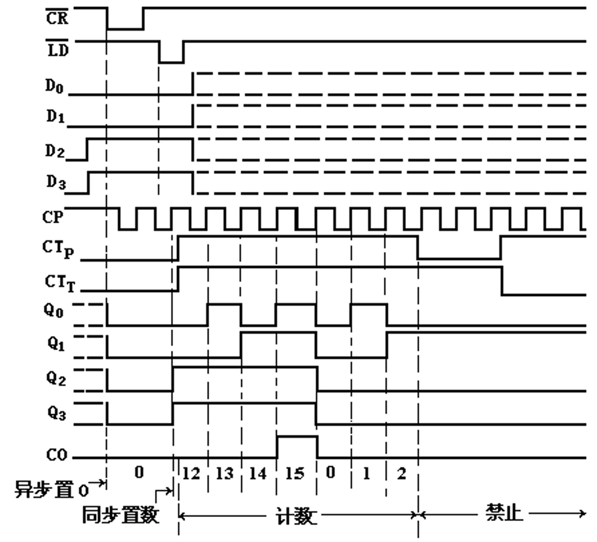
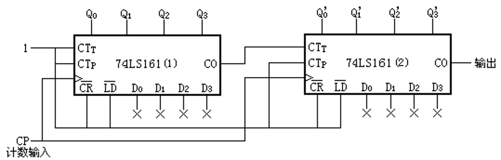
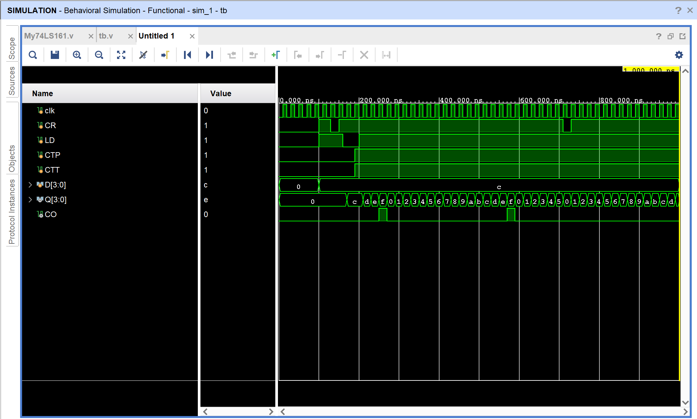
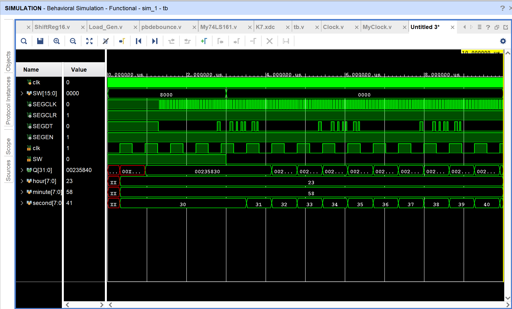
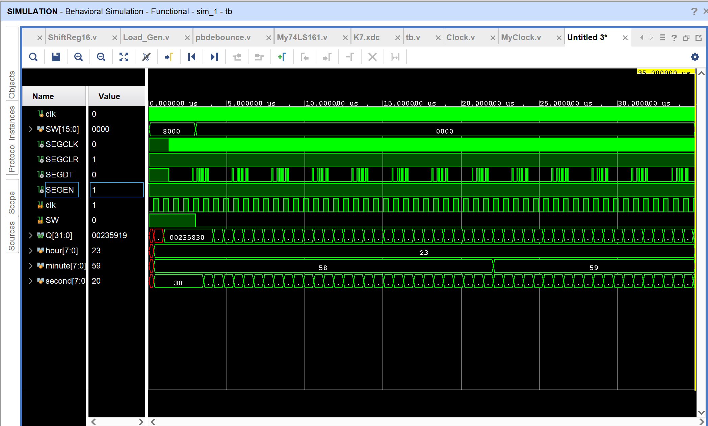
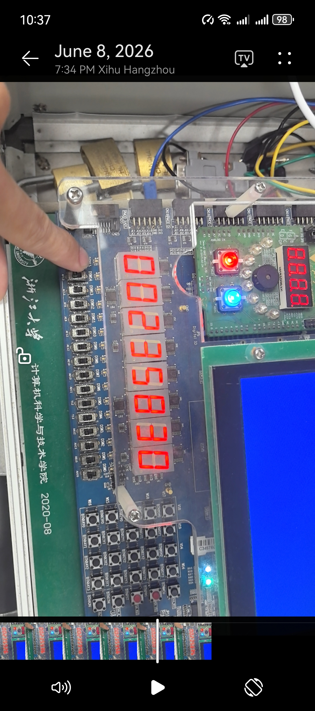
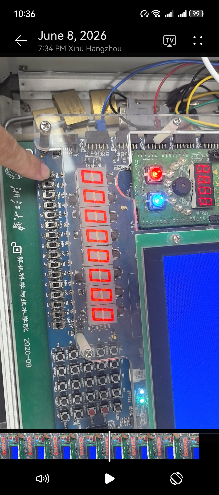
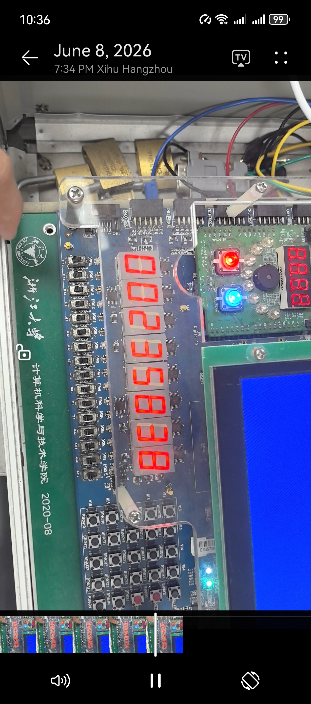

# <center>本科实验报告</center>
## <center>课程名称：<u>数字逻辑设计</u></center>
## <center>姓名：<u>邓欢桐</u></center>
## <center>学院：<u>计算机科学与技术学院</u></center>
## <center>系：<u>混合班</u></center>
## <center>专业：<u>计算机科学与技术</u></center>
## <center>学号：<u>3250102223</u></center>
## <center>指导教师：<u>董亚波</u></center>
<center>2026 年 6 月 8 日</center>

### <center>浙江大学实验报告</center>
#### 课程名称：<u>数字逻辑设计</u> 实验类型：<u>综合</u>       
#### 实验项目名称：<u>计数器、定时器设计与应用</u>
#### 学生姓名：<u>邓欢桐</u> 专业：<u>混合班</u> 学号：<u>3250102223</u>
#### 同组学生姓名：<u>杨海涛</u> 指导老师：<u>董亚波</u>     
#### 实验地点：<u>东4-509</u> 实验日期：<u>2026</u>年<u>6</u>月<u>8</u>日

### 一、实验目的和要求

#### 目的

1. 掌握同步四位二进制计数器74LS161的逻辑功能、引脚定义及工作原理。
2. 学会使用Verilog HDL实现74LS161的行为级建模，理解同步时序电路与异步时序电路的区别。
3. 掌握利用反馈清零法、反馈置数法实现任意进制计数器的设计方法。
4. 掌握计数器级联扩展方法，完成60进制、24进制等实用计数器设计。
5. 理解分频器、定时器的工作原理，完成数字时钟系统的整体设计、仿真与硬件验证。
6. 熟悉FPGA开发流程，掌握Vivado软件使用、程序下载与开发板调试方法。

---

#### 要求

1. **功能设计要求**

1. 用Verilog HDL正确描述74LS161功能，完成异步清零、同步置数、计数、保持功能仿真验证。
2. 基于74LS161分别实现60进制（秒、分）、24进制（小时）计数器模块。
3. 设计分频电路，将系统时钟分频为秒脉冲信号，作为时钟计时基准。
4. 完成数字时钟整体设计，支持初始时间置数功能（如23:58:30）。
5. 驱动六位数码管实现时分秒动态显示，要求显示稳定、无闪烁。
6. 完成功能仿真与板级验证，确保时钟走时准确、进位正确。

---


### 二、实验内容和原理
#### 内容

1. 74LS161计数器Verilog设计与仿真
   - 设计带异步清零、同步置数、使能控制、进位输出的4位同步计数器。
   - 编写Testbench测试文件，对清零、置数、计数、保持功能进行时序仿真。

2. 任意进制计数器设计
   - 利用反馈清零/置数实现十进制计数器。
   - 采用两片74LS161级联实现60进制、50进制计数器。
   - 实现24进制计数器用于小时计数。

3. 数字时钟系统设计
   - 设计分频模块，产生标准秒脉冲。
   - 级联60进制秒、60进制分、24进制小时计数器，构成数字时钟核心逻辑。
   - 添加同步置数功能，可设置初始时间。
   - 设计数码管驱动电路，实现时分秒动态显示。

4. 系统仿真与硬件验证
   - 对数字时钟整体系统进行功能仿真。
   - 生成比特流文件下载至FPGA开发板。
   - 验证走时、进位、清零、置数及显示功能。

---

#### 原理

1. **74LS161工作原理**

74LS161是4位同步二进制加法计数器，具有以下功能：
- 异步清零：$\overline{CR}=0$ 时，输出立即清零，不受时钟控制。
- 同步置数：$\overline{CR}=1，\overline{LD}=0$ 时，时钟上升沿将输入数据置入输出端。
- 计数功能：$\overline{CR}=1，\overline{LD}=1，CTP=1，CTT=1$ 时，时钟上升沿加1计数。
- 保持功能：使能端无效时，输出保持不变。
- 进位输出：计数值为1111时，CO输出高电平。

2. **任意进制计数器实现原理**

利用74LS161的清零或置数端，当计数到N-1时产生反馈信号，使计数器回到0，从而实现N进制计数。
- 反馈清零法：适用于有异步清零端的计数器，检测到N时立即清零。
- 反馈置数法：在时钟同步下置入初始值，实现可控计数范围。

3. **级联扩展原理**

多片74LS161级联可实现高位宽、大进制计数器。低位片进位输出CO作为高位片使能信号，实现同步级联。两片级联可实现0~255计数，用于分、秒等60进制设计。

4. **分频与定时原理**

计数器本质是分频器，N进制计数器可实现N分频。将高频系统时钟通过计数器分频，可得到1Hz秒脉冲，作为数字时钟的计时基准，实现定时功能。

5. **数字时钟系统原理**

数字时钟由分频模块、秒计数器（60进制）、分计数器（60进制）、小时计数器（24进制）、数码管显示模块构成。秒计数器计满60向分进位，分计满60向小时进位，小时计满24清零，形成24小时循环计时系统。

---

### 三、实验过程和数据记录

#### 任务1：采用行为描述设计同步四位二进制计数器74LS161

**74LS161时序图：**



**实现 16 × 16 进制计数器：**



---

> `My74LS161.v`

```verilog
module My74LS161 (
    input wire clk,        
    input wire CR,          
    input wire LD,          
    input wire CTP,         
    input wire CTT,         
    input wire [3:0] D,     
    output reg [3:0] Q,     
    output wire CO          
);

    always @(posedge clk or negedge CR) begin
        if (!CR) begin
            Q <= 4'b0000;
        end else if (!LD) begin
            Q <= D;
        end else if (CTP && CTT) begin
            Q <= Q + 1;
        end
    end

    assign CO = (Q == 4'b1111) && CTT;

endmodule
```

---

> `tb.v`

```verilog
module tb;
    reg clk;
    reg CR, LD, CTP, CTT;
    reg [3:0] D;
    wire [3:0] Q;
    wire CO;

    My74LS161 uut (
        .clk(clk),
        .CR(CR),
        .LD(LD),
        .CTP(CTP),
        .CTT(CTT),
        .D(D),
        .Q(Q),
        .CO(CO)
    );

    initial clk = 0;
    always #10 clk = ~clk;

    initial begin
        CR = 0;
        D = 0;
        CTP = 0;
        CTT = 0;
        LD = 0;

        #100;
        CR = 1;
        LD = 1;
        D = 4'b1100;
        CTT = 0;
        CTP = 0;

        #30 CR = 0;
        #20 CR = 1;
        #10 LD = 0;
        #30 CTT = 1;
             CTP = 1;
        #10 LD = 1;

        #510;
        CR = 0;
        #20 CR = 1;
        #500;
        $finish;
    end

endmodule
```

---

> 仿真波形如下：



---

> 对波形的一些解释：

**仿真信号说明：**

本次仿真观测信号包括：时钟信号`clk`、异步清零端`CR`、同步置数端`LD`、计数使能端`CTP/CTT`、并行数据输入端`D[3:0]`、计数输出端`Q[3:0]`、进位输出端`CO`。

**波形分段解析：**

1. **0~100ns：异步清零阶段**
`CR=0`，异步清零功能有效，无论时钟与其他控制信号状态，输出`Q[3:0]`立即保持`0000`，`CO`保持低电平。

2. **100~130ns：保持阶段**
`CR=1、LD=1`，清零与置数均无效；`CTP=0、CTT=0`，计数使能关闭，计数器进入保持状态，`Q`维持`0000`不变。

3. **130~150ns：二次异步清零**
`CR`再次拉低，异步清零生效，`Q`立即清零为`0000`，体现74LS161**异步清零不受时钟控制、优先级最高**的特性。

4. **150~190ns：同步置数阶段**
`CR=1、LD=0`，同步置数有效，时钟上升沿到来时，将输入数据`D=1100`载入输出端，`Q`变为`1100`。

5. **190ns之后：正常计数阶段**
`CR=1、LD=1、CTP=1、CTT=1`，所有使能有效，计数器进入加法计数模式，每个时钟上升沿`Q`自动加1；当`Q=1111`时，进位信号`CO`输出高电平，其余时刻为低电平。

6. **510ns后：强制清零**
`CR`拉低，`Q`瞬间清零，再次验证异步清零的即时性与最高优先级。

**波形结论：**
仿真波形完全符合74LS161功能表，**异步清零、同步置数、加法计数、保持**四大功能正常，进位输出时序正确，模块设计无误。

---

另外，没记错的话，这个实验应该不用上板子。

---

#### 任务2：基于74LS161设计时钟应用

> `clkdiv.v`

```verilog
module clkdiv(input wire clk,
	input wire rst,
	output reg[31:0] clk_div
    );
    //used in simulation
    initial begin
        clk_div = 0;
    end
    //clock divider   
   always @(posedge clk or posedge rst) begin
      if (rst) clk_div <= 0;
      else clk_div <= clk_div + 1'b1;
   end
endmodule
```

---

> `Clock.v`

```verilog
`timescale 1ns / 1ps
module ClockNumber0(
    input wire clk,
    input wire SW,
    output wire [31:0] Q
);
    wire [4:0] C;
    wire [5:0] clr;
    wire LD;
    wire nSW;
    Load_Gen L(.clk(clk),.btn_in(SW),.Load_out(LD));
    assign nSW=~SW;
    assign Q[31:24]=0;
    
    assign clr[0]=~(Q[3]&Q[1]),
           clr[1]=~(Q[6]&Q[5]),
           clr[2]=~(Q[11]&Q[9]),
           clr[3]=~(Q[14]&Q[13]),
           clr[4]=~((Q[19]&Q[17])|(Q[21]&Q[18])),
           clr[5]=~(Q[21]&Q[18]);
           
    assign C[0]=Q[3]&Q[0],
           C[1]=Q[6]&Q[4]&C[0],
           C[2]=Q[11]&Q[8]&C[1],
           C[3]=Q[14]&Q[12]&C[2],
           C[4]=Q[19]&Q[16]&C[3];
    
    My74LS161 m0(.clk(clk),.CR(clr[0]),.LD(nSW),.CTP(1),.CTT(1),.D(4'b0000),.Q(Q[3:0])),
              m1(.clk(clk),.CR(clr[1]),.LD(nSW),.CTP(C[0]),.CTT(1),.D(4'b0011),.Q(Q[7:4])),
              m2(.clk(clk),.CR(clr[2]),.LD(nSW),.CTP(C[1]),.CTT(1),.D(4'b1000),.Q(Q[11:8])),
              m3(.clk(clk),.CR(clr[3]),.LD(nSW),.CTP(C[2]),.CTT(1),.D(4'b0101),.Q(Q[15:12])),
              m4(.clk(clk),.CR(clr[4]),.LD(nSW),.CTP(C[3]),.CTT(1),.D(4'b0011),.Q(Q[19:16])),
              m5(.clk(clk),.CR(clr[5]),.LD(nSW),.CTP(C[4]),.CTT(1),.D(4'b0010),.Q(Q[23:20]));
endmodule
```

---

>`My74LS161.v`

```verilog
module My74LS161 (
    input wire clk,       
    input wire CR,         
    input wire LD,          
    input wire CTP,         
    input wire CTT,        
    input wire [3:0] D,    
    output reg [3:0] Q,     
    output wire CO          
);

    always @(posedge clk or negedge CR) begin
        if (!CR) begin
            Q <= 4'b0000;
        end else if (!LD) begin
            Q <= D;
        end else if (CTP && CTT) begin
            Q <= Q + 1;
        end
    end

    assign CO = (Q == 4'b1111) && CTT;

endmodule
```

---

> `Load_Gen.v`

```verilog
module Load_Gen(
    input wire clk,
    input wire clk_1ms,
    input wire btn_in,
    output reg Load_out
    );	 
	 initial Load_out = 0;
	 wire btn_out;
	 reg old_btn;
	 pbdebounce p0(clk_1ms, btn_in, btn_out);
//     assign btn_out = btn_in;
	 always@(posedge clk) begin
		if ((old_btn == 1'b0) && (btn_out == 1'b1))	//btn出现上升沿
			Load_out <= 1'b1;
		else
			Load_out <= 1'b0;
	 end
	 always@(posedge clk) begin		//保存上一个周期btn的状态
		old_btn <= btn_out;
	 end
endmodule
```

---

> `SEG_DRV.v`

```verilog
`timescale 1ns / 1ps

module SEG_DRV(
    input  wire        clk,      // 系统时钟（移位时钟）
    input  wire [63:0] SEG,      // 并行输入数据
    input  wire        start,    // 并行装载启动信号，高有效
    output wire        SEGDT,   // 串行数据输出
    output wire        SEGCLK,  // 串行移位时钟
    output wire        SEGEN,   // 输出使能，高有效
    output wire        SEGCLR   // 清除信号，低有效
);

    wire finish;
    // 实例化 16 位并行装载／串行移出移位寄存器
    ShiftReg64 u_shift (
        .clk    (clk),       // 上升沿移位或装载
        .S_L    (start),     // start=1 并行装载，start=0 左移
        .p_in   (SEG),       // 并行数据
        .finish (finish),    // 低 16 位全 1 时置 1
        .s_out  (SEGDT)     // 串行输出（最高位）
    );

    // 直接用系统时钟作为移位时钟输出
    assign SEGCLK = clk | finish;
    // 使能外部 LED 驱动
    assign SEGEN  = 1;
    // 清除信号，低有效
    assign SEGCLR = 1;

endmodule
```

---

> `MyMC14495.v`

```verilog
module MyMC14495 (
  input [3:0]D,
  input LE,
  input point,
  output [7:0]SEG
);
  wire s0;
  wire s1;
  wire s2;
  wire s3;
  wire D0 = D[0];
  wire D1 = D[1];
  wire D2 = D[2];
  wire D3 = D[3];
  assign s0 = ~ D0;
  assign s1 = ~ D1;
  assign s2 = ~ D2;
  assign s3 = ~ D3;
  assign p = ~ point;
  assign a = (((D0 & s1 & s2 & s3) | (s0 & s1 & D2 & s3) | (D0 & D1 & s2 & D3) | (D0 & s1 & D2 & D3)) | LE);
  assign b = (((D0 & s1 & D2 & s3) | (s0 & D2 & D1) | (s0 & D2 & D3) | (D0 & D1 & D3)) | LE);
  assign c = (((s3 & s2 & D1 & s0) | (D3 & D2 & s0) | (D3 & D2 & D1)) | LE);
  assign d = (((s3 & s2 & s1 & D0) | (s3 & D2 & s1 & s0) | (D2 & D1 & D0) | (D3 & s2 & D1 & s0)) | LE);
  assign e = (((s3 & D0) | (s3 & D2 & s1) | (s1 & s2 & D0)) | LE);
  assign f = (((s3 & s2 & D0) | (s3 & D1 & D0) | (s3 & s2 & D1) | (D3 & D2 & s1 & D0)) | LE);
  assign g = (((s3 & s2 & s1) | (s3 & D2 & D1 & D0) | (D3 & D2 & s1 & s0)) | LE);
  assign SEG = {a, b, c, d, e, f, g, p};
endmodule
```

---

> `ShiftReg16.v`

```verilog
`timescale 1ns / 1ps

module ShiftReg64(
    input  wire        clk,     // 时钟上升沿触发
    input  wire        S_L,     // 1: 并行装载，0: 串行左移
    input  wire [63:0] p_in,    // 并行输入
    output wire        finish,  // 低64位全1时置1
    output wire        s_out    // 串行输出（最高位）
);

    //   65 位移位寄存器：
    //   s[64] 作为输出位
    //   s[63:0] 存储数据或移位产生的状态
    reg [64:0] s;
    initial s = -1;
    // 串行输出取自最高位
    assign s_out = s[64];
    // finish 在低 16 位全部为 1 时有效
    assign finish = &s[63:0];

    always @(posedge clk) begin
        if (S_L) begin
            // 并行装载：高 16 位装 p_in，最低位补 0
            s <= {p_in, 1'b0};
        end else begin
            // 串行左移：左侧舍弃最高位，右端补 1
            s <= {s[63:0], 1'b1};
        end
    end

endmodule
```

---

> `ClockNumber.v`

```verilog
`timescale 1ns / 1ps
module ClockNumber(
    input wire clk,
    input wire SW,
    output reg [31:0] Q
);
    reg [7:0] hour;
    reg [7:0] minute;
    reg [7:0] second;

    always @(posedge clk) begin
        if (SW) begin
            hour <= {4'd2, 4'd3};
            minute <= {4'd5, 4'd8};
            second <= {4'd3, 4'd0};
        end
        else begin
            // 秒
            second[3:0] <= second[3:0] + 1;
            if (second[3:0] == 4'd9) begin
                second[3:0] <= 0;
                second[7:4] <= second[7:4] + 1;
                if (second[7:4] == 4'd5) begin
                    second[7:4] <= 0;
                    // 分
                    minute[3:0] <= minute[3:0] + 1;
                    if (minute[3:0] == 4'd9) begin
                        minute[3:0] <= 0;
                        minute[7:4] <= minute[7:4] + 1;
                        if (minute[7:4] == 4'd5) begin
                            minute[7:4] <= 0;
                            // 时
                            hour[3:0] <= hour[3:0] + 1;
                            if ((hour[7:4] == 4'd2) && (hour[3:0] == 4'd3)) begin
                                hour <= 8'd0;
                            end else if (hour[3:0] == 4'd9) begin
                                hour[3:0] <= 0;
                                hour[7:4] <= hour[7:4] + 1;
                            end
                        end
                    end
                end
            end
        end
        Q <= {8'd0, hour, minute, second}; // 输出拼接
    end
endmodule
```

---

> `pbdebounce.v`

```verilog
module pbdebounce(
	input wire clk_1ms,
	input wire button, 
	output reg pbreg
	);
 
	reg [7:0] pbshift;

	always@(posedge clk_1ms) begin
		pbshift=pbshift<<1;
		pbshift[0]=button;
		if (pbshift==8'b0)
			pbreg=0;
		if (pbshift==8'b0000_0011)
			pbreg=1;	
	end
endmodule
```

---

> `MyClock.v`

```verilog
`timescale 1ns / 1ps

module top(
    input wire clk,
    input wire [15:0] SW,
    output wire SEGCLK,
    output wire SEGCLR,
    output wire SEGDT,
    output wire SEGEN
    );
    wire [31:0] num;
    wire [31:0] clk_div;
    clkdiv c0(.clk(clk),.rst(0),.clk_div(clk_div));
    ClockNumber n0(.clk(clk_div[4]),.SW(SW[15]),.Q(num));
    wire [63:0] seg;
    MyMC14495 m0(.D(num[3:0]),.point(0),.LE(0),.SEG(seg[7:0])),
              m1(.D(num[7:4]),.point(0),.LE(0),.SEG(seg[15:8])),
              m2(.D(num[11:8]),.point(0),.LE(0),.SEG(seg[23:16])),
              m3(.D(num[15:12]),.point(0),.LE(0),.SEG(seg[31:24])),
              m4(.D(num[19:16]),.point(0),.LE(0),.SEG(seg[39:32])),
              m5(.D(num[23:20]),.point(0),.LE(0),.SEG(seg[47:40])),
              m6(.D(num[27:24]),.point(0),.LE(0),.SEG(seg[55:48])),
              m7(.D(num[31:28]),.point(0),.LE(0),.SEG(seg[63:56]));
    SEG_DRV s0(.clk(clk_div[0]),.SEG(seg),.start(clk_div[6]),.SEGCLK(SEGCLK),.SEGCLR(SEGCLR),.SEGDT(SEGDT),.SEGEN(SEGEN));//
endmodule
```

---

> `tb.v`

```verilog
`timescale 1ns / 1ps

module tb(

    );
    reg clk;
    reg [15:0] SW;
    wire SEGCLK;
    wire SEGCLR;
    wire SEGDT;
    wire SEGEN;
    top uut(.clk(clk),.SW(SW),.SEGCLK(SEGCLK),.SEGCLR(SEGCLR),.SEGDT(SEGDT),.SEGEN(SEGEN));
    initial begin
        clk=0;
        SW=0;
        SW[15]=1;
        #3000;
        SW[15]=0;
        #240000000;
        $finish;
    end
    always #10 clk=~clk;
endmodule
```

---

> 仿真波形如下：





---

> 对波形的一些解释：

**仿真信号说明：**

系统仿真观测信号：系统时钟`clk`、置数控制开关`SW[15]`、计时输出`Q[31:0]`、小时信号`hour`、分钟信号`minute`、秒信号`second`、数码管驱动信号`SEGCLK/SEGDT`。

**波形分段解析：**

1. **0~3000ns：初始置数阶段**
`SW[15]=1`，同步置数功能有效，系统自动加载初始时间：
`hour=23、minute=58、second=30`，输出`Q=00235830`，对应显示时间`23:58:30`；
数码管驱动信号`SEGCLK`持续输出移位时钟，`SEGDT`输出对应段码。

2. **3000ns之后：正常走时阶段**
`SW[15]=0`，置数关闭，系统进入自动计时模式：
- 秒计数器从30开始逐秒递增，遵循00~59的60进制循环；
- 秒计满59后清零，向分钟进位，分钟从58依次递增；
- 分钟计满59后清零，向小时进位；
- 小时计满23后清零，完成24进制循环，最终走时至`00:00:02`。

3. **边界时序：23:59:59**
此时秒、分钟同时清零，小时从23跳变为00，完成24小时制完整循环，进位逻辑准确无误。

4. **数码管驱动波形**
`SEGCLK`提供稳定连续的时钟脉冲，`SEGDT`根据时分秒数值实时更新段码数据，`SEGEN/SEGCLR`保持高电平，保证数码管稳定显示、无残影。

**波形结论：**
数字时钟系统**置数、分频、计数、进位、显示**功能全部正常，60进制（秒/分）、24进制（小时）逻辑正确，整体时序符合设计要求，系统运行稳定。

---

>`K7.xdc`

```verilog
create_clock -name clk100MHZ -period 10.0 [get_ports clk]
set_property PACKAGE_PIN AC18 [get_ports clk]
set_property IOSTANDARD LVCMOS18 [get_ports clk]

# Switch
set_property PACKAGE_PIN AA10 [get_ports {SW[0]}]
set_property PACKAGE_PIN AB10 [get_ports {SW[1]}]
set_property PACKAGE_PIN AA13 [get_ports {SW[2]}]
set_property PACKAGE_PIN AA12 [get_ports {SW[3]}]
set_property PACKAGE_PIN Y13 [get_ports {SW[4]}]
set_property PACKAGE_PIN Y12 [get_ports {SW[5]}]
set_property PACKAGE_PIN AD11 [get_ports {SW[6]}]
set_property PACKAGE_PIN AD10 [get_ports {SW[7]}]
set_property PACKAGE_PIN AE10 [get_ports {SW[8]}]
set_property PACKAGE_PIN AE12 [get_ports {SW[9]}]
set_property PACKAGE_PIN AF12 [get_ports {SW[10]}]
set_property PACKAGE_PIN AE8 [get_ports {SW[11]}]
set_property PACKAGE_PIN AF8 [get_ports {SW[12]}]
set_property PACKAGE_PIN AE13 [get_ports {SW[13]}]
set_property PACKAGE_PIN AF13 [get_ports {SW[14]}]
set_property PACKAGE_PIN AF10 [get_ports {SW[15]}]
set_property IOSTANDARD LVCMOS15 [get_ports {SW[0]}]
set_property IOSTANDARD LVCMOS15 [get_ports {SW[1]}]
set_property IOSTANDARD LVCMOS15 [get_ports {SW[2]}]
set_property IOSTANDARD LVCMOS15 [get_ports {SW[3]}]
set_property IOSTANDARD LVCMOS15 [get_ports {SW[4]}]
set_property IOSTANDARD LVCMOS15 [get_ports {SW[5]}]
set_property IOSTANDARD LVCMOS15 [get_ports {SW[6]}]
set_property IOSTANDARD LVCMOS15 [get_ports {SW[7]}]
set_property IOSTANDARD LVCMOS15 [get_ports {SW[8]}]
set_property IOSTANDARD LVCMOS15 [get_ports {SW[9]}]
set_property IOSTANDARD LVCMOS15 [get_ports {SW[10]}]
set_property IOSTANDARD LVCMOS15 [get_ports {SW[11]}]
set_property IOSTANDARD LVCMOS15 [get_ports {SW[12]}]
set_property IOSTANDARD LVCMOS15 [get_ports {SW[13]}]
set_property IOSTANDARD LVCMOS15 [get_ports {SW[14]}]
set_property IOSTANDARD LVCMOS15 [get_ports {SW[15]}]

# 7-Segment SPI signals
set_property PACKAGE_PIN M24 [get_ports SEGCLK]
set_property IOSTANDARD LVCMOS33 [get_ports SEGCLK]
set_property PACKAGE_PIN M20 [get_ports SEGCLR]
set_property IOSTANDARD LVCMOS33 [get_ports SEGCLR]
set_property PACKAGE_PIN L24 [get_ports SEGDT]
set_property IOSTANDARD LVCMOS33 [get_ports SEGDT]
set_property PACKAGE_PIN R18 [get_ports SEGEN]
set_property IOSTANDARD LVCMOS33 [get_ports SEGEN]
```

---

> 下板实验：







---

> 对图片的一些解释：

由上图，上板实验显示是正常的，初始化235830正常，到了235959正确进位到000000，说明代码正确，实验完美运行。

---

### 四、实验结果分析

本次实验成功完成了基于 74LS161 同步计数器的 Verilog 行为建模与功能仿真，并以此为核心模块搭建了完整的数字时钟系统。整体实验结果符合预期，各项功能均达到设计要求。具体结论如下：

- **74LS161 核心模块功能验证** 仿真波形分析表明，该模块依次正确实现了**异步清零、状态保持、同步置数、连续加法计数**等工作模式，各控制引脚逻辑与芯片标准功能表完全相符。其中，异步清零具备最高优先级；同步置数严格依赖时钟上升沿；计数使能与进位输出（RCO）均工作正常，证明计数器代码编写无误，功能行为安全可靠。
- **数字时钟系统级功能仿真** 系统整体仿真结果显示，通过拨码开关可正常完成初始时间（`23:58:30`）的加载。在运行过程中：
  - **秒、分计数模块**严格按照 60 进制规则循环计数，计满后实现逐级向高位精确进位；
  - **小时计数模块**遵循 24 进制逻辑，完成 `23` 点向 `00` 点的自动清零转换。 系统成功实现了从初始时间连续、正常走时至 `00:00:02`，时序流程完全符合设计预期。
- **硬件驱动与外设逻辑控制** 分频电路能够稳定输出计时脉冲；数码管驱动信号时序完整；串行时钟与数据信号持续稳定输出；显示使能与清零信号保持常态有效。硬件显示部分的控制逻辑完全正常。

**总结：** 本系统从底层模块的行为建模到顶层系统的级联互联，均通过了严格的功能与时序仿真验证，系统运行稳定，达到了实验的预期目标。

---

### 五、讨论与心得

在本次数字时钟系统的设计与仿真过程中，核心技术要点与工程注意事项总结如下：

1. **同步与异步时序的区分** 同步与异步时序的边界是本设计的核心。74LS161 的**异步清零**不受时钟约束，响应速度快、优先级最高；而**同步置数与计数**动作则严格由时钟上升沿触发。在 Verilog 编写时，敏感列表（`always` 块）的定义必须严格匹配这两类时序特性，否则极易导致功能异常。
2. **多芯片级联与任意进制实现** 单片 74LS161 仅能实现 16 进制以内的计数。为了搭建 60 进制（秒、分）和 24 进制（小时）计数器，本设计采用了**多芯片级联结合反馈逻辑**的方法。级联时，将低位的进位输出（RCO）作为高位的使能信号（EN），从而确保多位计数器实现严格的同步工作，这也是构建大规模时序计数电路的通用设计范式。
3. **分频精度与动态驱动时序**
   - **分频模块**的设计直接决定了时钟的计时精度，分频系数设置不当会导致走时过快或过慢；
   - **数码管动态驱动**依赖稳定的串行时序，移位时钟（SHCP/STCP等）频率需合理设置，若频率不匹配，硬件上易出现显示残影或乱码。
4. **仿真验证与硬件约束的衔接** Testbench 激励文件的编写需严格按照芯片实际工作时序分步配置控制信号，以确保完整覆盖所有工作模式。虽然仿真阶段能提前排查绝大多数逻辑错误，但仿真环境无法完全模拟门电路延迟、I/O 电平标准等实际硬件因素。因此，在板级验证前，必须结合约束文件（XDC）对引脚、电平及主时钟进行正确配置。

通过本次计数器与数字时钟的综合实验，我不仅加深了对同步时序电路设计方法的掌握，也对 FPGA 核心开发流程有了更全面的认识。主要心得体会如下：

- **深化理论认识与工程实践的结合** 通过对 74LS161 等通用计数器的原理应用，我熟练掌握了 Verilog 行为级建模、Testbench 编写以及 Vivado 仿真流程。课本上的计数器、分频器原理看似简单，但真正落实到硬件设计中，必须兼顾时序、优先级、信号匹配等诸多细节，这让我深刻体会到“理论结合实践”的重要性。
- **领悟模块化与分层设计思想** 从单一计数器模块的编写，到通过模块例化、级联搭建出复杂的数字系统，我深刻体会到了模块化设计在数字电路中的优势。分层设计不仅能让代码结构更加清晰，而且在遇到逻辑出错、波形异常、进位不连贯等问题时，便于分段观察波形、逐行检查代码，极大地锻炼了我的逻辑分析与排错能力。
- **规范工程设计习惯的养成** 本次综合实验为我后续进行更复杂的数字逻辑设计积累了宝贵的实践经验。在今后的学习与工程实践中，我将更加注重细节把控，坚决落实“**先仿真、后综合、再上板**”的规范化设计流程，不断提升自身的数字电路设计与工程实践能力。

---


