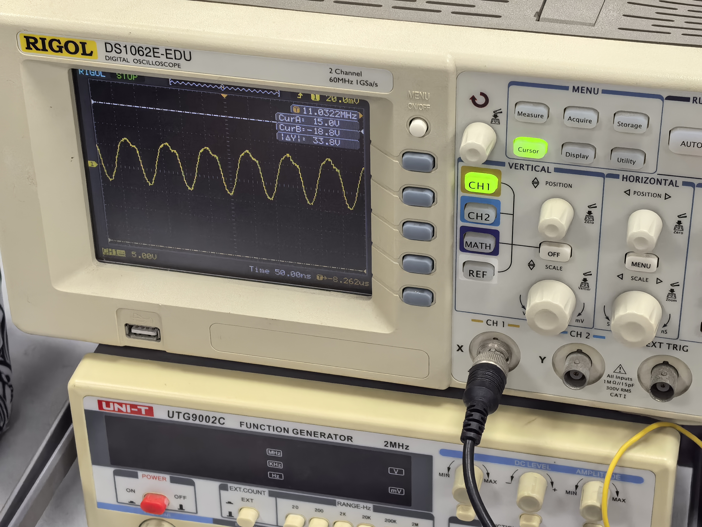
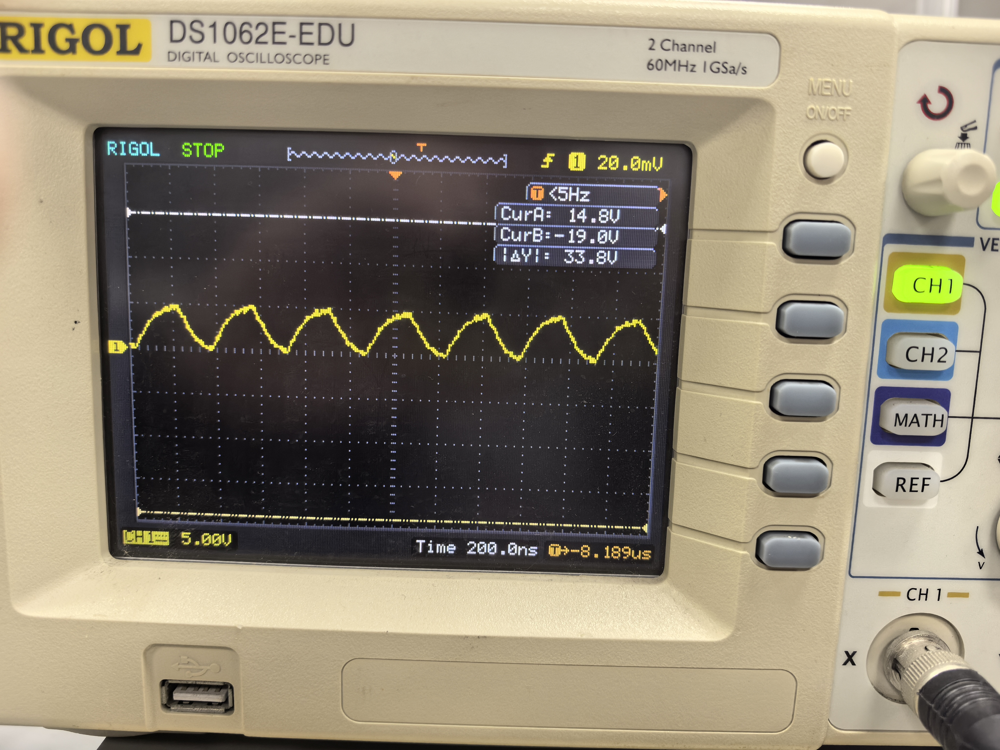
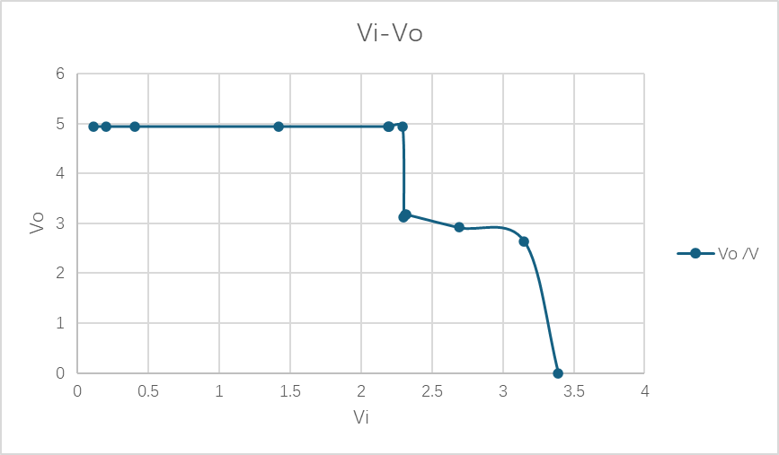

# 
本科实验报告

## 
课程名称：<u>数字逻辑设计</u>

## 
姓名：<u>邓欢桐</u>

## 
学院：<u>计算机科学与技术学院</u>

## 
系：<u>混合班</u>

## 
专业：<u>计算机科学与技术</u>

## 
学号：<u>3250102223</u>

## 
指导教师：<u>董亚波</u>

2026年3月16日

### 
浙江大学实验报告

#### 课程名称：<u>数字逻辑设计</u> 实验类型：<u>综合</u>       
#### 实验项目名称：<u>集成逻辑门电路的功能及参数测试</u>
#### 学生姓名：<u>邓欢桐</u> 专业：<u>混合班</u> 学号：<u>3250102223</u>
#### 同组学生姓名：<u>杨海涛</u> 指导老师：<u>董亚波</u>     
#### 实验地点：<u>东4-509</u> 实验日期：<u>2026</u>年<u>3</u>月<u>16</u>日
---
### 一、实验目的和要求
- 熟悉基本逻辑门电路的功能、外部电气特性和逻辑功能
- 熟悉TTL与非门和CMOS或非门的封装及管脚功能
- 掌握主要参数和静态特性的测试方法，加深对各参数意义的理解
- 进一步建立信号传输有时间延时的概念
- 进一步熟悉示波器仪器的使用

---
### 二、实验内容和原理
#### 内容：
- 验证集成电路74LS00“与非”门的逻辑功能
- 验证集成电路CD4001“或非”门的逻辑功能
- 测量集成电路74LS00逻辑门的传输延迟时间$t_{pd}$
- 测量集成电路CD4001逻辑门的传输延迟时间$t_{pd}$
- 测量集成电路74LS00传输特性与开关门电平$V_{ON}$和$V_{OFF}$以及噪声容限

---
#### 原理：
本实验所使用的芯片为 74LS00（TTL 两输入与非门）和 CD4001（CMOS 两输入或非门）。以下是一些重要的参数/物理量：
- **输出高电平 $V_{OH}$ 和输出低电平 $V_{OL}$：**
  - 这两个参数本质上是门电路输出“1”和输出“0”的时候实际电压是多少。理想情况下应该是 $5$ V和 $0$ V，但实际上总会有偏差。比如在上一次实验中大量出现$4.95$ V与$0.11$ V的数据。
- **电压传输特性和开关电平：**
  - 电压传输特性：缓慢调节输入电压，观察输出电压如何变化，画出来的 $I-U$ 曲线就是电压传输特性。
  - 关门电平 $V_{OFF}$：随着输入电压升高，输出电压开始下降，当输出电压降到$2.4$V（就是前面说的$V_{OH}$最小值）的时候，对应的输入电压就是$V_{OFF}$。输入不能超过这个值，否则输出不算可靠的高电平。
  - 开门电平 $V_{ON}$：继续升高输入电压，输出电压继续下降，当降到$0.4$V（$V_{OL}$最大值）的时候，对应的输入电压就是$V_{ON}$。也就是说输入至少要高于该值，才能保证输出是可靠的低电平。
- **噪声容限：**
  - 低电平噪声容限 $V_{NL} = V_{OFF} - V_{OL}$。
  - 高电平噪声容限 $V_{NH} = V_{OH} - V_{ON}$。
  - 数值越大，说明抗干扰能力越强。
- **传输延迟时间 $t_{pd}$：**
  - 此为一个动态参数。因为芯片里面的晶体管有电容，信号传输会有延迟。从输入变化到输出变化之间的时间就是传输延迟。输出从高变低需要的时间叫$t_{PHL}$，从低变高叫$t_{PLH}$，取平均值为$t_{pd} = \frac{t_{PHL} + t_{PLH}}{2}$。
  - 环形振荡器是测量延迟时间的有效工具。把奇数个门首尾串起来，任其振荡。测出振荡周期$T$，除以门的个数再乘以$2$（因为每个门贡献两次延迟），就能算出$t_{pd}$。对三个门来说，就是$t_{pd} = \frac{T}{6}$（本次实验需要用到该公式）。
- **输入电流：**
  - $I_{iL}$：输入接地时从输入端流出来的电流。
  - $I_{iH}$：输入接高电平时流进输入端的电流。
- **扇出系数 $N_o$：**
  - 即解决此门的输出能带多少个同样的门的问题。对TTL来说，与输出低电平时的灌电流能力有关（$I_{OLmax}$），此时除以每个门输入低电平时要抽走的电流（$I_{iL}$），就得到扇出系数：$N_o = \frac{I_{OLmax}}{ I_{iL}}$。
- **功耗：**
  - 输出低电平时的功耗叫空载导通功耗$P_{ON}$，输出高电平时的功耗叫空载截止功耗$P_{OFF}$。
  - 虽然单个门功耗不大，但在大规模芯片情况下需要慎重考虑。

---
### 三、实验过程和数据记录
- **验证集成电路74LS00“与非”门的逻辑功能**
|$V_A$ (V)|$V_B$ (V)|$V_F$ (V)|
|:---:|:---:|:---:|
|$0.09$|$0.09$|$4.96$|
|$4.95$|$0.09$|$4.95$|
|$0.09$|$4.95$|$4.95$|
|$4.95$|$4.95$|$0.00$|

以下是第一组数据的实验图片，与表格内的实验数据完全吻合。

- **分析：**当两个输入均为低电平时，输出为高电平（约$4.96$V）；当一个输入为低点评、另一个为高电平时，输出仍为高电平；只有当两个输入均为高电平时，输出才为低电平（接近$0$V）。这一结果符合与非门“若有$0$则总是$1$，全为$1$则总是$0$”的逻辑功能。高电平输出在$4.95$ V左右，接近$5$ V；低电平约为$0.09$ V，输出接近0V，电路工作正常。

---
- **验证集成电路CD4001“或非”门的逻辑功能**
|$V_A$ (V)|$V_B$ (V)|$V_F$ (V)|
|:---:|:---:|:---:|
|$0.09$|$0.09$|$0.00$|
|$4.95$|$0.09$|$0.00$|
|$0.09$|$4.95$|$0.00$|
|$0.09$|$0.09$|$4.96$|

以下是第三组数据的实验图片，与表格内的实验数据完全吻合。

- **分析：**当两个输入均为低电平时，输出为高电平；只要有一个输入为高电平，输出即为低电平。这完全符合或非门“若全$0$总是$1$，若有$1$总是$0$”的逻辑关系。高电平输出在$4.95$ V左右，接近$5$ V；低电平约为$0.09$ V，输出接近$0$V。说明CD4001工作正常。

---
- **测量集成电路74LS00逻辑门的传输延迟时间$t_{pd}$**
  - 环形振荡器由三个与非门构成，每个门贡献两次延迟，故$t_{pd}=\frac{T}{6}$ 
  - 由图中可以读取频率为$11.0322$MHz
  - 周期与频率的关系为$T=\frac{1}{f}$
  - 代入数据有 $t_{pd}=\frac{T}{6}≈15.11$ns。
  - 该值与74LS00的典型传输延迟时间（约$15$ns）相符，说明测量准确。

如图所示，数据真实。

---
- **测量集成电路CD4001逻辑门的传输延迟时间$t_{pd}$**
  - 由图中可以读取周期约为$344$ns
  - 代入数据有$t_{pd}=\frac{T}{6}≈57.3$ns
  - 该值在CD4001的典型传输延迟范围内（实测可能受供电电压、负载电容等因素影响），测量结果合理。

如图所示，数据真实。

---
- **测量集成电路74LS00传输特性与开关门电平$V_{ON}$和$V_{OFF}$以及噪声容限**
|$V_i$/V|$V_o$/V|
|:---:|:---:|
|$0.113$|$4.95$|
|$0.202$|$4.95$|
|$0.401$|$4.95$|
|$1.42$|$4.95$|
|$2.19$|$4.95$|
|$2.20$|$4.95$|
|$2.29$|$4.94$|
|$2.30$|$3.12$|
|$2.31$|$3.17$|
|$2.32$|$3.18$|
|$2.69$|$2.92$|
|$3.15$|$2.64$|
|$3.39$|$0.00$|

- 以下是数据曲线图和实验图片

- **分析：**
   - 输出高电平区：
   当输入电压在 $0.113$ V～$2.20$ V 范围内时，输出电压几乎稳定在 $4.95$ V，电路保持高电平输出状态，与非门处于截止工作区，输入变化对输出基本没有产生影响。
   - 转折区（阈值区）：
   输入电压在 $2.29$ V～$2.32$ V 区间时，输出电压出现明显跳变，由接近 $4.95$ V的高电平迅速下降至 $3.10 ~ 3.20$ V左右，表明门电路在此区间完成逻辑状态转换。该区域曲线陡峭，符合TTL与非门传输特性的典型特征。
   - 输出下降过渡区
   输入电压继续升高至 $2.69$ V～$3.15$ V 时，输出电压缓慢持续下降，逐步向低电平过渡，电路进入饱和导通的过渡阶段。
   - 输出低电平区
   当输入电压达到 $3.39$ V 时，输出电压降至 $0.00$V，电路稳定地输出低电平，与非门完全导通。
   - 整体合理性
   整体数据趋势符合TTL与非门电压传输特性规律：输入低电平时输出高电平，输入超过阈值电压后输出迅速转为低电平。就当前数据来说，测量结果能够反映器件真实的开关特性，实验数据合理有效。

- **根据实验原理：**
  - 关门电平 $V_{OFF}$：输出电压下降到$2.4$ V时的输入电压。观察数据，$V_i$从$2.29$ V上升到$2.30$ V时，$V_o$从$4.94$ V骤降至$3.12$ V，说明$2.4$ V落在该区间内。通过线性插值估算，当 $V_o = 2.4\,\text{V}$ 时，$V_i \approx 2.295\,\text{V}$。
  - 开门电平 $V_{ON}$：输出电压下降到$0.4$ V时的输入电压。从数据看，$V_i = 3.15\,\text{V}$ 时 $V_o = 2.64\,\text{V}$，$V_i = 3.152\,\text{V}$ 时 $V_o = 0.00\,\text{V}$，说明突变发生在$3.15$ V附近。估算当 $V_o = 0.4\,\text{V}$ 时，$V_i \approx 3.151\,\text{V}$。
  - 取实验实测的 $V_{OL} \approx 0.00\,\text{V}$，$V_{OH} \approx 4.95\,\text{V}$，计算噪声容限：
    - $V_{NL} = V_{OFF} - V_{OL} \approx 2.295 - 0.00 = 2.295\,\text{V}$
    - $V_{NH} = V_{OH} - V_{ON} \approx 4.95 - 3.151 = 1.799\,\text{V}$

---
### 四、实验结果分析
- 74LS00与非门和CD4001或非门的逻辑功能测试结果均与真值表完全一致。实测高电平约$4.95$ V，低电平约$0.09$ V，符合TTL和CMOS的电平标准。
- 环形振荡器法测得的74LS00 $t_{pd} \approx 15.1\,\text{ns}$，与手册典型值一致；CD4001 $t_{pd} \approx 57.3\,\text{ns}$，明显大于TTL，这一比较直接体现了CMOS器件速度较慢的特点。在整个的测量过程中，示波器读数稳定，调整好波形后几乎没有明显的抖动或其他异常，示波器的波形清晰，这也充分说明了结果的可靠性。
- 传输特性曲线显示，输入电压在$2.3$ V附近时输出发生陡降，表明TTL与非门的阈值电压约在$2.3$ V左右。计算得到的 $V_{OFF} \approx 2.295\,\text{V}$，$V_{ON} \approx 3.151\,\text{V}$，噪声容限 $V_{NL} \approx 2.3\,\text{V}$，$V_{NH} \approx 1.8\,\text{V}$，均远大于$0$，说明74LS00具有较强的抗干扰能力。
- 实验过程中记录了每个步骤的数据，并至少其中一组数据附有当时的实验图片，逻辑功能、延迟时间、传输特性三个部分看似是相互独立的实验方向和类型，但结果相互印证，整体实验数据可信较高。

---
### 五、讨论与心得
- 本次实验加深了我对组合逻辑电路的理解，对于格式逻辑的组合以及各种不同的表现形式都有了更深刻的认知，也对知识有了更牢固的掌握。
- 另外，在本次实验中，通过数据直观地感受到了74LS00与CD4001两种芯片的差异，也能清晰地发现TTL的速度优势。另外，计算噪声容限的时候，数据直接鲜明地表明了TTL在抗干扰能力方面的优越性，不会因为微小的扰动而失误。
- 本次实验依旧有粗心的点，比如少连了一根接线，又或是在最后一个实验中用错了芯片，导致对着接线研究了很久都没发现问题。这是我们需要反思的地方。
- 其他时候两人合作依旧顺利，默契地一人读数记录一人旋旋扭进行操作，最后得出的数据也有较强的说服力。总而言之，这是一次学到了很多新知识的、有意义的、结局比较圆满的实验。

---

