# <center>本科实验报告</center>
## <center>课程名称：<u>数字逻辑设计</u></center>
## <center>姓名：<u>邓欢桐</u></center>


## <center>学院：<u>计算机科学与技术学院</u></center>
## <center>系：<u>混合班</u></center>
## <center>专业：<u>计算机科学与技术</u><center>
## <center>学号：<u>3250102223</u></center>
## <center>指导教师：<u>董亚波</u></center>
<center>2026年3月23日</center>

### <center>浙江大学实验报告</center>
#### 课程名称：<u>数字逻辑设计</u> 实验类型：<u>综合</u>       
#### 实验项目名称：<u>EDA实验平台与实验环境运用</u>
#### 学生姓名：<u>邓欢桐</u> 专业：<u>混合班</u> 学号：<u>3250102223</u>
#### 同组学生姓名：<u>杨海涛</u> 指导老师：<u>董亚波</u>     
#### 实验地点：<u>东4-509</u> 实验日期：<u>2026</u>年<u>3</u>月<u>23</u>日

### 一、实验目的和要求
- 熟悉**Verilog HDL**语言并能用其建立基本的逻辑部件，在**Digital**软件和**Vivado**平台进行输入、编辑、调试、行为与仿真与综合后功能仿真
- 熟悉掌握**SWORD FPGA**开发平台，同时在**Vivado**平台上进行时序约束、引脚约束及映射布线后时序- 仿真
- 运用**Vivado**将设计验证后的代码下载到实验板上，并在实验板上验证

---
### 二、实验内容和原理
#### 内容：
- **任务一**：以图形方式输入逻辑功能描述：不考虑灯延时熄灭
- **任务二**：用 **Verilog** 语言描述电路逻辑功能每个开关拨动一次，灯亮以后会延时 $2$s 后熄灭

---
#### 原理：
- **任务一：组合逻辑通道灯控制**
   - 功能描述：三层楼道灯，每层一个开关均可独立控制灯的亮灭。假设开关往下拨为逻辑“ $1$ ”，灯亮为逻辑“ $1$ ”。
   - 逻辑分析：该功能等价于“三变量奇偶校验”，即三个开关中奇数个开关为“1”时灯亮。其逻辑表达式为：$F = S_1 \overline{S_2} \overline{S_3} + \overline{S_1} S_2 \overline{S_3} + \overline{S_1} \overline{S_2} S_3 + S_1 S_2 S_3$。
   - 最终逻辑表达式：$F=S1⊕S2⊕S3$。
- **任务二：楼道灯时序逻辑电路**
   - 功能描述：任意开关波动一次，灯亮，且开关拨回后，灯延时 $2$s 自动熄灭。
   - 实现方式：
     - 输入开关信号通过或门产生触发信号 $w$。
     - 计数器在 $w$ 为 $1$ 时清零，在 $w$ 为 $0$ 时累加。
     - 当计数器数值小于最大值时，灯亮，反之灯灭。
     - 通过调整计数器位数和时钟频率，实现 $2$s 延迟。

---
### 三、实验过程和数据记录
#### 任务一：图形方式输入逻辑功能描述（无延时版本）
- **Digital原理图绘制**：
  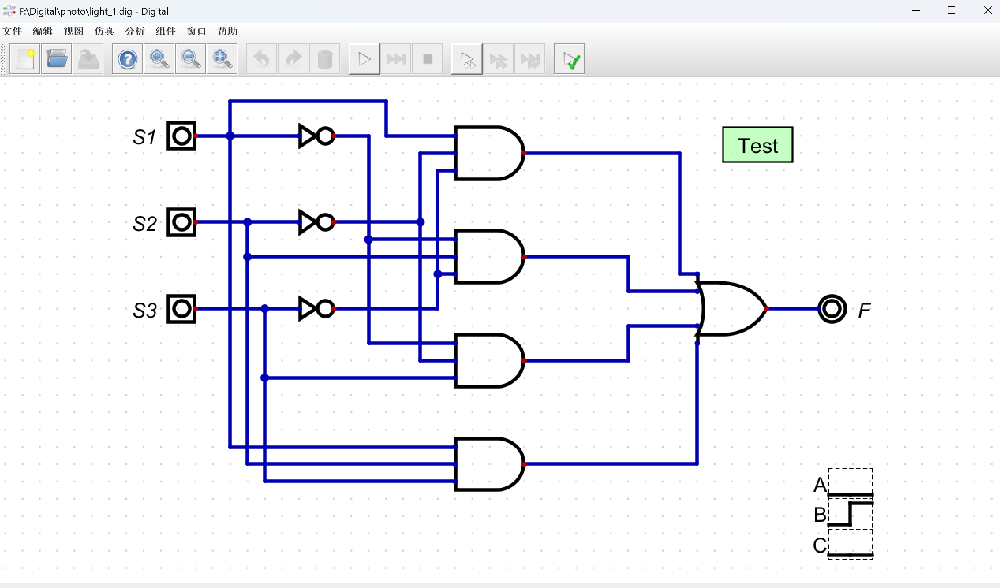
   - 如上图所示，第一张图为基本的电路图，包含了或门、与门等等原件，输入为S1、S2、S3，输出为F。
      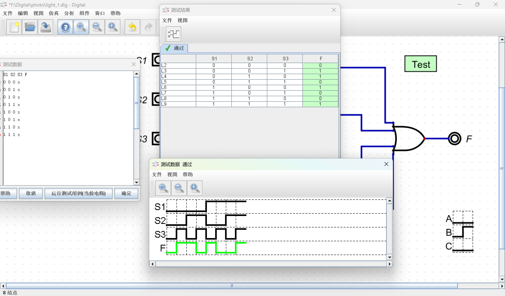
  
   - 如上图所示，第二张图为基本的模拟结果，可以看到S1、S2、S3三个输入当中只要有奇数个为 $1$，F 输出就为 $1$；反之，F 输出为 $0$。
  
   - 以上两图符合逻辑表达式 $F = S_1 \overline{S_2} \overline{S_3} + \overline{S_1} S_2 \overline{S_3} + \overline{S_1} \overline{S_2} S_3 + S_1 S_2 S_3$，由此我们可以得到最终表达式：$F=S1⊕S2⊕S3$。
  
---
- **Vivado 工程建立**：
   - 新建 **RTL** 工程，正确选择器件
     - Default Part: $xc7k160tffg676-1$
     - Family: $Kintex-7$
     - Package: $ffg676$
     - Speed Grade: $-1$
   - 编写 **Verilog** 代码如下并导出此 **Verilog** 文件Lampctrl_sch.v

>这是文件Lampctrl_sch.v
```verilog
   `timescale 1ns / 1ps
    module Lampctrl_HDL(

 	input wire clk, 
 	input wire S1, 
 	input wire S2, 
 	input wire S3,
 	output wire F
 	);
 	
 	parameter C_NUM = 8;
 	parameter C_MAX = 8'hFF;
 	
 	reg [C_NUM-1:0] count;
 	wire [C_NUM-1:0] c_next;
 	wire w;
 	
 	initial begin	//初始化
 	count = C_MAX;
 	end
 	//button pressed
 	assign w=S1||S2||S3; 
 	
 	//lamp logic
 	assign F = (count < C_MAX) ? 1'b1 : 1'b0;
 	
 	//count logic
 	always@(posedge clk)
 	begin
 		if(w == 1'b1)
 			count = 0;
 		else if(count < C_MAX)
 			count = c_next;
 	end
 	//next logic
 	assign c_next = count + 8'b1;

endmodule
```

---
- **行为仿真**
   - 建立仿真文件，输入仿真代码。
   - 进行仿真，观察波形以验证输出是否符合真值表。
>这是仿真代码 Lampctrl_sch_testbench.v
```verilog
   ///
   /*
   程序功能：给设计源文件及功能编写仿真文件，验证设计是否满足要求。
   */
   ///
   //1、设置仿真时间单位
   //格式"`timescale 1ns / 1ps"，其中时间单位"1ps"
   `timescale 1ns / 1ps

module Lampctrl_sch_testbench();
//2、定义信号类似
//与设计源文件对应，对应规则：一般输入信号定义为reg，输出信号定义为wire
    
    // Inputs
   reg S1;
   reg S2;
   reg S3;

// Output
   wire F;

//3、例化设计源文件
//注意第一个名字为设计源文件名，第二个满足源文件命名规则即可，这里为了方便起见，命名源文件名_UUT。

// Instantiate the UUT
   Lampctrl_sch Lampctrl_sch_UUT (
		.S1(S1), 
		.S2(S2), 
		.S3(S3), 
		.F(F)
		);
//4、添加激励（测试条件）

// Initialize Inputs
initial begin
//5、测试条件代码是顺序执行的
	S1 = 0;
	S2 = 0;
	S3 = 0;
	#50 S1 = 1;
//6、#50表示延迟50ns
	#50 S1 = 0;
	S2 = 1;
	#50 S1 = 1;
	#50 S1 = 0;
	S2 = 0;
	S3 = 1;
	#50 S1 = 1;
	#50 S1 = 0;
	S2 = 1;
	#50 S1 = 1;
	#50 S1 = 0;
	S2 = 0;
	S3 = 0;
end

endmodule
```
---
>这是仿真的波形图

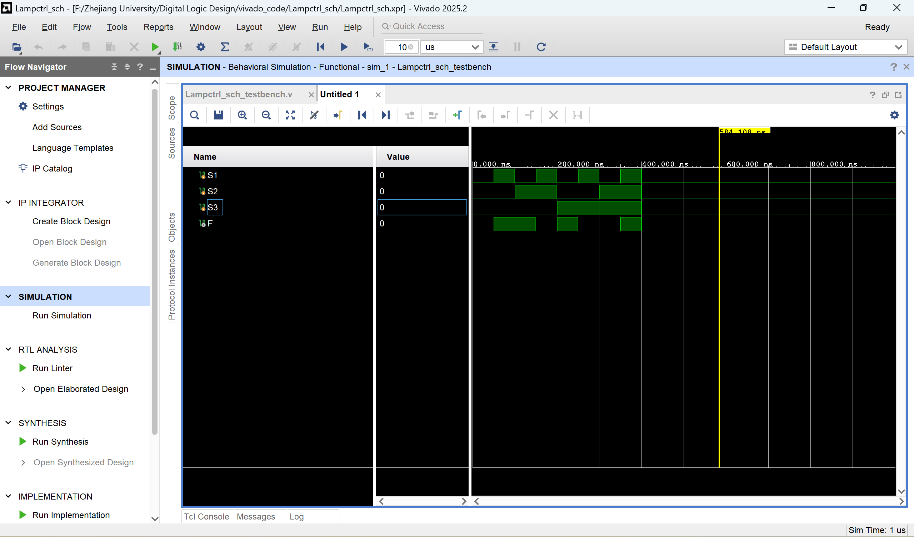

---
- **引脚约束和下载实现**
   - 编写约束文件 K7.xdc，将 S1、S2、S3 映射到开发板最右侧三个拨动开关，F 映射到LED。
   - 综合实现，生成比特流。
   - 最后通过 Hardware Manager 下载到 SWORD 板，拨动开关验证逻辑正确性。

>这是约束文件
```tcl
set_property PACKAGE_PIN AA10 [get_ports {S1}]
set_property IOSTANDARD LVCMOS15 [get_ports {S1}]
set_property PACKAGE_PIN AB10 [get_ports {S2}]
set_property IOSTANDARD LVCMOS15 [get_ports {S2}]
set_property PACKAGE_PIN AA13 [get_ports {S3}]
set_property IOSTANDARD LVCMOS15 [get_ports {S3}]
set_property PACKAGE_PIN AF24 [get_ports {F}]
set_property IOSTANDARD LVCMOS33 [get_ports {F}]
```
- **综合分析**
   - 从仿真的波形图来看，本次实验合乎逻辑，在 S1、S2、S3 三个输入中，奇数个输入为 $1$ 时 F 的输出为 $1$。反之 F 的输出为 $0$，符合逻辑表达式 $F = S_1 \overline{S_2} \overline{S_3} + \overline{S_1} S_2 \overline{S_3} + \overline{S_1} \overline{S_2} S_3 + S_1 S_2 S_3$。
   - 以下是一些实验中的实时图片，以证明该实验得到的仿真结果和真实结果的确符合要求

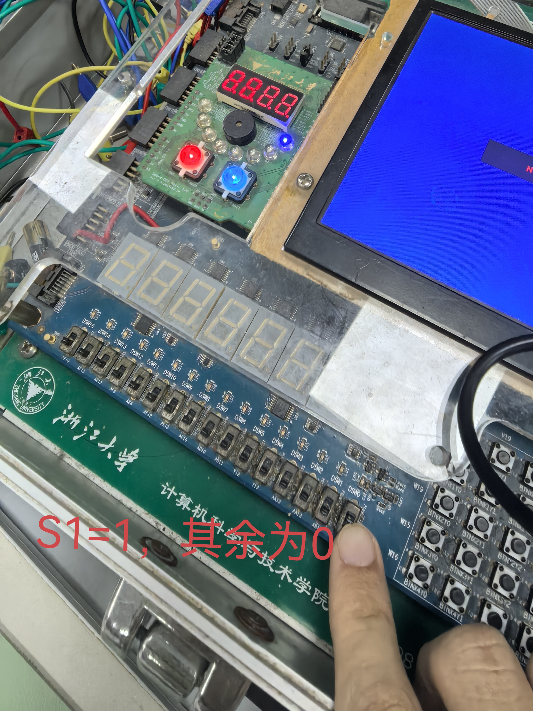

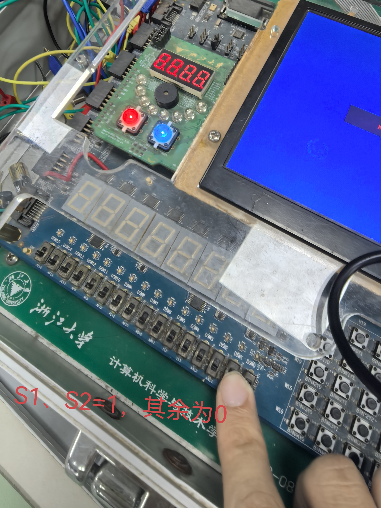

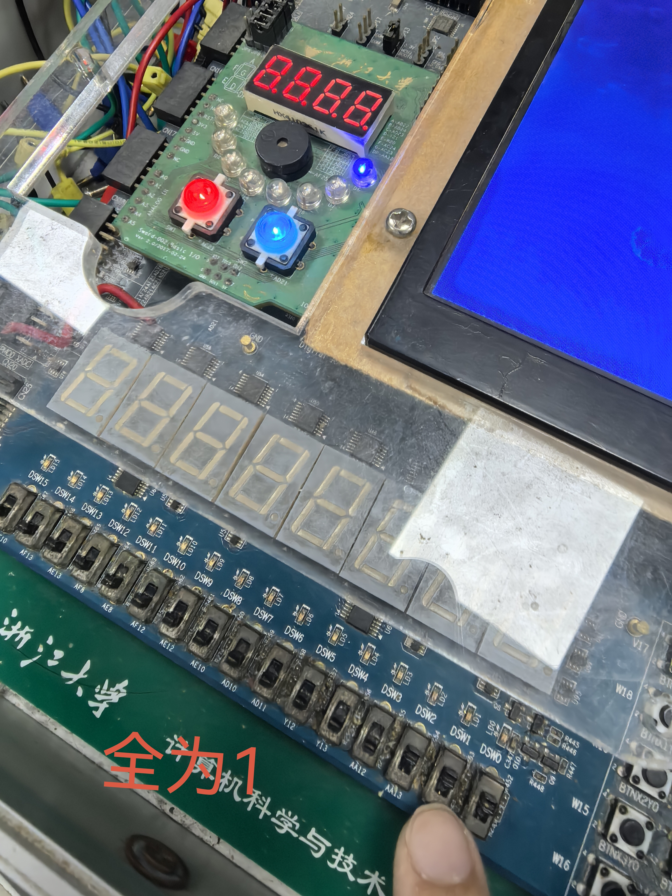

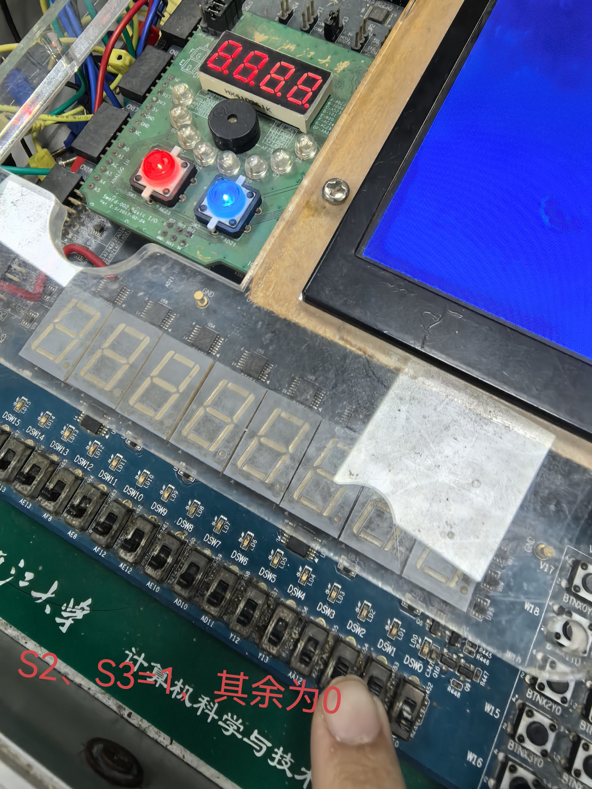

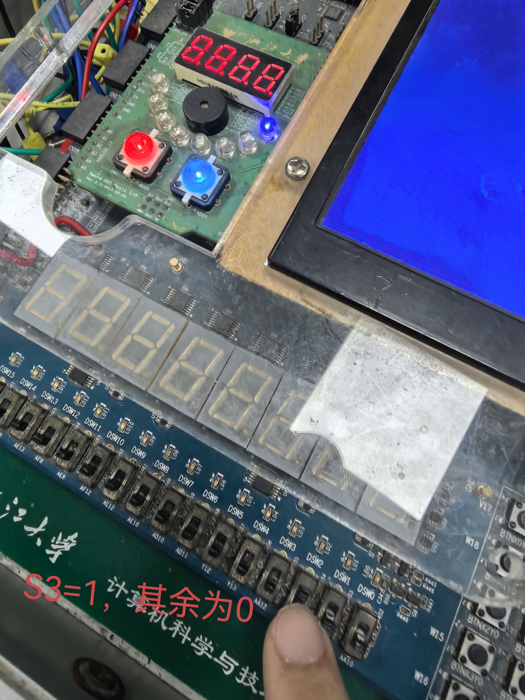

---
#### 实验二：Verilog 语言描述电路逻辑功能（带 $2$s 延时）
- **Vivado 工程建立**：
   - 新建 **RTL** 工程，正确选择器件
     - Default Part: $xc7k160tffg676-1$
     - Family: $Kintex-7$
     - Package: $ffg676$
     - Speed Grade: $-1$
   - 编写 **Verilog** 代码并导出 **Verilog** 文件Lampctrl_HDL.v
   - 编写编写 **Verilog** 代码并导出 **Verilog** 文件Lampctrl_HDL_testbench.v

>这是文件Lampctrl_HDL.v
```verilog
   `timescale 1ns / 1ps
    module Lampctrl_HDL(

 	input wire clk, 
 	input wire S1, 
 	input wire S2, 
 	input wire S3,
 	output wire F
 	);
 	
 	parameter C_NUM = 8;
 	parameter C_MAX = 8'hFF;
 	
 	reg [C_NUM-1:0] count;
 	wire [C_NUM-1:0] c_next;
 	wire w;
 	
 	initial begin	//初始化
 	count = C_MAX;
 	end
 	//button pressed
 	assign w=S1||S2||S3; 
 	
 	//lamp logic
 	assign F = (count < C_MAX) ? 1'b1 : 1'b0;
 	
 	//count logic
 	always@(posedge clk)
 	begin
 		if(w == 1'b1)
 			count = 0;
 		else if(count < C_MAX)
 			count = c_next;
 	end
 	//next logic
 	assign c_next = count + 8'b1;

endmodule
```

>这是增加了计数器位数的文件Lampctrl_HDL.v
```verilog
   `timescale 1ns / 1ps
    module Lampctrl_HDL(

 	input wire clk, 
 	input wire S1, 
 	input wire S2, 
 	input wire S3,
 	output wire [6:0] LED,
 	output wire F
 	);
 	
 	parameter C_NUM = 28;
	parameter C_MAX = 28'hFFFFFFF;
 	
 	reg [C_NUM-1:0] count;
 	wire [C_NUM-1:0] c_next;
 	wire w;
 	
 	initial begin	//初始化
 	count = C_MAX;
 	end
 	//button pressed
 	assign w=S1||S2||S3; 
 	
 	//lamp logic
 	assign F = (count < C_MAX) ? 1'b1 : 1'b0;
 	
 	assign LED = 7'b0000000;	//需增加对应output 端口

 	//count logic
 	always@(posedge clk)
 	begin
 		if(w == 1'b1)
 			count = 0;
 		else if(count < C_MAX)
 			count = c_next;
 	end
 	//next logic
 	assign c_next = count + 8'b1;

endmodule
```

---
- **行为仿真**
   - 建立仿真文件，输入仿真代码。
   - 观察波形，是否在 S1、S2、S3 任意一个输入为 $1$ 后 F 输出为 $1$，所有输入为 $0$ 后 F 并不是立即变为 $0$，而是在约 $2$s 后变为 $0$。


>这是仿真代码 Lampctrl_HDL_testbench.v
```verilog
module Lampctrl_HDL_testbench;
	// Inputs
	reg clk;
	reg S1;
	reg S2;
	reg S3;
	// Outputs
	wire F;

	// Instantiate the Unit Under Test (UUT)
	Lampctrl_HDL uut (
		.clk(clk), 
		.S1(S1), 
		.S2(S2), 
		.S3(S3), 
		.F(F)
	);
	
	initial begin
		// Initialize Inputs
		clk = 0;
		S1 = 0;S2 = 0;S3 = 0;

		#600 S1 = 1;	
		#20 S1 = 0;
		#6000 S2 = 1;
		#20 S2 = 0;
		#6000 S3 = 1;
		#20 S3 = 0;
	end
	
	always begin
		#10 clk = 0;
		#10 clk = 1;
	end	
endmodule
```

*以下是分别是仿真时长为 $10$us 的波形图以及仿真时长为 $21$us 的波形图*

>仿真时长为 $10$us 的波形图

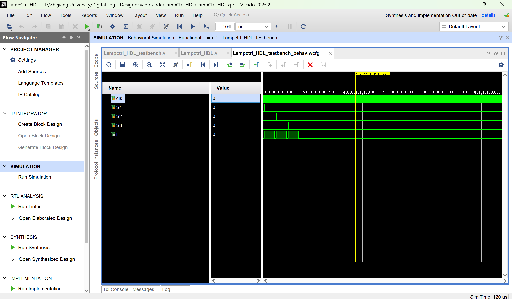

>仿真时长为 $21$us 的波形图

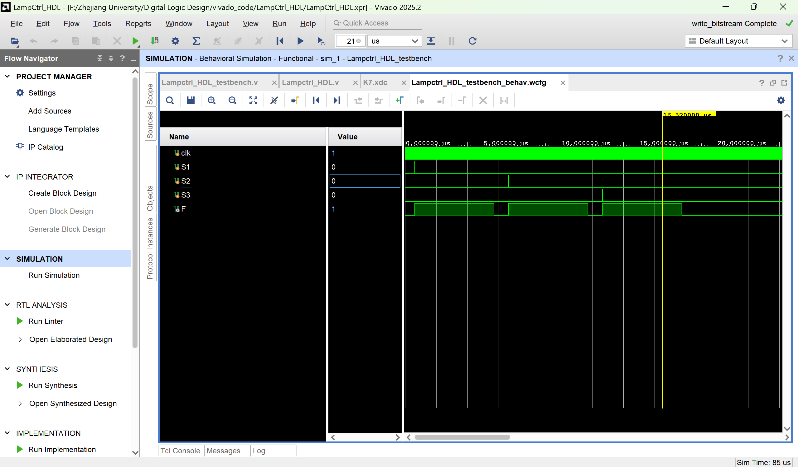

---
- **引脚约束和下载实现**
   - 编写约束文件。
   - 生产比特流，下载到开发板。
   - 观察 LED 灯，是否在拨动任意一个输入开关后 LED 灯亮起，关掉所有开关后 LED 灯并不是立即熄灭，而是在约 $2$s 后熄灭。

>这是约束文件
```tcl
create_clock -name clk100MHZ -period 10.0 [get_ports {clk}]
set_property PACKAGE_PIN AC18 [get_ports {clk}]
set_property IOSTANDARD LVCMOS18 [get_ports {clk}]
set_property PACKAGE_PIN AA10 [get_ports {S1}]
set_property IOSTANDARD LVCMOS15 [get_ports {S1}]
set_property PACKAGE_PIN AB10 [get_ports {S2}]
set_property IOSTANDARD LVCMOS15 [get_ports {S2}]
set_property PACKAGE_PIN AA13 [get_ports {S3}]
set_property IOSTANDARD LVCMOS15 [get_ports {S3}]
set_property PACKAGE_PIN W23 [get_ports {LED[0]}]
set_property IOSTANDARD LVCMOS33 [get_ports {LED[0]}]
set_property PACKAGE_PIN AB26 [get_ports {LED[1]}]
set_property IOSTANDARD LVCMOS33 [get_ports {LED[1]}]
set_property PACKAGE_PIN Y25 [get_ports {LED[2]}]
set_property IOSTANDARD LVCMOS33 [get_ports {LED[2]}]
set_property PACKAGE_PIN AA23 [get_ports {LED[3]}]
set_property IOSTANDARD LVCMOS33 [get_ports {LED[3]}]
set_property PACKAGE_PIN Y23 [get_ports {LED[4]}]
set_property IOSTANDARD LVCMOS33 [get_ports {LED[4]}]
set_property PACKAGE_PIN Y22 [get_ports {LED[5]}]
set_property IOSTANDARD LVCMOS33 [get_ports {LED[5]}]
set_property PACKAGE_PIN AE21 [get_ports {LED[6]}]
set_property IOSTANDARD LVCMOS33 [get_ports {LED[6]}]
set_property PACKAGE_PIN AF24 [get_ports {F}]
set_property IOSTANDARD LVCMOS33 [get_ports {F}]
```

---
- **综合分析**
   - 根据本次实验的波形和数据，可以得出开关闭合后 LED 灯亮，而开关断开后约 $2$s LED 灯灭，符合我们的设计需求。
   - 以下是一些实验中的实时图片，和仿真时的波形完全一致。

---

>这是延时很短的情况，LED 灯的亮暗情况和 S1、S2、S3 的开关情况几乎完全同步，肉眼看不出差别。

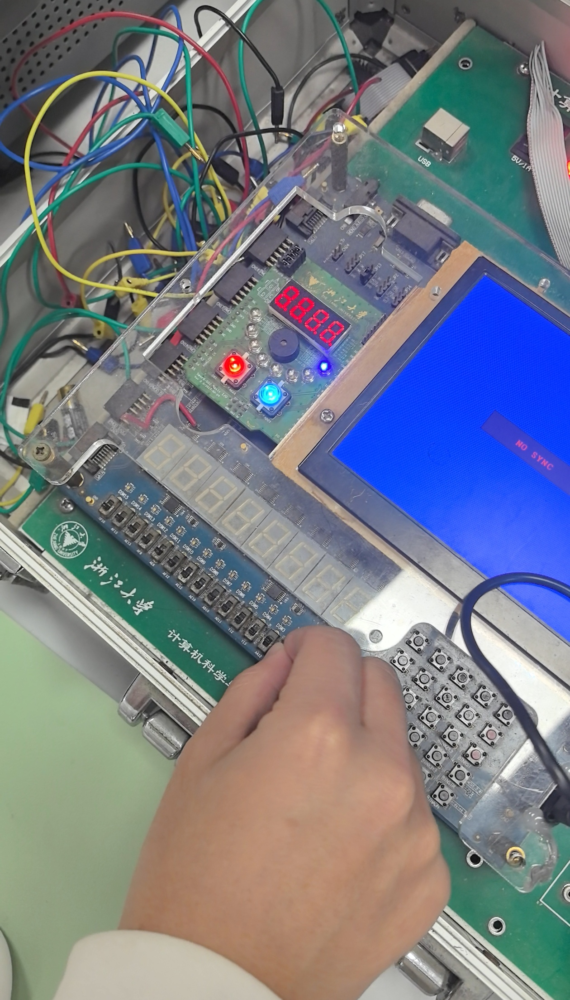

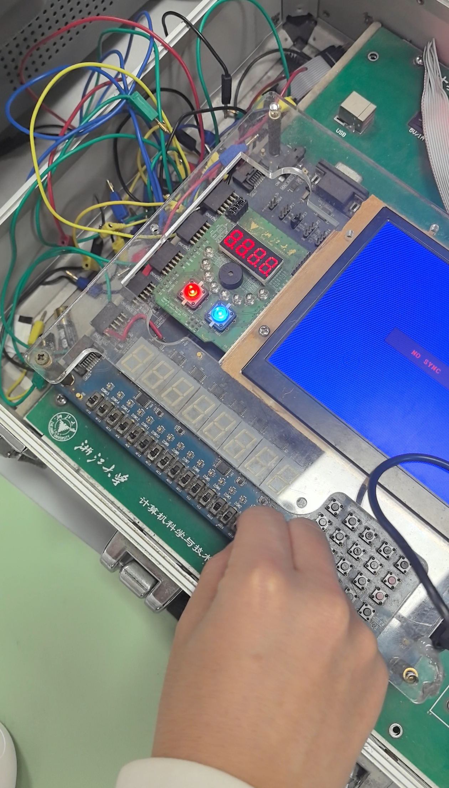

---
>这是延时较长的情况，S1、S2、S3 任一开关闭合后 LED 灯亮，所有开关断开后 LED 灯并不会立即熄灭，而是延时约 $2$s 熄灭。

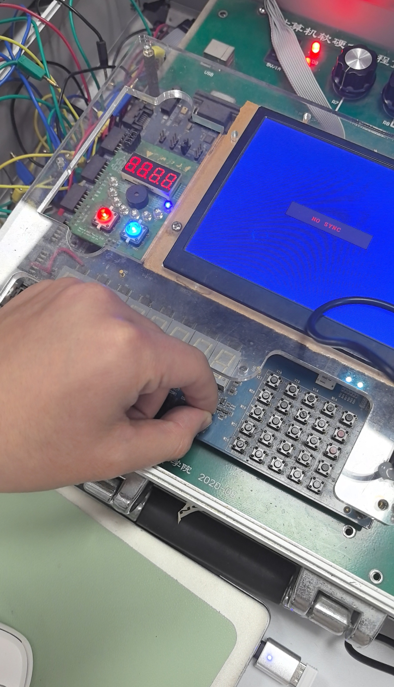

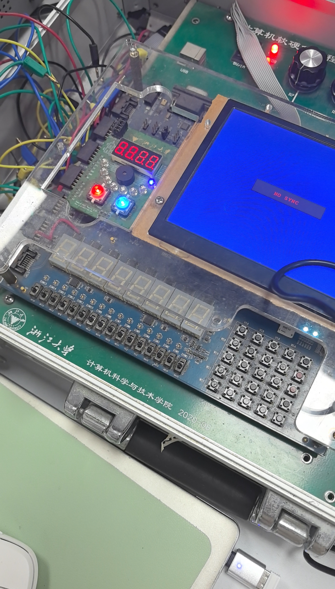


---
### 四、实验结果分析

- **Digital** 原理图仿真分析中，正确地连接了电路后，通过数据图组件进行实时的仿真，并通过手动改变输入值，得到输出波形，并在 **Vivado** 中进行仿真时得到了完全一样的波形，最后在下板子硬件验证的过程中确实做到了奇数个 $1$ 输入则灯亮，反之灯灭的情况。
|S1|S2|S3|F(理论)|F(Digital仿真)|F(Vivado仿真)|
|:---:|:---:|:---:|:---:|:---:|:---:|
|$0$|$0$|$0$|$0$|$0$|$0$|
|$0$|$0$|$1$|$1$|$1$|$1$|
|$0$|$1$|$0$|$1$|$1$|$1$|
|$0$|$1$|$1$|$0$|$0$|$0$|
|$1$|$0$|$0$|$1$|$1$|$1$|
|$1$|$0$|$1$|$0$|$0$|$0$|
|$1$|$1$|$0$|$0$|$0$|$0$|
|$1$|$1$|$1$|$1$|$1$|$1$|

- 由于 $8$ 位计数器延时过短导致肉眼几乎不可见，因此改为 $28$ 位，理论延时约为 $2.684$s。在 S1、S2、S3 任一输入为 $1$ 时，**Vivado** 仿真的波形图上都显示 F 的输出值为 $1$，输入变为 $0$ 且隔一段时间的延迟后 F 的输出值变为 $0$。而在硬件验证中，在 S1、S2、S3 任一开关闭合时，LED 灯立即亮起，这表明任一输入为 $1$ 时输出都是 $1$，而在任一开关断开后，LED 灯需要经过一段时间才会熄灭。在该过程中，输入为 $1$ 时计时器清零，输入为 $0$ 时计时器开始计时，在板子上（硬件上）表现为 LED 灯延时熄灭。经过实验，每次延时时间稳定，行为一致。

|S1(先闭合后立即断开)|S2(先闭合后立即断开)|S3(先闭合后立即断开)|F(立即)|F(一小段时间后)|F(最终)|
|:---:|:---:|:---:|:---:|:---:|:---:|
|$1$|$0$|$0$|$1$|$1$|$0$|
|$0$|$1$|$0$|$1$|$1$|$0$|
|$0$|$0$|$1$|$1$|$1$|$0$|

---

### 五、讨论与心得

- 在 **Digital** 绘制电路图的过程中，对与门或门的输入端口和输出端口个数并没有注意调整，导致一直报错。另外在尝试运行该应用时发现 **Windows** 依旧需要下载 **Java**，这是一个较细节的疏忽。
- 在仿真实验中， 意外出现了高阻的现象（表现为输入出现X、Z这样的标识），最后反思总结原因为没有保存写入的仿真代码以及其他文件，导致 **Vivado** 没有按照我写的代码和文件去执行命令，这是一个需要时刻注意的点。
- 在下板子进行硬件测试的过程中，出现了两次没有延时的情况，导致同样的程序跑了三次，反思结果是在代码写入时可能出现了错误，抑或是复制粘贴时位置不对/出现了复制粘贴时的疏漏，下一次实验必须注意。
- 下板子进行实验验证后，回头再进行仿真进行验收时出现了些许的偏差，但是下板子之前确实是完全正确的（助教一直看着），查阅资料后我更倾向于归因于综合后生成了门级网表，回来跑仿真时可能选成了综合后仿真/布局布线后仿真，有门延迟、走线延迟、触发器延迟等等，就不是原来的 RTL 行为级仿真了。据观察，其实依旧有延迟，只是 S1、S2、S3 变化间隔太短，加上真实电路的延迟，就导致 F 的输出还没来得及归零就又一次变成 $1$ 了，实际上是合理的情况（具体图片没保存，但助教分析后认为合理，遂验收通过）。这样看来，只要 S1、S2、S3 变化间隔调整一下，依旧可以呈现应有的波形。
- 最后，我与杨海涛同学的实验合作依旧顺利，连接板子用的是我的电脑，我负责对实验进行拍照记录，杨海涛负责拨动开关，配合默契，本次实验完全成功，也在下课之前提前完成了任务。

---

.png)
