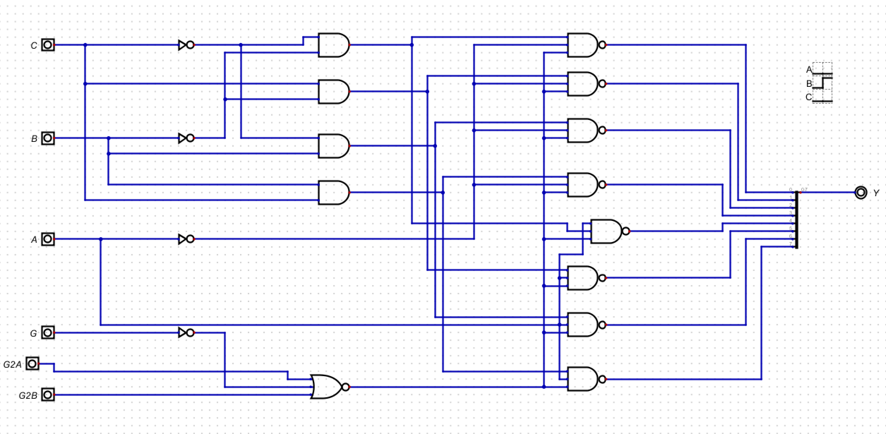
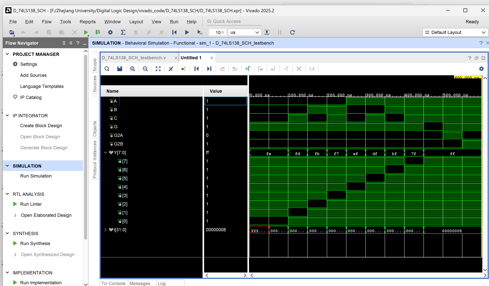
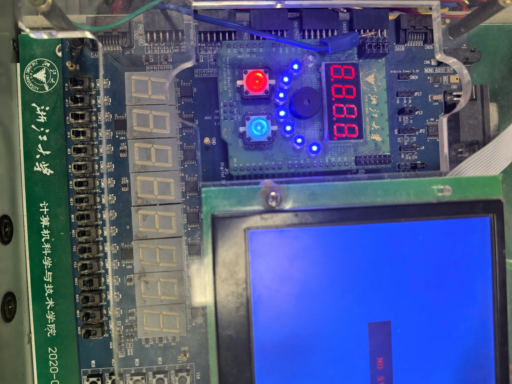
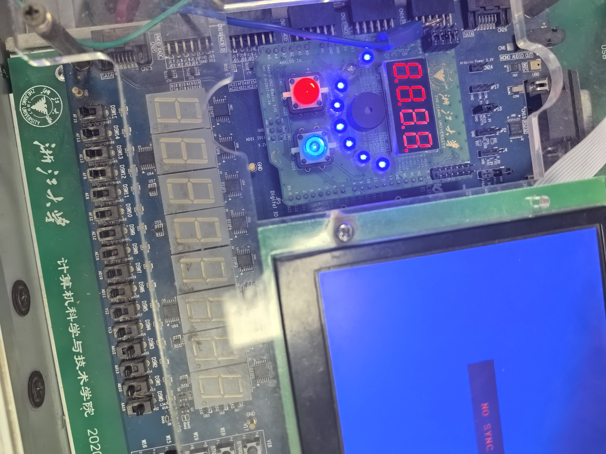
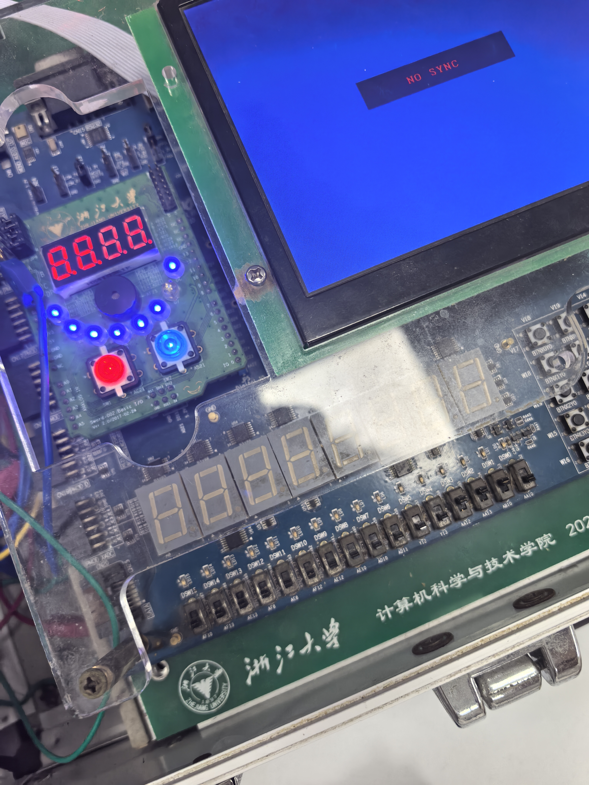
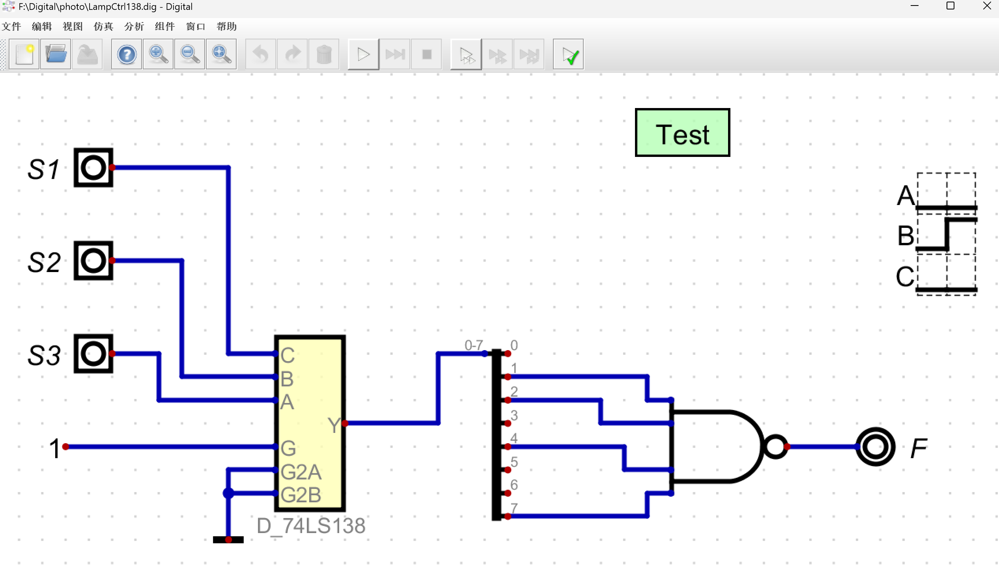
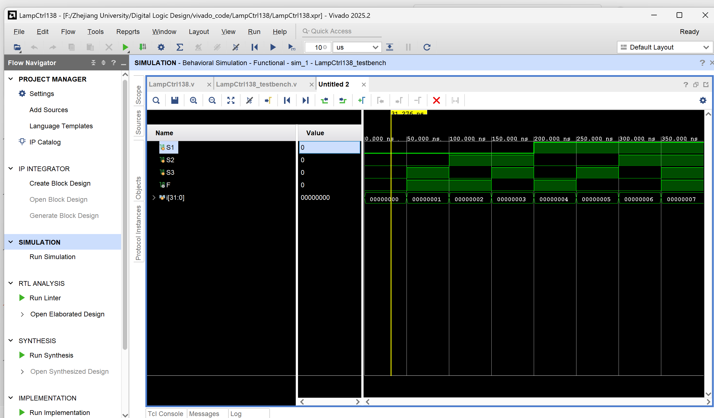
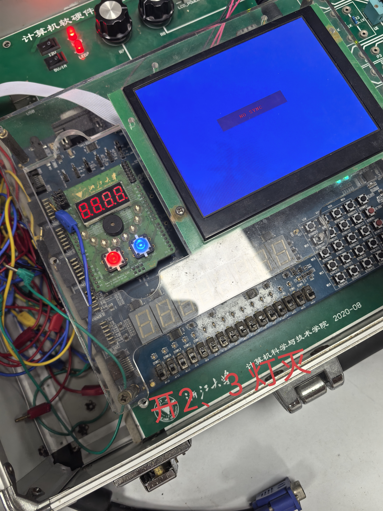
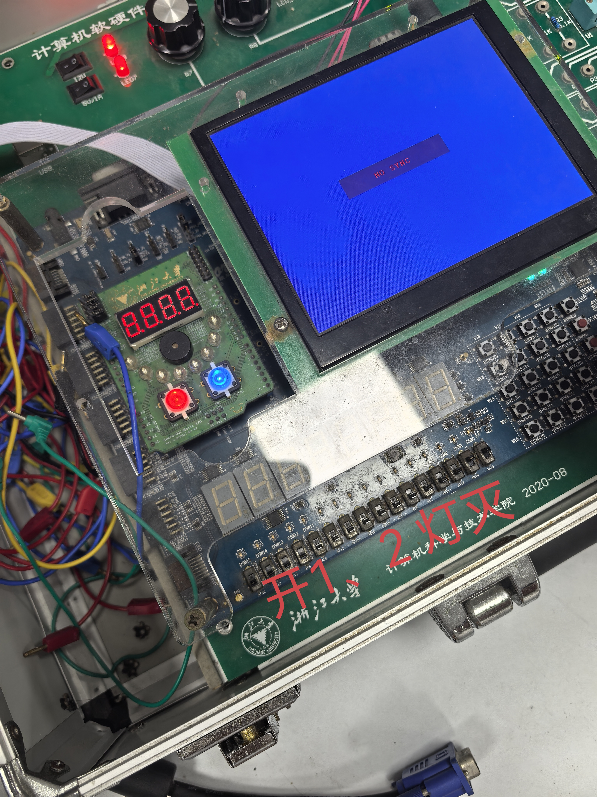

# <center>本科实验报告</center>
## <center>课程名称：<u>数字逻辑设计</u></center>
## <center>姓名：<u>邓欢桐</u></center>
## <center>学院：<u>计算机科学与技术学院</u></center>
## <center>系：<u>混合班</u></center>
## <center>专业：<u>计算机科学与技术</u><center>
## <center>学号：<u>3250102223</u></center>
## <center>指导教师：<u>董亚波</u></center>
<center>2026年3月30日</center>

### <center>浙江大学实验报告</center>
#### 课程名称：<u>数字逻辑设计</u> 实验类型：<u>综合</u>       
#### 实验项目名称：<u>变量译码器设计与应用</u>
#### 学生姓名：<u>邓欢桐</u> 专业：<u>混合班</u> 学号：<u>3250102223</u>
#### 同组学生姓名：<u>杨海涛</u> 指导老师：<u>董亚波</u>     
#### 实验地点：<u>东4-509</u> 实验日期：<u>2026</u>年<u>3</u>月<u>30</u>日

### 一、实验目的和要求

#### 目的

- 掌握变量译码器的的逻辑构成和逻辑功能；
- 用变量译码器实现组合函数；
- 采用原理图设计电路模块；
- 进一步熟悉 Vivado 平台及下载实验平台物理验证。

#### 要求

- 设计并实现 74LS138 译码器模块，完成功能仿真与硬件验证。
- 利用该译码器实现楼道灯控制逻辑，功能与实验四任务 $1$ 保持一致。
- 记录仿真波形、硬件测试结果，并撰写完整的实验报告。

---

### 二、实验内容和原理

#### 内容：
- **任务1： 设计 74LS138 译码器模块**
   - 原理图设计：在Digital中绘制74LS138的逻辑电路，包括输入引脚（A、B、C、G、G2A、G2B）与输出引脚（Y[7:0]），保存为D_74LS138模块。
   - 仿真验证：在Digital中设计测试用例，验证译码器的使能控制与输出逻辑，记录仿真结果。
   - 代码导出：将原理图导出为Verilog文件，学习其结构描述方式。
   - Vivado 仿真：新建工程，编写测试激励，观察波形图，验证输出是否与功能表一致。
   - 硬件验证：编写约束文件，将输入输出映射到SWORD开发板的拨动开关与LED，生成比特流并下载，测试模块功能。

---

- **任务2： 使用 74LS138 实现楼道灯控制器**
   - 块调用：在Digital中调用任务1中生成的D_74LS138模块，使用分裂器/合并器处理总线信号。
   - 逻辑实现：利用一个四输入与非门，结合译码器输出（低电平有效），实现楼道灯控制逻辑。
   - 仿真验证：导出LampCtrl138.v文件，在Vivado中进行仿真，波形结果应与实验四任务1一致。
   - 硬件验证：新建工程，添加约束文件，下载到开发板，使用三个拨动开关控制一个LED的亮灭，验证功能正确性。

---

#### 原理：

- 变量译码器：将 $n$ 位输入转换为 $2^n$ 个最小项输出，如 3-8 译码器（74LS138）。
- 74LS138 结构：三个使能端（G、G2A、G2B），输出低电平有效，内部由三级门电路构成。
- 楼道灯控制逻辑：通过译码器输出最小项，结合与非门实现组合逻辑函数，符合实验四任务 $1$ 的功能要求。

---

### 三、实验过程和数据记录

#### 任务1： 设计 74LS138 译码器模块


- 原理图如下：



*括输入引脚（A、B、C、G、G2A、G2B）与输出引脚（Y[7:0]）,符合要求。*

- Verilog代码如下：

>Digital原理图导出的Verilog HDL文件 D_74LS138.v

```verilog
/*
 * Generated by Digital. Don't modify this file!
 * Any changes will be lost if this file is regenerated.
 */

module D_74LS138 (
  input C,
  input B,
  input A,
  input G,
  input G2A,
  input G2B,
  output [7:0] Y
);
  wire s0;
  wire s1;
  wire s2;
  wire s3;
  wire s4;
  wire s5;
  wire s6;
  wire s7;
  assign s0 = ~ C;
  assign s1 = ~ B;
  assign s2 = ~ A;
  assign s6 = (B & C);
  assign s7 = ~ (G2A | ~ G | G2B);
  assign s3 = (s0 & s1);
  assign s4 = (C & s1);
  assign s5 = (s0 & B);
  assign Y[0] = ~ (s3 & s2 & s7);
  assign Y[1] = ~ (s4 & s2 & s7);
  assign Y[2] = ~ (s5 & s2 & s7);
  assign Y[3] = ~ (s6 & s2 & s7);
  assign Y[4] = ~ (A & s3 & s7);
  assign Y[5] = ~ (s4 & A & s7);
  assign Y[6] = ~ (s5 & A & s7);
  assign Y[7] = ~ (s6 & A & s7);
endmodule
```

>仿真文件（含激励）D_74LS138_SCH_testbench.v

```verilog
`timescale 1ns / 1ps

module D_74LS138_SCH_testbench();

    reg A, B, C, G, G2A, G2B;
    wire [7:0] Y;
    
    D_74LS138 uut (
        .A(A), .B(B), .C(C),
        .G(G), .G2A(G2A), .G2B(G2B),
        .Y(Y)
    );
    
    integer i;
    initial begin
        A = 0; B = 0; C = 0;
        G = 1; G2A = 0; G2B = 0;
        #50;
        
        for (i=0; i<=7; i=i+1) begin
            {A,B,C} = i;
            #50;
        end
        
        G = 0; G2A = 0; G2B = 0;
        #50;
        
        G = 1; G2A = 1; G2B = 0;
        #50;
        
        G = 1; G2A = 0; G2B = 1;
        #50;
        
        $finish;
    end

endmodule

```

>顶层测试文件 D_74LS138_Test.v

```verilog
module D_74LS138_Test(
    input S1,
    input S2,
    input S3,
    input S4,
    input S5,
    input S6,
    output [7:0] LED
    );
    
    D_74LS138 D1 (
    .A(S3),
    .B(S2),
    .C(S1),
    .G(S4),
    .G2A(S5),
    .G2B(S6),
    .Y(LED)
    );    
endmodule
```

>编写约束文件 K7.xdc

```tcl
set_property PACKAGE_PIN AA10 [get_ports {S1}]
set_property IOSTANDARD LVCMOS15 [get_ports {S1}]
set_property PACKAGE_PIN AB10 [get_ports {S2}]
set_property IOSTANDARD LVCMOS15 [get_ports {S2}]
set_property PACKAGE_PIN AA13 [get_ports {S3}]
set_property IOSTANDARD LVCMOS15 [get_ports {S3}]
set_property PACKAGE_PIN AA12 [get_ports {S4}]
set_property IOSTANDARD LVCMOS15 [get_ports {S4}]
set_property PACKAGE_PIN Y13 [get_ports {S5}]
set_property IOSTANDARD LVCMOS15 [get_ports {S5}]
set_property PACKAGE_PIN Y12 [get_ports {S6}]
set_property IOSTANDARD LVCMOS15 [get_ports {S6}]
set_property PACKAGE_PIN W23 [get_ports {LED[0]}]
set_property IOSTANDARD LVCMOS33 [get_ports {LED[0]}]
set_property PACKAGE_PIN AB26 [get_ports {LED[1]}]
set_property IOSTANDARD LVCMOS33 [get_ports {LED[1]}]
set_property PACKAGE_PIN Y25 [get_ports {LED[2]}]
set_property IOSTANDARD LVCMOS33 [get_ports {LED[2]}]
set_property PACKAGE_PIN AA23 [get_ports {LED[3]}]
set_property IOSTANDARD LVCMOS33 [get_ports {LED[3]}]
set_property PACKAGE_PIN Y23 [get_ports {LED[4]}]
set_property IOSTANDARD LVCMOS33 [get_ports {LED[4]}]
set_property PACKAGE_PIN Y22 [get_ports {LED[5]}]
set_property IOSTANDARD LVCMOS33 [get_ports {LED[5]}]
set_property PACKAGE_PIN AE21 [get_ports {LED[6]}]
set_property IOSTANDARD LVCMOS33 [get_ports {LED[6]}]
set_property PACKAGE_PIN AF24 [get_ports {LED[7]}]
set_property IOSTANDARD LVCMOS33 [get_ports {LED[7]}]
```

- 仿真验证，Vivado仿真图如下：



*与PPT上的标准原理图完全一致，证明实验正确。*

- 下载到开发板上进行验证：



---



---


---


---


---



---


---


---

- **分析**
   - 由上图可以知道，原理图正确，Verilog代码正确，约束文件正确，仿真波形正确，最终得到的结果也是正确的；
   - 拨动开关，使能端有效时，对于不同的开关，会有不同的LED灯灭掉，其余亮起；
   - 若使能端无效，则无论如何拨动开关，LED灯从头至尾全亮，不会有任何一盏熄灭；
   - 实验表明，对应开关上的AA12为1，Y13和Y12为0时，芯片正常工作，此时对应G=1、G2A=0、G2B=0，若不满足，则输出全为高电平，LED全亮；
   - 满足条件后，Y0~Y7按既有固定真值表输出低电平，开发板上表现为LED灯灭。

---

#### 任务2： 使用 74LS138 实现楼道灯控制器

- 原理图如下：



- Verilog代码如下：

>Digital原理图导出的Verilog HDL文件 D_74LS138.v

```verilog
/*
 * Generated by Digital. Don't modify this file!
 * Any changes will be lost if this file is regenerated.
 */

module D_74LS138 (
  input C,
  input B,
  input A,
  input G,
  input G2A,
  input G2B,
  output [7:0] Y
);
  wire s0;
  wire s1;
  wire s2;
  wire s3;
  wire s4;
  wire s5;
  wire s6;
  wire s7;
  assign s0 = ~ C;
  assign s1 = ~ B;
  assign s2 = ~ A;
  assign s6 = (B & C);
  assign s7 = ~ (G2A | ~ G | G2B);
  assign s3 = (s0 & s1);
  assign s4 = (C & s1);
  assign s5 = (s0 & B);
  assign Y[0] = ~ (s3 & s2 & s7);
  assign Y[1] = ~ (s4 & s2 & s7);
  assign Y[2] = ~ (s5 & s2 & s7);
  assign Y[3] = ~ (s6 & s2 & s7);
  assign Y[4] = ~ (A & s3 & s7);
  assign Y[5] = ~ (s4 & A & s7);
  assign Y[6] = ~ (s5 & A & s7);
  assign Y[7] = ~ (s6 & A & s7);
endmodule

module LampCtrl138 (
  input S1,
  input S2,
  input S3,
  output F
);
  wire [7:0] s0;
  D_74LS138 D_74LS138_i0 (
    .C( S1 ),
    .B( S2 ),
    .A( S3 ),
    .G( 1'b1 ),
    .G2A( 1'b0 ),
    .G2B( 1'b0 ),
    .Y( s0 )
  );
  assign F = ~ (s0[1] & s0[2] & s0[4] & s0[7]);
endmodule
```

>Digital原理图导出的Verilog HDL文件 LampCtrl138.v

```verilog
/*
 * Generated by Digital. Don't modify this file!
 * Any changes will be lost if this file is regenerated.
 */

module D_74LS138 (
  input C,
  input B,
  input A,
  input G,
  input G2A,
  input G2B,
  output [7:0] Y
);
  wire s0;
  wire s1;
  wire s2;
  wire s3;
  wire s4;
  wire s5;
  wire s6;
  wire s7;
  assign s0 = ~ C;
  assign s1 = ~ B;
  assign s2 = ~ A;
  assign s6 = (B & C);
  assign s7 = ~ (G2A | ~ G | G2B);
  assign s3 = (s0 & s1);
  assign s4 = (C & s1);
  assign s5 = (s0 & B);
  assign Y[0] = ~ (s3 & s2 & s7);
  assign Y[1] = ~ (s4 & s2 & s7);
  assign Y[2] = ~ (s5 & s2 & s7);
  assign Y[3] = ~ (s6 & s2 & s7);
  assign Y[4] = ~ (A & s3 & s7);
  assign Y[5] = ~ (s4 & A & s7);
  assign Y[6] = ~ (s5 & A & s7);
  assign Y[7] = ~ (s6 & A & s7);
endmodule

module LampCtrl138 (
  input S1,
  input S2,
  input S3,
  output F
);
  wire [7:0] s0;
  D_74LS138 D_74LS138_i0 (
    .C( S1 ),
    .B( S2 ),
    .A( S3 ),
    .G( 1'b1 ),
    .G2A( 1'b0 ),
    .G2B( 1'b0 ),
    .Y( s0 )
  );
  assign F = ~ (s0[1] & s0[2] & s0[4] & s0[7]);
endmodule
```

>仿真文件（含激励）LampCtrl138_testbench.v

```verilog
`timescale 1ns / 1ps

module LampCtrl138_testbench();

    reg S1, S2, S3;
    wire F;
    
    LampCtrl138 uut (
        .S1(S1), .S2(S2), .S3(S3),
        .F(F)
    );
    
    integer i;
    initial begin
        for (i = 0; i <= 7; i = i + 1) begin
            {S1, S2, S3} = i;
            #50;
        end
        $finish;
    end
```

>约束文件K7.xdc

```tcl
set_property PACKAGE_PIN AA10 [get_ports {S1}]
set_property IOSTANDARD LVCMOS15 [get_ports {S1}]
set_property PACKAGE_PIN AB10 [get_ports {S2}]
set_property IOSTANDARD LVCMOS15 [get_ports {S2}]
set_property PACKAGE_PIN AA13 [get_ports {S3}]
set_property IOSTANDARD LVCMOS15 [get_ports {S3}]
set_property PACKAGE_PIN AF24 [get_ports {F}]
set_property IOSTANDARD LVCMOS33 [get_ports {F}]
```

- Vivado仿真得到的波形图如下，与实验四的任务一几乎完全一样，证明了波形图和仿真实验的正确性：



---

- 下载验证，在开发板上进行实验：


---



---


---



---


*以上是实验过程中的真实图片，整个实验过程真实可靠*

---

- **分析**：
   - 与实验四一样，当三个输入端有奇数个输入为1时，得到的输出就为1，此时表现为LED灯亮，反之，若为偶数个输入为1，则输出为0，LED灯灭；
   - 对于仿真波形，同样和实验四一致，以及也和真值表一致，奇数1输入则得1输出，偶数1输入则得0输出，说明实验正确；
   - 与实验四不同的是，本实验采用了译码器加与非门的方法实现，两种方法结果相同但原理不完全一致：前者更倾向于底层逻辑的建构，后者更接近于“中规模集成电路+少量门电路”的设计思想，规模化程度高，设计简洁。

---

### 四、实验结果分析

- 任务一：
   - 找到G对应的开关是关键，下板子进行实操实验时，将G一直置1（高电平），G2A与G2B一直置0（低电平），译码器就处于工作状态，在Y0~Y7八条信号线中，有且仅有一条为低电平，其余均为高电平，地址和信号线编号对应，反映在开发板上就是LED灯亮与灭的区别，低电平则灭，高电平则亮；
   - 对于使能端，如果尝试其他组合，即非G=0，G2A=G2B=1的状态，无论地址如何变化，八条信号线均保持高电平，说明实验完全符合真值表；
   - 在实验前的准备阶段充分进行了Digital和Vivado的仿真实验，这也一定程度上为实验节约了时间，更好地把握可能随机出现的问题，事实证明没有发生错误。

- 任务二：
   - 仿真结果和实验四完全一致，即奇数1得1，偶数1得0，在开发板上输出为1则LED灯亮，输出为0则LED灯灭，手动验证000~111八种组合，在开发板上表现正确；
   - 连续快速拨动开关，发现灯的变化是及时的，几乎无延迟/抖动，说明电路工作稳定；
   - 本次任务对标实验四，但更像是实验四的进阶版，采用译码器加与非门实现，更具集成化，且减少了门电路，规模化程度变高，设计更加简洁，也更加符合现实需求。

---

### 五、讨论与心得

- 在任务一的Digital原理图绘制的过程中，寻找分裂器/合并器花了较长时间，本质上还是没有对Digital有足够的熟练度导致的；
- 以及，在最后的输出中，没有调整Y的位数，这里感谢助教wjb学长，周日下午一直被我带偏，最后还是他发现了这个问题；
- 在下板子验证的过程中其实没什么问题，只是，第一个座位的开发板似乎无法打开，导致两次下载验证都失败了，耗费了不少时间，下次需要及时求助/换机，及时止损；
- 本次实验让我有些理解了简单芯片的内部结构与原理，同时加深了对译码器的认识和理解，掌握了模块化设计思想，从底层理解了这些器件的逻辑原理，对后续的实验将很有帮助；
- 本次与杨海涛同学的合作依旧成功，两人配合默契，分别完成了仿真，最后一起进行下板子实验，依旧是他进行操作我拍照记录，最后实验也完全成功。

---


