# 
本科实验报告

## 
课程名称：<u>数字逻辑设计</u>

## 
姓名：<u>邓欢桐</u>

## 
学院：<u>计算机科学与技术学院</u>

## 
系：<u>混合班</u>

## 
专业：<u>计算机科学与技术</u>

## 
学号：<u>3250102223</u>

## 
指导教师：<u>董亚波</u>

2026年 月 日

### 
浙江大学实验报告

#### 课程名称：<u>数字逻辑设计</u> 实验类型：<u>综合</u>       
#### 实验项目名称：<u>基本开关电路</u>
#### 学生姓名：<u>邓欢桐</u> 专业：<u>混合班</u> 学号：<u>3250102223</u>
#### 同组学生姓名：<u>杨海涛</u> 指导老师：<u>董亚波</u>     
#### 实验地点：<u>东4-509</u> 实验日期：<u>2026</u>年<u>3</u>月<u>10</u>日

### 一、实验目的和要求
- 掌握逻辑开关电路的基本结构 
- 掌握二极管导通和截止的概念 
- 用二极管、三极管构成简单逻辑门电路 
- 掌握最简单的逻辑门电路构成

---
### 二、实验内容和原理
#### 内容：
- 利用二极管构建正逻辑“与门”电路，测试输入电压与输出电压的关系，验证逻辑功能 $F = A·B$。
- 利用二极管构建正逻辑“或门”电路，测量不同输入组合下的输出电压，验证逻辑功能 $F = A + B$。
- 使用万用表测量三极管极性，判断三极管类型（NPN或PNP）并确定其基极、集电极和发射极。
- 利用三极管构建正逻辑“非门”电路，测试输入与输出的反相关系。验证逻辑功能 $F = \bar{A}$。
- 利用多个晶体管构建正逻辑“与非门”电路，验证其逻辑功能是否为 $F = \overline{AB}$。

---
#### 原理：

- **二极管开关特性：**二极管具有单向导电性。当外加正向电压（阳极电压高于阴极约$0.7$V）时导通，呈现低阻状态，相当于开关闭合；外加反向电压时截止，呈现高阻状态，相当于开关断开。利用这一特性可构成基本逻辑门。
- **二极管与门：**电路中将多个二极管的阴极并联作为输出，阳极分别接输入，并通过电阻上拉到电源正极（$+5$V）。当任一输入为低电平时，对应二极管导通，输出被钳位在低电平（约$0.7$V）；只有所有输入均为高电平时，所有二极管截止，输出通过电阻上拉至$+5$V，实现“与”逻辑。
- **二极管或门：**电路中将多个二极管的阳极并联作为输出，阴极分别接输入，并通过电阻下拉到地。当任一输入为高电平时，对应二极管导通，输出被拉至高电平；只有所有输入均为低电平时，所有二极管截止，输出通过电阻接地，视为$0$V，实现“或”逻辑。
- **三极管开关特性：**NPN型三极管常在数组电路中作开关使用。在基极输入高电平时，三极管饱和导通，集电极与发射极之间近似于短路，电压接近$0$V，输出为低电平；当基极输入低电平时，三极管截止，集电极与发射极之间近似于开路，输出为高电平。这一反向的关系可以构成“非门”。
- **三极管非门：**电路中将三极管的基极通过电阻接输入，集电极通过电阻上拉到电源，发射极接地。当输入为高电平时，三极管饱和导通，输出为低电平；当输入为低电平时，三极管截止，输出为高电平。输入高则输出低，输出低则输入高，实现“非”逻辑。
- **晶体管与非门：**将二极管与门的输出连接到三极管非门的输入，即可构成与非门。当输入全为高电平时，与门输出高电平，使三极管导通，输出低电平；否则与门输出低电平，三极管截止，输出高电平，实现“与非”逻辑。

---
### 三、实验过程和数据记录
- 用二极管实现正逻辑“与门”
这里仅给出第一组数据的图片，完全对应。
|$V_A$|$V_B$|$V_F$|$F$ 逻辑值|
|:---:|:---:|:---:|:---:|
|$0.11$|$0.11$|$0.65$|$0$|
|$4.95$|$0.14$|$0.71$|$0$|
|$0.13$|$4.95$|$0.69$|$0$|
|$4.95$|$4.95$|$4.94$|$1$|

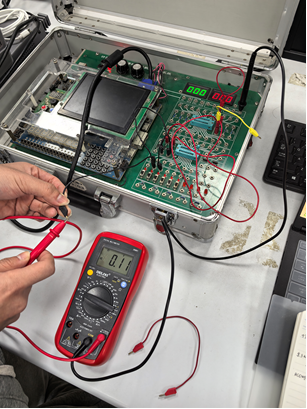

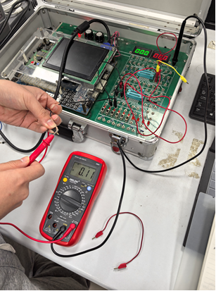

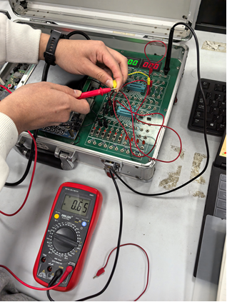

**测量数据表明：**当输入A和B均为低电平（约$0.11$V）时，输出为$0.65$V，对应逻辑$0$；当任一输入为低电平、另一为高电平时，输出约为$0.7$V，对应逻辑$0$；只有当两输入均为高电平（约$4.95$V）时，输出为$4.94$V，对应逻辑$1$。

---
- 用二极管实现正逻辑“或门”
以下为第二组数据的实验图片，与表格数据完全对应。
|$V_A$|$V_B$|$V_F$|$F$ 逻辑值|
|:---:|:---:|:---:|:---:|
|$0.08$|$0.09$|$0.00$|$0$|
|$3.47$|$0.09$|$2.93$|$1$|
|$0.09$|$3.47$|$2.92$|$1$|
|$4.05$|$4.06$|$3.53$|$1$|

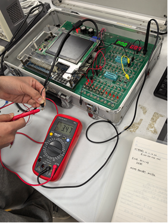

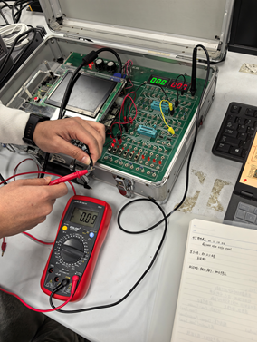

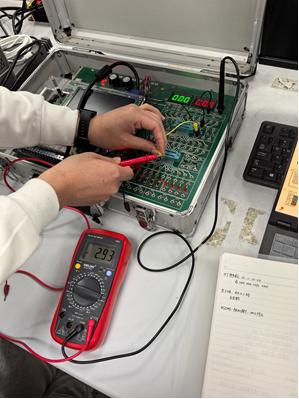

**测量数据表明：**当两输入均为低电平（$0.08$V、$0.09$V）时，输出为$0.00$V，逻辑$0$；当任一输入为高电平（如$3.47$V或$4.05$V）时，输出分别为$2.93$V和$3.53$V，对应逻辑$1$；当两输入均为高电平时，输出为$3.53$V，对应逻辑$1$。

---
- 三极管极性测量
- 测得三极管类型为NPN型，正向210，反向9。如图所示，实验图片证实了该结论的正确性和可靠性。

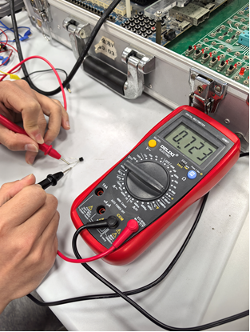

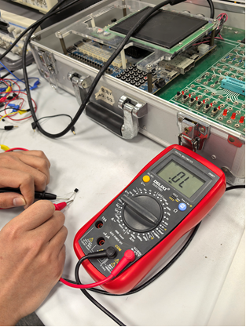

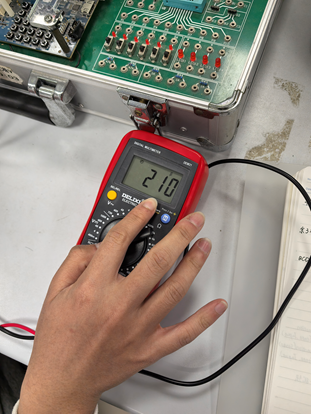

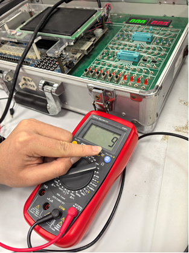

**测量数据表明：**红表笔接基极时导通，三极管正向电阻约$210$Ω，反向电阻约$9$Ω，表明该管为NPN型，且基极-发射极正向导通正常。

---
- 用三极管实现正逻辑“非门”
以第二组数据为例，如实验图片所示，表格数据完全正确。
|$V_A$ /V|$V_F$ /V|$F$ 逻辑值|
|:---:|:---:|:---:|
|$0.09$|$4.93$|$1$|
|$2.83$|$0.01$|$0$|

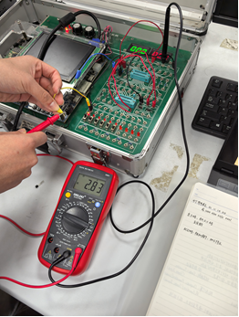

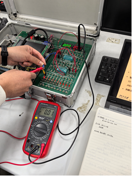

**测量数据表明：**当输入为低电平（$0.09$V）时，三极管截止，输出为高电平（$4.93$V），逻辑$1$；当输入为高电平（$2.83$V，尽管未到$5$ V，但已经高于三极管开启电压）时，三极管饱和导通，输出为低电平（$0.01$V），逻辑$0$。实现了反相功能。

---
- 用晶体管实现正逻辑“与非门”
如图所示，以第四组数据为例，与表格数据完全对应。
|$V_A$|$V_B$|$V_F$|$F$ 逻辑值|
|:---:|:---:|:---:|:---:|
|$0.09$|$0.09$|$4.79$|$1$|
|$4.92$|$0.10$|$4.64$|$1$|
|$0.09$|$4.93$|$4.68$|$1$|
|$4.93$|$4.93$|$1.09$|$0$|

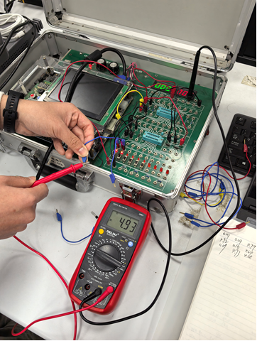

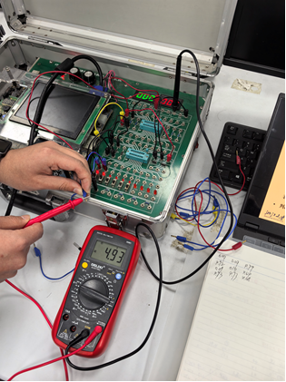

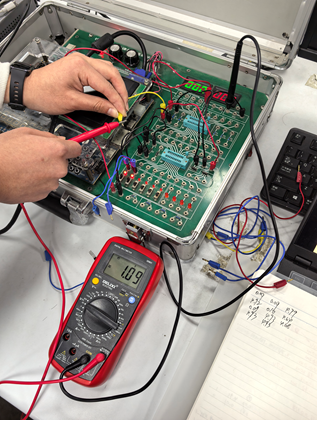

**测量数据表明：**当输入A、B均为低电平或任一为低电平时，输出均为高电平（$4.79$ V、$4.64$ V、$4.68$ V）；仅当两输入均为高电平（$4.93$ V）时，输出为低电平（$1.09$ V）。逻辑关系符合"与非门"。

---
### 四、实验结果分析
- 与门中，实验数据有效反映了“全为$1$就为$1$，有$0$则为$0$”的“与门”特色；另外在或门同样符合“有$1$为$1$，有$0$出$0$”的特点。与非门和或非门就是在与门和或门的最终结果上取反，看似是一个稍微复杂的组合逻辑电路，本质上还是来源于最基本的与门、或门、非门。
- 实测电压和$0$ V以及$5$ V存在一些差异，经过实验过后的分析和研究，发现这些差异背后的来源包括但不限于二极管正向压降（导通约有$0.7$ V的压降）、电阻的分压、三极管的饱和压降、以及输入电平时开关接触电阻、电源波动会导致输入电压略有变化，导致了输入电平的非理想性。
- 第三个实验检验三极管的类型以及确认引脚的实验十分有效，为后续两个实验做好了客观上的铺垫和保障。
- 本次实验使用的电阻值与电源电压配合适当，保证了二极管导通电流适中，三极管可在饱和与截止两个状态下较为容易地切换。
- 本次实验每个小实验都记录了多组数据，迫于排版和容量的客观条件，并没有把所有的数据全部放在本次实验报告中，但这些数据是绝对真实的。在真实的数据反映下，本次实验是成功的。

---
### 五、讨论与心得
- 本次实验深刻揭示了二极管、三极管的开关特性，并教会了实验者如何判断三极管的类型和确认三极管的引脚，以及在该过程中，组合逻辑电路得以实现，更好地加深了实验者对数字逻辑设计这门课程的理解。
- 本次实验过程中仍然存在一些偏差，比如二极管与门低电平输出约$0.65$ V，而不是$0$ V。偏差来源于电阻分压以及二极管压降等等，但都在可控的范围之内，这样的误差是完全可以接受的。因此，整个实验得出的结论是完全可靠的。
- 在与杨海涛同学合作的过程中，两人分工明确，一人接线一人记录数据，有条不紊。在实验遇到瓶颈时能够互相观察，提出自己的思考和想法，这样也促使了实验效率的提高。总而言之，本次实验合作十分顺利，当然，实验也是成功的。

---