# <center>本科实验报告</center>
## <center>课程名称：<u>数字逻辑设计</u></center>
## <center>姓名：<u>邓欢桐</u></center>
## <center>学院：<u>计算机科学与技术学院</u></center>
## <center>系：<u>混合班</u></center>
## <center>专业：<u>计算机科学与技术</u></center>
## <center>学号：<u>3250102223</u></center>
## <center>指导教师：<u>董亚波</u></center>
<center>2026年 月 日</center>

### <center>浙江大学实验报告</center>
#### 课程名称：<u>数字逻辑设计</u> 实验类型：<u>综合</u>       
#### 实验项目名称：<u></u>
#### 学生姓名：<u>邓欢桐</u> 专业：<u>混合班</u> 学号：<u>3250102223</u>
#### 同组学生姓名：<u>杨海涛</u> 指导老师：<u>董亚波</u>     
#### 实验地点：<u>东4-509</u> 实验日期：<u>2026</u>年<u> </u>月<u> </u>日

---

### 一、实验目的和要求

#### 目的：

- 深入理解**一位全加器**的工作原理、输入输出逻辑关系与电路实现方式，掌握其逻辑功能与 **Verilog** 代码编写。

- 掌握**多位串行进位加法器**的构成方法，理解进位传递机制与进位延迟特性。

- 掌握基于补码加法的**减法器实现原理**，理解加减法器共用加法器的设计思路。

- 掌握 **$4$ 位加减法器**的原理图设计与模块级联方法。

- 理解 **ALU（算术逻辑单元）** 的基本原理、在 **CPU** 中的核心作用，掌握 $4$ 位 **ALU** 的功能定义与设计方法。

- 熟练使用 **Xilinx Vivado** 与 **Digital** 软件完成电路设计、仿真、综合与下载验证。

---

#### 要求：

- 以**原理图方式**完成 $4$ 位加减法器与 $4$ 位 **ALU** 的设计，确保电路连接正确、功能完整。

- 编写对应 **Verilog** 代码，在 **Digital** 中完成仿真测试，覆盖加、减、与、或全部操作。

- 搭建 $4$ 位 **ALU** 完整应用工程，完成模块实例化、端口连接与按键去抖动处理。

- 将工程下载到 **SWORD** 开发板，通过按键与开关验证 **ALU** 功能，记录实验数据与波形。

- 完成实验报告，包含原理说明、设计过程、仿真波形、硬件验证结果与分析。


### 二、实验内容和原理
#### 内容：

- 设计 $1$ 位全加器，推导真值表与逻辑表达式，编写 **Verilog** 模块并绘制原理图。

- 基于 $1$ 位全加器级联构成 **$4$ 位串行进位加法器**，实现 $4$ 位二进制数加法。

- 利用补码原理设计 **$4$ 位加减法器**，通过控制信号实现加法与减法切换。

- 整合加法、减法、按位与、按位或功能，设计 **$4$ 位 ALU**，通过选择信号切换功能。

- 建立 `ALU` 应用工程，添加时钟分频、数码管显示、按键输入、按键去抖动模块。

- 在 **Vivado** 中完成行为仿真，下载到开发板验证，记录按键操作、开关控制与数码管显示结果。

---

#### 原理：

**1 位全加器**

- 输入：$A_i$、$B_i$（操作数）、$C_i$（低位进位）；输出：$S_i$（和）、$C_i+1$（进位输出）。
- 逻辑表达式：$Si=A_i⊕B_i⊕C_i$；$C_{i+1}=A_iB_i+A_iC_i+B_iC_i$。
- 由与门、异或门、或门构成，可封装为独立模块。

**4 位串行进位加法器**

- 将 $4$ 个 $1$ 位全加器级联，低位进位输出作为高位进位输入，最低位进位 $C_0=0$。
- 优点：结构简单；缺点：进位逐位传递，存在延迟。

**4 位加减法器**

- 减法通过 **补码加法** 实现：$A−B=A+(\sim B)+1$。
- 用控制信号 $Ctrl$ 控制：$Ctrl=0$ 做加法，$B$ 不变、$C_0=0$；$Ctrl=1$ 做减法，$B$ 按位取反、$C_0=1$。
- 每一位 $B$ 与 $Ctrl$ 异或实现取反，共用加法器硬件。

**4 位 ALU**

- 操作数：$4$ 位 $A$、$4$ 位 $B$；功能选择：`S [1:0]`。
- 功能定义：
  - $S=00：C=A+B$
  - $S=01：C=A−B$
  - $S=10：C=A$ $\&$ $B$
  - $S=11：C=A$ $|$ $B$
- 由 $4$ 位加减法器、$4$ 位与门、$4$ 位或门、$4$ 选 $1$ 多路选择器构成。

**按键去抖动**

- 按键机械抖动时长 $10 \sim 20ms$，用移位寄存器模块 `pbdebounce` 实现延时滤波，稳定后输出有效按键信号。

---

### 三、实验过程和数据记录

#### 1. 任务一

##### 1.1 $1$ 位加法器设计

>在 **Digital** 中绘制 $1$ 位全加器原理图：

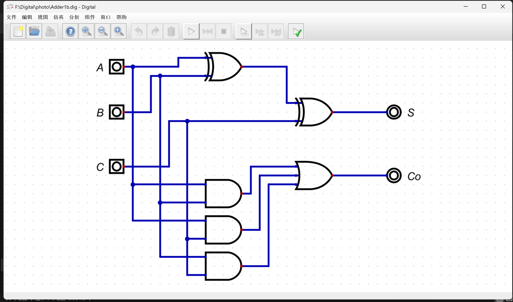

> 导出的 `Adder1b.v` 如下：

```verilog
/*
 * Generated by Digital. Don't modify this file!
 * Any changes will be lost if this file is regenerated.
 */

module Adder1b (
  input A,
  input B,
  input C,
  output S,
  output Co
);
  assign S = ((A ^ B) ^ C);
  assign Co = ((A & B) | (A & C) | (B & C));
endmodule
```

---

##### 1.2 $4$ 位加法器设计

> 在 **Digital** 中绘制 $4$ 位全加器原理图：

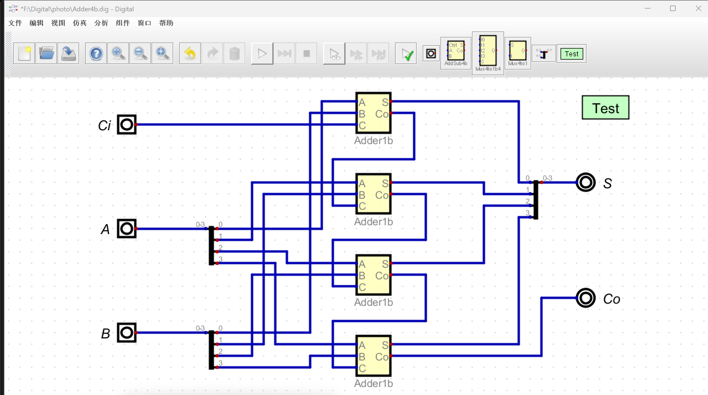

> 测试用例及波形如下：

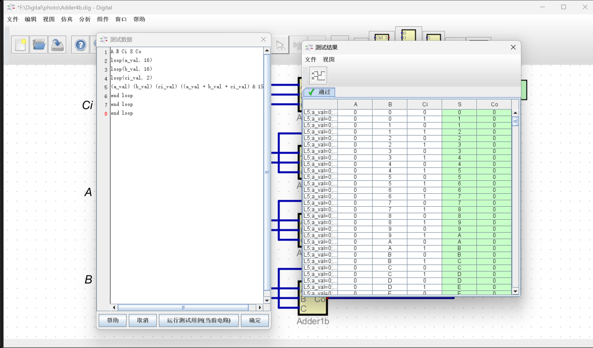

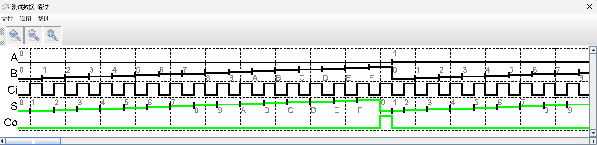

> 导出的 `Adder4b.v` 如下：

```verilog
/*
 * Generated by Digital. Don't modify this file!
 * Any changes will be lost if this file is regenerated.
 */

module Adder1b (
  input A,
  input B,
  input C,
  output S,
  output Co
);
  assign S = ((A ^ B) ^ C);
  assign Co = ((A & B) | (A & C) | (B & C));
endmodule

module Adder4b (
  input Ci,
  input [3:0] A,
  input [3:0] B,
  output [3:0] S,
  output Co
);
  wire s0;
  wire s1;
  wire s2;
  wire s3;
  wire s4;
  wire s5;
  wire s6;
  wire s7;
  wire s8;
  wire s9;
  wire s10;
  wire s11;
  wire s12;
  wire s13;
  wire s14;
  assign s0 = A[0];
  assign s4 = A[1];
  assign s8 = A[2];
  assign s12 = A[3];
  assign s1 = B[0];
  assign s5 = B[1];
  assign s9 = B[2];
  assign s13 = B[3];
  Adder1b Adder1b_i0 (
    .A( s0 ),
    .B( s1 ),
    .C( Ci ),
    .S( s2 ),
    .Co( s3 )
  );
  Adder1b Adder1b_i1 (
    .A( s4 ),
    .B( s5 ),
    .C( s3 ),
    .S( s6 ),
    .Co( s7 )
  );
  Adder1b Adder1b_i2 (
    .A( s8 ),
    .B( s9 ),
    .C( s7 ),
    .S( s10 ),
    .Co( s11 )
  );
  Adder1b Adder1b_i3 (
    .A( s12 ),
    .B( s13 ),
    .C( s11 ),
    .S( s14 ),
    .Co( Co )
  );
  assign S[0] = s2;
  assign S[1] = s6;
  assign S[2] = s10;
  assign S[3] = s14;
endmodule
```

---

##### 1.3 $1$ 位加减法器

> 在 **Digital** 中绘制 $1$ 位加减法器原理图：

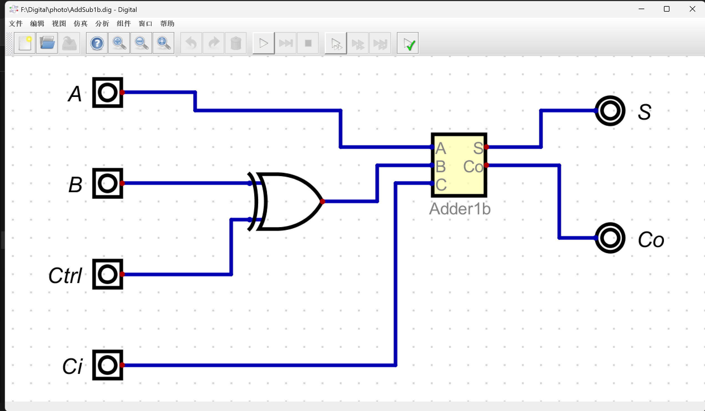

> 导出的 `AddSub1b.v` 如下：

```verilog
/*
 * Generated by Digital. Don't modify this file!
 * Any changes will be lost if this file is regenerated.
 */

module Adder1b (
  input A,
  input B,
  input C,
  output S,
  output Co
);
  assign S = ((A ^ B) ^ C);
  assign Co = ((A & B) | (A & C) | (B & C));
endmodule

module AddSub1b (
  input A,
  input B,
  input Ctrl,
  input Ci,
  output S,
  output Co
);
  wire s0;
  assign s0 = (B ^ Ctrl);
  Adder1b Adder1b_i0 (
    .A( A ),
    .B( s0 ),
    .C( Ci ),
    .S( S ),
    .Co( Co )
  );
endmodule
```

---

##### 1.4 $4$ 位加减法器

>在 **Digital** 中绘制 $4$ 位加减法器原理图：

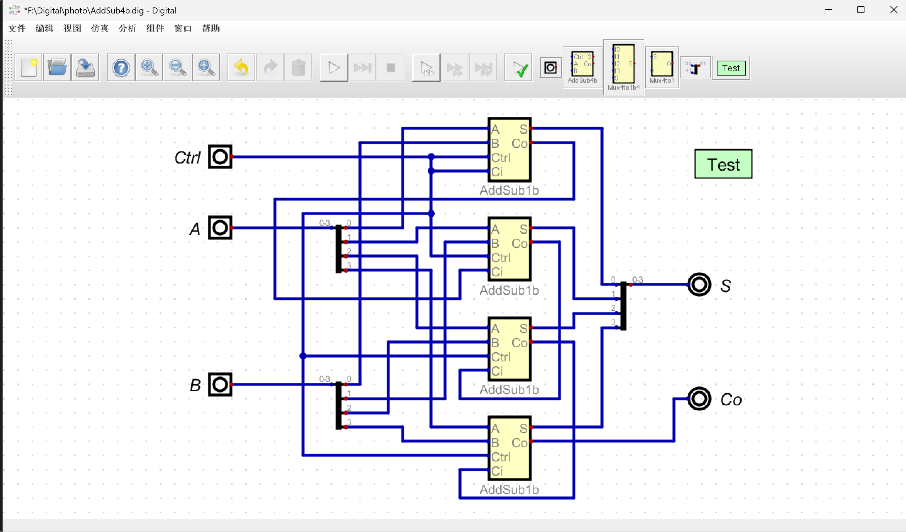

> 测试用例及波形如下：

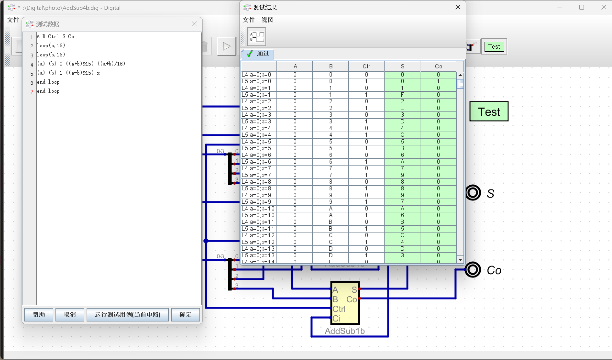

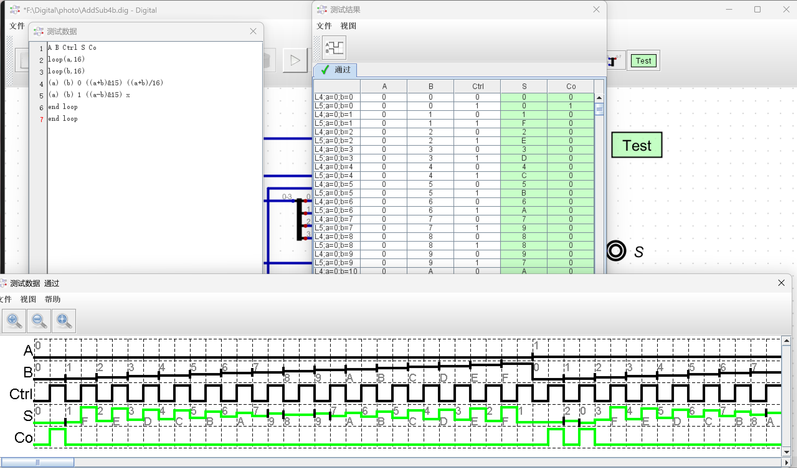

> 导出的 `AddSub4b.v` 如下：

```verilog
/*
 * Generated by Digital. Don't modify this file!
 * Any changes will be lost if this file is regenerated.
 */

module Adder1b (
  input A,
  input B,
  input C,
  output S,
  output Co
);
  assign S = ((A ^ B) ^ C);
  assign Co = ((A & B) | (A & C) | (B & C));
endmodule

module AddSub1b (
  input A,
  input B,
  input Ctrl,
  input Ci,
  output S,
  output Co
);
  wire s0;
  assign s0 = (B ^ Ctrl);
  Adder1b Adder1b_i0 (
    .A( A ),
    .B( s0 ),
    .C( Ci ),
    .S( S ),
    .Co( Co )
  );
endmodule

module AddSub4b (
  input Ctrl,
  input [3:0] A,
  input [3:0] B,
  output [3:0] S,
  output Co
);
  wire s0;
  wire s1;
  wire s2;
  wire s3;
  wire s4;
  wire s5;
  wire s6;
  wire s7;
  wire s8;
  wire s9;
  wire s10;
  wire s11;
  wire s12;
  wire s13;
  wire s14;
  assign s0 = A[0];
  assign s1 = A[1];
  assign s2 = A[2];
  assign s3 = A[3];
  assign s4 = B[0];
  assign s5 = B[1];
  assign s6 = B[2];
  assign s7 = B[3];
  AddSub1b AddSub1b_i0 (
    .A( s0 ),
    .B( s4 ),
    .Ctrl( Ctrl ),
    .Ci( Ctrl ),
    .S( s8 ),
    .Co( s9 )
  );
  AddSub1b AddSub1b_i1 (
    .A( s1 ),
    .B( s5 ),
    .Ctrl( Ctrl ),
    .Ci( s9 ),
    .S( s10 ),
    .Co( s11 )
  );
  AddSub1b AddSub1b_i2 (
    .A( s2 ),
    .B( s6 ),
    .Ctrl( Ctrl ),
    .Ci( s11 ),
    .S( s12 ),
    .Co( s13 )
  );
  AddSub1b AddSub1b_i3 (
    .A( s3 ),
    .B( s7 ),
    .Ctrl( Ctrl ),
    .Ci( s13 ),
    .S( s14 ),
    .Co( Co )
  );
  assign S[0] = s8;
  assign S[1] = s10;
  assign S[2] = s12;
  assign S[3] = s14;
endmodule
```

---

##### 1.5 $4$ 位ALU

> 在 **Digital** 中绘制 $4$ 位 `ALU` 原理图：

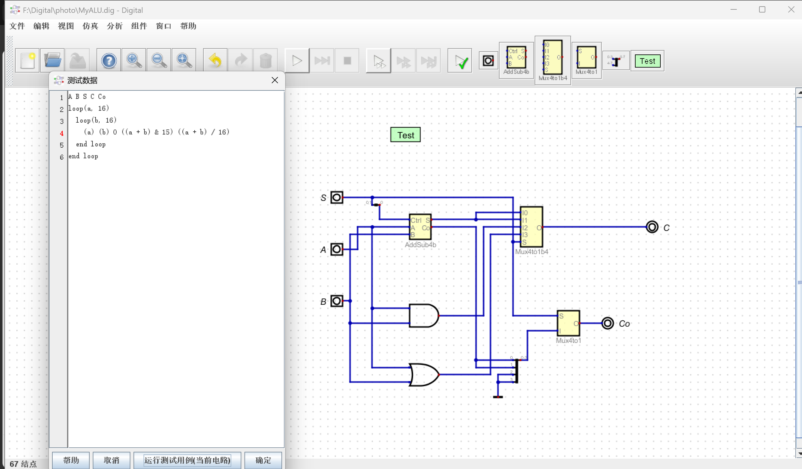

> 测试用例及波形如下：

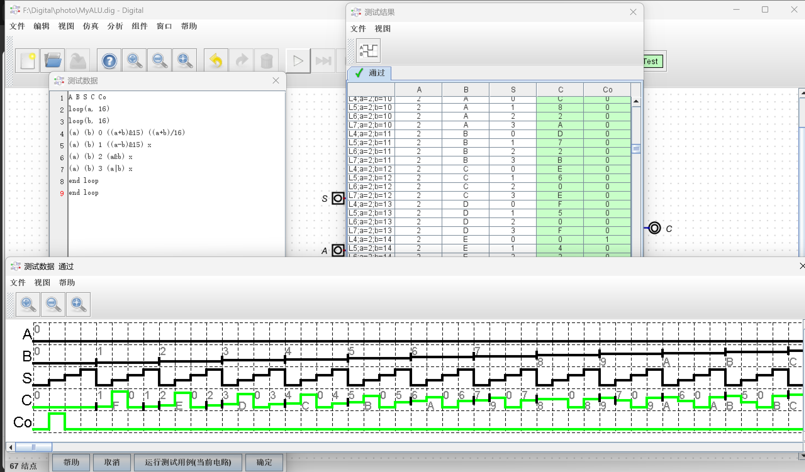

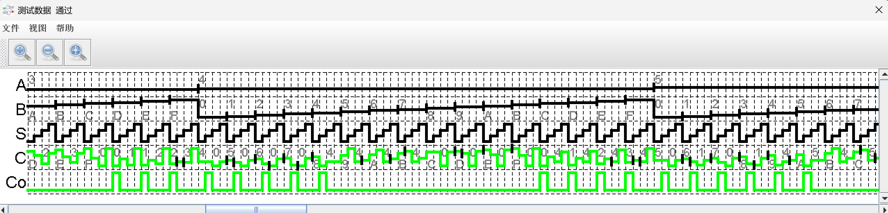

该波形为 **Digital** 软件中对 **4 位 ALU 核心模块**的功能仿真波形，用于单独验证 **ALU** 的算术运算与逻辑运算功能，是核心逻辑的单元测试。下面仅对第二张图片的波形进行分析，第一张图片禁用来表示仿真的正确性。

- **A**：$4$ 位操作数 $A$
  - 波形中数值依次变化：$3 → 4 → 5$，作为 **ALU** 第一组运算输入。
- **B**：$4$ 位操作数 $B$
  - 数值从 $0$ 开始递增遍历：$0→1→2→…→F→0→1→…→7$，覆盖全部 $4$ 位二进制数，用于全面测试运算正确性。
- **S**：**ALU** 功能选择信号
  周期性方波变化，自动切换 4 种运算模式：
  - $S=00$：$A + B$
  - $S=01$：$A - B$
  - $S=10$：$A$ $\&$ $B$（按位与）
  - $S=11$：$A$ $|$ $B$（按位或）
- **C**：**ALU** 运算结果输出
  波形数值与理论计算完全一致：
  - 加法：$A=3$、$B=1$，$C=4$
  - 减法：$A=4$、$B=1$，$C=3$
  - 与运算：$A=3(0011)$、$B=1(0001)$，$C=1$
  - 或运算：$A=3(0011)$、$B=1(0001)$，$C=3$
- **Co**：进位/借位标志输出
  - 加法时：$Co=1$ 表示产生进位；
  - 减法时：$Co=1$ 表示无借位（结果非负），$Co=0$ 表示有借位；
  - 波形中标志位输出完全符合运算规则。

$4$ 位 **ALU** 核心逻辑功能完全正确，加、减、与、或运算结果无误，进位/借位信号正常，模块设计符合实验要求。


---

#### 2. 任务二

##### 2.1 新建工程 `MyALU`

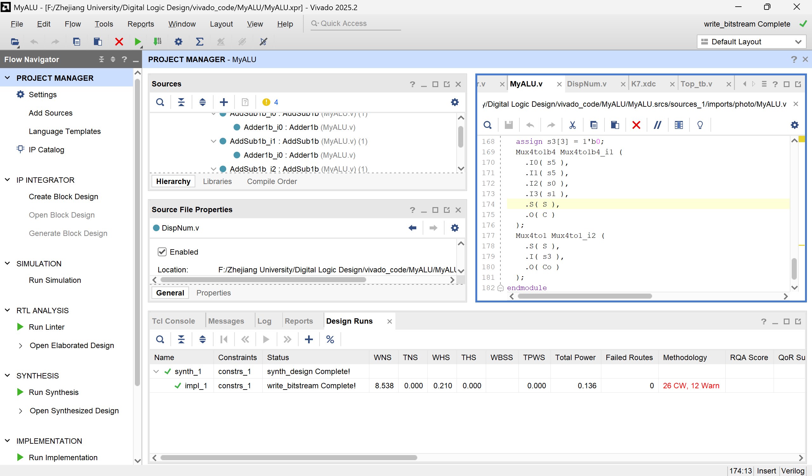

---

##### 2.2 **添加源文件**

> `MyALU.v`

```verilog
/*
 * Generated by Digital. Don't modify this file!
 * Any changes will be lost if this file is regenerated.
 */

module Adder1b (
  input A,
  input B,
  input C,
  output S,
  output Co
);
  assign S = ((A ^ B) ^ C);
  assign Co = ((A & B) | (A & C) | (B & C));
endmodule

module AddSub1b (
  input A,
  input B,
  input Ctrl,
  input Ci,
  output S,
  output Co
);
  wire s0;
  assign s0 = (B ^ Ctrl);
  Adder1b Adder1b_i0 (
    .A( A ),
    .B( s0 ),
    .C( Ci ),
    .S( S ),
    .Co( Co )
  );
endmodule

module AddSub4b (
  input Ctrl,
  input [3:0] A,
  input [3:0] B,
  output [3:0] S,
  output Co
);
  wire s0;
  wire s1;
  wire s2;
  wire s3;
  wire s4;
  wire s5;
  wire s6;
  wire s7;
  wire s8;
  wire s9;
  wire s10;
  wire s11;
  wire s12;
  wire s13;
  wire s14;
  assign s0 = A[0];
  assign s1 = A[1];
  assign s2 = A[2];
  assign s3 = A[3];
  assign s4 = B[0];
  assign s5 = B[1];
  assign s6 = B[2];
  assign s7 = B[3];
  AddSub1b AddSub1b_i0 (
    .A( s0 ),
    .B( s4 ),
    .Ctrl( Ctrl ),
    .Ci( Ctrl ),
    .S( s8 ),
    .Co( s9 )
  );
  AddSub1b AddSub1b_i1 (
    .A( s1 ),
    .B( s5 ),
    .Ctrl( Ctrl ),
    .Ci( s9 ),
    .S( s10 ),
    .Co( s11 )
  );
  AddSub1b AddSub1b_i2 (
    .A( s2 ),
    .B( s6 ),
    .Ctrl( Ctrl ),
    .Ci( s11 ),
    .S( s12 ),
    .Co( s13 )
  );
  AddSub1b AddSub1b_i3 (
    .A( s3 ),
    .B( s7 ),
    .Ctrl( Ctrl ),
    .Ci( s13 ),
    .S( s14 ),
    .Co( Co )
  );
  assign S[0] = s8;
  assign S[1] = s10;
  assign S[2] = s12;
  assign S[3] = s14;
endmodule

module Mux4to1b4 (
  input [3:0] I0,
  input [3:0] I1,
  input [3:0] I2,
  input [3:0] I3,
  input [1:0] S,
  output [3:0] O
);
  wire s0;
  wire s1;
  wire s2;
  wire s3;
  wire s4;
  wire s5;
  wire s6;
  wire s7;
  assign s3 = S[0];
  assign s5 = S[1];
  assign s7 = (s5 & s3);
  assign s0 = ~ s3;
  assign s1 = ~ s5;
  assign s2 = (s0 & s1);
  assign s4 = (s3 & s1);
  assign s6 = (s0 & s5);
  assign O[0] = ((s2 & I0[0]) | (s4 & I1[0]) | (s6 & I2[0]) | (s7 & I3[0]));
  assign O[1] = ((s2 & I0[1]) | (s4 & I1[1]) | (s6 & I2[1]) | (s7 & I3[1]));
  assign O[2] = ((s2 & I0[2]) | (s4 & I1[2]) | (s6 & I2[2]) | (s7 & I3[2]));
  assign O[3] = ((s2 & I0[3]) | (s4 & I1[3]) | (s6 & I2[3]) | (s7 & I3[3]));
endmodule

module Mux4to1 (
  input [1:0] S,
  input [3:0] I,
  output O
);
  assign O = (((~ S[0] & ~ S[1]) & I[0]) | ((S[0] & ~ S[1]) & I[1]) | ((~ S[0] & S[1]) & I[2]) | ((S[1] & S[0]) & I[3]));
endmodule

module MyALU (
  input [1:0] S,
  input [3:0] A,
  input [3:0] B,
  output Co,
  output [3:0] C
);
  wire [3:0] s0;
  wire [3:0] s1;
  wire s2;
  wire [3:0] s3;
  wire s4;
  wire [3:0] s5;
  assign s0 = (A & B);
  assign s1 = (A | B);
  assign s4 = S[0];
  AddSub4b AddSub4b_i0 (
    .Ctrl( s4 ),
    .A( A ),
    .B( B ),
    .S( s5 ),
    .Co( s2 )
  );
  assign s3[0] = s2;
  assign s3[1] = s2;
  assign s3[2] = 1'b0;
  assign s3[3] = 1'b0;
  Mux4to1b4 Mux4to1b4_i1 (
    .I0( s5 ),
    .I1( s5 ),
    .I2( s0 ),
    .I3( s1 ),
    .S( S ),
    .O( C )
  );
  Mux4to1 Mux4to1_i2 (
    .S( S ),
    .I( s3 ),
    .O( Co )
  );
```

---

> `DispNum.v`

```verilog
/*
 * Generated by Digital. Don't modify this file!
 * Any changes will be lost if this file is regenerated.
 */

module Decoder2 (
    output out_0,
    output out_1,
    output out_2,
    output out_3,
    input [1:0] sel
);
    assign out_0 = (sel == 2'h0)? 1'b1 : 1'b0;
    assign out_1 = (sel == 2'h1)? 1'b1 : 1'b0;
    assign out_2 = (sel == 2'h2)? 1'b1 : 1'b0;
    assign out_3 = (sel == 2'h3)? 1'b1 : 1'b0;
endmodule


module Mux4to1 (
  input [1:0] S,
  input [3:0] I,
  output O
);
  assign O = (((~ S[0] & ~ S[1]) & I[0]) | ((S[0] & ~ S[1]) & I[1]) | ((~ S[0] & S[1]) & I[2]) | ((S[1] & S[0]) & I[3]));
endmodule

module Mu4to1b4 (
  input [1:0] S,
  input [3:0] I0,
  input [3:0] I1,
  input [3:0] I2,
  input [3:0] I3,
  output [3:0] O
);
  wire s0;
  wire s1;
  wire s2;
  wire s3;
  wire s4;
  wire s5;
  wire s6;
  wire s7;
  assign s0 = S[0];
  assign s1 = S[1];
  assign s2 = ~ s0;
  assign s3 = ~ s1;
  assign s7 = (s1 & s0);
  assign s4 = (s2 & s3);
  assign s5 = (s0 & s3);
  assign s6 = (s2 & s1);
  assign O[0] = ((s4 & I0[0]) | (s5 & I1[0]) | (s6 & I2[0]) | (s7 & I3[0]));
  assign O[1] = ((s4 & I0[1]) | (s5 & I1[1]) | (s6 & I2[1]) | (s7 & I3[1]));
  assign O[2] = ((s4 & I0[2]) | (s5 & I1[2]) | (s6 & I2[2]) | (s7 & I3[2]));
  assign O[3] = ((s4 & I0[3]) | (s5 & I1[3]) | (s6 & I2[3]) | (s7 & I3[3]));
endmodule

module MyMC14495 (
  input point,
  input LE,
  input D3,
  input D2,
  input D1,
  input D0,
  output g,
  output f,
  output e,
  output d,
  output c,
  output b,
  output a,
  output p
);
  wire s0;
  wire s1;
  wire s2;
  wire s3;
  assign p = ~ point;
  assign s2 = ~ D3;
  assign s1 = ~ D2;
  assign s0 = ~ D1;
  assign s3 = ~ D0;
  assign g = (((s3 & s0 & D2 & D3) | (D0 & D1 & D2 & s2) | (s0 & s1 & s2)) | LE);
  assign f = (((D0 & s0 & D2 & D3) | (D0 & D1 & s2) | (D1 & s1 & s2) | (D0 & s1 & s2)) | LE);
  assign e = (((D0 & s0 & s1) | (s0 & D2 & s2) | (D0 & s2)) | LE);
  assign d = (((s3 & D1 & s1 & D3) | (D0 & D1 & D2) | (s3 & s0 & D2 & s2) | (D0 & s0 & s1 & s2)) | LE);
  assign c = (((D1 & D2 & D3) | (s3 & D2 & D3) | (s3 & D1 & s1 & s2)) | LE);
  assign b = (((D0 & D1 & D3) | (s3 & D2 & D3) | (s3 & D1 & D2) | (D0 & s0 & D2 & s2)) | LE);
  assign a = (((D0 & s0 & D2 & D3) | (D0 & D1 & s1 & D3) | (s3 & s0 & D2 & s2) | (D0 & s0 & s1 & s2)) | LE);
endmodule

module DispNum (
  input [1:0] scan,
  input [15:0] HEXS,
  input [3:0] point,
  input [3:0] LES,
  output [3:0] AN,
  output [7:0] SEGMENT
);
  wire s0;
  wire s1;
  wire s2;
  wire s3;
  wire [3:0] s4;
  wire [3:0] s5;
  wire [3:0] s6;
  wire [3:0] s7;
  wire [3:0] s8;
  wire s9;
  wire s10;
  wire s11;
  wire s12;
  wire s13;
  wire s14;
  wire s15;
  wire s16;
  wire s17;
  wire s18;
  wire s19;
  wire s20;
  wire s21;
  wire s22;
  Decoder2 Decoder2_i0 (
    .sel( scan ),
    .out_0( s0 ),
    .out_1( s1 ),
    .out_2( s2 ),
    .out_3( s3 )
  );
  Mux4to1 Mux4to1_i1 (
    .S( scan ),
    .I( point ),
    .O( s9 )
  );
  Mux4to1 Mux4to1_i2 (
    .S( scan ),
    .I( LES ),
    .O( s10 )
  );
  assign s4 = HEXS[3:0];
  assign s5 = HEXS[7:4];
  assign s6 = HEXS[11:8];
  assign s7 = HEXS[15:12];
  assign AN[0] = ~ s0;
  assign AN[1] = ~ s1;
  assign AN[2] = ~ s2;
  assign AN[3] = ~ s3;
  Mu4to1b4 Mu4to1b4_i3 (
    .S( scan ),
    .I0( s4 ),
    .I1( s5 ),
    .I2( s6 ),
    .I3( s7 ),
    .O( s8 )
  );
  assign s14 = s8[0];
  assign s13 = s8[1];
  assign s12 = s8[2];
  assign s11 = s8[3];
  MyMC14495 MyMC14495_i4 (
    .point( s9 ),
    .LE( s10 ),
    .D3( s11 ),
    .D2( s12 ),
    .D1( s13 ),
    .D0( s14 ),
    .g( s15 ),
    .f( s16 ),
    .e( s17 ),
    .d( s18 ),
    .c( s19 ),
    .b( s20 ),
    .a( s21 ),
    .p( s22 )
  );
  assign SEGMENT[0] = s21;
  assign SEGMENT[1] = s20;
  assign SEGMENT[2] = s19;
  assign SEGMENT[3] = s18;
  assign SEGMENT[4] = s17;
  assign SEGMENT[5] = s16;
  assign SEGMENT[6] = s15;
  assign SEGMENT[7] = s22;
endmodule
```

---

> `CreateNumber.v`

```verilog
module CreateNumber(
    input wire [3:0] btn,
    input wire [3:0] sw,
    output reg [15:0] num
    );
    wire [3:0] A,B,C,D;
    wire co1,co2,co3,co4;
    
    initial num <= 16'b0000_0000_0000_0000; // display "AbCd"
    
    AddSub4b a1 (.A(num[3:0]), .B(4'b1), .Ctrl(sw[0]), .S(A), .Co(co1));
    AddSub4b a2 (.A(num[7:4]), .B(4'b1), .Ctrl(sw[1]), .S(B), .Co(co2));
    AddSub4b a3 (.A(num[11:8]), .B(4'b1), .Ctrl(sw[2]), .S(C), .Co(co3));
    AddSub4b a4 (.A(num[15:12]), .B(4'b1), .Ctrl(sw[3]), .S(D), .Co(co4));
    
    always@(posedge btn[3]) num[ 3: 0]<= A;
    always@(posedge btn[2]) num[ 7: 4]<= B;
    always@(posedge btn[1]) num[ 11: 8]<= C;
    always@(posedge btn[0]) num[ 15: 12]<= D;
    
endmodule
```

---

> `clkdiv.v`

```verilog
module clkdiv (
    input wire clk,
    input wire rst,
    output reg [31:0] clk_div
);
    initial begin
        clk_div = 0;
    end
    always @(posedge clk or posedge rst)
    begin
        if (rst) clk_div <= 0;
        else clk_div <= clk_div + 1;
end
endmodule
```

---

##### 2.3 新建源文件 

>`Top.v`（注意：在仿真时 `.scan(clk_div[18:17]),` 部分需要改为 `.scan(clk_div[1:0]),`）

```verilog
module Top (
    input wire clk,
    input wire [15:0] SW,
    input wire [3:0] BTN,
    output wire [3:0] AN,
    output wire [7:0] SEGMENT,
    output wire BTNX4
);

    wire [15:0] num;
    wire [3:0] C;
    wire Co;
    wire [31:0] clk_div;
    wire [15:0] disp_hexs;
    wire btn2_db, btn3_db;

    assign disp_hexs[15:12] = num[3:0];
    assign disp_hexs[11:8]  = num[7:4];
    assign disp_hexs[7:4]   = {3'b000, Co};
    assign disp_hexs[3:0]   = C;

    clkdiv c1 (
        .clk(clk),
        .rst(1'b0),
        .clk_div(clk_div)
    );

    pbdebounce db3 (
        .clk_1ms(clk_div[17]),
        .button(BTN[3]),
        .pbreg(btn3_db)
    );
    pbdebounce db2 (
        .clk_1ms(clk_div[17]),
        .button(BTN[2]),
        .pbreg(btn2_db)
    );

    CreateNumber m3 (
        .btn({btn3_db, btn2_db, 1'b0, 1'b0}),
        .sw({SW[1], SW[0], 2'b00}),
        .num(num)
    );

    MyALU m5 (
        .S(SW[15:14]),
        .A(num[3:0]),
        .B(num[7:4]),
        .Co(Co),
        .C(C)
    );

    DispNum d0 (
        .scan(clk_div[18:17]),
        .HEXS(disp_hexs),
        .LES(4'b0),
        .point(4'b0),
        .AN(AN),
        .SEGMENT(SEGMENT)
    );

    assign BTNX4 = 1'b0;
endmodule
```

---

##### 2.4 进行仿真

> `Top_tb.v`

```verilog
`timescale 1ns / 1ps
module Top_tb;

    reg clk;
    reg [15:0] SW;
    reg [3:0] BTN;

    wire [3:0] AN;
    wire [7:0] SEGMENT;
    wire BTNX4;


    Top uut(
        .clk(clk),
        .SW(SW),
        .BTN(BTN),
        .AN(AN),
        .SEGMENT(SEGMENT),
        .BTNX4(BTNX4)
    );

    // 100MHz 时钟（周期10ns）
    initial begin
        clk = 0;
        forever #5 clk = ~clk;
    end


    initial begin
        // 初始化
        SW = 16'h0000;
        BTN = 4'b0000;
        #10;

        // 0~100ns: SW=0000, BTN[3]在50~100ns为1
        #40;    // 50ns 时按下BTN3
        BTN[3] = 1;
        #50;    // 100ns 时松开
        BTN[3] = 0;

        // 100~200ns: SW=0001, BTN[2]在150~200ns为1
        SW = 16'h0001;
        #50;    // 150ns 时按下BTN2
        BTN[2] = 1;
        #50;    // 200ns 时松开
        BTN[2] = 0;

        // 200~300ns: SW=4001
        SW = 16'h4001;
        #100;

        // 300~400ns: SW=8001
        SW = 16'h8001;
        #100;

        $stop;
    end

endmodule
```

---

> 仿真波形如下：

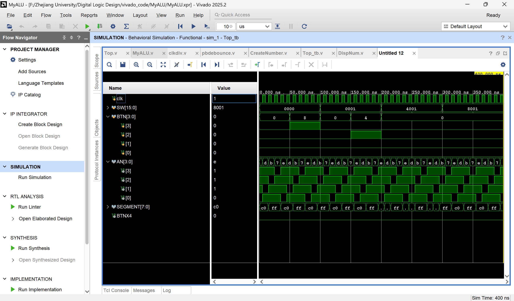

该波形为 **Vivado** 软件中对**实验顶层工程**的行为仿真波形，时间范围 $0 \sim 400ns$，用于验证整个系统的时序逻辑、输入响应和输出驱动是否正常，是对全加器、加减法器、**ALU**、按键、数码管驱动等全部模块整合后的整体测试。

- **clk**：系统时钟信号
  波形为连续标准方波，周期固定为 $10ns$，时钟频率 $100MHz$，为整个实验电路提供统一时序基准，保证所有模块同步工作。
- **SW[15:0]**：开发板开关输入信号
  仿真过程中依次赋值变化：$0000 → 0001 → 4001 → 8001$；
  其中 `SW[15:14]` 为 **ALU** 功能选择端：
  - $00$：加法运算
  - $01$：减法运算
  - $10$：按位与运算
  - $11$：按位或运算
  开关信号变化正常，可正确控制 ALU 切换运算功能。
- **BTN[3:0]**：开发板按键输入信号
  仿真中 `BTN[3]`、`BTN[2]` 出现高电平脉冲，对应修改操作数 $A$、操作数 $B$ 的按键，波形表明按键输入模块可正常识别有效按键信号。
- **AN[3:0]**：$4$ 位数码管位选信号
  波形按固定规律循环变化：$d → b → 7 → e$，实现数码管动态扫描，依次选中 $4$ 个数码管，分时点亮以完成数值显示。
- **SEGMENT[7:0]**：数码管段选信号
  随位选信号同步变化，在 `c0`、`ff` 等值间切换，对应不同数字的段码输出，与 `AN` 信号配合完成数字显示，无显示混乱或异常。

顶层模块时钟稳定，输入开关、按键响应正常，数码管驱动时序正确，整体电路集成无误，系统级功能验证通过。

---

##### 2.5 上板实验

> 添加去抖动文件 `pbdebounce.v`

```verilog
module pbdebounce (
    input wire clk_1ms,
    input wire button,
    output reg pbreg
);
    reg [7:0] pbshift;
    always @(posedge clk_1ms) begin
        pbshift <= {pbshift[6:0], button};
        if (pbshift == 8'b0)
            pbreg <= 1'b0;
        else if (pbshift == 8'hFF)
            pbreg <= 1'b1;
    end
endmodule
```

---

> `K7.xdc`

```tcl
#######################################################################
# 时钟约束
#######################################################################
create_clock -period 10.000 -name clk [get_ports clk]
set_property PACKAGE_PIN AC18 [get_ports clk]
set_property IOSTANDARD LVCMOS18 [get_ports clk]

#######################################################################
# 独立按键 BTN[3:0]（SWORD 独立键模式：K_COL[3:0]）
# 映射关系：BTN[0] -> K_COL[3] (W14)
#          BTN[1] -> K_COL[2] (V14)
#          BTN[2] -> K_COL[1] (V19)
#          BTN[3] -> K_COL[0] (V18)
#######################################################################
set_property PACKAGE_PIN W14 [get_ports {BTN[0]}]
set_property PACKAGE_PIN V14 [get_ports {BTN[1]}]
set_property PACKAGE_PIN V19 [get_ports {BTN[2]}]
set_property PACKAGE_PIN V18 [get_ports {BTN[3]}]
set_property IOSTANDARD LVCMOS18 [get_ports {BTN[0]}]
set_property IOSTANDARD LVCMOS18 [get_ports {BTN[1]}]
set_property IOSTANDARD LVCMOS18 [get_ports {BTN[2]}]
set_property IOSTANDARD LVCMOS18 [get_ports {BTN[3]}]

#######################################################################
# 按键使能 BTNX4（输出低电平，使能独立按键）
# 必须分配引脚，否则 DRC 报错
#######################################################################
set_property PACKAGE_PIN W16 [get_ports BTNX4]
set_property IOSTANDARD LVCMOS18 [get_ports BTNX4]

#######################################################################
# 拨动开关 SW[15:0]
#######################################################################
set_property PACKAGE_PIN AA10 [get_ports {SW[0]}]
set_property PACKAGE_PIN AB10 [get_ports {SW[1]}]
set_property PACKAGE_PIN AA13 [get_ports {SW[2]}]
set_property PACKAGE_PIN AA12 [get_ports {SW[3]}]
set_property PACKAGE_PIN Y13  [get_ports {SW[4]}]
set_property PACKAGE_PIN Y12  [get_ports {SW[5]}]
set_property PACKAGE_PIN AD11 [get_ports {SW[6]}]
set_property PACKAGE_PIN AD10 [get_ports {SW[7]}]
set_property PACKAGE_PIN AE10 [get_ports {SW[8]}]
set_property PACKAGE_PIN AE12 [get_ports {SW[9]}]
set_property PACKAGE_PIN AF12 [get_ports {SW[10]}]
set_property PACKAGE_PIN AE8  [get_ports {SW[11]}]
set_property PACKAGE_PIN AF8  [get_ports {SW[12]}]
set_property PACKAGE_PIN AE13 [get_ports {SW[13]}]
set_property PACKAGE_PIN AF13 [get_ports {SW[14]}]
set_property PACKAGE_PIN AF10 [get_ports {SW[15]}]
set_property IOSTANDARD LVCMOS15 [get_ports {SW[0]}]
set_property IOSTANDARD LVCMOS15 [get_ports {SW[1]}]
set_property IOSTANDARD LVCMOS15 [get_ports {SW[2]}]
set_property IOSTANDARD LVCMOS15 [get_ports {SW[3]}]
set_property IOSTANDARD LVCMOS15 [get_ports {SW[4]}]
set_property IOSTANDARD LVCMOS15 [get_ports {SW[5]}]
set_property IOSTANDARD LVCMOS15 [get_ports {SW[6]}]
set_property IOSTANDARD LVCMOS15 [get_ports {SW[7]}]
set_property IOSTANDARD LVCMOS15 [get_ports {SW[8]}]
set_property IOSTANDARD LVCMOS15 [get_ports {SW[9]}]
set_property IOSTANDARD LVCMOS15 [get_ports {SW[10]}]
set_property IOSTANDARD LVCMOS15 [get_ports {SW[11]}]
set_property IOSTANDARD LVCMOS15 [get_ports {SW[12]}]
set_property IOSTANDARD LVCMOS15 [get_ports {SW[13]}]
set_property IOSTANDARD LVCMOS15 [get_ports {SW[14]}]
set_property IOSTANDARD LVCMOS15 [get_ports {SW[15]}]

#######################################################################
# 数码管位选 AN[3:0]（共阳极，低电平有效）
#######################################################################
set_property PACKAGE_PIN AD21 [get_ports {AN[0]}]
set_property PACKAGE_PIN AC21 [get_ports {AN[1]}]
set_property PACKAGE_PIN AB21 [get_ports {AN[2]}]
set_property PACKAGE_PIN AC22 [get_ports {AN[3]}]
set_property IOSTANDARD LVCMOS33 [get_ports {AN[0]}]
set_property IOSTANDARD LVCMOS33 [get_ports {AN[1]}]
set_property IOSTANDARD LVCMOS33 [get_ports {AN[2]}]
set_property IOSTANDARD LVCMOS33 [get_ports {AN[3]}]

#######################################################################
# 数码管段选 SEGMENT[7:0] (a b c d e f g dp)
#######################################################################
set_property PACKAGE_PIN AB22 [get_ports {SEGMENT[0]}]
set_property PACKAGE_PIN AD24 [get_ports {SEGMENT[1]}]
set_property PACKAGE_PIN AD23 [get_ports {SEGMENT[2]}]
set_property PACKAGE_PIN Y21  [get_ports {SEGMENT[3]}]
set_property PACKAGE_PIN W20  [get_ports {SEGMENT[4]}]
set_property PACKAGE_PIN AC24 [get_ports {SEGMENT[5]}]
set_property PACKAGE_PIN AC23 [get_ports {SEGMENT[6]}]
set_property PACKAGE_PIN AA22 [get_ports {SEGMENT[7]}]
set_property IOSTANDARD LVCMOS33 [get_ports {SEGMENT[0]}]
set_property IOSTANDARD LVCMOS33 [get_ports {SEGMENT[1]}]
set_property IOSTANDARD LVCMOS33 [get_ports {SEGMENT[2]}]
set_property IOSTANDARD LVCMOS33 [get_ports {SEGMENT[3]}]
set_property IOSTANDARD LVCMOS33 [get_ports {SEGMENT[4]}]
set_property IOSTANDARD LVCMOS33 [get_ports {SEGMENT[5]}]
set_property IOSTANDARD LVCMOS33 [get_ports {SEGMENT[6]}]
set_property IOSTANDARD LVCMOS33 [get_ports {SEGMENT[7]}]
```

---

> $A + B$：对于加法，最左边的是 $A$，次左边的是 $B$，次右边是 $Co$，最右边是 $C$，$C$ 和 $Co$ 代表了最终的结果，如果两个数相加超过 $16$，则 $Co$ 显示为 $1$，同时C显示为 $A+B-Co$ 的值。

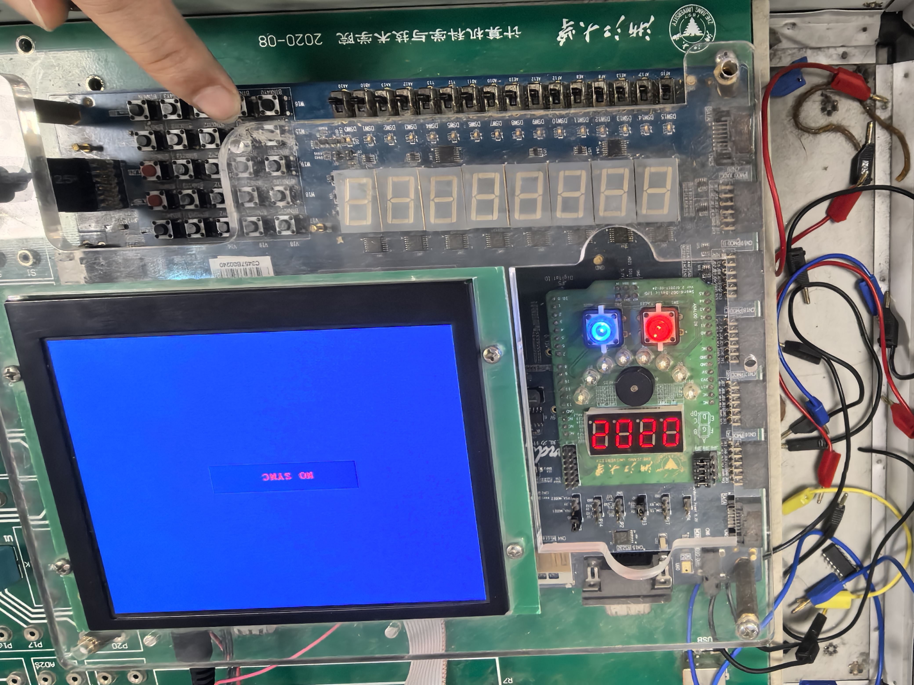

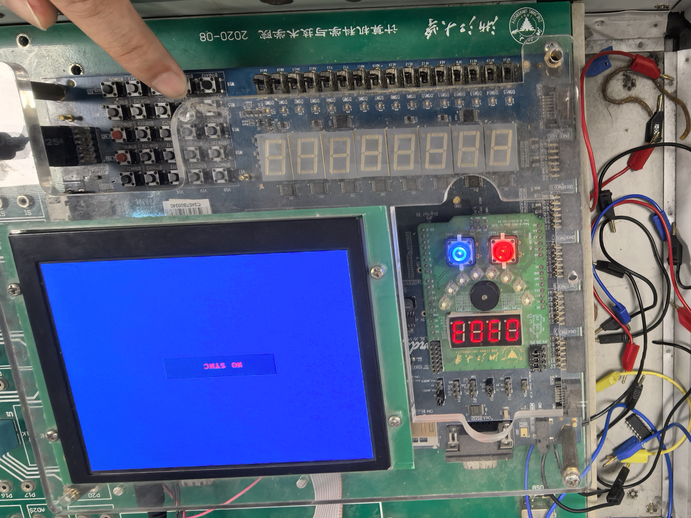

---

> $A-B$：对于减法，最左边的是 $A$，次左边的是 $B$，次右边是 $Co$，最右边是 $C$，$C$ 和 $Co$ 代表了最终的结果。如果 $A \geq B$，则 $Co=1$；反之，$Co=0$。


---

> $A$ $\&$ $B$：对于与法，最左边的是 $A$，次左边的是 $B$，次右边是 $Co$，最右边是 $C$，$C$ 和 $Co$ 代表了最终的结果。其中 $Co$ 永远是 $0$。


---

> $A$ $|$ $B$：对于或法，最左边的是 $A$，次左边的是 $B$，次右边是 $Co$，最右边是 $C$，$C$ 和 $Co$ 代表了最终的结果。其中 $Co$ 永远是 $0$。


---

### 四、实验结果分析

本次实验完成了 $1$ 位全加器、$4$ 位串行进位加法器、$4$ 位加减法器以及 $4$ 位 **ALU** 的设计、仿真与 **FPGA** 硬件验证，整体结果符合预期，各项功能均正常实现。

- **ALU** 可通过功能选择信号 `S [1:0]` 稳定切换加、减、与、或四种运算，运算结果与理论值一致，进位 / 借位标志输出正确。**Digital** 软件仿真覆盖全部运算模式，波形清晰无毛刺，证明 **ALU** 算术与逻辑功能设计无误。
- 在 **Vivado** 中完成顶层工程搭建，集成时钟分频、按键输入、数码管显示与按键去抖动模块。行为仿真显示按键、开关响应正常，数码管动态扫描时序正确。下载到 **SWORD** 开发板后，可通过按键修改操作数，开关切换运算功能，数码管实时显示 $A$、$B$、进位与结果，运行稳定无跳变，按键经去抖动处理后无错误触发。
- 一些需要注意的小问题：
  - 在仿真时 `.scan(clk_div[18:17]),` 部分需要改为 `.scan(clk_div[1:0]),`，否则效果将会比较糟糕（亲自踩坑）；
  - 在 `DispNum d0` 部分，`.LES(4'b0),` 出现了差错，需要全部为 $0$ 才可以，否则数码管会被强制熄灭；
  - 在 `K7.xdc` 部分，引脚需要完全一一对应，否则真的容易出问题，即使比特流下载成功也会跑不上板子。

---

### 五、讨论与心得

- 本次实验完整实践了从基本门电路到 **CPU** 核心部件 **ALU** 的逐层设计与实现过程，对数字系统模块化设计思想有了更直观的理解。从 $1$ 位全加器到 $4$ 位加减法器，再到集成算术与逻辑运算的 **ALU**，每一步都建立在前序模块的基础之上，让我清晰认识到复杂数字系统是由简单单元组合而成；

- 在实验过程掌握了串行进位加法器的结构与延迟特性、补码减法的实现原理，再次熟悉了 **Digital** 与 **Vivado** 软件的使用流程，提升了原理图绘制、**Verilog** 代码编写、电路仿真与 **FPGA** 下载调试的能力。信号延迟、机械抖动、管脚约束等实际问题解决都得到理论性的简单尝试；

- 本次实验让我理解了 **ALU** 作为 **CPU** 运算核心的工作方式，为后续学习计算机组成原理、**CPU** 设计打下了重要基础。整体而言，实验不仅巩固了课堂知识，也提升了动手能力与问题排查能力，收获十分充实；
- 另外，本次和杨海涛同学的合作依旧顺利且成功，一人操作一人拍照，各写各的程序和代码，并最后深入交流得到最优解，本次实验完全是成功的。

---


