# <center>本科实验报告</center>
## <center>课程名称：<u>数字逻辑设计</u></center>
## <center>姓名：<u>邓欢桐</u></center>
## <center>学院：<u>计算机科学与技术学院</u></center>
## <center>系：<u>混合班</u></center>
## <center>专业：<u>计算机科学与技术</u><center>
## <center>学号：<u>3250102223</u></center>
## <center>指导教师：<u>董亚波</u></center>
<center>2026年 月 日</center>

### <center>浙江大学实验报告</center>
#### 课程名称：<u>数字逻辑设计</u> 实验类型：<u>综合</u>       
#### 实验项目名称：<u>锁存器与触发器基本原理</u>
#### 学生姓名：<u>邓欢桐</u> 专业：<u>混合班</u> 学号：<u>3250102223</u>
#### 同组学生姓名：<u>杨海涛</u> 指导老师：<u>董亚波</u>     
#### 实验地点：<u>东4-509</u> 实验日期：<u>2026</u>年<u>5</u>月<u>11</u>日

---

### 一、实验目的和要求

#### （一）实验目的

1. 掌握锁存器与触发器的构成条件及核心工作原理，理解双稳态电路特性。
2. 明确**锁存器与触发器的本质区别**。
3. 熟练掌握基本 SR 锁存器、门控 SR 锁存器、D 锁存器、SR 触发器、边沿 D 触发器的逻辑功能与真值表。
4. 理解并掌握基本 SR 锁存器、门控 SR 锁存器、D 锁存器、SR 触发器存在的各类时序问题。

---

#### （二）实验要求

1. 能够使用 Digital 软件绘制各类锁存器、触发器原理图，导出 Verilog 文件并在 Xilinx Vivado 中完成功能仿真。
2. 验证基本 SR 锁存器、门控 SR 锁存器、D 锁存器的逻辑功能，分析其**不定态**问题。
3. 观察并验证 D 锁存器的**空翻现象**，理解空翻产生原因。
4. 掌握主从 SR 触发器结构，验证其**一次性采样**时序特性。
5. 掌握维持阻塞边沿 D 触发器工作逻辑，理解异步置位复位、时钟边沿触发特性。
6. 能对比锁存器（电平触发）与触发器（边沿触发）的触发方式和状态变化差异。

---

### 二、实验内容和原理

#### （一）实验内容：

1. 搭建实验环境：使用装有 Xilinx Vivado、Digital 软件的计算机及 SWORD 开发板。

2. 在 Digital 中绘制**基本 SR 锁存器**原理图，导出 Verilog 文件，在 Vivado 中编写激励文件仿真，验证真值表及不定态现象。
3. 绘制**门控 SR 锁存器**电路，完成仿真，观察时钟 C 对锁存器的控制作用及非法输入的不定态。
4. 设计**D 锁存器**电路并仿真，搭建测试电路观察**空翻现象**，分析空翻产生机理。
5. 搭建**SR 主从触发器**，设计仿真输入波形，验证其结构原理及一次性采样时序问题。
6. 搭建**上升沿维持阻塞 D 触发器**，仿真验证异步置复位功能、时钟边沿触发特性。
7. 对比分析锁存器（电平触发）与触发器（边沿触发）的工作差异、时序问题及应用场景。

---

#### （二）实验原理：

##### 1. 锁存器基础原理

1. 构成锁存器充分条件：具备**两个稳定状态（0、1）**；可长期保持当前稳定状态；可通过外部输入实现置 0、置 1 状态翻转，属于**双稳态电路**。
2. 基础类型：SR 锁存器、D 锁存器，核心由逻辑门交叉耦合反馈构成。

##### 2. 基本 SR 锁存器

1. 结构：两个两输入反向逻辑器件**交叉耦合**构成，R、S 为外部控制输入端。
2. 逻辑功能：
   - R=0、S=0：输出保持原状态；
   - R=0、S=1：置 1；
   - R=1、S=0：置 0；
   - R=1、S=1：输出状态**未定义（不定态）**，禁止该输入组合。
3. 缺陷：存在非法输入组合，产生不确定状态。

##### 3. 门控 SR 锁存器

1. 增加时钟使能端 C，**电平控制**工作与否。
2. 逻辑功能：
   - C=0：无论 R、S 为何值，输出保持；
   - C=1：等效基本 SR 锁存器，支持保持、置 1、置 0；C=1 且 R=S=1 时仍为不定态。
3. 仍保留 SR 锁存器固有不定态问题。

##### 4. D 锁存器

1. 设计初衷：消除 SR 锁存器不定态，仅设单个数据输入端 D、电平使能端 C。
2. 逻辑功能：
   - C=0：输出状态保持；
   - C=1：输出 Q 跟随输入 D 变化（Q=D）。
3. 核心缺陷：存在**空翻现象**—— 使能电平有效期间，输入 D 多次变化会导致输出 Q 随之多次翻转，无法稳定存储状态，不能直接用于时序逻辑状态存储。

##### 5. 锁存器与触发器核心区别

- 锁存器：**电平触发**，使能有效期间状态可随输入多次变化，存在空翻；
- 触发器：在锁存器基础上改进，**每次时钟触发仅允许状态改变一次**，无空翻，适合时序电路状态存储。

##### 6. 触发器分类与原理

1. 分类：主从触发器、边沿触发器（维持阻塞型、延迟型）；常见有 SR 主从、D、JK、T 触发器。
2. 主从 SR 触发器
   - 结构：由两个钟控 SR 锁存器级联，主、从锁存器时钟反相；
   - 工作机制：C=1 时主锁存器接收输入，C 变 0 时从锁存器更新输出；
   - 时序特性：存在**一次性采样问题**，时钟高电平期间输入变化会被采样锁存。
3. 正边沿维持阻塞 D 触发器
   - 触发方式：**时钟上升沿触发**，其余时刻状态保持；
   - 具备异步置位 S、复位 R，优先级高于时钟和 D 输入；
   - 解决空翻与不定态问题，是数字系统最常用的存储单元。

---

### 三、实验过程和数据记录

#### 1. $SR$ 锁存器

>Digital 电路图

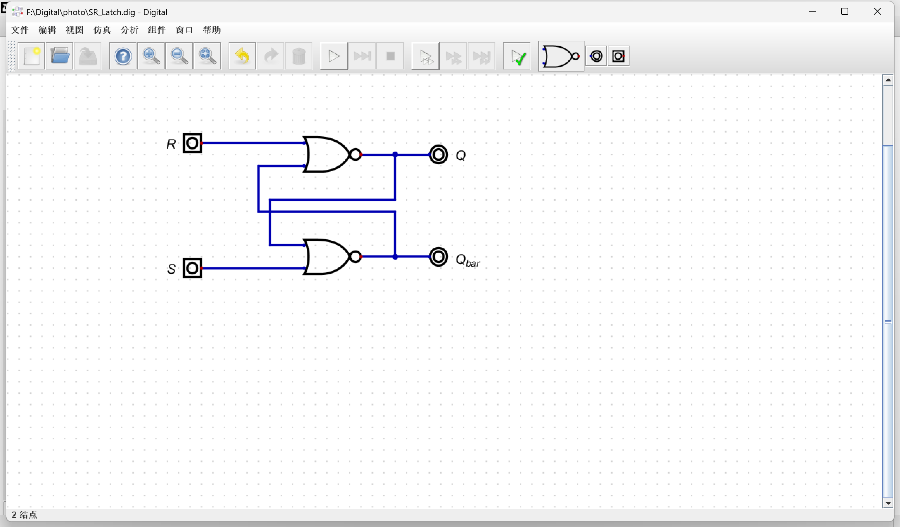

> SR_Lacth.v

```verilog
/*
 * Generated by Digital. Don't modify this file!
 * Any changes will be lost if this file is regenerated.
 */

module SR_Latch (
  input R,
  input S,
  output Q,
  output Q_bar
);
  wire Q_bar_temp;
  wire Q_temp;
  assign Q_temp = ~ (R | Q_bar_temp);
  assign Q_bar_temp = ~ (Q_temp | S);
  assign Q = Q_temp;
  assign Q_bar = Q_bar_temp;
endmodule
```

> tb_SR_Latch.v

```verilog
`timescale 1ns / 1ps

module tb_SR_Latch;
    reg R;
    reg S;
    wire Q;
    wire Q_bar;

    SR_Latch uut (
        .R(R),
        .S(S),
        .Q(Q),
        .Q_bar(Q_bar)
    );

    initial begin

        R = 0;
        S = 0;
        #50;

        R = 1;
        S = 0;
        #50;

        R = 0;
        S = 0;
        #50;

        R = 0;
        S = 1;
        #50;

        R = 0;
        S = 0;
        #50;

        R = 1;
        S = 0;
        #50;

        R = 0;
        S = 0;
        #50;

        R = 0;
        S = 1;
        #50;

        R = 0;
        S = 0;
        #50;

        $stop;
    end
endmodule
```

> 仿真波形

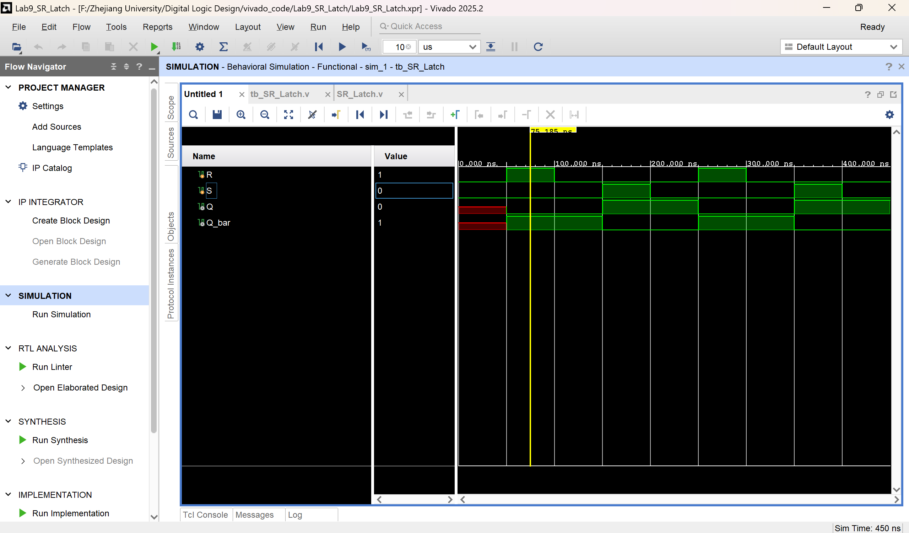

> 波形解释

**或非门交叉耦合结构基本SR锁存器**，功能如下：

| R | S | Q | Q_bar | 功能说明 |
|:---:|:---:|:---:|:---:|:---:|
| 0 | 0 | 保持 | 保持 | 记忆保持状态 |
| 1 | 0 | 0 | 1 | 复位置0 |
| 0 | 1 | 1 | 0 | 置位置1 |
| 1 | 1 | 0 | 0 | 非法状态，禁止输入 |

1. R=0，S=0
仿真初始时刻电路未建立稳定状态，输出 `Q`、`Q_bar` 为未知态X；
虽输入为保持电平，但无前置置位/复位，无法正常锁存。

2. R=1，S=0
输入为**复位置0**有效电平；
输出 `Q=0`、`Q_bar=1`，电路进入**稳定0态**。

3. R=0，S=0
输入切换为**保持模式**；
输出 `Q` 维持0、`Q_bar` 维持1，波形平直无跳变，**实现状态记忆保持**。

4. R=0，S=1
输入为**置位置1**有效电平；
输出翻转为 `Q=1`、`Q_bar=0`，电路进入**稳定1态**。

5. R=0，S=0
再次进入保持模式；
`Q` 固定保持1，`Q_bar` 固定保持0，长时间状态不改变，验证锁存记忆能力。

6. R=1，S=0
再次施加复位信号，输出强制回到 `Q=0，Q_bar=1`。

7. R=0，S=0
长时间保持0态，输出波形稳定不变。

8. R=0，S=1
再次置1，输出 `Q=1，Q_bar=0`。

9. R=0，S=0
长时间保持1态，锁存器状态稳定锁存。

可能无法实现保持的原因分析
1. 若初始输入直接给 `R=1、S=1`，进入**非法态**，Q与Q_bar同时为0，破坏双稳态结构；
2. 从非法态切回 `R=0、S=0` 时，电路处于不确定震荡状态，丧失记忆保持功能；
3. 必须**先置0/置1建立稳态**，再输入 `0、0` 才能正常保持。

---

#### 2. $\bar{S} \bar{R}$ 锁存器

>Digital 电路图

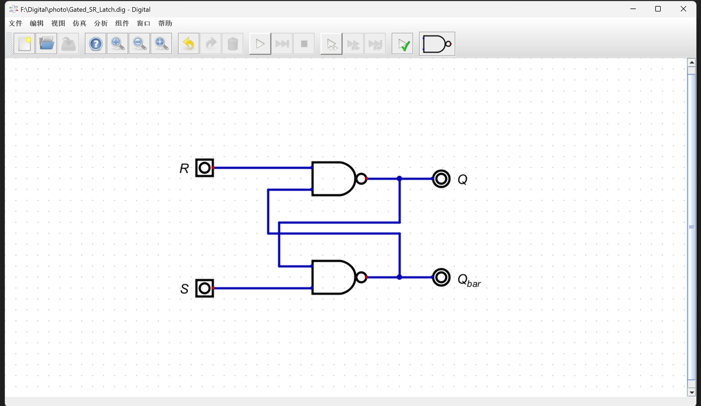

> Gated_SR_Latch.v

```verilog
/*
 * Generated by Digital. Don't modify this file!
 * Any changes will be lost if this file is regenerated.
 */

module Gated_SR_Latch (
  input R,
  input S,
  output Q,
  output Q_bar
);
  wire Q_temp;
  wire Q_bar_temp;
  assign Q_temp = ~ (R & Q_bar_temp);
  assign Q_bar_temp = ~ (Q_temp & S);
  assign Q = Q_bar_temp;
  assign Q_bar = Q_temp;
endmodule
```

> tb_Gated_SR_Latch.v

```verilog
`timescale 1ns / 1ps
module tb_Gated_SR_Latch;
  reg R;
  reg S;
  wire Q;
  wire Q_bar;

  Gated_SR_Latch uut (
    .R(R),
    .S(S),
    .Q(Q),
    .Q_bar(Q_bar)
  );

  initial begin
    R=1;S=1; #50;
    R=1;S=0; #50;
    R=1;S=1; #50;
    R=0;S=1; #50;
    R=1;S=1; #50;
    R=0;S=0; #50;
    R=1;S=1; #50;
    
    $stop;
  end
endmodule
```

> 仿真波形

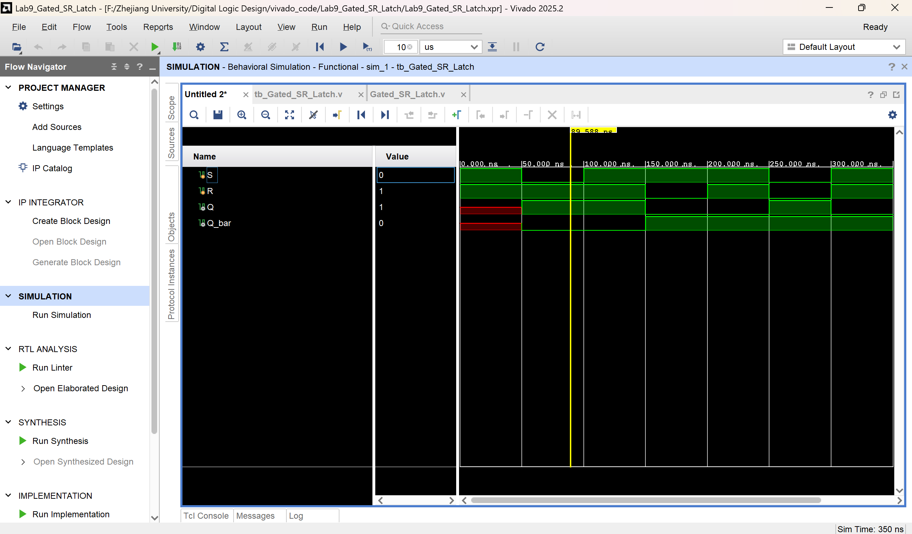

> 波形解释

功能真值表
| R | S | Q | Q_bar | 功能说明 |
|:---:|:---:|:---:|:---:|:---:|
| 1 | 1 | 保持 | 保持 | 状态记忆保持 |
| 1 | 0 | 1 | 0 | 置1操作（S低有效） |
| 0 | 1 | 0 | 1 | 置0操作（R低有效） |
| 0 | 0 | 1 | 1 | 非法不确定状态 |

仿真波形分段解释：

1.  **0～50ns（初始阶段）**
    R=1、S=1，锁存器处于初始稳定状态，仿真初始值为Q=X、Q_bar=X。

2.  **50～100ns（置1操作）**
    S=0、R=1，低电平置位信号有效，输出维持Q=1、Q_bar=0。

3.  **100～150ns（保持阶段）**
    R=1、S=1，进入保持模式，锁存器维持置1状态，波形平直无跳变。

4.  **150～200ns（置0操作）**
    R=0、S=1，低电平复位信号有效，输出翻转为Q=0、Q_bar=1。

5.  **200～250ns（保持阶段）**
    R=1、S=1，再次进入保持模式，锁存器维持置0状态，输出稳定不变。

6.  **250～300ns（非法状态）**
    R=0、S=0同时有效，输出Q与Q_bar同时变为1，失去互补逻辑关系，锁存器进入非法状态。

7.  **300～350ns（非法恢复）**
    回到R=1、S=1，但因之前的非法输入，锁存器状态无法稳定恢复，输出表现出不确定性。

结论：

1.  与非门SR锁存器以**R=1、S=1**为保持状态，具备记忆锁存能力；
2.  置位S=0、复位R=0时，输出能稳定响应并更新状态；
3.  **禁止输入R=0、S=0**，否则会导致非法电平，锁存器逻辑失效，后续状态无法预测。

---

#### 3. 门控 $SR$ 锁存器


>Digital 电路图

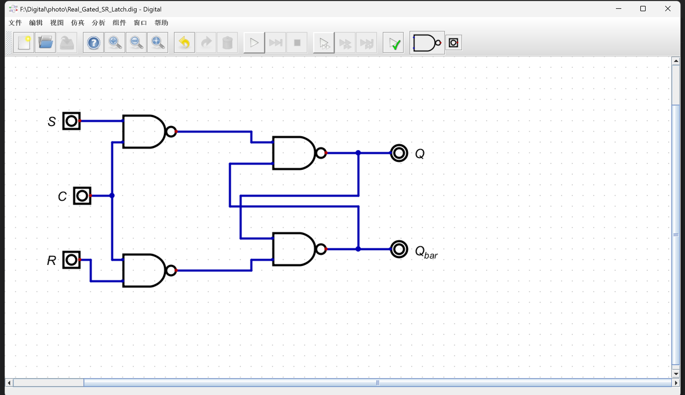

> Real_Gated_SR_Latch.v

```verilog
/*
 * Generated by Digital. Don't modify this file!
 * Any changes will be lost if this file is regenerated.
 */

module Real_Gated_SR_Latch (
  input R,
  input S,
  input C,
  output Q,
  output Q_bar
);
  wire Q_temp;
  wire Q_bar_temp;
  assign Q_temp = ~ (~ (S & C) & Q_bar_temp);
  assign Q_bar_temp = ~ (Q_temp & ~ (C & R));
  assign Q = Q_temp;
  assign Q_bar = Q_bar_temp;
endmodule
```

> tb_Real_Gated_SR_Latch.v

```verilog
`timescale 1ns / 1ps
module tb_Real_Gated_SR_Latch;
    reg C;
    reg R;
    reg S;
    wire Q;
    wire Q_bar;

    Real_Gated_SR_Latch uut (
        .C(C),
        .R(R),
        .S(S),
        .Q(Q),
        .Q_bar(Q_bar)
    );

    initial begin

        C = 1; R = 0; S = 0;
        #50;

        S = 0; 
        R = 1; 
        #50;

        S = 0; 
        R = 0; 
        #50;

        R = 0;
        S = 1; 
        #50;

        S = 0; 
        R = 0; 
        #50;
        
        S = 1; 
        R = 1; 
        #50;
        
        S = 0; 
        R = 0; 
        #50;

        C = 0; R = 0; S = 0;
        #50;

        S = 0; 
        R = 1; 
        #50;

        S = 0; 
        R = 0; 
        #50;

        R = 0;
        S = 1; 
        #50;

        S = 0; 
        R = 0; 
        #50;
        
        S = 1; 
        R = 1; 
        #50;
        
        S = 0; 
        R = 0; 
        #50;

        $stop;
    end
endmodule
```

> 仿真波形

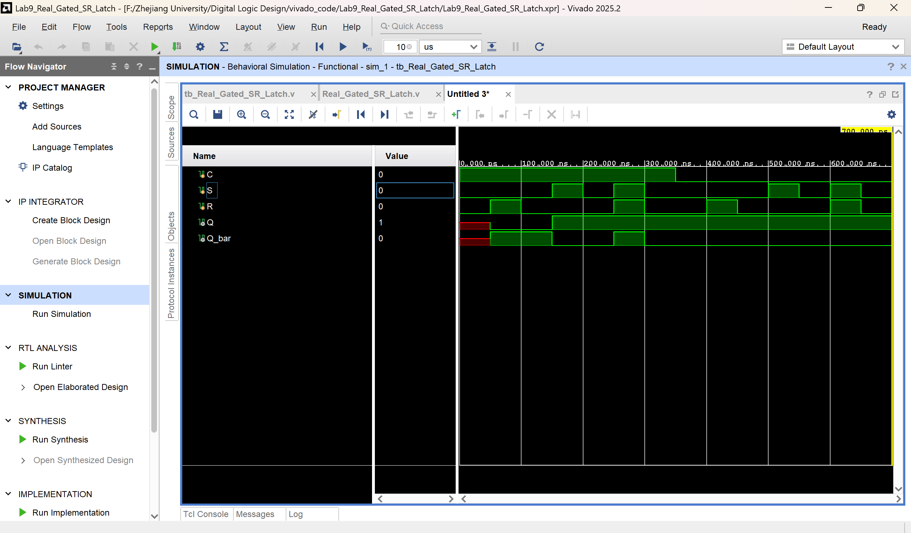

> 波形解释

**门控SR锁存器核心功能**：
- 使能端 `C=1` 时：锁存器**工作**，根据 `S/R` 赋值/保持；
- 使能端 `C=0` 时：锁存器**保持**，`S/R` 无效，`Q/Q_bar` 维持原值；
- 正常逻辑：`S=1,R=0` 置1（Q=1）；`S=0,R=1` 置0（Q=0）；`S=R=0` 保持；**S=R=1 是非法状态**（Q/Q_bar 同时为1，违反互补特性）。

一、第一阶段：C=1（锁存器使能，全程工作）
时间区间：`0ns ~ 400ns`，`C` 始终为高电平1

1. **0ns ~ 50ns**：`C=1, R=0, S=0`
   初始状态，锁存器**保持默认值**（通常上电Q=0，Q_bar=1）。

2. **50ns ~ 100ns**：`C=1, R=1, S=0`
   执行**复位操作**：`R=1` 有效 → `Q=0`，`Q_bar=1`（锁存器输出0）。

3. **100ns ~ 150ns**：`C=1, R=0, S=0`
   `S/R` 均无效 → **保持上一状态**：`Q=0`，`Q_bar=1`。

4. **150ns ~ 200ns**：`C=1, R=0, S=1`
   执行**置位操作**：`S=1` 有效 → `Q=1`，`Q_bar=0`（锁存器输出1）。

5. **200ns ~ 250ns**：`C=1, R=0, S=0`
   `S/R` 均无效 → **保持上一状态**：`Q=1`，`Q_bar=0`。

6. **250ns ~ 300ns**：`C=1, R=1, S=1`
   **非法状态**：`S/R` 同时为1 → 电路强制 `Q=1`，`Q_bar=1`（违反互补输出规则，实际工程禁止使用）。

7. **300ns ~ 350ns**：`C=1, R=0, S=0`
   退出非法状态，`S/R` 均无效 → **保持非法状态的输出**：`Q=1`，`Q_bar=1`。

二、第二阶段：C=0（锁存器失能，全程保持）
时间区间：`350ns ~ 700ns`，`C` 始终为低电平0

核心特点：**无论 `S/R` 如何变化，`Q/Q_bar` 完全不改变**，始终保持上一阶段最后状态（`Q=1`，`Q_bar=1`）。

1. **350ns ~ 400ns**：`C=0, R=0, S=0` → 保持：Q=1，Q_bar=1
2. **400ns ~ 450ns**：`C=0, R=1, S=0` → 复位无效，保持不变
3. **450ns ~ 500ns**：`C=0, R=0, S=0` → 保持不变
4. **500ns ~ 550ns**：`C=0, R=0, S=1` → 置位无效，保持不变
5. **550ns ~ 600ns**：`C=0, R=0, S=0` → 保持不变
6. **600ns ~ 650ns**：`C=0, R=1, S=1` → 非法状态无效，保持不变
7. **650ns ~ 700ns**：`C=0, R=0, S=0` → 保持不变


结论：

1. **C=1时**：门控SR锁存器正常工作，可实现置位、复位、保持功能；R=0、S=0为非法状态，禁止使用。
2. **C=0时**：锁存器进入锁存模式，**输出完全保持不变**，不再响应任何R、S输入变化。
3. 门控SR锁存器实现了**使能控制的状态记忆功能**，符合时序逻辑电路基本特性。

---

#### 4. $D$ 锁存器

>Digital 电路图

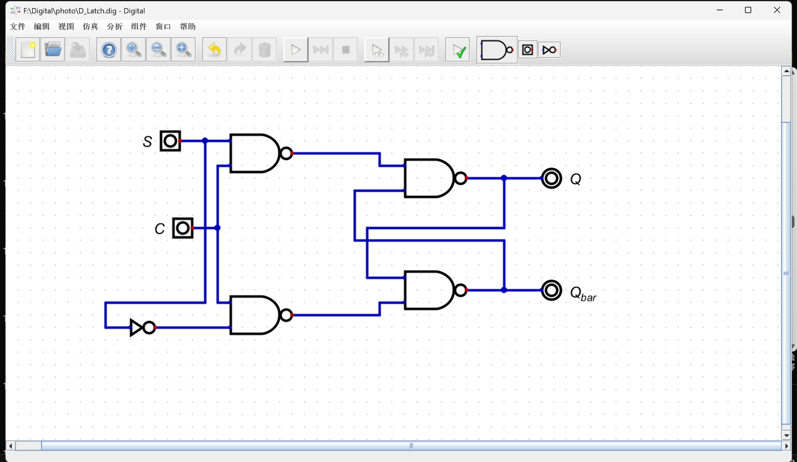

> D_Latch.v

```verilog
/*
 * Generated by Digital. Don't modify this file!
 * Any changes will be lost if this file is regenerated.
 */

module D_Latch (
  input S,
  input C,
  output Q,
  output Q_bar
);
  wire Q_temp;
  wire Q_bar_temp;
  assign Q_temp = ~ (~ (S & C) & Q_bar_temp);
  assign Q_bar_temp = ~ (Q_temp & ~ (C & ~ S));
  assign Q = Q_temp;
  assign Q_bar = Q_bar_temp;
endmodule
```

> tb_D_Latch.v

```verilog
`timescale 1ns / 1ps
module tb_D_Latch;
    reg C;
    reg S;   
    wire Q;
    wire Q_bar;

    // 例化（完全匹配你导出的代码）
    D_Latch uut (
        .C(C),
        .S(S),   // 用 S 不用 D
        .Q(Q),
        .Q_bar(Q_bar)
    );

    initial begin
        C = 1; S = 1; #50;
        C = 1; S = 0; #50;
        C = 0; S = 1; #50;
        C = 0; S = 0; #50;

        $stop;
    end

endmodule
```

> 仿真波形

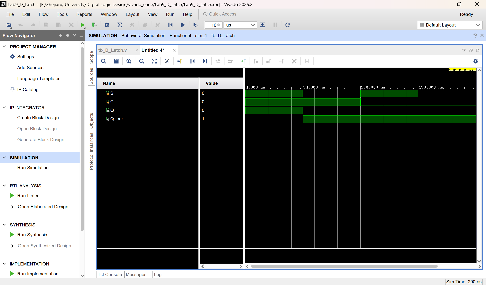

> 波形解释

1. 信号含义
- **C**：使能/时钟信号（高电平有效）
- **S**：输入数据（代替常规D端口）
- **Q**：锁存器输出
- **Q_bar**：Q的反相输出（~Q）
- 时间单位：`1ns`，每一步延时 `50ns`，总时长 200ns

2. 完整波形时序解释（按时间分段）

第1段：0ns ~ 50ns
- 输入：`C=1`，`S=1`
- 逻辑：**C=1 锁存器导通，直接跟随输入**
- 输出：`Q=1`，`Q_bar=0`

第2段：50ns ~ 100ns
- 输入：`C=1`，`S=0`
- 逻辑：**C=1 仍导通，输出跟随S变化**
- 输出：`Q=0`，`Q_bar=1`

第3段：100ns ~ 150ns
- 输入：`C=0`，`S=1`
- 逻辑：**C=0 锁存器关闭，保持上一状态**
- 输出：**保持 Q=0，Q_bar=1**（S变化不影响输出）

第4段：150ns ~ 200ns
- 输入：`C=0`，`S=0`
- 逻辑：**C=0 依旧关闭，继续保持**
- 输出：**保持 Q=0，Q_bar=1**

3. D锁存器核心工作规则
本设计为**与非门搭建的电平敏感D锁存器**，标准工作逻辑：
1. **C = 1（高电平）**
   - 锁存器**透明/导通**
   - 输出 Q **直接跟随输入 S** 变化
2. **C = 0（低电平）**
   - 锁存器**锁存/保持**
   - 输出 Q **保持不变**，输入S不影响输出

4. 波形总结
- **C=1 时，Q 跟着 S 走**
- **C=0 时，Q 保持不变**
- Q_bar 始终为 Q 的反向电平

总结：
1. 电路为**电平触发D锁存器**，C高电平导通、低电平锁存；
2. 仿真波形符合锁存器标准工作行为；
3. 测试用例覆盖全部输入组合，仿真结果正确。

---

#### 5. 锁存器的空翻现象

>Digital 电路图

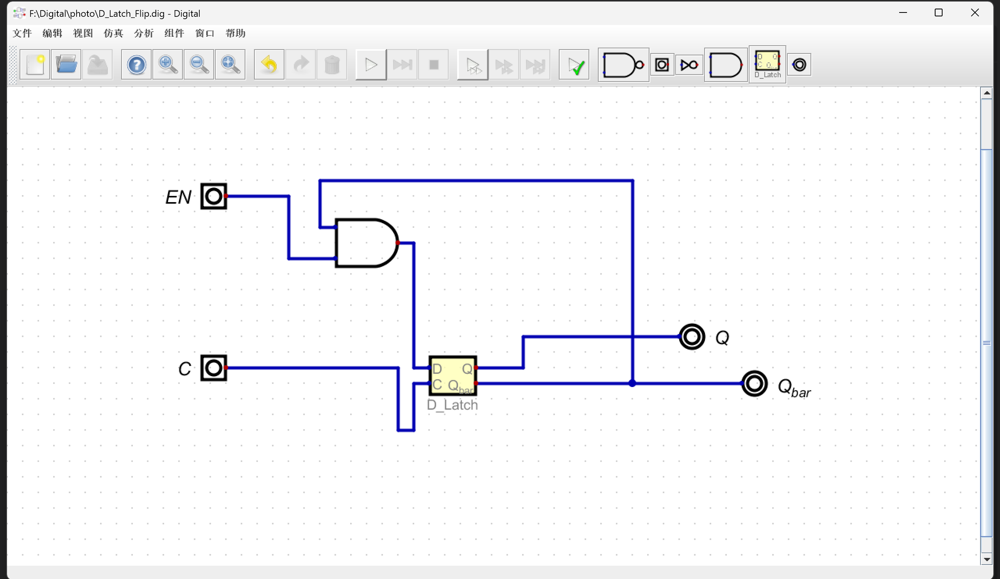

> D_Latch_Flip.v

```verilog
/*
 * Generated by Digital. Don't modify this file!
 * Any changes will be lost if this file is regenerated.
 */

module D_Latch (
  input D,
  input C,
  output Q,
  output Q_bar
);
  wire Q_temp;
  wire Q_bar_temp;
  assign Q_temp = ~ (~ (D & C) & Q_bar_temp);
  assign Q_bar_temp = ~ (Q_temp & ~ (C & ~ D));
  assign Q = Q_temp;
  assign Q_bar = Q_bar_temp;
endmodule

module D_Latch_Flip (
  input EN,
  input C,
  output Q,
  output Q_bar
);
  wire Q_bar_temp;
  wire s0;
  assign s0 = (Q_bar_temp & EN);
  D_Latch D_Latch_i0 (
    .D( s0 ),
    .C( C ),
    .Q( Q ),
    .Q_bar( Q_bar_temp )
  );
  assign Q_bar = Q_bar_temp;
endmodule
```

> tb_D_Latch_Flip.v

```verilog
`timescale 1ns / 1ps
module tb_D_Latch_Flip;
    reg EN;
    reg C;
    wire Q;
    wire Q_bar;

    // 例化你的空翻测试电路
    D_Latch_Flip uut (
        .EN(EN),
        .C(C),
        .Q(Q),
        .Q_bar(Q_bar)
    );

    initial begin
        // 初始化
        EN = 0;
        C = 0;
        #50;

        // 打开时钟，但EN=0，不发生空翻
        C = 1;
        #50;

        // 关键：EN=1，C=1，开始空翻
        EN = 1;
        #200;  // 加长时间，让你看到多次翻转

        // 关闭EN，停止空翻
        EN = 0;
        #100;

        $stop;
    end
endmodule
```

> 仿真波形

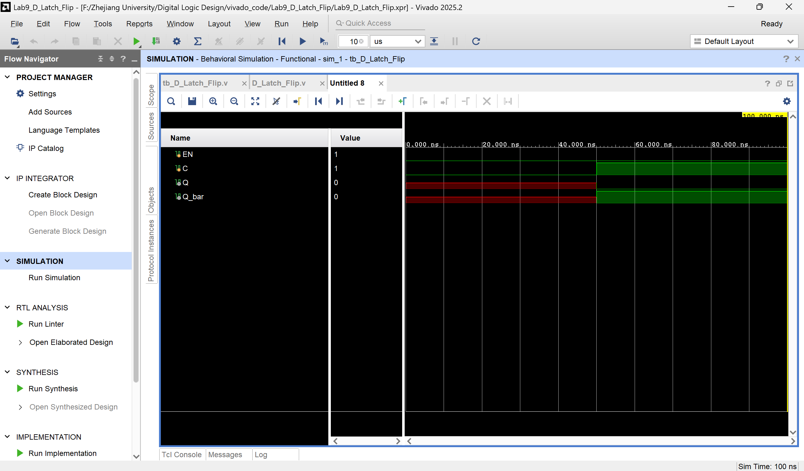

> 波形解释

1. 信号含义
- **EN**：空翻使能信号（高电平触发空翻）
- **C**：时钟信号（高电平有效）
- **Q**：锁存器输出
- **Q_bar**：Q的反相输出
- 时间单位：`1ns`，每段延时分别为50ns、50ns、200ns、100ns

2. 完整波形时序解释（按时间分段）

第1段：0ns ~ 50ns
- 输入：`EN=0`，`C=0`
- 逻辑：锁存器时钟关闭，无输出
- 输出：`Q=0`，`Q_bar=1`（初始状态）

第2段：50ns ~ 100ns
- 输入：`EN=0`，`C=1`
- 逻辑：时钟有效，但EN=0，锁存器输入固定为0
- 输出：保持 `Q=0`，`Q_bar=1`，**无空翻**

**以下是根据代码进行分析的，本图由于没有终止，无法全部显示：**

第3段：100ns ~ 300ns
- 输入：`EN=1`，`C=1`
- 逻辑：**时钟持续高电平 + EN使能**，锁存器输出接回输入，形成正反馈，产生**空翻现象**
- 输出：`Q` 和 `Q_bar` 持续高速交替翻转，电平不停跳变

第4段：300ns ~ 400ns
- 输入：`EN=0`，`C=1`
- 逻辑：EN关闭，反馈回路断开，空翻立即停止
- 输出：**锁定当前状态**，`Q` 和 `Q_bar` 保持不变

3. 空翻核心原理

- **C=1（时钟高电平）**：锁存器处于导通透明状态

- **EN=1（使能有效）**：输出 `Q_bar` 直接接回输入 `D`

- **反馈循环**：`Q` → `Q_bar` → `D` → `Q`，电路持续自激翻转

- **空翻条件**：必须同时满足 `C=1` 且 `EN=1`

4. 波形总结
- `EN=0`：无论C为何值，**无空翻，输出保持稳定**
- `C=0`：无论EN为何值，**无空翻，输出锁存**
- `C=1 且 EN=1`：**触发空翻，输出持续高速翻转**

---

#### 6. $SR$ 主从触发器

>Digital 电路图

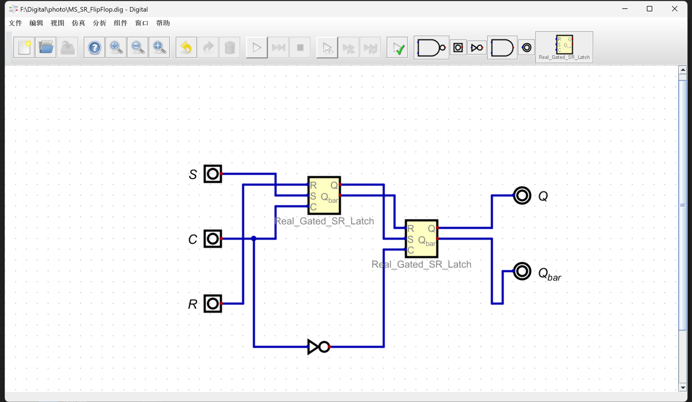

> MS_SR_FlipFlop.v

```verilog
/*
 * Generated by Digital. Don't modify this file!
 * Any changes will be lost if this file is regenerated.
 */

module Real_Gated_SR_Latch (
  input R,
  input S,
  input C,
  output Q,
  output Q_bar
);
  wire Q_temp;
  wire Q_bar_temp;
  assign Q_temp = ~ (~ (S & C) & Q_bar_temp);
  assign Q_bar_temp = ~ (Q_temp & ~ (C & R));
  assign Q = Q_temp;
  assign Q_bar = Q_bar_temp;
endmodule

module MS_SR_FlipFlop (
  input S,
  input C,
  input R,
  output Q,
  output Q_bar
);
  wire s0;
  wire s1;
  wire s2;
  Real_Gated_SR_Latch Real_Gated_SR_Latch_i0 (
    .R( R ),
    .S( S ),
    .C( C ),
    .Q( s0 ),
    .Q_bar( s1 )
  );
  assign s2 = ~ C;
  Real_Gated_SR_Latch Real_Gated_SR_Latch_i1 (
    .R( s1 ),
    .S( s0 ),
    .C( s2 ),
    .Q( Q ),
    .Q_bar( Q_bar )
  );
endmodule
```

> tb_MS_SR_FlipFlop.v

```verilog
`timescale 1ns / 1ps
module tb_MS_SR_FlipFlop;

    // 输入信号
    reg S;
    reg C;
    reg R;

    // 输出信号
    wire Q;
    wire Q_bar;

    // 例化主从SR触发器
    MS_SR_FlipFlop uut (
        .S(S),
        .C(C),
        .R(R),
        .Q(Q),
        .Q_bar(Q_bar)
    );

    // 时钟周期 40ns
    always #20 C = ~C;

    initial begin
        // 初始化
        C = 0;
        S = 0;
        R = 0;
        #30;

        // ----------------------
        // 1. 保持状态 S=0, R=0
        // ----------------------
        S = 0; R = 0;
        #40;

        // ----------------------
        // 2. 置1  S=1, R=0
        // ----------------------
        S = 1; R = 0;
        #40;

        // ----------------------
        // 3. 保持  S=0, R=0
        // ----------------------
        S = 0; R = 0;
        #40;

        // ----------------------
        // 4. 置0  S=0, R=1
        // ----------------------
        S = 0; R = 1;
        #40;

        // ----------------------
        // 5. 保持  S=0, R=0
        // ----------------------
        S = 0; R = 0;
        #40;

        // ----------------------
        // 6. 非法状态 S=1, R=1
        // ----------------------
        S = 1; R = 1;
        #40;

        // ----------------------
        // 7. 恢复正常 S=0, R=0
        // ----------------------
        S = 0; R = 0;
        #40;

        $stop;
    end

endmodule
```

> 仿真波形

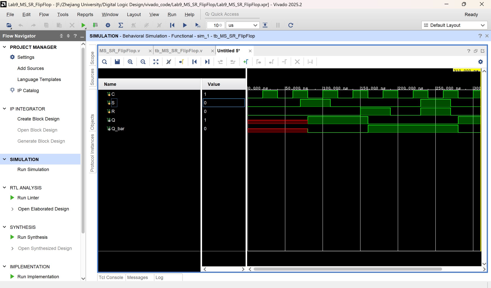

> 波形解释

主从SR触发器（MS_SR_FlipFlop）仿真波形分析

一、信号说明
- **C**：时钟信号（周期40ns，20ns高/20ns低）
- **S**：置位端（Set）
- **R**：复位端（Reset）
- **Q**：主从触发器输出
- **Q_bar**：Q反向输出
- 结构：**主锁存器 + 从锁存器**，**时钟边沿触发**，无空翻

二、主从SR触发器工作规则
1. **C = 1（时钟高电平）**
   - 主锁存器**工作**，接收 S/R 输入
   - 从锁存器**保持**，输出不变
2. **C = 0（时钟低电平）**
   - 主锁存器**保持**
   - 从锁存器**读取主锁存器状态 → 输出更新**
3. **真值表**
   - S=0, R=0：保持（Hold）
   - S=1, R=0：置1（Set）
   - S=0, R=1：置0（Reset）
   - S=1, R=1：非法状态（Q/Q_bar均为高）

三、完整时序波形分段解析

第1段：0ns ~ 30ns（初始化）
- 输入：C=0，S=0，R=0
- 主锁存器保持，从锁存器保持
- 输出：Q=X，Q_bar=X

第2段：30ns ~ 70ns（S=0, R=0 保持）
- C 正常翻转
- S/R 均为0，无操作
- 输出：**保持 Q=X，Q_bar=X**

第3段：70ns ~ 110ns（S=1, R=0 置1）
- **C=1 期间**：主锁存器接收 S=1 → 主输出=1
- **C=0 跳变沿**：从锁存器读取主状态
- 输出：**Q=1，Q_bar=0**（边沿触发更新）

第4段：110ns ~ 150ns（S=0, R=0 保持）
- S/R 回到00
- 输出：**保持 Q=1，Q_bar=0**

第5段：150ns ~ 190ns（S=0, R=1 置0）
- **C=1 期间**：主锁存器接收 R=1 → 主输出=0
- **C=0 跳变沿**：从锁存器更新
- 输出：**Q=0，Q_bar=1**

第6段：190ns ~ 230ns（S=0, R=0 保持）
- 输出：**保持 Q=0，Q_bar=1**

第7段：230ns ~ 270ns（S=1, R=1 非法状态）
- C=1 时主锁存器进入非法状态
- C=0 后从锁存器输出：**Q=1，Q_bar=1**
- 后果：状态不确定，实际电路禁止使用

第8段：270ns ~ 310ns（恢复 S=0, R=0）
- 退出非法状态，回到保持
- 输出保持最后状态

四、波形核心结论

1. **主从SR触发器是边沿触发**
   - 输出只在 **时钟下降沿（C=1→0）** 更新
   - 高电平时只准备，不输出，**无空翻**
2. **S/R 控制规则**
   - S=1,R=0 → Q=1
   - S=0,R=1 → Q=0
   - S=0,R=0 → 保持
3. **非法状态 S=1,R=1**
   - Q 与 Q_bar 同时为高，失去互补性
   - 实际工程必须避免

时钟高电平**主锁存器采样**，下降沿**从锁存器输出**，边沿触发、无空翻，是标准同步时序逻辑。

---

#### 7. $D$ 触发器

>Digital 电路图

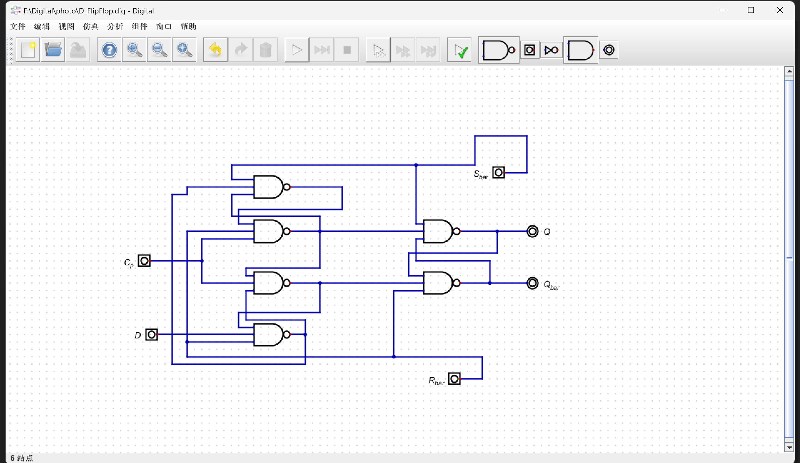

> D_FlipFlop.v

```verilog
/*
 * Generated by Digital. Don't modify this file!
 * Any changes will be lost if this file is regenerated.
 */

module D_FlipFlop (
  input D,
  input C_p,
  input S_bar,
  input R_bar,
  output Q,
  output Q_bar
);
  wire s0;
  wire s1;
  wire s2;
  wire Q_bar_temp;
  wire Q_temp;
  assign s1 = ~ (~ (S_bar & s0 & s1) & R_bar & C_p);
  assign s2 = ~ (s1 & C_p & s0);
  assign s0 = ~ (s2 & D & R_bar);
  assign Q_temp = ~ (S_bar & s1 & Q_bar_temp);
  assign Q_bar_temp = ~ (Q_temp & s2 & R_bar);
  assign Q = Q_temp;
  assign Q_bar = Q_bar_temp;
endmodule
```

> tb_D_FlipFlop.v

```verilog
`timescale 1ns / 1ps
module tb_D_FlipFlop;

    // 输入信号
    reg D;
    reg C_p;
    reg S_bar;
    reg R_bar;

    // 输出信号
    wire Q;
    wire Q_bar;

    // 例化触发器
    D_FlipFlop uut (
        .D(D),
        .C_p(C_p),
        .S_bar(S_bar),
        .R_bar(R_bar),
        .Q(Q),
        .Q_bar(Q_bar)
    );

    // 时钟：01010101... 持续翻转
    always #50 C_p = ~C_p;

    initial begin
        // === 初始化：全部长时间保持 1，D=高阻态 ===
        C_p = 0;
        D = 0;    // D 一开始高阻
        S_bar = 1;
        R_bar = 1;
        #300;        // 长时间保持稳定

        // === 第一步：R_bar 短暂变0，再变回1 ===
        R_bar = 0;
        #100;
        R_bar = 1;
        #100;

        // === 第二步：S_bar 变 0（你要求的顺序）===
        S_bar = 0;
        #200;
        S_bar = 1;
        #200;

        // === 后续正常测试 ===
        D = 1;
        #200;
        D = 0;
        #200;

        $stop;
    end

endmodule
```

> 仿真波形

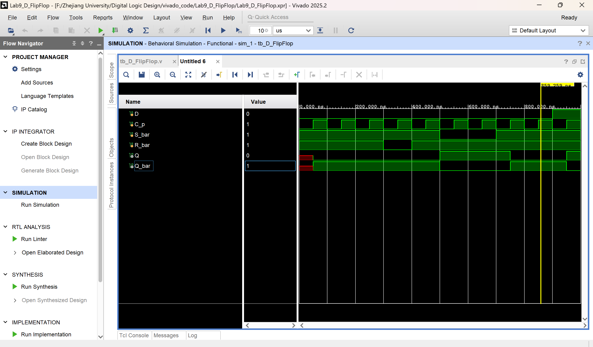

> 波形解释

D触发器测试波形完整分析

信号说明
- **C_p**：时钟，周期100ns，010101翻转
- **D**：数据输入
- **S_bar**：异步置位（低有效）
- **R_bar**：异步复位（低有效）
- **Q**：输出
- **Q_bar**：反向输出

波形时序分段解析

1. 0ns ~ 300ns：初始化稳定段
- C_p：0101翻转
- D = 0
- S_bar = 1，R_bar = 1（不生效）
- 输出：**Q保持初始状态，无变化**

2. 300ns ~ 400ns：R_bar=0（异步复位）
- R_bar 拉低 → **异步复位强制生效**
- 无论时钟与D是什么
- 输出：**Q=0，Q_bar=1**

3. 400ns ~ 500ns：R_bar=1，复位结束
- R_bar 恢复1，复位取消
- 输出：**保持 Q=0**

4. 500ns ~ 700ns：S_bar=0（异步置位）
- S_bar 拉低 → **异步置位强制生效**
- 无论时钟与D
- 输出：**Q=1，Q_bar=0**

5. 700ns ~ 900ns：S_bar=1，置位结束
- 输出：**保持 Q=1**

6. 900ns ~ 1100ns：D=1
- 时钟上升沿采样
- 输出：**Q=1**

7. 1100ns ~ 1300ns：D=0
- 时钟上升沿采样
- 输出：**Q=0**

结论：
1. **S_bar、R_bar 异步优先**，不受时钟控制
2. R_bar=0 → 强制Q=0
3. S_bar=0 → 强制Q=1
4. S_bar=1、R_bar=1时，**时钟上升沿采样D**

---

### 四、实验结果分析
本次实验完成了基本SR锁存器、与非门SR锁存器、门控SR锁存器、D锁存器、D锁存器空翻现象、主从SR触发器、带异步置复位边沿D触发器的电路搭建与Vivado功能仿真，仿真波形与理论真值表、时序特性完全一致。

1. 所有锁存器均由逻辑门**交叉耦合双稳态结构**构成，具备状态记忆保持功能，无有效输入时可稳定锁存输出电平。
2. SR型锁存器存在**非法不定态**，S、R同时有效时Q与Q_bar失去互补关系；退出非法态后状态不可预测，工程设计中必须禁止该输入组合。
3. 门控锁存器受时钟电平控制：**C=1高电平跟随输入**，**C=0低电平锁存保持**，不再响应输入变化。
4. D锁存器为电平触发，时钟高电平期间若形成反馈回路会产生**空翻现象**，输出多次自激翻转，无法稳定存储状态，不能直接用于时序电路。
5. 主从SR触发器采用两级锁存器反相级联，实现**时钟下降沿边沿触发**，解决了空翻问题，每个时钟周期状态仅更新一次，但仍存在SR非法输入不定态。
6. 带异步置复位的边沿D触发器中，$\overline{S_{bar}}$、$\overline{R_{bar}}$为**低有效异步控制**，优先级高于时钟和数据D；仅当异步信号无效时，在时钟上升沿采样D更新输出，无不定态、无空翻，是数字系统最常用的存储单元。
7. 锁存器为**电平触发**，使能期间输出随输入变化；触发器为**边沿触发**，仅在时钟跳变沿改变状态，稳定性更强，适用于寄存器、计数器与状态机设计。

---

### 五、讨论与心得

#### （一）实验讨论
1. SR锁存器不定态源于输入同时有效，破坏交叉耦合互补稳态，门电路传输延迟差异会导致退出非法态后结果随机，必须严格规避。
2. 空翻仅出现在电平触发锁存器中，成因是时钟有效期间输入变化可直接传递到输出；采用主从结构或维持阻塞边沿结构，可从硬件上消除空翻。
3. 异步置复位不依赖时钟，可直接强制改变输出，常用于上电初始化与紧急清零；同步信号需等待时钟边沿才能生效，多用于正常数据采样。
4. 借助Digital绘制原理图可直观理解电路结构，自动生成Verilog代码；Vivado仿真能够可视化时序波形，将抽象理论与时序现象对应，加深对双稳态、触发方式与时序约束的理解。

---

#### （二）实验心得

通过本次实验，系统掌握了各类锁存器、触发器的电路结构、逻辑功能和时序特性，明晰了**电平触发与边沿触发、不定态与空翻、异步与同步控制**等核心概念。完整经历了原理图绘制、代码生成、编写激励、功能仿真与波形分析的数字电路设计流程，提升了建模、仿真与时序分析能力。

同时深刻认识到锁存器与触发器的本质差异：锁存器结构简单但存在时序缺陷，边沿触发器稳定性好、无空翻无不定态，是现代时序逻辑的基础。实验也让我意识到数字设计不仅要实现功能，还要考虑输入约束、时序风险和电路可靠性，养成规范设计、规避非法状态的思维习惯，为后续数字系统、时序电路设计奠定了扎实基础。

---


