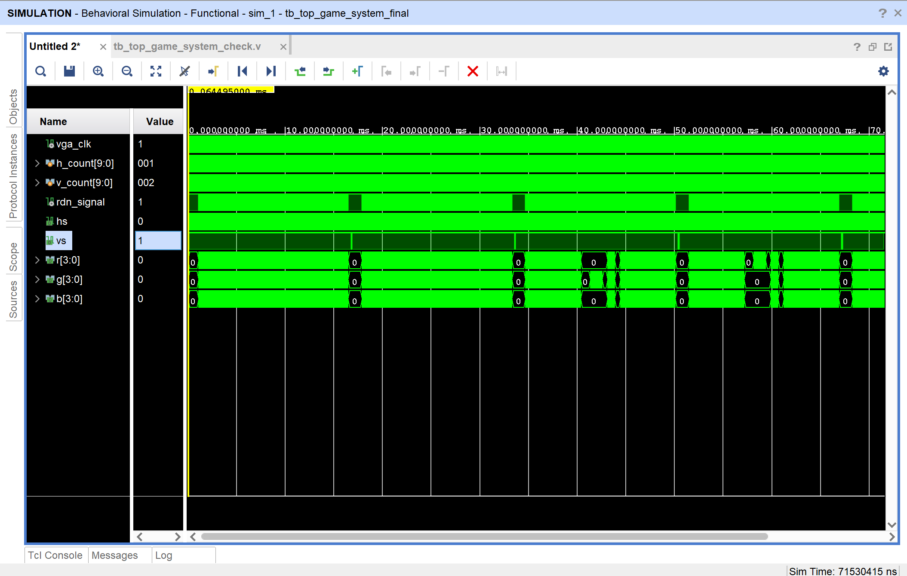
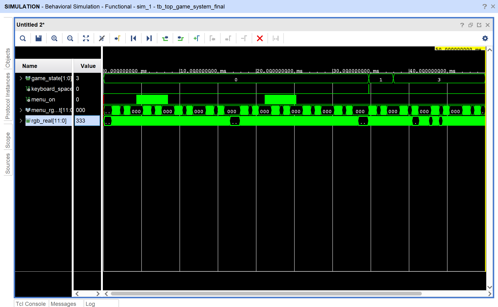
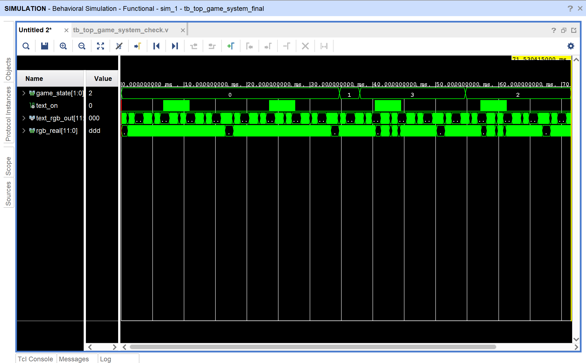

# <center>Report of Final Project</center>
## <center>ZJU_Lowrider_Challenge_Lite</center>

<center>邓欢桐 3250102223</center>

<center>


</center>
<center>

</center>
---

## 摘要

本课程设计以 **Sword Kintex7** **FPGA** 实验平台为硬件基础，基于 **Verilog HDL** 设计并实现了一个具备 **VGA** 图像显示、**PS/2** 键盘输入、按键输入、分数统计、等级变化、错误判定、菜单界面与结算界面的简化节奏类交互游戏系统。项目命名为 **ZJU_Lowrider_Challenge_Lite**。系统以 $100$ **MHz** 板载时钟为输入，通过分频得到 $25$ **MHz VGA** 像素时钟，驱动 **640×480** 分辨率 **VGA** 显示；通过 **ROM** 存储高清背景图、开始菜单文字和结算文字；通过有限状态机控制游戏的菜单、游玩、失败和胜利状态；通过按键与 **PS/2** 键盘实现玩家输入；通过七段数码管和 **VGA HUD** 同时显示得分、等级与错误次数。

本设计的灵感来源于 **GTASA（Grand Theft Auto: San Andreas）中的 Lowrider Challenge 任务**。原任务中玩家需要驾驶带有液压悬挂的 **Lowrider**，根据屏幕上出现的方向提示，在合适时机控制车辆弹跳。本项目将其中“方向箭头移动到判定区后按下对应方向键”的核心玩法抽象为 **FPGA** 上的硬件逻辑：系统不断生成从右向左移动的方向箭头，玩家在箭头进入判定区时按下 **W/A/S/D** 或板载按键，按对得分，按错或错过则累计错误次数，错误次数达到上限判定失败，分数达到目标判定胜利。

本报告按照大作业报告格式，从设计背景、开发环境、系统需求、总体结构、各模块功能、程序流程、**VGA** 显示原理、图像 **ROM** 设计、输入控制、仿真验证、硬件调试以及总结反思等方面进行说明。报告中穿插线条结构图与流程示意图，以便更加清晰地反映系统内部的连接关系与数据流向。

**关键词：** **FPGA**；**Verilog HDL**；**VGA**；**PS/2** 键盘；有限状态机；**ROM**；节奏游戏；**GTASA**；**Lowrider Challenge**

---

## 目录

- [一、背景介绍](#一背景介绍)
- [二、课程设计环境](#二课程设计环境)
- [三、系统功能要求](#三、系统功能要求)
- [四、工程文件结构](#四、工程文件结构)
- [五、系统总体结构设计](#五系统总体结构设计)
- [六、核心模块设计](#六核心模块设计)
- [七、VGA显示与图层渲染设计](#七VGA显示与图层渲染设计)
- [八、游戏核心逻辑与状态机设计](#八游戏核心逻辑与状态机设计)
- [九、输入系统设计](#九输入系统设计)
- [十、数码管与LED显示设计](#十数码管与LED显示设计)
- [十一、约束文件与硬件接口](#十一约束文件与硬件接口)
- [十二、调试过程分析](#十二调试过程分析)
- [十三、仿真设计与波形分析](#十三仿真设计与波形分析)
- [十四、资源占用与实现结果](#十四资源占用与实现结果)
- [十五、问题总结与改进方向](#十五问题总结与改进方向)
- [十六、总结](#十六总结)
- [十七、关键代码片段](#十七关键代码片段)
- [十八、仿真观察信号建议](#十八仿真观察信号建议)

---

## 一、背景介绍

随着 **FPGA** 技术和可编程逻辑器件的发展，数字系统设计已经不再局限于简单组合逻辑和时序逻辑实验，而是逐渐扩展到图像显示、外设通信、人机交互、实时控制和嵌入式娱乐系统等更加综合的应用领域。与传统软件程序不同，**FPGA** 设计更加接近硬件本身，所有功能都需要被拆解为时钟、寄存器、组合逻辑、状态机、存储器和外设接口之间的协同工作。因此，一个完整的 **FPGA** 游戏项目能够比较全面地检验 **Verilog HDL** 设计能力。

本项目的设计目标是实现一个简化版的 **Lowrider** 方向判定游戏。游戏在 **VGA** 显示器上呈现高清背景、开始菜单、移动箭头、判定框、得分板、等级、错误次数以及胜利/失败结算文字。玩家通过 **PS/2** 键盘或开发板物理按键进行输入。系统内部根据箭头方向与玩家输入方向进行匹配判断，从而更新得分与错误次数。

本游戏的灵感来源于 **GTASA 中的 Lowrider Challenge 任务**。在原任务中，玩家控制主角 **CJ** 驾驶 **Lowrider** 车辆参加汽车液压弹跳比赛，屏幕上会出现方向提示，玩家需要在箭头进入目标位置时按下对应方向键。该任务的核心乐趣在于节奏、反应和方向匹配。本设计没有复刻复杂的 **3D** 场景，而是将该任务的交互核心抽象出来，转化为适合 **FPGA** 实现的 **2D VGA** 节奏判定系统。

从课程设计角度来看，该项目综合使用了以下知识点：

1. **Verilog HDL** 模块化设计；
2. 有限状态机（**FSM**）控制游戏流程；
3. **VGA 640×480** 显示时序设计；
4. **ROM** 初始化文件读取与图像显示；
5. **PS/2** 键盘解码；
6. 机械按键消抖；
7. 多路输入合并；
8. 数码管动态扫描；
9. 仿真 **Testbench** 编写；
10. **Vivado** 综合、实现、生成 **bitstream** 和上板调试。

---

## 二、课程设计环境

### 2.1 硬件环境

本课程设计使用的硬件平台为 **Sword Kintex7** **FPGA** 实验平台。该平台提供了板载时钟、物理按键、**LED**、四位七段数码管、**PS/2** 接口以及 **VGA** 输出接口，能够满足本项目对输入、显示和调试的需求。

| 类别 | 使用内容 | 作用 |
|:---:|:---:|:---:|
| **FPGA** 开发板 | **Sword Kintex7** 实验平台 | 承载整个硬件逻辑系统 |
| 主时钟 | $100$ **MHz** 板载时钟 | 系统主时钟来源 |
| **VGA** 接口 | `r[3:0]`, `g[3:0]`, `b[3:0]`, `hs`, `vs` | 输出 $640×480$ 图像 |
| 板载按键 | `BTN[3:0]` | 玩家方向输入 |
| **PS/2** 接口 | `ps2_clk`, `ps2_data` | 键盘 **W/A/S/D** 与 **Space** 输入 |
| **LED** | `LED[7:0]` | 显示辅助状态 |
| 四位数码管 | `SEGMENT[7:0]`, `AN[3:0]` | 显示分数、等级、错误次数 |

### 2.2 软件环境

| 软件/语言 | 作用 |
|:---:|:---:|
| **Xilinx Vivado** | 工程管理、**RTL** 分析、综合、实现、仿真、生成 **bitstream** |
| **Verilog HDL** | 硬件逻辑描述语言 |
| **Python + PIL** | 将 `PNG/JPG` 图片转为 `.mem` **ROM** 初始化文件 |
| **Vivado Behavioral Simulation** | 功能仿真与波形验证 |
| **Typora / Markdown** | 撰写课程设计报告 |

### 2.3 主要设计文件

本项目采用模块化结构，主要设计文件如下：

| 文件名 | 功能 |
|:---:|:---:|
| `top_game_system.v` | 顶层模块，连接所有子模块 |
| `game_core.v` | 游戏核心逻辑、状态机、计分、箭头生成与判定 |
| `vga_game_display.v` | **VGA** 图层渲染模块，负责背景、菜单、箭头、**HUD**、结算文字叠加 |
| `VGA_Driver.v` | **VGA** 时序发生器与 **RGB** 输出驱动 |
| `bg_rom.v` | 背景图 **ROM**，读取 `bg_data.mem` |
| `menu_rom.v` | 开始菜单文字 **ROM**，读取 `menu_data.mem` |
| `text_rom.v` | 胜利/失败结算文字 **ROM**，读取 `text_data.mem` |
| `ps2_keyboard.v` | **PS/2** 键盘解码模块 |
| `debounce.v` | 物理按键消抖模块 |
| `seg_driver.v` | 四位七段数码管动态扫描显示模块 |
| `K7_clean.xdc` | 管脚约束与时钟约束 |
| `tb_top_game_system_final.v` | 顶层仿真 **Testbench** |

---

## 三、系统功能要求

### 3.1 基本功能要求

本系统需要实现一个可运行、可交互、可显示的 **FPGA** 小游戏。基本功能如下：

1. 系统复位后进入开始菜单状态；
2. **VGA** 显示高清背景图；
3. 菜单界面显示标题 **ZJU_Lowrider Challenge_Lite** 和提示 **Press Space to Start**；
4. 玩家按下 **Space** 后进入游戏状态；
5. 游戏过程中随机生成方向箭头；
6. 箭头从屏幕右侧向左移动；
7. 玩家在箭头进入判定区时按下对应方向键；
8. 输入正确则分数增加；
9. 输入错误或错过箭头则错误次数增加；
10. 错误次数达到上限后进入失败状态；
11. 分数达到胜利目标后进入胜利状态；
12. 结算状态显示胜利或失败文字；
13. 数码管实时显示得分、等级和错误次数；
14. **LED** 显示当前游戏状态的辅助信息。

### 3.2 输入映射要求

玩家可通过 **PS/2** 键盘或板载按键输入方向。为了提高可玩性，系统同时支持两类输入。

| 游戏方向 | 键盘输入 | 板载按键 | 内部信号 |
|:---:|:---:|:---:|:---:|
| 上 | `W` | `BTN[2]` | `key_w` |
| 左 | `A` | `BTN[0]` | `key_a` |
| 下 | `S` | `BTN[1]` | `key_s` |
| 右 | `D` | `BTN[3]` | `key_d` |
| 开始/重开 | `Space` | - | `btn_start` |

### 3.3 状态要求

游戏状态由 `game_state[1:0]` 表示：

| 状态编码 | 状态名 | 含义 |
|:---:|:---:|:---:|
| `2'b00` | `STATE_MENU` | 菜单 / 未开始 |
| `2'b01` | `STATE_PLAY` | 游戏进行中 |
| `2'b10` | `STATE_FAIL` | 失败结算 |
| `2'b11` | `STATE_WIN` | 胜利结算 |

### 3.4 显示要求

**VGA** 显示需要包含以下图层：

1. 背景图层：**640×480** 原生背景图；
2. 菜单文字图层：仅在菜单状态显示；
3. 游戏轨道图层：游戏过程中显示底部跑道；
4. 判定框图层：提示玩家按键时机；
5. 箭头图层：显示当前需要按下的方向；
6. 角色 / 车辆弹跳图层：根据按键方向产生视觉反馈；
7. **HUD** 图层：显示得分、等级和错误次数；
8. 结算文字图层：失败或胜利时显示对应文字。

---

## 四、工程文件结构

项目总体文件结构如下所示：

```text
ZJU_Lowrider_Challenge_Lite
│
├── ZJU_Lowrider_Challenge_Lite.srcs
│   │
│   ├── sources_1
│   │   ├── new
│   │   │   ├── top_game_system.v
│   │   │   ├── game_core.v
│   │   │   ├── vga_game_display.v
│   │   │   ├── VGA_Driver.v
│   │   │   ├── bg_rom.v
│   │   │   ├── menu_rom.v
│   │   │   ├── text_rom.v
│   │   │   ├── ps2_keyboard.v
│   │   │   ├── debounce.v
│   │   │   ├── seg_driver.v
│   │   │   └── sprite_rom.v
│   │   │
│   │   └── imports/python_pic_word
│   │       ├── bg_data.mem
│   │       ├── menu_data.mem
│   │       └── text_data.mem
│   │
│   ├── constrs_1
│   │   └── new
│   │       └── K7_clean.xdc
│   │
│   └── sim_1
│       └── new
│           └── tb_top_game_system_final.v
│
├── ZJU_Lowrider_Challenge_Lite.runs
│   ├── synth_1
│   └── impl_1
│
└── ZJU_Lowrider_Challenge_Lite.sim
    └── sim_1
```

本项目相比早期版本的主要变化在于：从仅有 **LED** / 数码管显示的简单方向游戏，扩展为带有高清 **VGA** 背景、菜单、移动箭头、图层叠加和结算界面的完整人机交互系统。

---

## 五、系统总体结构设计

### 5.1 顶层结构说明

系统顶层模块为 `top_game_system.v`。它承担模块连接和信号分发作用，本身不直接实现复杂游戏规则，而是将输入、游戏核心、显示驱动和外设输出组合在一起。

顶层模块主要完成以下工作：

1. 接收 $100$ **MHz** 主时钟；
2. 通过 `clk_div[1]` 产生 $25$ **MHz** **VGA** 像素时钟；
3. 对板载按键进行消抖；
4. 对 **PS/2** 键盘输入进行解码；
5. 将按键输入与键盘输入合并为统一控制信号；
6. 例化 `game_core` 产生游戏状态、分数、箭头坐标和角色坐标；
7. 例化 `vga_game_display` 生成每个像素对应的颜色；
8. 例化 `VGA_Driver` 产生 **VGA** 行场同步与 **RGB** 输出；
9. 例化 `seg_driver` 驱动数码管；
10. 将状态信息输出到 **LED**。

### 5.2 总体线条结构图

```text
                            ┌─────────────────────────┐
                            │       100 MHz clk       │
                            └────────────┬────────────┘
                                         │
                         ┌───────────────┴────────────────┐
                         │        top_game_system         │
                         └───────────────┬────────────────┘
                                         │
       ┌─────────────────────────────────┼──────────────────────────────────┐
       │                                 │                                  │
       ▼                                 ▼                                  ▼
┌─────────────┐                  ┌──────────────┐                ┌────────────────┐
│ debounce    │                  │ ps2_keyboard │                │ clk_div[1]     │
│ BTN[3:0]    │                  │ W/A/S/D Space│                │ 25 MHz vga_clk │
└──────┬──────┘                  └──────┬───────┘                └─────────┬──────┘
       │                                │                                  │
       └─────────────┬──────────────────┘                                  │
                     ▼                                                     │
        ┌────────────────────────┐                                         │
        │ combined_ctrl_status   │                                         │
        │ board key OR keyboard  │                                         │
        └────────────┬───────────┘                                         │
                     ▼                                                     │
              ┌─────────────┐                                              │
              │ game_core   │                                              │
              │ FSM + score │                                              │
              │ notes + hit │                                              │
              └──────┬──────┘                                              │
                     │                                                     │
        ┌────────────┼───────────────────────┐                             │
        │            │                       │                             │
        ▼            ▼                       ▼                             ▼
┌────────────┐ ┌──────────────┐      ┌──────────────────┐         ┌──────────────┐
│ seg_driver │ │ LED status   │      │ vga_game_display │◄────────│ VGA_Driver   │
│ score/err  │ │ level/state  │      │ layers + pixels  │ x/y     │ h/v counter  │
└─────┬──────┘ └──────────────┘      └─────────┬────────┘         └──────┬───────┘
      │                                       rgb_pixel_data             │
      ▼                                            │                     ▼
SEGMENT + AN                                       └──────────────► r/g/b/hs/vs
```

该结构体现了本系统的设计思想：**游戏规则与显示渲染分离，显示时序与像素内容分离，输入设备与游戏控制分离**。这种分离使得每个模块都能够单独调试，也方便后期扩展。

### 5.3 主要数据流

系统数据流可以概括为：

```text
玩家输入
  │
  ├── 板载按键 BTN[3:0] ──► debounce ─────┐
  │                                      ├───► combined_ctrl_status
  └── PS/2 键盘 W/A/S/D ─────────────────┘
                                          │
                                          ▼
                                    game_core
                                          │
       ┌──────────────────────────────────┼──────────────────────────────────┐
       │                                  │                                  │
       ▼                                  ▼                                  ▼
  score/error/level               note_x/note_type                  avatar_x/avatar_y
       │                                  │                                  │
       ├────────► seg_driver              └──────────────┬───────────────────┘
       │                                                 ▼
       └────────► LED                             vga_game_display
                                                        │
                                                        ▼
                                                  VGA_Driver
                                                        │
                                                        ▼
                                                  VGA 显示器
```

---

## 六、核心模块设计

### 6.1 `top_game_system` 顶层模块

`top_game_system` 是工程的最上层模块，连接外部引脚和内部子模块。该模块的输入输出端口如下：

```verilog
module top_game_system(
    input clk,
    input rstn,
    input [3:0] BTN,
    input ps2_clk,
    input ps2_data,
    output [7:0] LED,
    output [7:0] SEGMENT,
    output [3:0] AN,
    output [3:0] r,
    output [3:0] g,
    output [3:0] b,
    output hs,
    output vs
);
```

顶层最重要的设计点是 VGA 时钟生成：

```verilog
reg [1:0] clk_div = 2'b00;
always @(posedge clk) clk_div <= clk_div + 1;
wire vga_clk = clk_div[1];
```

由于开发板主时钟为 $100$ **MHz**，`clk_div[1]` 对应 $4$ 分频，即 $25$ **MHz**。**640×480 VGA** 显示的像素时钟约为 $25$ **MHz**，因此此处使用 `clk_div[1]` 是合理的。

### 6.2 顶层互连示意图

```text
┌───────────────────────────────────────────────────────────────────────┐
│                           top_game_system                             │
├───────────────────────────────────────────────────────────────────────┤
│                                                                       │
│  clk ──► clk_div[1] ──► vga_clk ─────────────┬─────────────┐          │
│                                              │             │          │
│  BTN[3:0] ──► debounce ──┐                   │             │          │
│                          ├──► input merge ──► game_core    │          │
│  ps2_clk/data ─► PS2 ────┘                   │             │          │
│                                              │             │          │
│                         score/error/level ───┘             │          │
│                         note_x/type/active ────────────────┤          │
│                         avatar_x/y ────────────────────────┤          │
│                                                            ▼          │
│                                                 vga_game_display      │
│                                                            │          │
│                                                  rgb_pixel_data       │
│                                                            ▼          │
│                                                   VGA_Driver          │
│                                                            │          │
│                                                   r/g/b + hs/vs       │
│                                                                       │
└───────────────────────────────────────────────────────────────────────┘
```

### 6.3 `game_core` 游戏核心模块

`game_core` 是整个系统的规则控制中心，负责状态转换、箭头生成、方向判定、得分统计、错误统计和角色坐标控制。它不直接负责 **VGA** 时序，而是向显示模块输出逻辑状态和坐标信息。

主要输入包括：

| 信号 | 含义 |
|:---:|:---:|
| `clk` | 系统主时钟 |
| `reset` | 高电平复位 |
| `key_w/key_a/key_s/key_d` | 方向输入 |
| `btn_start` | 开始或重新开始输入 |

主要输出包括：

| 信号 | 含义 |
|:---:|:---:|
| `game_state` | 游戏状态 |
| `score` | 当前得分 |
| `error_cnt` | 当前错误次数 |
| `level` | 当前等级 |
| `note0_x~note3_x` | 四个箭头槽位的横坐标 |
| `note0_type~note3_type` | 四个箭头槽位的方向类型 |
| `note0_active~note3_active` | 四个箭头槽位是否有效 |
| `avatar_x/avatar_y` | 中央车辆/角色位置 |

### 6.4 四音符槽位结构

为了允许屏幕中同时存在多个箭头，系统设计了 $4$ 个音符槽位。每个槽位包含三个基本属性：

```text
note_i_active：该槽位是否有箭头
note_i_x     ：箭头当前横坐标
note_i_type  ：箭头方向类型
```

结构示意如下：

```text
┌────────────────────────────────────────────────────┐
│                    Note Queue                      |
├──────────┬─────────────┬─────────────┬─────────────┤
│ Slot     │ active      │ x           │ type        │
├──────────┼─────────────┼─────────────┼─────────────┤
│ note0    │ note0_active│ note0_x     │ note0_type  │
│ note1    │ note1_active│ note1_x     │ note1_type  │
│ note2    │ note2_active│ note2_x     │ note2_type  │
│ note3    │ note3_active│ note3_x     │ note3_type  │
└──────────┴─────────────┴─────────────┴─────────────┘
        ▲                                      ▲
        │                                      │
   head_ptr 指向当前判定箭头          tail_ptr 指向下一个生成槽位
```

`head_ptr` 指向当前需要进行判定的最前方箭头，`tail_ptr` 指向下一个可生成箭头的位置。这样可以用较少的寄存器实现一个简单的循环队列。

### 6.5 方向编码

方向类型使用 $2$ 位二进制编码：

| 编码 | 方向 | 对应按键 |
|:---:|:---:|:---:|
| `2'b00` | 上 | W |
| `2'b01` | 下 | S |
| `2'b10` | 左 | A |
| `2'b11` | 右 | D |

箭头类型由 `rand_counter` 生成。`rand_counter` 是一个 $2$ 位计数器，不断自增，生成箭头时取当前计数值作为箭头方向。虽然它不是严格意义上的随机数发生器，但在玩家操作和时钟采样的共同作用下，能够形成足够用于小游戏的变化效果。

### 6.6 等级与速度控制

游戏速度由 `speed_target` 控制。`speed_counter` 达到 `speed_target` 后产生一次 `move_tick`，每次 `move_tick` 使所有有效箭头向左移动 $1$ 个像素。

```text
speed_counter 计数
        │
        ▼
是否达到 speed_target ?
        │
   ┌────┴────┐
   │         │
  否         是
   │         │
继续计数   move_tick = 1
             │
             ▼
      note_x <= note_x - 1
```

等级越高，`speed_target` 越小，`move_tick` 出现越频繁，箭头速度越快。

| 等级 | `speed_target` | 速度含义 |
|:---:|:--:|:---:|
| **Level 1** | $600000$ | 约 $6$ **ms** 移动 $1$ 像素，适合初始难度 |
| **Level 2** | $450000$ | 约 $4.5$ **ms** 移动 $1$ 像素 |
| **Level 3** | $320000$ | 约 $3.2$ **ms** 移动 $1$ 像素 |
| 其他 | $250000$ | 更高速度备用 |

---

## 七、VGA显示与图层渲染设计

### 7.1 VGA 显示基本原理

**VGA** 显示本质上是按照固定时序逐点扫描。系统使用 $25$ **MHz** 像素时钟驱动 `h_count` 和 `v_count` 两个计数器。`h_count` 表示当前扫描到一行中的第几个像素周期，`v_count` 表示当前扫描到第几行。

本设计采用 **640×480** 显示模式，时序参数可以概括为：

| 项目 | 数值 |
|:---:|:--:|
| 水平总周期 | $800$ 像素时钟 |
| 垂直总行数 | $525$ 行 |
| 有效显示宽度 | $640$ 像素 |
| 有效显示高度 | $480$ 行 |
| 像素时钟 | $25$ **MHz** |
| 一帧时间 | 约 $16.8$ **ms** |

`VGA_Driver` 中的 `h_count` 正常范围为 `0~799`，`v_count` 正常范围为 `0~524`。由于 **Vivado** 波形默认可能以十六进制显示，因此仿真中看到 `31F` 和 `20C` 分别对应十进制 `799` 和 `524`。

### 7.2 VGA 时序结构图

```text
一行水平扫描：

h_count: 0 ──────────────────────────────────────────────────────────── 799
         │     同步/后沿/消隐区        │       有效显示 640 像素         │ 前沿 │
         │                           │                              │      │
         └───────────────────────────┴──────────────────────────────┴──────┘
                                     ▲                              ▲
                                  col=0                         col=639

一帧垂直扫描：

v_count: 0 ──────────────────────────────────────────────────────────── 524
         │    同步/后沿/消隐区         │        有效显示 480 行         │  前沿 │
         │                           │                              │      │
         └───────────────────────────┴──────────────────────────────┴──────┘
                                     ▲                              ▲
                                  row=0                         row=479
```

在有效显示区域内，`rdn_signal = 0`，此时 `col_addr` 和 `row_addr` 表示当前像素坐标。在消隐区内，**RGB** 输出被置为黑色。

### 7.3 图层渲染总体结构

`vga_game_display.v` 负责将多个图层按照优先级叠加，最终输出 `rgb_real`。本项目的图层设计如下：

```text
┌──────────────────────────────────────┐
│             最终 VGA 像素             │
└──────────────────▲───────────────────┘
                   │
        ┌──────────┴──────────┐
        │    rgb_real 输出     │
        └──────────▲──────────┘
                   │
┌──────────────────┼──────────────────────────────────────┐
│                  │                                      │
│  最高优先级        │  结算文字 text_rom                    │
│                  │  菜单文字 menu_rom                     │
│                  │  HUD 数字/边框                         │
│                  │  角色/车辆 avatar                      │
│                  │  箭头 arrow                           │
│                  │  判定框 judge_box                     │
│                  │  跑道 bottom_track                    │
│  最低优先级        │  背景图 bg_rom                        │
└──────────────────┴──────────────────────────────────────┘
```

图层叠加规则是：先取背景像素，再根据当前游戏状态决定是否覆盖菜单文字、游戏元素或结算文字。例如在菜单状态下，背景图始终显示，菜单文字中非黑色像素覆盖背景；在游戏状态下，背景上叠加跑道、判定框、箭头、角色和 **HUD**；在结算状态下，中央区域先变黑，再叠加胜利或失败文字。

### 7.4 背景 ROM 设计

背景 **ROM** 使用 **640×480** 原生分辨率，不再对图片进行放大。这样可以避免 **160×120** 或 **320×240** 背景拉伸后产生的模糊问题。

| 文件 | 尺寸 | 行数 | 作用 |
|:---:|:--:|:--:|:---:|
| `bg_data.mem` | 640×480 | 307200 | 背景图 |
| `menu_data.mem` | 640×128 | 81920 | 开始菜单文字 |
| `text_data.mem` | 640×256 | 163840 | 胜利/失败结算文字 |

背景地址计算为：

```text
addr = row * 640 + col
     = row * (512 + 128) + col
     = (row << 9) + (row << 7) + col
```

使用移位加法代替直接乘法，可以更符合硬件实现习惯。

### 7.5 菜单文字 ROM 设计

菜单文字 **ROM** 的显示区域为屏幕上方偏中的 **640×128** 区域。菜单文字只在 `STATE_MENU` 状态下显示。

```text
屏幕坐标：

x: 0 ─────────────────────────────── 639

        ┌────────────────────────────┐
        │ ZJU_Lowrider Challenge_Lite│
        │ Press Space to Start       │
        └────────────────────────────┘
        y = 100 ~ 227
```

菜单文字的黑色像素 `12'h000` 被视为透明，因此背景图仍然可见。只有非黑色文字像素会覆盖背景。

### 7.6 结算文字 ROM 设计

结算文字 **ROM** 使用 **640×256** 尺寸，其中上半部分存储胜利文字，下半部分存储失败文字。

```text
text_data.mem 结构：

0      ┌──────────────────────────────┐
       │          胜利文字区域          │ 0~127 行
127    └──────────────────────────────┘
128    ┌──────────────────────────────┐
       │          失败文字区域          │ 128~255 行
255    └──────────────────────────────┘
```

显示时，如果 `game_state == STATE_WIN`，读取 `0~127` 行；如果 `game_state == STATE_FAIL`，读取 `128~255` 行。这样同一个 **ROM** 文件就能存储两种结算文本。

---

## 八、游戏核心逻辑与状态机设计

### 8.1 有限状态机设计

游戏状态机是 `game_core` 的控制核心。状态转移如下：

```text
                      Space
          ┌───────────────────────────┐
          │                           ▼
┌─────────────────┐          ┌─────────────────┐
│   STATE_MENU    │          │   STATE_PLAY    │
│   菜单/未开始    │           │    游戏进行中     │
└────────┬────────┘          └───────┬─────────┘
         ▲                           │
         │                           │ score >= 20
         │                           ▼
         │                  ┌─────────────────┐
         │                  │   STATE_WIN     │
         │                  │    胜利结算      │
         │                  └────────┬────────┘
         │                           │ Space
         │                           │
         │                           │
         │                           │ error_cnt >= 3
         │                           ▼
         │                  ┌─────────────────┐
         └──────────────────│   STATE_FAIL    │
                 Space      │    失败结算      │
                            └─────────────────┘
```

状态机逻辑如下：

1. 复位后进入 `STATE_MENU`；
2. `STATE_MENU` 中显示背景和开始提示，分数与错误次数清零；
3. 按下 **Space** 后进入 `STATE_PLAY`；
4. `STATE_PLAY` 中生成箭头、移动箭头、判断输入；
5. 若错误次数达到 $3$，进入 `STATE_FAIL`；
6. 若分数达到 $20$，进入 `STATE_WIN`；
7. 在 `STATE_FAIL` 或 `STATE_WIN` 中再次按 **Space** 返回菜单。

### 8.2 箭头生成流程

箭头生成由 `pixel_count` 控制。当 `pixel_count >= 180` 时，在 `tail_ptr` 指向的槽位中生成新的箭头，初始横坐标为 `639`，方向类型为当前 `rand_counter` 值。

```text
move_tick 到来
    │
    ▼
所有 active 箭头 x 坐标减 1
    │
    ▼
pixel_count 是否达到 180 ?
    │
 ┌──┴───┐
 │ 否   │ 是
 ▼      ▼
累加   在 tail_ptr 槽位生成新箭头
       note_x = 639
       note_type = rand_counter
       note_active = 1
       tail_ptr = tail_ptr + 1
```

这种设计将箭头移动速度与箭头生成间隔分离，使得系统既能控制箭头运动速度，也能控制箭头之间的间距。

### 8.3 判定逻辑

判定逻辑主要包含三个条件：

1. 当前是否存在待判定箭头：`target_active`；
2. 玩家是否按下某个方向键：`any_key_pulse`；
3. 箭头是否在判定范围内：`perfect_range`。

判定区由横坐标决定：

```verilog
wire perfect_range = (target_x >= 10'd60) && (target_x <= 10'd78);
```

判定流程如下：

```text
当前箭头 target_active = 1 ?
    │
    ▼
是否错过判定区 target_x < 60 ?
    │
 ┌──┴─────┐
 │ 是     │ 否
 ▼        ▼
错误+1   是否有按键脉冲 any_key_pulse ?
          │
       ┌──┴─────┐
       │ 否     │ 是
       ▼        ▼
      等待   key_match 且 perfect_range ?
                 │
              ┌──┴─────┐
              │ 是     │ 否
              ▼        ▼
            得分+1   错误+1
              │        │
              └──┬─────┘
                 ▼
            清除当前箭头
            head_ptr + 1
```

### 8.4 角色/车辆弹跳反馈

为了模拟 **Lowrider** 车辆液压弹跳效果，系统设计了一个 **16×16** 的中央 **Avatar**。玩家按下方向键时，**Avatar** 会瞬间偏移；松开按键后回到中心位置。

| 输入 | Avatar 变化 |
|:---:|:---:|
| `W` | 向上偏移 $60$ 像素 |
| `A` | 向左偏移 $60$ 像素 |
| `S` | 向下偏移 $60$ 像素 |
| `D` | 向右偏移 $60$ 像素 |
| 不按或同时按相反方向 | 回到中心 |

弹跳反馈结构如下：

```text
          W
          ▲
          │
          │
A ◄──── 中心 Avatar ────► D
          │
          │
          ▼
          S
```

该设计虽然并未实现真实连续动画，但通过坐标瞬移形成类似“弹跳”的视觉反馈，与 **Lowrider Challenge** 的液压车弹跳意象相对应。

---

## 九、输入系统设计

### 9.1 物理按键消抖

机械按键按下或释放时会产生抖动。如果直接使用原始按键信号，可能会导致一次按键被识别成多次输入。本系统使用 `debounce.v` 对每个 **BTN** 进行消抖。

消抖模块工作原理如下：

```text
原始 key_in
    │
    ▼
与上一次稳定值比较
    │
    ├── 相同：计数器清零
    │
    └── 不同：计数器累加
            │
            ▼
      达到稳定时间阈值 ?
            │
        ┌───┴───┐
        │ 否    │ 是
        ▼       ▼
      继续等待  更新 key_out
```

### 9.2 PS/2 键盘输入

**PS/2** 键盘通过 `ps2_clk` 和 `ps2_data` 两根线传输扫描码。`ps2_keyboard.v` 对 **PS/2** 时钟进行同步，检测下降沿，并移位接收 **11** 位数据帧。最终根据扫描码输出 **W/A/S/D** 和 **Space** 对应的控制信号。

PS/2 输入链路如下：

```text
PS/2 Keyboard
     │
     ├── ps2_clk
     └── ps2_data
          │
          ▼
┌───────────────────┐
│ ps2_keyboard      │
│ 同步 + 下降沿检测   │
│ 11位数据帧接收      │
│ 扫描码判断          │
└─────────┬─────────┘
          │
          ├── key_wasd[3:0]
          └── key_space
```

### 9.3 双输入通道合并

顶层模块将板载按键和 **PS/2** 键盘输入合并：

```verilog
wire [3:0] combined_ctrl_status = (~btn_debounced) | keyboard_wasd;
```

由于板载按键为低电平有效，先对 `btn_debounced` 取反，再与键盘方向信号进行或运算。这样玩家可以使用键盘，也可以使用板载按键，两种输入方式对游戏核心完全等价。

---

## 十、数码管与LED显示设计

### 10.1 LED 显示

**LED** 输出用于辅助观察当前游戏状态。顶层中将 **LED** 定义为：

```verilog
assign LED = {level, game_state, error_cnt};
```

因此 **LED** 可以同时反映等级、状态和错误次数。

| LED 位段 | 显示内容 |
|:---:|:---:|
| `LED[7:4]` | `level` |
| `LED[3:2]` | `game_state` |
| `LED[1:0]` | `error_cnt` |

### 10.2 数码管显示

`seg_driver.v` 使用动态扫描方式驱动**四位七段数码管**。由于多位数码管共用段选信号，因此系统需要快速轮流选通不同位，以人眼视觉暂留形成多位同时显示的效果。

扫描结构如下：

```text
scan_cnt[15:14]
      │
      ├── 00 ─► AN[0] ─► score 个位
      ├── 01 ─► AN[1] ─► score 十位
      ├── 10 ─► AN[2] ─► level
      └── 11 ─► AN[3] ─► error_cnt
```

显示内容为：

```text
┌─────────┬─────────┬─────────┬─────────┐
│ Error   │ Level   │ Score十 │ Score个  │
└─────────┴─────────┴─────────┴─────────┘
```

### 10.3 VGA HUD 显示

除了数码管外，**VGA** 画面上方也设计了 **HUD** 区域，以七段风格数字显示得分、等级和错误次数。

```text
屏幕上方 HUD：

┌────────────┐                 ┌──────┐                 ┌──────┐
│  Score     │                 │Level │                 │Error │
│  两位数字   │                 │一位数 │                 │一位数 │
└────────────┘                 └──────┘                 └──────┘
 x≈30~95                       x≈290~330                x≈550~590
```

**HUD** 的数字不依赖 **ROM**，而是由 `draw_digit` 函数实时绘制，因此显示边缘清楚，占用资源较低。

---

## 十一、约束文件与硬件接口

### 11.1 时钟约束

`K7_clean` 约束文件中对主时钟建立 $100$ **MHz** 时钟约束：

```tcl
create_clock -name clk100MHZ -period 10.0 [get_ports clk]
```

该约束与顶层设计保持一致。顶层通过 `clk_div[1]` 产生 $25$ **MHz** **VGA** 像素时钟。

### 11.2 VGA 接口约束

**VGA** 使用 $12$ 位颜色输出：

```text
r[3:0]
g[3:0]
b[3:0]
hs
vs
```

其中 **RGB** 每个通道 $4$ 位，共 $12$ 位颜色；`hs` 和 `vs` 为 **VGA** 同步信号。实际仿真中，`vs` 大部分时间保持高电平，并以帧为周期产生短暂低有效同步脉冲；`hs` 则以行为周期进行较高频率的周期性跳变，用于完成每一行像素扫描的同步控制。

### 11.3 PS/2 与按键约束

**PS/2** 端口包括：

```text
ps2_clk
ps2_data
```

板载按键包括：

```text
BTN[0]
BTN[1]
BTN[2]
BTN[3]
```

按键经过消抖后输入到游戏核心，**PS/2** 键盘经过解码后输入到游戏核心。两路输入在顶层进行合并。

---

## 十二、调试过程分析

### 12.1 调试总体思路

本项目调试过程遵循由底层到顶层、由局部到整体的原则。调试顺序如下：

```text
1. 检查时钟与复位
2. 检查 VGA h_count / v_count
3. 检查 rdn_signal 有效显示区
4. 检查 RGB 输出是否有颜色
5. 检查背景 ROM 是否正确读取
6. 检查菜单文字 ROM 是否正确读取
7. 检查 Space 是否能启动游戏
8. 检查箭头生成与移动
9. 检查判定逻辑与得分错误统计
10. 检查胜利/失败结算文字
11. 上板验证 VGA、键盘、按钮、数码管
```

### 12.2 VGA 无信号问题

早期调试中曾出现显示器完全无信号的现象。经过排查，确认 **VGA** 时序和主逻辑仿真基本正常，最终发现问题与连接位置和硬件接线有关。该问题说明，在 **FPGA** 项目调试中，不能只检查代码，也必须同时检查物理连接、显示器输入源、**VGA** 线缆和约束文件。

### 12.3 VGA 显示模块时钟连接问题

调试中还发现 `vga_game_display` 内部需要使用 `vga_clk` 驱动 **ROM** 读取。如果顶层实例化时未连接 `.vga_clk(vga_clk)`，则背景 **ROM** 和文字 **ROM** 的同步读时钟可能不正确，导致画面异常。因此最终顶层中明确连接：

```verilog
vga_game_display u_vga_display (
    .vga_clk(vga_clk),
    .x(col_addr),
    .y(row_addr),
    ...
);
```

### 12.4 背景清晰度问题

最初背景图使用低分辨率 **ROM**，例如 **160×120** 或 **320×240**，再放大到 **640×480**。这会导致背景模糊。最终将背景升级为 **640×480** 原生 **ROM**，`bg_data.mem` 行数为 **307200**，使背景不再进行像素放大，显示效果明显改善。

### 12.5 文字显示问题

结算文字最初只出现黑框而没有文字。

- 通过检查发现，黑框出现说明游戏已经进入结算状态，`text_on` 区域也有效；
- 文字不显示则说明 `text_rgb_out` 没有读出非黑像素。

最终通过修正 `text_rom.v` 地址位宽、确认 `text_data.mem` 加入工程并重新生成 **bitstream**，解决了结算文字显示问题。

### 12.6 计分板数字异常问题

早期 **HUD** 数字出现形状怪异，原因是七段数字的编码位序与绘制函数内部的段位顺序不一致。修正后统一按照 `{a,b,c,d,e,f,g}` 的顺序解释七段码，使数字显示恢复正常。

---

## 十三、仿真设计与波形分析

本项目使用 **Vivado Behavior Simulation** 对顶层系统进行仿真。由于真实游戏速度较慢，完整等待箭头从右侧移动到判定区会耗费较长仿真时间，因此仿真重点放在 **VGA** 时序、菜单切换和结算文字显示三组关键现象上。

### 13.1 第一组仿真：VGA 时序正确性

观察信号：

```verilog
uut.vga_clk
uut.u_vga_driver.h_count
uut.u_vga_driver.v_count
uut.rdn_signal
hs
vs
r
g
b
```



<center>Figure 1  VGA 时序仿真波形</center>

如图所示，需要注意 `h_count` 和 `v_count` 在 **Vivado** 中可能以十六进制显示。`31F` 对应十进制 $799$，`20C` 对应十进制 $524$。

正确现象如下：

| 信号 | 正确现象 | 含义 |
|:---:|:---:|:---:|
| `vga_clk` | 周期约 $40$ **ns** | $25$ **MHz VGA** 像素时钟正常 |
| `h_count` | `0 → 799 → 0` | 一行 $800$ 个像素周期 |
| `v_count` | `0 → 524 → 0` | 一帧 $525$ 行 |
| `rdn_signal` | 有效显示区为 `0` | 低有效读显示窗口 |
| `hs` | 大部分为 `1`，每行有短暂低脉冲 | 行同步正常 |
| `vs` | 大部分为 `1`，每帧有短暂低脉冲 | 场同步正常 |
| `r/g/b` | 有效显示区有颜色输出 | **RGB** 像素生成正常 |

仿真结果说明 **VGA** 时序模块能够正常产生行扫描、场扫描和 **RGB** 输出。

### 13.2 第二组仿真：菜单切换到游戏

观察信号：

```verilog
uut.u_game_core.game_state
uut.keyboard_space
uut.u_vga_display.menu_on
uut.u_vga_display.menu_rgb_out
uut.u_vga_display.rgb_real
```



<center>Figure 2  菜单到游戏状态切换波形</center>

正确现象如下：

| 阶段 | 正确现象 |
|:---:|:---:|
| 复位后 | `game_state = 00`，系统处于菜单状态 |
| 菜单状态 | `menu_on` 在菜单文字区域为 `1` |
| 菜单文字像素 | `menu_rgb_out` 在文字像素处不为 `000` |
| **Space** 有效 | `keyboard_space` 出现有效脉冲 |
| 进入游戏 | `game_state` 从 `00` 变为 `01` |
| 游戏状态 | `menu_on = 0`，菜单文字消失 |

该组仿真证明开始菜单逻辑和游戏启动逻辑正确，菜单文字不会在游戏进行状态继续显示。

### 13.3 第三组仿真：胜利/失败结算文字

观察信号：

```verilog
uut.u_game_core.game_state
uut.u_vga_display.text_on
uut.u_vga_display.text_rgb_out
uut.u_vga_display.rgb_real
```



<center>Figure 3  结算文字显示波形</center>

仿真时通过 `force` 强制 `game_state` 为胜利或失败状态，从而快速验证结算文字显示。

正确现象如下：

| 状态 | 正确现象 |
|:---:|:---:|
| `game_state = 11` | 显示胜利文字 |
| `game_state = 10` | 显示失败文字 |
| `text_on` | 在结算文字区域为 1 |
| `text_rgb_out` | 在文字像素处不为 000 |
| `rgb_real` | 背景上叠加结算文字，中央区域显示清晰 |

该组仿真说明 `text_rom` 能够正确读取 `text_data.mem`，并且 `vga_game_display` 的图层叠加逻辑正确。

### 13.4 仿真 Testbench 设计思路

为了提高仿真效率，`Testbench` 没有完整仿真 **PS/2** 协议，也没有等待真实按键消抖，而是通过 `force` 直接给内部信号赋值。

主要仿真策略如下：

```text
1. 生成 100 MHz clk；
2. 拉低 rstn 后释放复位；
3. force btn_debounced = 4'b1111，避免消抖输出初始 X；
4. 采样一帧 VGA，确认 h_count/v_count/hs/vs/RGB；
5. 在菜单状态采样 menu_on 和 menu_rgb_out；
6. force keyboard_space，检查 game_state 由 00 变为 01；
7. force game_state 为 11/10，检查 text_on 和 text_rgb_out。
```

这种方法适合课程设计展示，因为它重点验证结构逻辑，而不是耗费大量时间等待真实键盘协议和游戏完整运行过程。

### 13.5 仿真结论

通过三组仿真可以证明：

1. **VGA** 时序正确，显示区域和同步信号符合预期；
2. 菜单显示与 **Space** 启动逻辑正确；
3. 结算文字 **ROM** 与图层叠加逻辑正确；
4. **RGB** 输出无 `X` 态，说明 **ROM** 文件和显示链路已正确加载；
5. 顶层模块连接关系正确，系统具备稳定上板运行基础。

---

## 十四、资源占用与实现结果

**Vivado** 实现后的资源占用情况如下表所示：

| 资源类型 | 使用量 | 可用量 | 利用率 |
|:---:|:--:|:--:|:--:|
| **Slice LUTs** | $1063$ | $101400$ | $1.05\%$ |
| **Slice Registers** | $1114$ | $202800$ | $0.55\%$ |
| **Block RAM Tile** | $216$ | $325$ | $66.46\%$ |
| **DSPs** | $0$ | $600$ | $0.00\%$ |
| **Bonded IOB** | $42$ | $400$ | $10.50\%$ |
| **BUFGCTRL** | $2$ | $32$ | $6.25\%$ |

从结果可以看出，本项目的组合逻辑和寄存器资源占用很低，主要资源消耗集中在 **Block RAM**。这是因为本项目使用了高清背景图、菜单文字图和结算文字图，三类图像均通过 **ROM** 实现。

其中背景图 `bg_data.mem` 的尺寸达到 **640×480**，共 **307200** 个 $12$ 位像素；菜单和结算文字也使用较高分辨率 **ROM**，因此 **BRAM** 使用率较高。但在当前 **FPGA** 平台上仍然能够正常综合、实现和上板运行，说明资源配置是可接受的。

### 14.1 ROM 存储量估算

| ROM | 像素数 | 每像素位宽 | 总位数 | 说明 |
|:---:|:--:|:--:|:--:|:---:|
| 背景 **ROM** | **640×480 = 307200** | $12$ **bit** | $3686400$ **bit** | 高清背景 |
| 菜单 **ROM** | **640×128 = 81920** | $12$ **bit** | $983040$ **bit** | 开始菜单文字 |
| 结算 **ROM** | **640×256 = 163840** | $12$ **bit** | $1966080$ **bit** | 胜利 / 失败文字 |
| 合计 | **552960** | $12$ bit | $6635520$ **bit** | 约 $6.6$ **Mbit** |

由此可见，高清图像显示是本项目中最消耗存储资源的部分。若后续需要降低资源占用，可以考虑降低背景分辨率，或将部分文字改为矢量绘制 / 字模绘制。

---

## 十五、问题总结与改进方向

### 15.1 已解决问题

本项目在开发过程中解决了多个典型 **FPGA** 调试问题：

1. **VGA** 接口接错导致显示器无信号；
2. **VGA** 显示模块时钟未正确连接导致 **ROM** 输出异常；
3. 背景图片分辨率不足导致画面模糊；
4. `bg_data.mem`、`menu_data.mem`、`text_data.mem` 尺寸不匹配导致图像错乱；
5. `text_rom` 地址位宽问题导致结算文字无法显示；
6. 七段数字位序不一致导致 **HUD** 数字怪异；
7. 真实消抖和 **PS/2** 协议仿真耗时较长，需要用 `force` 简化验证；
8. `hs/vs` 大部分时间为高电平容易误判，实际低脉冲才是同步有效阶段。

### 15.2 当前系统不足

虽然系统已经能够稳定运行，但仍存在进一步优化空间：

1. 箭头方向由简单 $2$ 位计数器生成，随机性有限；
2. 没有加入音乐节拍同步，仅实现了视觉节奏；
3. 箭头判定区宽度固定，未区分 $Perfect / Good / Miss$；
4. 紫色菱形所代表的角色 / 车辆弹跳的反馈反馈，虽然是连续动画，但不是一个绝对节奏化的动画；
5. 高清 **ROM** 占用较多 **BRAM**，资源利用还可优化；
6. **PS/2** 键盘输入只识别有限按键，未实现完整键盘状态管理；
7. **VGA** 图层主要由组合逻辑直接叠加，复杂度继续增加时可能需要流水线优化。

### 15.3 后续改进方向

后续可以从以下方向继续完善：

1. **节拍系统**：加入音乐节奏表，使箭头生成与音乐节拍对应；
2. **更细判定**：增加 $Perfect$、$Good$、$Bad$、$Miss$ 等不同判定等级；
3. **动画效果**：用 **sprite ROM** 实现车辆弹跳连续帧动画；
4. **音频输出**：加入蜂鸣器或音频 **DAC**，形成声画同步；
5. **难度曲线**：根据分数动态调整箭头速度和生成密度；
6. **资源优化**：将大面积背景改为低频纹理或矢量绘制，减少 **BRAM** 占用；
7. **菜单系统扩展**：增加难度选择、说明页面和重开提示；
8. **更完整输入**：实现 **PS/2** 断码处理和按键释放状态管理。

---

## 十六、总结

本课程设计完成了基于 **FPGA** 的 **ZJU_Lowrider_Challenge_Lite** 游戏系统设计与实现。系统以 **Verilog HDL** 为主要开发语言，在 **Sword Kintex7** 实验平台上实现了一个具备高清 **VGA** 显示、键盘/按键输入、游戏状态控制、实时得分统计、等级变化、错误判定、菜单界面与结算界面的完整交互系统。

在设计过程中，项目综合运用了数字逻辑、状态机、**VGA** 时序、**ROM** 图像显示、按键消抖、**PS/2** 键盘通信、数码管动态扫描和 **Vivado** 仿真调试等多方面知识。通过模块化设计，系统被拆分为游戏核心、输入处理、**VGA** 时序、图层渲染、图像 **ROM**、数码管显示等多个相对独立的模块，各模块之间通过清晰的信号接口连接，便于调试和扩展。

本项目的特色在于将 **GTASA 中的 Lowrider Challenge 任务**抽象为适合 **FPGA** 实现的硬件节奏游戏：移动箭头对应原任务中的方向提示，判定框对应按键时机，玩家输入对应 **Lowrider** 液压控制，中央 **Avatar** 的弹跳反馈对应车辆的弹跳动作。虽然项目规模相对课程设计而言较大，但最终成功实现了可运行、可显示、可交互的完整系统。

通过本次课程设计，我进一步理解了 **FPGA** 开发中“硬件并行性”和“时序同步”的重要性，也认识到图像显示类项目中 **ROM** 文件尺寸、位宽、地址计算和显示时序之间必须严格匹配。特别是在 **VGA** 调试过程中，单纯依靠代码分析并不足够，还需要结合仿真波形、上板表现、物理连接和约束文件进行综合判断。

综上，**ZJU_Lowrider_Challenge_Lite** 达到了课程设计预期目标。系统运行稳定，画面显示清晰，输入响应正常，游戏流程完整，具有较好的展示效果和进一步扩展价值。

---

## 十七、关键代码片段

### 17.1 VGA 时钟分频

```verilog
reg [1:0] clk_div = 2'b00;
always @(posedge clk) clk_div <= clk_div + 1;
wire vga_clk = clk_div[1];
```

主时钟为 $100$ **MHz**，`clk_div[1]` 输出为 $25$ **MHz**，用于 **VGA** 像素时钟。

### 17.2 输入合并

```verilog
wire [3:0] combined_ctrl_status = (~btn_debounced) | keyboard_wasd;
```

该语句将低有效板载按键转换为高有效，并与 **PS/2** 键盘输入合并。

### 17.3 背景 ROM 地址计算

```verilog
assign addr = (row_ext << 9) + (row_ext << 7) + col_ext;
```

由于 **640 = 512 + 128**，因此 `row * 640` 可用移位加法实现。

### 17.4 图层叠加核心逻辑

```verilog
rgb_real = bg_rgb_out;

if (game_state == STATE_MENU) begin
    if (menu_on && (menu_rgb_out != BLACK))
        rgb_real = menu_rgb_out;
end else if (game_state == STATE_PLAY) begin
    if (bottom_track) rgb_real = TRACK_BG;
    if (judge_box_border) rgb_real = CYAN;
    if (arrow_active && arrow_pixel) rgb_real = WHITE;
    if (avatar_on && avatar_pixel) rgb_real = PINK;
    if (score_box || score_pix) rgb_real = CYAN;
    if (level_box || level_pix) rgb_real = GREEN;
    if (error_box || error_pix) rgb_real = ORANGE;
end else if (game_state == STATE_FAIL || game_state == STATE_WIN) begin
    if (text_on) rgb_real = BLACK;
    if (text_on && (text_rgb_out != BLACK))
        rgb_real = text_rgb_out;
end
```

该逻辑体现了从背景到底层元素，再到文字和 **HUD** 的图层覆盖关系。

---

## 十八、仿真观察信号建议

### 18.1 VGA 时序组

```verilog
uut.vga_clk
uut.u_vga_driver.h_count
uut.u_vga_driver.v_count
uut.rdn_signal
hs
vs
r
g
b
```

期望现象：`h_count` 在 `0~799` 循环，`v_count` 在 `0~524` 循环，`hs/vs` 出现低有效同步脉冲，**RGB** 在有效显示区有非黑色输出。

### 18.2 菜单切换组

```verilog
uut.u_game_core.game_state
uut.keyboard_space
uut.u_vga_display.menu_on
uut.u_vga_display.menu_rgb_out
uut.u_vga_display.rgb_real
```

期望现象：复位后 `game_state=00`，菜单文字显示；**Space** 后 `game_state=01`，菜单文字消失。

### 18.3 结算文字组

```verilog
uut.u_game_core.game_state
uut.u_vga_display.text_on
uut.u_vga_display.text_rgb_out
uut.u_vga_display.rgb_real
```

期望现象：`game_state=11` 显示胜利文字，`game_state=10` 显示失败文字，`text_rgb_out` 在文字像素处为非黑色。

---


