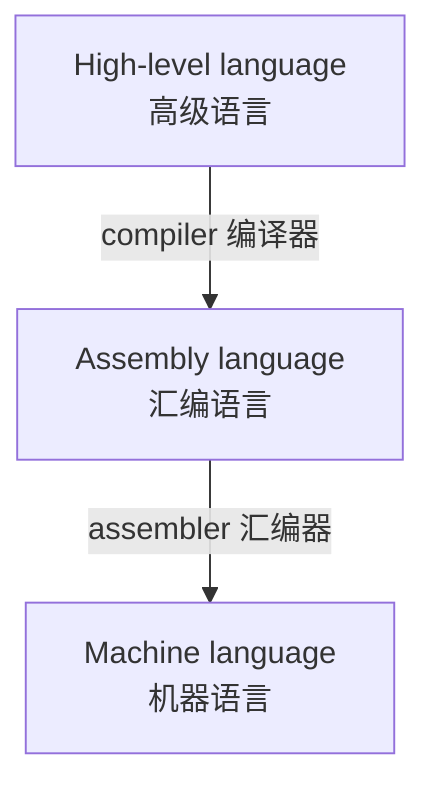
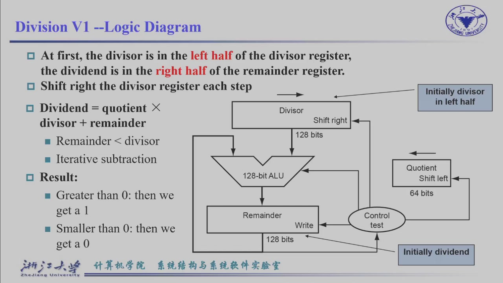
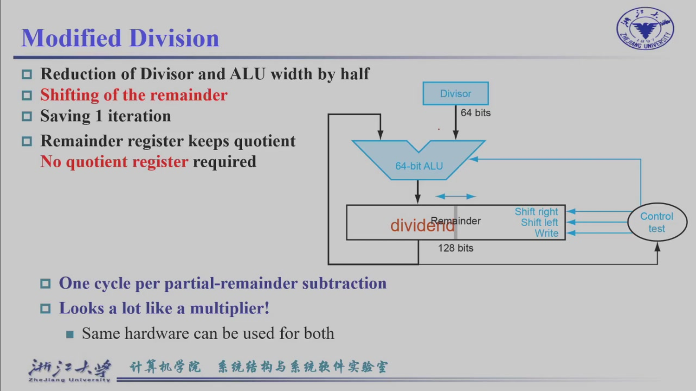
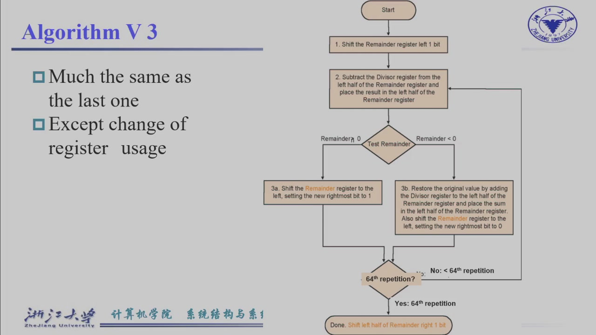

# <center>计算机组成</center>

---

<center>浙江大学 竺可桢学院 混合2504班 邓欢桐 3250102223</center>

---

<center>


</center>


---

[TOC]

---

## Chapter 2: Instructions: Language of the Machine

> 指令: 机器的语言

> [!NOTE]
>
> 1 Byte (字节) = 8 bits (比特)
>
> 1 KB (千字节) = 1024 Bytes
>
> 1 MB (兆字节) = 1024 KB
>
> 1 GB (吉字节) = 1024 MB
>
> 1 TB (太字节) = 1024 GB

### 2.1 RISC-V 指令基础

#### 2.1.1 编译过程



#### 2.1.2 RISC-V 指令集

> $The \ RISC-V \ Instruction \ Set$

1. 基本思想是: **Simplicity favors regularity**, 也就是说, 指令格式越统一, 硬件实现越容易. 

2. $Stored-program \ concept$

   > 存储程序概念

   核心是两句话: 

   > `Instructions are represented as numbers.`
   >  指令也表示成数字. 

   > `Programs can be stored in memory to be read or written just like numbers.`
   >  程序可以像数字一样存储在内存中, 并被读取或写入. 

#### 2.1.3 RISC-V 的算术操作

> 一般是三个操作数. 

**加法**如下: 

`add x5, x6, x7`, 即 $x_5=x_6+x_7$. 

**减法**如下: 

`add x5, x6, x7`, 即 $x_5=x_6-x_7$. 

#### 2.1.4 RISC-V 寄存器

> Arithmetic instructions use register operands 算术指令使用寄存器操作数

RISC-V 中有 32 个通用寄存器, RV64(RISC-V 64-bit) 寄存器中每个寄存器是 64 bits, 编号为 x0~x31. 

> 寄存器访问比内存快

|       寄存器       |   别名   |           用途           |
| :----------------: | :------: | :----------------------: |
|        `x0`        |  `zero`  |         永远是 0         |
|        `x1`        |   `ra`   | return address, 返回地址 |
|        `x2`        |   `sp`   |  stack pointer, 栈指针   |
| `x5-x7`, `x28-x31` | `t0-t6`  |  temporary, 临时寄存器   |
| `x8-x9`, `x18-x27` | `s0-s11` |    saved, 保存寄存器     |
|     `x10-x17`      | `a0-a7`  |      参数 / 返回值       |

#### 2.1.5 寄存器 vs 内存

> Operating on memory data requires loads and stores 对内存数据操作需要 load 和 store

对于 RISC-V, 其流程为: load 内存数据到寄存器 → 在寄存器中计算 → store 结果回内存

也就是说: Memory → Register → ALU → Register → Memory

#### 2.1.6 内存操作数（Memory Operands）

主要用于复合数据, 比如数组、结构体、动态内存数据等等. 

RISV-C 用 load 和 store 访问内存, 例如: 

>ld x9, 64(x22) 即 x9 = Memory[x22 + 64]
>
>sd x9, 96(x22) 即 Memory[x22+96] = x9
>
>effective address = base register + offset
>
>x22 是 base register, 64 或 96 是 offset

#### 2.1.7 内存对齐（Memory Alignment）

有些数据类型最好放在对应的地址边界上, 例如: 

>int 通常 4 字节对齐
>double 通常 8 字节对齐

对于一个结构体: 

```c
struct {
    int a;
    char b;
    char c[2];
    char d[3];
    float e;
}
```

编译器会加上 padding, 也就是空洞以保证对齐. 

另, RISC-V 是小端序, 如下表: 

|    字节序     |         含义         |
| :-----------: | :------------------: |
|  Big endian   | 最高有效字节放低地址 |
| Little endian | 最低有效字节放低地址 |

比如 0×12345678, 低地址先放 78, 再放 56、34、12. 

> 一个地址是 1 个字节（1 Byte = 8 bits），一个数字是 4 bits，也就是一个地址存两个数. 

#### 2.1.8 立即数（Immediate）

如: g = h + 55, 不需要先从内存取 55, 而是可以写 addi x3, x3, 55.

addi 就是 **加立即数** 的意思, 让常见情况更快.

### 2.2 编码

#### 2.1.1 指令编码

> Bits are just bits; conventions define relationship between bits and numbers.
>
> 位只是位; 约定决定 bit 和数值之间的关系.

计算机所有信息都由二进制构成, 指令也常常被编码为二进制.

RISC-V 的指令通常是 32 位, 常见格式如下: 

- R-format
- I-format
- S-format
- SB-format
- U-format
- UJ-format

> [!NOTE]
>
> 1. **opcode (操作码)**：指令的“大类”（比如是算术运算，还是读写内存）.
> 2. **funct3 / funct7 (辅助功能码)**：配合 opcode，进一步锁定“具体动作”（大类是算术，这里细分是加法还是减法）.
> 3. **rd (Register Destination)**：**目标**寄存器，负责接收最终的计算结果.
> 4. **rs1 / rs2 (Register Source)**：**源**寄存器 1 和 2，提供计算所需的原材料.
> 5. **imm (Immediate)**：**立即数**，直接硬编码在代码里的常数（比如数字 1000 或 64）.

**R-format:** 

用于寄存器和寄存器之间的运算: 

```
add x9, x20, x21
```

字段大致是: 

```
funct7 | rs2 | rs1 | funct3 | rd | opcode
```

**I-format:**

用于立即数和 load: 

```
addi x9, x20, 1000
ld x9, 64(x22)
```

字段包括: 

```
imm | rs1 | funct3 | rd | opcode
```

**S-format:**

用于 store: 

```
sd x9, 64(x22)
```

注意 S-format 没有 rd，因为 store 不写回寄存器. 

它把 immediate 拆成两段: 

```
imm[11:5]
imm[4:0]
```

#### 2.2.2 逻辑操作（Logical Operations）

> Instructions for bitwise manipulation
> 用于按位操作的指令

|   操作   |  RISC-V 指令  |               含义               |
| :------: | :-----------: | :------------------------------: |
|   左移   |    `slli`     |   shift left logical immediate   |
| 逻辑右移 |    `srli`     |  shift right logical immediate   |
| 算术右移 |    `srai`     | shift right arithmetic immediate |
|    与    | `and`, `andi` |              按位与              |
|    或    |  `or`, `ori`  |              按位或              |
|   异或   | `xor`, `xori` |             按位异或             |

1. 左移：slli x5, x6, 2

   表示：x5 = x6 << 2

   没有溢出时，相当于：x5 = x6 × 4

2. 逻辑右移：srli x5, x6, 2

   左边补 0，常用于 unsigned.

3. 算术右移：srai x5, x6, 2

   左边补符号位，常用于 signed.

4. AND: x & 00001111 保留 x 的低 4 位, 其他位清零.

   > Useful to mask bits in a word

5. OR: x \| 00001111 强制 x 的高 4 位置 1.

   > Useful to include bits in a word

6. XOR: 相同为 0, 不同为 1.

   > Differencing operation

#### 2.2.3 条件分支（Branch Instruction）

beq rs1, rs2, L1 即 如果 rs1 == rs2, 跳到 L1

bne rs1, rs2, L1 即 如果 rs1 != rs2, 跳到 L1

#### 2.2.4 Loop 循环

Loop:
    ...
    bne x22, x23, Loop

即, 若 x22 !=x23, 就跳回 Loop 继续执行.

#### 2.2.5 slt 和更多条件分支

>Most popular Compare Operation — set on less than: slt
>最常见的比较操作：小于则置位 slt.

1. slt rd, rs1, rs2: 若 rs1 < rs2, 则 rd = 1, 否则 rd = 0.
2. blt rs1, rs2, L1: 若 rs1 < rs2, 则跳转 L1.
3. bge rs1, rs2, L1: 若 rs1 >= rs2, 则跳转 L1.

#### 2.2.6 switch 和 Jump Address Table

1. 检查 k 是否越界
2. 用 k 计算表中位置
3. 取出目标地址
4. 用 jalr 跳过去

关键指令: jalr x0, 0(x7), 意思是跳到 x7 保存的地址, 不保留返回地址.

#### 2.2.7 基本块（Basic Block）

>A basic block is a sequence of instructions with no embedded branches and no branch targets except at beginning.
>基本块是一段连续指令，中间没有分支，除了开头之外没有其他跳转目标.

基本块内部是顺序执行的, 只有一个入口, 通常最后才有分支或跳转, 编译器一般都会用基本块进行优化.

#### 2.2.8 过程调用（Procedure / Function）

1. 传参数
2. 跳到函数
3. 执行函数
4. 返回结果
5. 跳回原来的地方

#### 2.2.9 栈（Stack）

> Stack grows from higher address to lower address.
> 栈从高地址向低地址增长.

RISC-V 里：

```
x2 = sp
```

`sp` 是 stack pointer，栈指针.

压栈：

```
addi sp, sp, -8
sd x5, 0(sp)
```

出栈：

```
ld x5, 0(sp)
addi sp, sp, 8
```

栈用于：

- 保存返回地址
- 保存寄存器
- 保存局部变量
- 支持递归

#### 2.2.10 Leaf Procedure 和 Nested Procedure

**Leaf Procedure**

不调用其他函数的函数叫 leaf procedure.

它比较简单，只要保存自己会破坏、但之后还要恢复的寄存器. 

**Nested Procedure**

函数里还调用其他函数，叫 nested procedure.

> 递归就是典型例子.

这种必须保存：

- ra
- 参数
- 临时结果
- 必要寄存器

否则下一次函数调用会覆盖原来的信息.

### 2.3 寄存器保存

#### 2.3.1 哪些寄存器需要保存

|   类型   |                规则                |
| :------: | :--------------------------------: |
| `s0-s11` |  saved registers，被调用者要恢复   |
| `t0-t6`  |  temporary registers，不保证保留   |
| `a0-a7`  |   参数和返回值寄存器，不保证保留   |
|   `sp`   |        栈指针，需要保持正确        |
|   `ra`   | 如果函数还会调用别的函数，就要保存 |

- s 开头：要保存
- t 开头：临时用，不保证保存
- a 开头：传参和返回值

#### 2.3.2 内存布局（Memory Layout）

**程序内存布局:**

>高地址
Stack
Heap / Dynamic data
Static data
Text
Reserved
低地址

|    区域     |              含义              |
| :---------: | :----------------------------: |
|    Text     |            程序代码            |
| Static data |       全局变量、静态变量       |
|    Heap     |    动态分配区，例如 malloc     |
|    Stack    | 函数调用、局部变量、保存寄存器 |

#### 2.2.4 字符数据（Character Data）

> Byte-encoded character sets
> 字节编码字符集.

|  编码   |        特点        |
| :-----: | :----------------: |
|  ASCII  | 7-bit，128 个字符  |
| Latin-1 | 8-bit，256 个字符  |
| Unicode |    更大的字符集    |
|  UTF-8  | 可变长度编码，常用 |
| UTF-16  |    可变长度编码    |

#### 2.2.5 Byte / Halfword / Word Operations

RISC-V 支持不同宽度的 load / store.

load：

| 指令  |              含义              |
| :---: | :----------------------------: |
| `lb`  |     load byte，有符号扩展      |
| `lbu` |   load byte unsigned，零扩展   |
| `lh`  |   load halfword，有符号扩展    |
| `lhu` | load halfword unsigned，零扩展 |
| `lw`  |           load word            |
| `lwu` |       load word unsigned       |
| `ld`  |        load doubleword         |

store：

| 指令 |       含义       |
| :--: | :--------------: |
| `sb` |    store byte    |
| `sh` |  store halfword  |
| `sw` |    store word    |
| `sd` | store doubleword |

重点：

> 带 u 的 load 是 unsigned，左边补 0
> 不带 u 的 load 会按 signed 做符号扩展

例如：

> lb 会把 byte 当成有符号数扩展到 64 位.
>
> lbu 会把 byte 当成无符号数扩展到 64 位.

---

## Chapter 3: Arithmetic for Computers

### 3.1 二进制本身没有意义

#### 3.1.1 一个小例子

$$
1001
$$

- 如果它是无符号数（unsigned number）, 则为 $9$; 

- 如果它是$4$位补码（signed number）, 则为 $-7$. 

>1. 对于正数和 $0$, 其原码、补码、反码完全相同; 
>2. 对于负数: 
>  - 原码 $\rightarrow$ 反码: 符号位不变, 其余取反; 
>  - 反码 $\rightarrow$ 补码: 反码 $+1$; 
>  - 原码 $\rightarrow$ 补码: 符号位不变, 其余取反 $+1$. 
>
>根据此, 可以得出 `1001` 若为 unsigned number, 则表示 $-7$. 
>
>总之, 对于负数来说, 如果从正数入手, 则全部按位取反; 若从负数入手, 则保留符号位为 $1$ 即可. 

#### 3.1.2 unsigned 和 signed

1. **unsigned** 无符号整数: $n$ 位 unsigned 范围是 $0 \sim 2^n-1$; 

2. **signed** 有符号整数: 最高位表示符号, $0$ 为正, $1$ 为负; 

   > 但是这样会出现两种 $0$, 因此现代计算机主要用 **two's complement 补码**. 

3. **two's complement** 补码: $n$ 位范围是 $-2^{n-1} \sim 2^{n-1}-1$. 

   > 其中最高位叫 **MSB**, 即 Most Significant Bit, 最高有效位; 最高位是 $0$ 一般是正数, 反之负数. 

注意: 需要求一个正数的相反数, 则对这个正数按位取反再 $+1$. 

#### 3.1.3 补码在减法中的作用

简单来说, 要求计算: 
$$
A-B
$$
则可以化为: 
$$
A+(-B)
$$
即: 
$$
A+(\sim B+1)
$$
这样就不用单独做一个减法器, 只需要按位取反再 $+1$ 即可放进加法器正常计算. 

#### 3.1.4 溢出（overflow）

例如: 
$$
(0111)_2+(0001)_2=(1000)_2
$$
理论上, 本应该是 $7+1=8$, 而现在结果是 $-8$, 即 **正数 + 正数 = 负数** 说明溢出了. 

归纳地: 

- 加法: 同号相加变号, 则成为溢出; 
- 减法: 相减后结果符号不同于被减数, 则溢出. 

### 3.2 算数逻辑单元（ALU, Arithmetic Logic Unit）

> **ALU** 可以做 $AND$、$OR$、$ADD$、$SUB$、$SLT$、$XOR$、$NOR$、$Shift$

#### 3.2.1 全加器（Full Adder）

输入: $A$, $B$, $CarryIn$

输出: $Sum$, $CarryOut$

其中: 
$$
Sum = A \oplus B \oplus CarryIn
$$
而 $CarryOut$ 仅需要两个及以上输入为 $1$, 则为 $1$. 

#### 3.2.2 串行进位加法器（Ripple Carry Adder）

将前一位的 $CarryOut$ 传给下一位的 $CarryIn$, 极其简单易懂, 但缺点也极明显, 就是慢. 

#### 3.2.3 超前进位加法器（CLA, Carry Lookahead Adder）

基本思想是, 不要等一级一级地传, 而是要提前计算好进位. 

进位产生信号, 即自己能不能产生进位: 
$$
G = generate
$$

进位传递信号, 如果右边有进位的话, 它负责传: 

> 这是一个极其难以想明白的点, 换句话说反正进位最多都是 $1$, 如果自己就能产生进位了, 那 $P$ 是多少就不重要了, 为了省钱, 干脆同为 $1$ 的时候设为 $P=0$ 也没关系. 

$$
P = propagate
$$

其中关系是: 
$$
G_i=A_i \cdot B_i 
$$

$$
P_i=A_i \oplus B_i
$$

$$
C_{i+1}=G_i+C_i \cdot P_i
$$
一个绝对完整的阐释如下: 

1. $A$ 和 $B$ 分别是加数和被加数, 没什么好说的; 
2. $G$ 表示自己能不能产生进位; 
3. $P$ 表示如果自己有一个 $1$, 那么右边如果有进位就传了, 没进位就不理; 
4. $C$ 表示右边传进来给本位的或者本位传出去的给下一位的. 

### 3.3 乘法器（Multiplier）

乘法的本质在于 **移位** **+** **加法**. 

> 类似十进制, 先计算个位相乘, 然后计算十位相乘时算出结果, 左移一位再相加, 后续以此类推. 

注意: 对于无符号数来说, $n$ 位数乘 $n$ 位数, 结果应该是 $2n$ 位数. 

#### 3.3.1 乘法指令

**RISC-V** 里面, 乘法相关的指令包括
$$
mul、mulh、mulhu、mulhsu
$$
1. $mul$ 的意思是 $multiply \ low$, 比如 $128$ 位的数, $mul$ 表示低 $64$ 位. 

   > 但是, 如果你的结果不到 $64$ 位, 那么 $mul$ 完全够用了; 反之, 它会直接丢掉超过 $64$ 的高位. 

2. $mulh$ 中, $h$ 是 $high$ 的意思, 其取的是乘积的高位部分, 其中两数均为 $signed \ number$, 均按补码解释. 
3. $mulhu$ 中, $u$ 是 $unsigned$ 的意思, 同样取高位; 
4. $mulhsu$ 中, 取两数相乘的高位, 其中第一个数按照 $signed \ number$, 第二个数按照 $unsigned \ number$ 来进行计算. 

|   指令   | 取哪一半 |         rs1 解释         |         rs2 解释         |
| :------: | :------: | :----------------------: | :----------------------: |
|  `mul`   |   低位   | $signed / unsigned$ 都可 | $signed / unsigned$ 都可 |
|  `mulh`  |   高位   |         $signed$         |         $signed$         |
| `mulhu`  |   高位   |        $unsigned$        |        $unsigned$        |
| `mulhsu` |   高位   |         $signed$         |        $unsigned$        |

由于乘法的低位部分一般来说无论是有符号还是无符号数, 都是一样的, 因此没有区分. 

#### 3.3.2 判断溢出规则

设某个数有 $2n$ 位, 那么其低 $n$ 位的最高位是 $0/1$, 则其高 $n$ 位所有应该全是 $0/1$. 若不是, 则为溢出. 

### 3.4 基本除法

#### 3.4.1 几个要素

|    英文     |  中文  | 例子: 13 ÷ 3 |
| :---------: | :----: | :----------: |
| $dividend$  | 被除数 |     $13$     |
|  $divisor$  |  除数  |     $3$      |
| $quotient$  |   商   |     $4$      |
| $remainder$ |  余数  |     $1$      |

二进制的除法的基本思想其实和十进制有异曲同工之妙, 以 $13 \div 3=4 \cdot \cdot \cdot 1$ 为例: 
$$
(13)_{10}=(1101)_2
$$

$$
(3)_{10}=(0011)_2
$$

计算过程: 

1. 先取最高位 $1$, 不够减 $3$, 商写 $0$, 余数为 $1$; 
2. 再取次高位 $1$, 够减 $3$, 商写 $1$, 余数为 $0$; 
3. 下一位为 $0$, 不够减 $3$, 商写 $0$, 余数为 $0$; 
4. 最后一位为 $1$, 不够减 $3$, 商写 $0$, 余数为 $1$. 

> 也就是说, 从最高位开始做文章, 但是拿出来的数依旧是按照先拿的在高位进行计算的. 

值得注意的是, 如果除数为 $0$, 硬件会单独处理, 记为不合法或者特殊情况. 

#### 3.4.2 恢复余数除法（Restoring Division）

> 基本思想是, 显示着减一下, 减成负数了再加回来即可

假设我们做无符号除法: 

1. $Remainder$: 余数寄存器
2. $Divisor$: 除数寄存器
3. $Quotient$: 商寄存器

一开始时: 

1. $Remainder = 0$
2. $Quotient = Dividend$
3. $Divisor = divisor$

每一轮: 

1. $Remainder$ 和 $Quotient$ 合起来左移一位, 得到新的 $Remainder$ 和 $Quotient$, 即 $[Remainder' | Quotient']$
2. $Remainder' = Remainder' - Divisor$
3. 如果 $Remainder' >= 0$: 
       $Quotient'$ 最低位 $=1$
   如果 $Remainder' < 0$: 
       $Remainder' = Remainder' + Divisor$
       $Quotient'$ 最低位 $= 0$

> 注意最低为是直接改. 
>
> $Dividend$ 有几位就做几轮. 

其实该方法时很慢的, 因为每一次都要算, 每一位都要算, 个人认为和串行进位加法器有点类似, 极其缓慢. 

### 3.5 浮点数（Floating Point）

#### 3.5.1 一些要素

$sign$: 符号
$exponent$: 指数
$fraction$: 尾数, 也叫 $significand / mantissa$

其中: 

1. 符号位

   > $sign = 0$ 表示正数
   > $sign = 1$ 表示负数

2. 指数

   > $1.xxx × 2^E$ 中的 $E$

3. 尾数

   > $1.10101 × 2^E$ 中的 $10101$

4. 规格化数

   > $101.1_2 = 1.011_2 × 2^2$

另外: 

1. 单精度浮点数 $float$ 为 $32$ 位

   > $[ sign ][ exponent ][ fraction ] \rightarrow$ $1$ 位 $sign$、$8$ 位 $exponent$、$23$ 位 $fraction$

2. 双精度浮点数 $double$ 为 $64$ 位

   >$1$ 位 $sign$
   >$11$ 位 $exponent$
   >$52$ 位 $fraction$

注意不够的 $fraction$ 后面用 $0$ 补齐. 

#### 3.5.2 bias

对于 $32$ 位 $float$: 
$$
bias = 127
$$
对于 $64$ 位 $double$: 
$$
bias = 1023
$$
存储时: 
$$
exponent=E+bias
$$

#### 3.5.3 规格化计算和表示

$$
value = (-1)^S × (1.F)_2 × 2^{E - bias}
$$

> 注意, 一定记住, $0.1$ 在该方法下无法被精确表示, 因为 $\frac{1}{2}$ 一直乘 $\frac{1}{2}$ 下去无论怎么组合都凑不出 $0.1$, 其为一个无限循环小数. 

#### 3.5.4 浮点数加减法和乘除法

加（减）法如下: 

1. 比较两个数的 $exponent$
2. 把 $exponent$ 小的那个数右移（逻辑, 直接左边补 $0$, 右边扔掉）, 使指数变成和最大的那个一样, 对齐
3. 加或减 $significand$
4. 规格化结果
5. 舍入
6. 检查 $overflow / underflow$

乘（除）法如下: 

1. $sign$ 相乘（除）
2. $exponent$ 相加（减）
3. $fraction$ 相乘（除）
4. 规格化
5. 舍入

#### 3.5.5 Overflow 和 Underflow

1. $overflow$: 很大的数 $\times$ 很大的数, 结果可能为 $+∞$; 
2. $underflow$: 很小的数 $\times$ 很小的数, 结果可能为 $0$; 

#### 3.5.6 关于左移和右移

|   操作   |             英文             |  空位补什么  |       常用于        |         数学意义         |
| :------: | :--------------------------: | :----------: | :-----------------: | :----------------------: |
|   左移   |        $left \ shift$        |  右边补 $0$  | $signed / unsigned$ |  乘以 $2^n$, 但可能溢出  |
| 逻辑右移 |  $logical \ right \ shift$   |  左边补 $0$  |     $unsigned$      |   除以 $2^n$, 向下取整   |
| 算术右移 | $arithmetic \ right \ shift$ | 左边补符号位 |    $signed$ 补码    | 近似除以 $2^n$, 保持符号 |

#### 3.5.7 精确舍入

> `Accurate Arithmetic`
>  精确算术

> `Guard: The first of two extra bits`
>  $Guard$: 两个额外位中的第一个

> `Round: method to make the immediate floating-point result fit the floating-point format`
> $Round$: 让中间浮点结果适配浮点格式的方法

> `Sticky: set whenever there are nonzero bits to the right of the round bit`
> $Sticky$: 如果 $round \ bit$ 右边还有非零位, 就置 $1$

这部分是讲浮点运算不能直接把多出来的低位丢掉, 否则误差可能偏大. 

可以大致理解为: 

- $Guard$: 保留下来的最低位后面第一位
- $Round$: 再后一位
- $Sticky$: 后面所有剩余位只要有一个 $1$, $sticky$ 就是 $1$

### 3.6 除法器

> 除法器主要分为三种, 称为 $Division \ V1、Division \ V2、Division \ V3$. 

#### 3.6.1 Division V1



:star2:一开始, 除数放在除数寄存器的左半部分, 被除数放在余数寄存器的右半部分. 

> 这就很有意思了, 比如计算 $7 \div 2$ 的时候, 我们记: 
>
> - 被除数: $0000 \ 0111$
> - 除数: $0010 \ 0000$

假设做的是 $64$ 位除法, 则主要包括以下内容: 

$Divisor \ register$: $128 \ bits$

$Remainder \ register$: $128 \ bits$

$Quotient \ register$: $64 \ bits$

$ALU$: $128 \ bits$

$Control test$

为了对齐高位, 一般会把除数和余数的位数都变成 $128$. 

操作流程如下: 

1. $Remainder = Remainder - Divisor$
2. 看 $Remainder$ 是否小于 $0$
3. 如果 $Remainder >= 0$: 
      - 说明够减
      - 保留这个 $Remainder$
      - $Quotient$ 左移, 最低位写 $1$
4. 如果 $Remainder < 0$: 
      - 说明不够减
      - $Remainder = Remainder + Divisor$
      - $Quotient$ 左移, 最低位写 $0$
5. $Divisor$ 右移一位

- 这里的左移即丢掉最左, 补最右为 $0$; 
- 右移即丢掉最右, 补最左为 $0$, 至于最低位要改的问题, 可以认为是补了 $0$ 后改成 $1$ 的; 
- 当余数小于除数即可认为计算完成. 

这里右移, 主要还是模拟了竖式加减法类似的原理, 但是其局限性也显而易见: 

1. 硬件大
2. $ALU$ 宽
3. 寄存器多
4. 还要多做一次迭代

#### 3.6.2 改进版除法（Modified Division）

> 其本质是: $Divisor$ 不动、$Remainder$ 整体左移



其特点是: 

- $Divisor$ 不再用 $128$ 位, 只用 $64$ 位
- $ALU$ 也从 $128$ 位变成 $64$ 位
- 不再单独要 $quotient \ register$
- $Quotient$ 存在 $Remainder \ register$ 的右半部分
- 每轮移动 $Remainder \ register$

|          项目          |       V1       | Modified Division |
| :--------------------: | :------------: | :---------------: |
|  $Divisor \ register$  |    $2n$ 位     |      $n$ 位       |
|         $ALU$          |    $2n$ 位     |      $n$ 位       |
| $Remainder \ register$ |    $2n$ 位     |      $2n$ 位      |
| $Quotient \ register$  |  单独 $n$ 位   |      不需要       |
|        移动对象        | $Divisor$ 右移 | $Remainder$ 左移  |
|        迭代次数        |    $n+1$ 次    |      $n$ 次       |

流程: 

1. $Remainder \ register$ 左移 $1$ 位
2. 用 $Remainder$ 左半部分减 $Divisor$
3. 如果结果 $>=0$: 
      - 保留结果
      - Remainder 最低位写 1
4. 如果结果 $<0$: 
      - 把 $Divisor$ 加回去, 恢复
      - $Remainder$ 最低位写 $0$
5. 重复 $n$ 次

> $Remainder \ register = [左半部分 \ | \ 右半部分]$
>
> 左半部分最后存真正的 $remainder$, 初始为 $0$; 
>
> 右半部分最后存 $quotient$, 初始为被除数. 

其精妙之处在于, 余数寄存器保存商, 不需要单独的商寄存器. 

#### 3.6.3 Algorithm V3

> 除法算法本质不变, 只是寄存器组织方式变了. 



总结起来就是, $V2$ 和 $V3$ 其实没有本质上的区别. 

- $V1$: 原始 $restoring \ division$ 硬件
- $V2/Modified$: 减少 $ALU$ 和 $divisor$ 宽度, 移动 $remainder$
- $V3$: 进一步改变寄存器用法, 让 $remainder \ register$ 同时保存 $quotient$

#### 3.6.4 汇总

> 出自 **ChatGPT**

|         版本          |                        核心动作                         |                     优点                     |                             缺点                             |
| :-------------------: | :-----------------------------------------------------: | :------------------------------------------: | :----------------------------------------------------------: |
|    $Division \ V1$    |      每轮 $Remainder$ 减 $Divisor$, $Divisor$ 右移      |                 直观, 好理解                 | $ALU$ 和 $Divisor \ register$ 太宽, 要单独 $Quotient \ register$ |
| $Modified \ Division$ |            $Divisor$ 不动, $Remainder$ 左移             |         $ALU$ 和 $Divisor$ 宽度减半          |                      理解起来比 $V1$ 绕                      |
|   $Algorithm \ V3$    | $Remainder register$ 同时保存 $remainder$ 和 $quotient$ | 不需要 $Quotient$ $register$, 更像乘法器结构 |                 要分清左半和右半分别代表什么                 |
